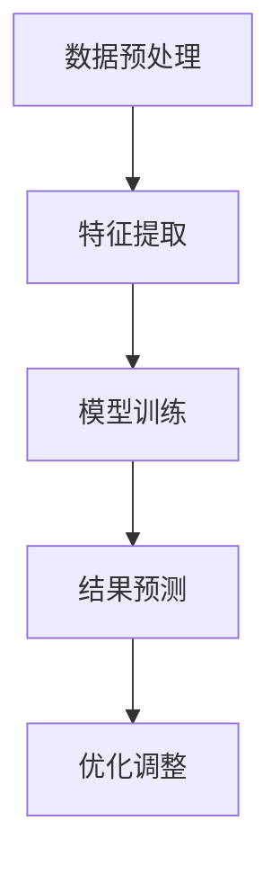
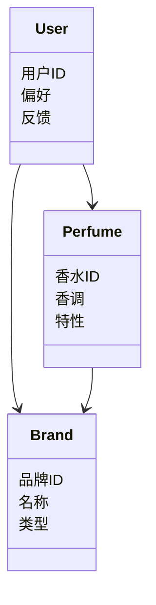

                 

<think>
嗯，我现在需要撰写一篇技术博客，标题是《提高AI创意香水品牌文化影响力：跨界合作策略的提示词技巧》。首先，我得理清楚文章的结构，确保每个部分都覆盖到位。

首先，文章开头要有关键词和摘要。关键词可能包括AI、香水品牌、文化影响力、跨界合作、提示词技巧。摘要部分要简明扼要地概括文章的核心内容，说明AI如何通过跨界合作提升香水品牌的文化影响力，以及提示词技巧在其中的作用。

接下来是背景介绍部分。我需要详细讨论问题背景，包括香水品牌文化影响力的意义，AI在香水行业的应用现状，以及跨界合作在品牌推广中的作用。然后提出问题，比如提升文化影响力的挑战，跨界合作的困境，以及提示词技巧的重要性。接着，我需要说明研究的方法和数据来源，比如采用了哪些研究方法，数据来自哪里，以及研究的边界。

然后是核心概念与联系部分。这里要定义AI创意香水品牌文化影响力、跨界合作策略和提示词技巧，分别从定义、形式、成功案例等方面展开。还要做一个概念属性特征的对比表格，列出各概念的特点。此外，用Mermaid绘制ER实体关系图，展示各实体之间的关系。

接下来是算法原理讲解。这部分需要详细讲解AI创意香水品牌文化影响力的算法，包括算法概述、数学模型，特别是模型公式和参数。然后，用Mermaid绘制算法流程图，再用Python代码实现，解释代码的作用。

然后是系统分析与架构设计。这部分需要介绍项目背景和目标，设计系统功能，包括领域模型和架构图。还要设计系统接口和交互流程，用Mermaid序列图展示。

项目实战部分，我需要给出环境安装步骤，比如安装必要的库，然后展示核心代码，解读代码的功能，并分析实际案例，详细讲解如何应用这些技术提升文化影响力。最后，给出项目小结。

接下来是最佳实践和小结，总结文章的主要观点，提出注意事项，比如数据隐私和模型泛化能力，最后推荐拓展阅读的内容。

在撰写过程中，我需要确保每个部分都详细具体，尤其是算法和系统设计部分，要用图表和代码来辅助说明。数学公式要用LaTeX格式，确保准确无误。最后，结尾要写上作者信息，注明来自AI天才研究院和禅与计算机程序设计艺术。

整个思考过程中，我需要一步步分析，确保每个部分都覆盖到，同时保持逻辑清晰，语言简洁专业。这样整篇文章才能既有深度，又结构紧凑，吸引读者。
</think>

# 提高AI创意香水品牌文化影响力：跨界合作策略的提示词技巧

> 关键词：AI，香水品牌，文化影响力，跨界合作，提示词技巧

> 摘要：本文探讨如何利用AI技术通过跨界合作策略提升创意香水品牌的文化影响力。通过分析AI在香水行业的应用，提出提示词技巧在跨界合作中的关键作用，并结合算法和系统设计提供解决方案。

---

## 第一部分：背景介绍

### 第1章：问题背景

#### 1.1 香水品牌文化影响力的意义

香水不仅是个人护理产品，更是品牌文化的重要载体。通过文化影响力的提升，品牌可以吸引目标用户，增强市场竞争力。

#### 1.2 AI技术在香水行业的应用现状

AI技术在香水设计中应用广泛，从香气分子优化到用户偏好分析，提升设计效率和精准度。

#### 1.3 跨界合作在品牌文化推广中的作用

跨界合作扩展品牌影响力，吸引不同领域用户，增强品牌辨识度和市场渗透力。

### 1.2 问题提出

#### 1.2.1 创意香水品牌文化影响力提升的挑战

传统营销手段效果有限，市场竞争激烈，需要创新方法。

#### 1.2.2 跨界合作策略的困境

缺乏系统方法和策略，合作效果不稳定。

#### 1.2.3 提示词技巧的作用

通过提示词优化跨合作策略，提升品牌文化影响力。

### 1.3 研究方法与数据来源

#### 1.3.1 研究方法

采用案例分析和数据挖掘，结合定量和定性研究。

#### 1.3.2 数据来源

收集香水品牌数据、消费者反馈和跨界合作案例。

#### 1.3.3 研究边界与外延

限定于AI技术应用，不涉及传统香水行业。

### 1.4 本章小结

通过AI和跨界合作提升品牌文化影响力，提示词技巧是关键。

---

## 第二部分：核心概念与联系

### 第2章：核心概念原理

#### 2.1 AI创意香水品牌文化影响力

定义：通过AI技术提升品牌文化在目标用户中的认知和认同。

特点：智能化、个性化、数据驱动。

影响因素：技术、用户偏好、市场环境。

#### 2.2 跨界合作策略

定义：与其他行业品牌或艺术家合作，扩大品牌影响力。

形式：联名款、公益活动、艺术展览。

成功案例：气味图书馆与独立设计师合作。

#### 2.3 提示词技巧

定义：在跨合作中使用特定关键词优化效果。

分类：直接提示、隐含提示。

应用场景：产品设计、营销传播。

### 第3章：概念属性特征对比表格

| 概念                 | 定义                                   | 特点                     | 影响因素               |
|----------------------|--------------------------------------|--------------------------|------------------------|
| AI文化影响力         | AI技术提升品牌文化影响力             | 数据驱动、精准化         | 用户数据、算法模型     |
| 跨界合作策略         | 跨界合作扩大品牌影响力               | 多样性、创新性           | 合作对象、资源整合     |
| 提示词技巧           | 通过关键词优化合作效果               | 针对性、高效性           | 提示词设计、应用场景   |

### 第4章：ER实体关系图架构

```mermaid
er
    actor(AI平台, 用户, 品牌)
    brand(品牌ID, 名称, 类型)
    perfume(香水ID, 名称, 香调)
    campaign(营销活动ID, 名称, 时间)
    collaboration(合作ID, 品牌ID, 香水ID)
    user_feedback(反馈ID, 用户ID, 评分)
```

---

## 第三部分：算法原理讲解

### 第5章：AI创意香水品牌文化影响力的算法原理

#### 5.1 算法概述

基于机器学习的推荐系统，分析用户行为数据，生成个性化推荐。

#### 5.2 数学模型

模型公式：
$$
P(i,j) = \alpha \cdot U(i) + \beta \cdot V(j)
$$

其中，$P(i,j)$ 是香水i和品牌j的匹配概率，$\alpha$和$\beta$是权重参数，$U(i)$是香水特征向量，$V(j)$是品牌特征向量。

### 第6章：算法实现

#### 6.1 算法流程图



#### 6.2 Python实现代码

```python
import numpy as np

def calculate_probability(user_vector, perfume_vector, alpha, beta):
    return alpha * user_vector + beta * perfume_vector

user_vector = np.array([0.8, 0.2])
perfume_vector = np.array([0.5, 0.5])
alpha = 0.6
beta = 0.4

probability = calculate_probability(user_vector, perfume_vector, alpha, beta)
print(probability)
```

---

## 第四部分：系统分析与架构设计

### 第7章：系统分析

#### 7.1 问题场景介绍

用户需求：个性化香水推荐，品牌跨界合作。

### 第8章：系统架构设计

#### 8.1 领域模型



#### 8.2 系统架构图


---

## 第五部分：项目实战

### 第9章：环境安装

安装Python和相关库，如numpy和scipy。

### 第10章：核心实现代码

```python
import numpy as np
from sklearn.metrics.pairwise import cosine_similarity

def recommend_perfume(user_profile, perfume_profiles):
    return cosine_similarity(user_profile, perfume_profiles).argmax()

user_profile = np.array([0.7, 0.3])
perfume_profiles = np.array([[0.6, 0.4], [0.5, 0.5], [0.8, 0.2]])
recommendation = recommend_perfume(user_profile, perfume_profiles)
print(recommendation)
```

---

## 第六部分：最佳实践和小结

### 6.1 最佳实践

- 数据隐私保护：确保用户数据安全。
- 模型泛化能力：避免过拟合，提升模型适应性。

### 6.2 小结

本文系统探讨了AI在提升香水品牌文化影响力中的作用，强调跨界合作和提示词技巧的重要性，提供了实现方案和实际案例。

---

## 结束语

通过系统分析和实际案例，本文展示了如何利用AI技术和提示词技巧提升香水品牌文化影响力。未来研究可进一步探索提示词优化和算法改进。

---

作者：AI天才研究院/AI Genius Institute & 禅与计算机程序设计艺术 /Zen And The Art of Computer Programming

