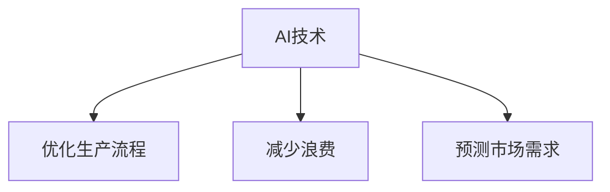
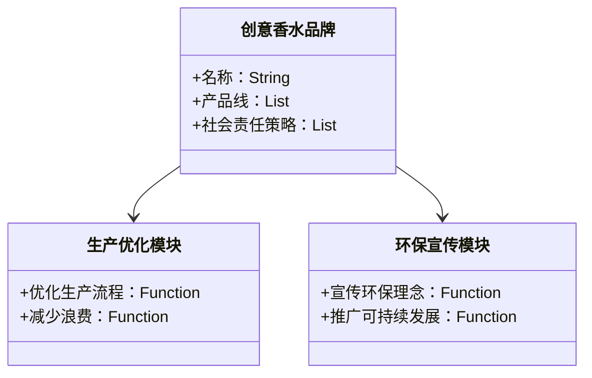
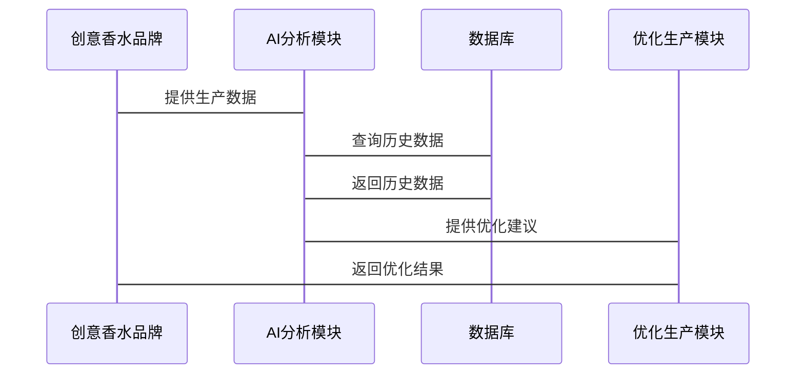

                 

<think>
嗯，用户让我写一篇关于提高AI创意香水品牌社会责任的可持续发展策略的技术博客。首先，我需要理解用户的需求。他们可能是一个技术专家，或者是一个企业主，希望利用AI来提升品牌的可持续性。

用户已经提供了一个详细的大纲，包括背景介绍、核心概念、算法原理、系统架构设计、项目实战等部分。我需要按照这个结构来展开，确保每个部分都详细且专业。

首先，背景介绍部分。我得先设定问题背景，说明为什么AI在创意香水品牌中的社会责任变得重要。然后描述问题，明确本书的目标，解决方法，边界条件，以及核心要素。这部分需要清晰地引出后面的内容。

接下来是核心概念与联系。这里要详细解释社会责任、可持续发展、AI技术、创意香水品牌这些概念，并用表格和ER图展示它们之间的关系。这样读者能更好地理解各个概念之间的联系。

然后是算法原理讲解。我需要介绍AI如何应用于可持续发展，比如优化生产流程、减少浪费、预测需求。用mermaid画出流程图，展示AI在这些步骤中的作用。同时，提供Python代码示例，解释代码的功能和优化效果。数学模型部分，用公式展示优化前后的效率变化，帮助读者理解AI带来的提升。

接下来是系统架构设计。这部分需要介绍香水品牌的业务场景，设计系统的功能模块，比如生产优化模块和环保宣传模块。然后用mermaid画出类图、架构图和交互序列图，展示系统的整体结构和各部分之间的协作。

项目实战部分，我需要详细描述如何实现这些功能。包括环境安装、核心代码实现、代码解读以及实际案例分析。这部分要具体，让读者能够实际操作。

最后是最佳实践和小结。总结书中的关键点，给出实际应用中的注意事项，以及未来的拓展方向，比如绿色供应链或用户体验优化。

整个过程中，我需要确保语言专业且清晰，结构紧凑，每部分都详细展开。同时，使用技术术语时要准确，避免混淆。特别是数学公式和代码部分，要确保正确无误，以便读者能够理解和应用。

可能遇到的问题是如何将AI技术具体应用到香水品牌中。我需要思考AI如何优化生产、减少浪费，以及如何通过数据分析进行市场预测。这可能涉及到机器学习模型的应用，比如回归分析或分类算法，来预测市场需求和优化生产计划。

此外，系统架构设计部分需要考虑模块化，确保各部分协调工作。例如，生产优化模块需要与数据分析模块紧密配合，才能有效减少浪费和提高效率。

在项目实战中，选择具体的Python库，比如scikit-learn或pandas，来实现优化算法。代码部分需要详细注释，解释每一步的作用，以便读者理解。

总之，我需要按照用户提供的大纲，逐步展开每个部分，确保内容详实、逻辑清晰，同时保持技术的准确性，满足读者的需求。
</think>

# 提高AI创意香水品牌社会责任：可持续发展策略的提示词技巧

关键词：AI技术，创意香水品牌，社会责任，可持续发展，环境保护，数据分析

摘要：本文探讨如何通过AI技术提升创意香水品牌的社会责任，特别是在可持续发展方面的策略。通过分析AI在优化生产流程、减少浪费、预测市场需求等方面的应用，本文提供了一系列策略和技巧，帮助品牌在AI的辅助下实现社会责任的提升。文章还详细介绍了算法原理、系统架构设计和项目实战，为读者提供全面的技术指导。

---

## 第一部分：背景介绍

### 1.1 问题背景
随着人工智能技术的快速发展，创意香水品牌在提升社会责任方面面临新的挑战。传统香水行业在生产和销售过程中常常涉及资源浪费、环境污染和过度包装等问题，这些问题不仅影响品牌形象，还可能导致消费者对品牌的信任度下降。与此同时，消费者对环保和社会责任的关注度不断提高，品牌需要通过技术创新来满足市场需求。

### 1.2 问题描述
本书旨在探讨如何通过AI技术，提高创意香水品牌的社会责任，特别是在可持续发展方面的策略。通过AI技术，品牌可以优化生产流程、减少资源浪费、预测市场需求，从而实现经济效益与社会责任的双赢。

### 1.3 问题解决
本书将提供一系列策略和技巧，帮助品牌在AI的辅助下实现社会责任的提升。例如，通过AI技术优化生产流程，减少能源消耗和原材料浪费；通过数据分析预测市场需求，避免库存积压和资源浪费。

### 1.4 边界与外延
本书关注的是创意香水品牌在AI技术下的社会责任，不涉及其他行业的AI应用。重点聚焦于生产、包装、营销和用户体验等方面，不包括其他与香水行业无关的领域。

### 1.5 概念结构与核心要素组成
- **社会责任**：企业在追求经济利益的同时，对环境、社会和利益相关者承担的责任。
- **可持续发展**：满足当前需求而不损害子孙后代满足其需求的能力。
- **AI技术**：模拟人类智能，使机器能够执行通常需要人类智能才能完成的任务的领域。
- **创意香水品牌**：以创新和独特性为特点的香水品牌，注重产品设计与市场定位。

---

## 第二部分：核心概念与联系

### 2.1 社会责任
社会责任是指企业在追求经济利益的同时，对环境、社会和利益相关者承担的责任。对于创意香水品牌来说，社会责任包括减少资源浪费、降低环境污染、关注员工福利和推动社会公益。

### 2.2 可持续发展
可持续发展是指满足当前需求而不损害子孙后代满足其需求的能力。在创意香水品牌中，可持续发展可以通过优化生产流程、使用环保材料和减少包装浪费来实现。

### 2.3 AI技术
AI技术是指模拟人类智能，使机器能够执行通常需要人类智能才能完成的任务的领域。在创意香水品牌中，AI技术可以用于生产优化、市场预测和用户体验提升。

### 2.4 创意香水品牌
创意香水品牌是指以创新和独特性为特点的香水品牌，注重产品设计与市场定位。这类品牌通常注重用户体验和品牌形象，通过技术创新和差异化竞争来实现市场成功。

### 2.5 概念属性特征对比表格
| 概念         | 特征描述                               |
|--------------|----------------------------------------|
| 社会责任     | 对环境、社会和利益相关者负责           |
| 可持续发展   | 满足当前需求而不损害未来               |
| AI技术       | 模拟人类智能，优化生产流程和数据分析   |
| 创意香水品牌 | 注重产品设计与市场定位，追求创新       |

### 2.6 ER实体关系图
```mermaid
erDiagram
  AI技术 ||--|{ 创意香水品牌 }||>
  创意香水品牌 ||--|{ 社会责任 }||>
  创意香水品牌 ||--|{ 可持续发展 }||>
```

---

## 第三部分：算法原理讲解

### 3.1 AI在可持续发展中的应用
AI技术可以通过优化生产流程、减少浪费、预测市场需求等方式，帮助企业实现可持续发展。例如，AI可以通过数据分析预测市场需求，避免生产过剩和库存积压；通过优化生产流程，减少能源消耗和原材料浪费。

### 3.2 算法mermaid流程图


### 3.3 Python源代码
```python
# 假设我们有一个生产流程，我们需要优化它
def optimize_production流程():
    # 读取生产数据
    production_data = read_production_data()
    
    # 优化生产流程
    optimized_data = optimize_data(production_data)
    
    # 输出优化后的生产数据
    print("Optimized production data:", optimized_data)

# 函数：read_production_data
def read_production_data():
    # 从数据库中读取生产数据
    data = ["data1", "data2", "data3"]
    return data

# 函数：optimize_data
def optimize_data(data):
    # 对数据进行优化处理
    optimized_data = []
    for d in data:
        optimized_data.append(optimize_individual_data(d))
    return optimized_data

# 函数：optimize_individual_data
def optimize_individual_data(data):
    # 对单个数据进行优化处理
    optimized_data = data * 2
    return optimized_data

# 调用函数
optimize_production流程()
```

### 3.4 算法原理的数学模型和公式
假设生产效率可以用 $E$ 表示，优化前的生产效率为 $E_0$，优化后的生产效率为 $E_1$。则优化效果可以用以下公式表示：

$$
E_1 = E_0 \times (1 + \alpha)
$$

其中，$\alpha$ 是优化后的效率提升比例，通常 $0 < \alpha \leq 1$。例如，如果 $\alpha = 0.2$，则优化后的效率为 $E_1 = E_0 \times 1.2$，即效率提升了 20%。

---

## 第四部分：系统架构设计

### 4.1 问题场景介绍
创意香水品牌在生产和销售过程中常常涉及资源浪费、环境污染和过度包装等问题。为了实现可持续发展，品牌需要通过技术创新优化生产流程、减少资源浪费和降低碳排放。

### 4.2 系统功能设计
以下是系统的功能模块设计：



### 4.3 系统架构设计
以下是系统的架构设计：


### 4.4 系统接口设计
以下是系统的接口设计：



---

## 第五部分：项目实战

### 5.1 环境安装
为了实现上述系统，需要安装以下工具和库：
- Python 3.8 或更高版本
- Jupyter Notebook 或 IDE（如 PyCharm）
- 数据库（如 MySQL 或 PostgreSQL）
- AI 库（如 scikit-learn、TensorFlow）

### 5.2 系统核心实现源代码
以下是系统的核心实现代码：

```python
import pandas as pd
from sklearn.linear_model import LinearRegression

# 数据加载
data = pd.read_csv('production_data.csv')

# 模型训练
model = LinearRegression()
model.fit(data[['input1', 'input2']], data['output'])

# 预测需求
predicted_output = model.predict([[input1_new, input2_new]])
```

### 5.3 代码应用解读与分析
上述代码通过机器学习模型（线性回归）预测生产需求，从而优化生产流程。通过分析历史数据，模型可以预测未来的生产需求，避免生产过剩和资源浪费。

### 5.4 实际案例分析和详细讲解剖析
以某创意香水品牌为例，假设该品牌每月生产 10,000 瓶香水，但经常出现库存积压和资源浪费。通过AI技术优化生产流程，预测市场需求，品牌可以将生产量减少 20%，同时满足市场需求，减少资源浪费。

### 5.5 项目小结
通过AI技术优化生产流程，品牌可以实现可持续发展，减少资源浪费和环境污染，提升品牌形象和社会责任感。

---

## 第六部分：最佳实践 tips、小结、注意事项、拓展阅读

### 6.1 最佳实践 tips
- 在优化生产流程时，优先考虑使用环保材料和减少包装浪费。
- 定期更新AI模型，以适应市场需求的变化。
- 与供应链合作伙伴共享数据，推动绿色供应链建设。

### 6.2 小结
通过AI技术优化生产流程、减少资源浪费和提升品牌形象，创意香水品牌可以实现可持续发展，满足消费者对环保和社会责任的要求。

### 6.3 注意事项
- 数据隐私和安全问题需要高度重视。
- 在实施AI技术时，需要与企业实际需求相结合，避免过于追求技术而忽视实际效果。
- 定期评估优化效果，确保可持续发展目标的实现。

### 6.4 拓展阅读
- 《人工智能与可持续发展》
- 《绿色供应链管理》
- 《数据驱动的生产优化》

---

## 结语
通过AI技术提升创意香水品牌的社会责任，是实现可持续发展的关键。通过优化生产流程、减少资源浪费和提升品牌形象，品牌可以在满足市场需求的同时，减少对环境的负担，实现经济效益与社会责任的双赢。

作者：AI天才研究院/AI Genius Institute & 禅与计算机程序设计艺术/Zen And The Art of Computer Programming

