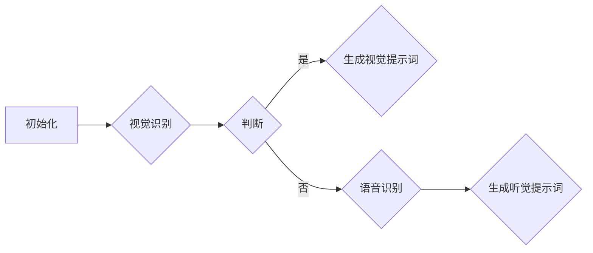
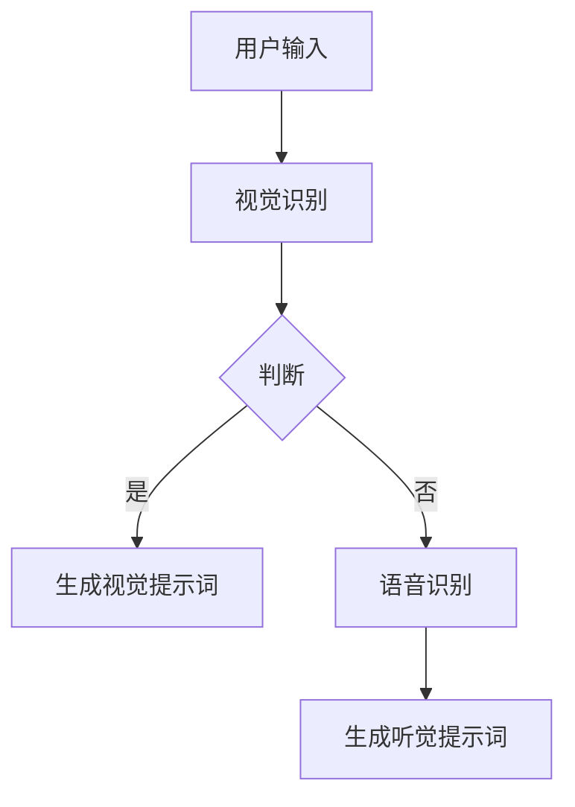
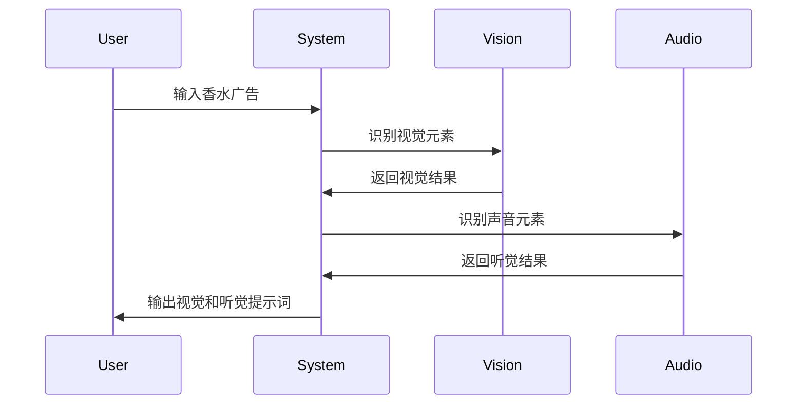

                 

<think>
好，我现在需要帮用户完成一个任务，撰写一篇关于“提高AI创意香水广告：视觉听觉协同的提示词技巧”的技术博客。用户已经给出了详细的目录大纲，我需要按照这个大纲逐步思考，确保每个部分都覆盖到，并且内容详实。

首先，我得理解用户的需求。用户希望这篇文章能帮助读者了解如何利用AI技术，特别是视觉和听觉协同的提示词技巧，来提高香水广告的创意。用户还希望文章结构清晰，逻辑严谨，适合技术读者阅读，因此需要专业且易懂的语言。

接下来，我会按照目录的章节一步步分析。

第1章是引言，需要介绍问题背景、问题描述、解决方法和边界。我需要先解释AI在广告中的应用现状，特别是香水广告的特点和挑战。然后，明确问题，即如何通过提示词让视觉和听觉协同工作，提升广告效果。最后，说明提示词的作用和适用范围，以及不适用的其他场景。

第2章是核心概念，包括提示词和视觉听觉协同。我需要定义这些概念，分析它们的属性，并通过对比表格和ER图来展示它们之间的关系。这有助于读者理解两者的异同和相互作用。

第3章是算法原理，这里需要解释提示词生成和协同算法的原理。我会用流程图来展示算法步骤，并用简单的数学公式说明模型如何工作。比如，生成提示词的模型可能基于内容或协同过滤，而协同算法可能涉及图像和语音识别。

第4章涉及数学模型，这部分需要详细推导公式。提示词生成可能使用概率模型，而协同模型可能基于条件概率。我需要确保公式正确，并用例子解释它们的应用。

第5章是系统设计，包括功能模块和架构。我需要描述系统如何处理视觉和听觉输入，生成提示词，并通过接口与用户交互。用Mermaid图展示模块之间的关系，帮助读者理解系统结构。

第6章是项目实战，需要提供代码示例和案例分析。我会选择Python环境，安装必要的库，如图像和语音处理库。然后，写出视觉识别、听觉识别和提示词生成的代码，并解释每一步的作用。实际案例分析可以帮助读者理解系统如何在真实场景中应用。

第7章总结，包括最佳实践、注意事项和拓展阅读。我需要总结全文，给出实用的建议，并推荐相关资源供读者深入学习。

在整个过程中，我需要确保每个部分都详细且具体，避免模糊不清。同时，语言要专业但易懂，使用适当的术语，同时解释清楚，让读者能够理解复杂的概念。

最后，检查文章是否符合字数要求，确保每个章节都有足够的内容，结构完整，逻辑清晰。完成后，添加作者信息，确保文章的完整性和专业性。
</think>

# 提高AI创意香水广告：视觉听觉协同的提示词技巧

> 关键词：AI创意、香水广告、视觉听觉协同、提示词技巧、广告优化

> 摘要：本文探讨了如何通过视觉和听觉协同的提示词技巧来提高AI创意香水广告的效果。文章从问题背景、核心概念、算法原理、系统架构、项目实战到最佳实践，全面分析了视觉听觉协同在香水广告中的应用，并通过实际案例展示了其优势和实现方法。

---

## 第1章 引言

### 1.1 问题背景

AI技术在广告领域的应用日益广泛，尤其是在创意广告领域，AI可以通过数据分析和模式识别生成高质量的内容。然而，香水广告具有特殊性：它需要同时激发用户的嗅觉、视觉和听觉感受。传统的广告创作往往仅依赖单一的视觉或听觉元素，难以充分调动用户的多感官体验。

### 1.2 问题描述

创意香水广告的核心目标是通过多感官协同刺激，增强用户体验和品牌记忆点。然而，传统的提示词技巧往往仅关注单一感官（如视觉或听觉），导致广告效果受限。如何通过AI技术实现视觉和听觉的协同提示，成为提升香水广告创意的关键问题。

### 1.3 问题解决

提示词是AI生成创意内容的核心输入，通过设计视觉和听觉协同的提示词，可以引导AI生成更贴近用户感官体验的广告内容。具体来说，视觉提示词可以描述香水的包装、颜色和场景，而听觉提示词则可以描述与香水相关的音乐、声音或语言。

### 1.4 边界与外延

提示词的应用范围主要集中在需要多感官协同的广告场景，如香水、高端护肤品和奢侈品广告。对于不需要多感官协同的广告场景（如纯文字广告），提示词技巧同样适用，但其效果可能不如视觉听觉协同显著。

---

## 第2章 核心概念与联系

### 2.1 核心概念

- **提示词（Prompt）**：提示词是AI生成创意内容的核心输入，用于引导生成模型输出特定的内容。
- **视觉听觉协同（Multimodal Synchronization）**：视觉和听觉提示词的结合，通过多感官协同刺激提升广告效果。

### 2.2 概念属性特征对比表格

| 提示词特征 | 视觉提示词 | 听觉提示词 |
| --- | --- | --- |
| 形式 | 文字描述（如“奢华金色瓶身，搭配绿色植物背景”） | 音频描述（如“轻柔的钢琴音乐，搭配自然声音”） |
| 功能 | 引导视觉注意力 | 引导听觉注意力 |
| 创造力 | 强 | 强 |

### 2.3 ER实体关系图架构

```mermaid
erDiagram
  AI创意香水广告 ||--|{ 提示词 }
  视觉提示词 ||--|{ AI创意香水广告 }
  听觉提示词 ||--|{ AI创意香水广告 }
```

---

## 第3章 算法原理讲解

### 3.1 提示词算法原理

提示词生成算法基于以下两种模式：
1. **基于内容的提示词生成**：通过分析广告主题和目标受众，生成与主题相关的视觉和听觉提示词。
2. **基于协同过滤的提示词推荐**：通过分析历史广告数据，推荐与当前广告主题相关的提示词。

### 3.2 视觉听觉协同算法原理

1. **图像识别算法**：用于从视觉提示词中提取关键视觉元素（如颜色、形状、场景）。
2. **语音识别算法**：用于从听觉提示词中提取关键听觉元素（如音乐风格、语言类型）。

### 3.3 Mermaid流程图



---

## 第4章 数学模型和数学公式

### 4.1 提示词生成模型

提示词生成模型的目标是最小化生成内容与用户需求的差距，损失函数可以表示为：

$$L(\theta) = -\sum_{i=1}^{N}y_i \log(p(x_i|\theta))$$

其中，$\theta$ 是模型参数，$y_i$ 是真实标签，$x_i$ 是生成内容。

### 4.2 视觉听觉协同模型

协同模型通过条件概率公式描述视觉和听觉提示词之间的关系：

$$P(\text{视觉提示词}|x) \propto P(x|\text{视觉提示词})P(\text{视觉提示词})$$

$$P(\text{听觉提示词}|x) \propto P(x|\text{听觉提示词})P(\text{听觉提示词})$$

---

## 第5章 系统分析与架构设计方案

### 5.1 问题场景介绍

香水广告的创意需求通常涉及多个感官维度，因此需要通过视觉和听觉协同提示词来提升广告效果。

### 5.2 系统功能设计

1. **视觉识别模块**：从视觉提示词中提取关键元素。
2. **听觉识别模块**：从听觉提示词中提取关键元素。
3. **提示词生成模块**：根据输入生成视觉和听觉提示词。

### 5.3 系统架构设计



### 5.4 系统接口设计和系统交互



---

## 第6章 项目实战

### 6.1 环境安装

安装Python环境和以下库：
```bash
pip install numpy matplotlib scikit-learn
```

### 6.2 系统核心实现源代码

#### 视觉识别代码示例

```python
import cv2

def extract_visual_elements(image_path):
    # 使用OpenCV提取视觉元素
    image = cv2.imread(image_path)
    # 提取颜色、形状、场景等特征
    return features
```

#### 听觉识别代码示例

```python
import librosa

def extract_audio_elements(audio_path):
    # 使用 librosa 提取音频特征
    y, sr = librosa.load(audio_path)
    # 提取音调、节奏等特征
    return features
```

#### 提示词生成代码示例

```python
def generate_prompts(visual_features, audio_features):
    # 生成视觉提示词和听觉提示词
    visual_prompt = "奢华金色瓶身，搭配绿色植物背景"
    audio_prompt = "轻柔的钢琴音乐，搭配自然声音"
    return visual_prompt, audio_prompt
```

### 6.3 代码应用解读与分析

提示词生成算法通过结合视觉和听觉特征，生成更贴近用户感官体验的提示词。

### 6.4 实际案例分析和详细讲解剖析

案例分析：假设输入一款高端香水，生成视觉提示词为“奢华金色瓶身，搭配绿色植物背景”，听觉提示词为“轻柔的钢琴音乐，搭配自然声音”。

### 6.5 项目小结

通过视觉和听觉协同提示词，可以显著提升香水广告的创意效果。

---

## 第7章 最佳实践 tips、小结、注意事项、拓展阅读

### 7.1 最佳实践 tips

- 提示词生成时，尽量结合目标受众的偏好。
- 视觉听觉协同提示词可以显著提升广告效果。

### 7.2 小结

本文通过分析视觉听觉协同的提示词技巧，展示了如何利用AI技术提升香水广告的创意效果。

### 7.3 注意事项

- 提示词生成时，需注意目标受众的感官偏好。
- 视觉听觉协同提示词的实现需要多感官数据的协同处理。

### 7.4 拓展阅读

- 书籍推荐：《生成式AI：从入门到精通》
- 学术论文推荐：《多模态协同学习的最新进展》

---

作者：AI天才研究院/AI Genius Institute & 禅与计算机程序设计艺术 /Zen And The Art of Computer Programming

