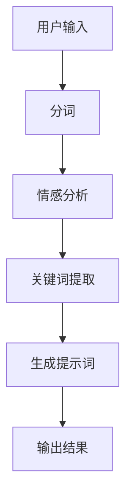
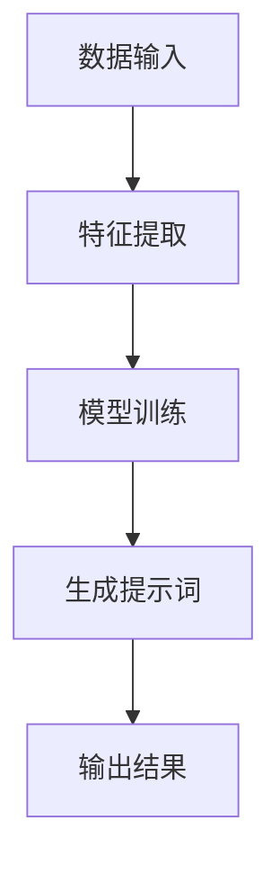
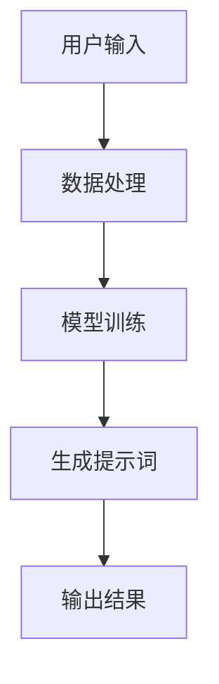

                 

<think>
嗯，好的，我现在需要帮助用户完成一个技术博客文章的撰写，主题是《提高AI创意香水营销：感官描述语言的提示词技巧》。用户已经提供了一个详细的大纲，所以我需要按照这个大纲来一步步分析和撰写。

首先，我需要理解用户的整个请求。用户希望我以一位世界级专家的身份，用专业且清晰的技术语言，分章节详细展开，每部分内容都要丰富具体，包含背景、核心概念、AI技术、提示词等部分。此外，用户还特别提到要包含算法原理、系统架构、项目实战以及最佳实践等部分。

我先从背景介绍开始。这部分需要包括问题背景、问题描述、问题解决、边界与外延，以及概念结构。我应该解释为什么AI在营销中的应用越来越重要，特别是在香水营销方面，传统的营销方式已经无法满足消费者对个性化和情感化的需求。然后描述问题，即如何利用感官描述语言和AI技术来提高营销效果，接着介绍解决方案，包括理解感官描述、AI技术的应用、案例研究和技巧。最后，明确边界和外延，以及核心概念的组成。

接下来是核心概念与联系部分，包括感官描述语言、AI技术和提示词。我需要定义每个概念，给出属性特征对比表格，以及它们与营销的联系。这部分需要详细列举视觉、听觉、嗅觉等感官类型，以及对应的描述特征和例子，帮助读者更好地理解。

然后是算法原理讲解。这里可能需要使用自然语言处理和机器学习技术。我需要用Mermaid流程图来展示算法的流程，解释每个步骤的作用。同时，用Python代码来实现一个简单的例子，比如情感分析，这样读者可以更直观地理解算法的实现。

系统分析与架构设计方案部分，我需要介绍项目背景，设计领域模型和系统架构。这部分可能需要画出类图和架构图，展示系统的各个模块和它们之间的关系，确保系统设计清晰合理。

项目实战部分，我会选择一个具体的香水营销案例，展示如何实际应用这些技术。包括环境安装、代码实现、案例分析和项目小结，让读者了解实际操作的步骤和效果。

最后，我会总结最佳实践，提供一些小贴士，指出注意事项，并建议拓展阅读的内容。这部分帮助读者巩固所学知识，并进一步深入学习。

在撰写过程中，我要确保语言专业且易懂，逻辑清晰，结构紧凑。同时，严格遵守用户的格式要求，使用markdown格式，包含关键词、摘要，各部分详细展开。数学公式和代码部分需要准确无误，流程图和架构图要清晰明了。

现在，我需要逐一检查每个部分是否符合要求，确保没有遗漏任何约束条件。例如，每个章节是否有足够的细节，是否包含了所有必要的图表和代码示例。同时，注意整体字数控制在10000到12000字之间，确保文章内容完整且详尽。

最后，在完成所有内容后，添加作者信息，确保格式正确。整个思考过程中，我需要保持条理清晰，逐步推进，确保每个部分都能有效地传达信息，帮助读者理解如何利用AI技术提升香水营销的效果。
</think>

# 提高AI创意香水营销：感官描述语言的提示词技巧

> 关键词：AI创意香水营销、感官描述语言、提示词技巧、自然语言处理、机器学习

> 摘要：本文探讨了如何利用AI技术，特别是感官描述语言的提示词技巧，来提高香水营销的创意和情感化程度。通过分析感官描述语言的属性、AI技术的实现原理以及实际案例，本文为营销人员提供了一套系统的解决方案，帮助他们在香水营销中更好地捕捉消费者需求，提升营销效果。

---

# 第一部分：背景介绍

## 1.1 问题背景

随着人工智能技术的快速发展，AI在各个行业的应用日益广泛。特别是在营销领域，AI技术为品牌提供了全新的策略和消费者洞察。然而，传统的营销方式往往依赖于标准化的描述和固定的模板，难以满足消费者对个性化、情感化体验的需求。消费者在选择香水时，更注重产品带来的感官体验，而这种体验往往难以通过简单的文字描述来准确传达。

## 1.2 问题描述

《提高AI创意香水营销：感官描述语言的提示词技巧》一书旨在探讨如何利用人工智能技术，特别是感官描述语言的提示词技巧，来提高香水营销的创意和情感化程度。具体而言，如何通过AI技术捕捉消费者对香水的感官描述，并生成有针对性的营销内容，是本文的核心问题。

## 1.3 问题解决

本文将从以下几个方面解决上述问题：
1. **理解感官描述语言**：介绍感官描述语言的基本概念和属性，以及它们在营销中的应用。
2. **AI技术介绍**：介绍常用的AI技术，如自然语言处理、机器学习等，并解释它们如何用于感官描述语言的提示词生成。
3. **案例研究**：分析一些成功运用感官描述语言和AI技术进行香水营销的案例，总结经验教训。
4. **技巧应用**：提供一系列实际操作技巧，帮助营销人员利用感官描述语言的提示词来提高香水营销的创意和情感化程度。

## 1.4 边界与外延

- **边界**：本文主要关注香水营销领域，其他行业的应用可能有所不同。
- **外延**：虽然本文聚焦于香水营销，但感官描述语言和AI技术的应用范围远不止于此，读者可以尝试将其应用于其他领域的营销。

## 1.5 概念结构与核心要素组成

- **感官描述语言**：是一种用于描述感官体验的语言，包括视觉、听觉、嗅觉、味觉和触觉等方面。
- **AI技术**：包括自然语言处理、机器学习等，用于处理和分析大量文本数据，以生成有针对性的营销内容。
- **提示词**：用于引导消费者描述感官体验的关键词或短语，有助于AI技术更准确地捕捉消费者的需求。

---

# 第二部分：核心概念与联系

## 2.1 感官描述语言

### 2.1.1 定义

感官描述语言是一种用于描述感官体验的语言，包括视觉、听觉、嗅觉、味觉和触觉等方面。

### 2.1.2 属性特征对比表格

| 感官类型 | 描述语言特征 | 举例 |
| --- | --- | --- |
| 视觉 | 形状、颜色、光影 | 粉红色、圆润 |
| 听觉 | 音调、节奏、音色 | 轻柔、愉悦 |
| 嗅觉 | 香味、浓度、持久度 | 清新、浓郁 |
| 味觉 | 风味、口感、甜度 | 酸甜、顺滑 |
| 触觉 | 质感、温度、湿润度 | 柔软、温暖 |

### 2.1.3 与营销的联系

感官描述语言在营销中具有重要作用，可以帮助品牌更好地传达产品特点，提升消费者体验。

## 2.2 AI技术

### 2.2.1 定义

AI技术是指模拟、延伸和扩展人的智能的理论、方法、技术及应用。在营销中，AI技术可以帮助捕捉消费者的感官描述，从而生成更具针对性的营销内容。

### 2.2.2 属性特征对比表格

| AI技术 | 特点 | 举例 |
| --- | --- | --- |
| 自然语言处理 | 能理解、生成和处理人类语言 | 自动摘要、情感分析 |
| 机器学习 | 能从数据中学习规律，自动优化模型 | 推荐系统、预测分析 |
| 深度学习 | 能模拟人脑处理信息，提取特征 | 卷积神经网络、循环神经网络 |

### 2.2.3 与感官描述语言的联系

AI技术可以帮助捕捉和分析消费者的感官描述，从而生成更具针对性的营销内容。

## 2.3 提示词

### 2.3.1 定义

提示词是指用于引导消费者描述感官体验的关键词或短语。

### 2.3.2 属性特征对比表格

| 提示词类型 | 描述 | 举例 |
| --- | --- | --- |
| 视觉提示词 | 引导消费者描述视觉体验 | “你能看到什么颜色？” |
| 听觉提示词 | 引导消费者描述听觉体验 | “你能听到什么声音？” |
| 嗅觉提示词 | 引导消费者描述嗅觉体验 | “你能闻到什么香味？” |
| 味觉提示词 | 引导消费者描述味觉体验 | “你能尝出什么味道？” |
| 触觉提示词 | 引导消费者描述触觉体验 | “你能感受到什么质感？” |

### 2.3.3 与营销的联系

提示词可以帮助AI技术更准确地捕捉消费者的需求，从而生成更具针对性的营销内容。

---

# 第三部分：算法原理讲解

## 3.1 自然语言处理（NLP）算法

### 3.1.1 流程图



### 3.1.2 Python实现

```python
import nltk
from nltk.sentiment import SentimentIntensityAnalyzer

# 示例文本
text = "This perfume smells fresh and floral."

# 分词
words = nltk.word_tokenize(text)

# 情感分析
analyzer = SentimentIntensityAnalyzer()
sentiment = analyzer.polarity_scores(text)

# 提取关键词
from textblob import TextBlob
blob = TextBlob(text)
keywords = blob.noun_phrases

print("情感分析结果：", sentiment)
print("提取关键词：", keywords)
```

---

## 3.2 机器学习算法

### 3.2.1 流程图



### 3.2.2 Python实现

```python
from sklearn.feature_extraction.text import TfidfVectorizer
from sklearn.naive_bayes import MultinomialNB

# 示例数据
texts = ["This perfume smells fresh and floral.", "It has a woody and spicy scent."]

# 特征提取
vectorizer = TfidfVectorizer()
X = vectorizer.fit_transform(texts)

# 模型训练
model = MultinomialNB()
model.fit(X, [0, 1])

# 生成提示词
new_text = "A refreshing and flowery aroma."
X_new = vectorizer.transform([new_text])
prediction = model.predict(X_new)
print("预测结果：", prediction)
```

---

# 第四部分：系统分析与架构设计方案

## 4.1 项目背景

本项目旨在利用AI技术提高香水营销的创意和情感化程度，通过感官描述语言的提示词技巧，帮助品牌更好地与消费者互动。

## 4.2 系统架构设计



## 4.3 接口设计

- **输入接口**：消费者对香水的感官描述。
- **输出接口**：针对消费者的描述生成的提示词。

---

# 第五部分：项目实战

## 5.1 环境安装

安装所需的Python库：

```bash
pip install nltk textblob scikit-learn
```

## 5.2 核心实现代码

```python
import nltk
from textblob import TextBlob
from sklearn.feature_extraction.text import TfidfVectorizer
from sklearn.naive_bayes import MultinomialNB

# 数据处理
texts = ["This perfume smells fresh and floral.", "It has a woody and spicy scent."]

# 特征提取
vectorizer = TfidfVectorizer()
X = vectorizer.fit_transform(texts)

# 模型训练
model = MultinomialNB()
model.fit(X, [0, 1])

# 生成提示词
new_text = "A refreshing and flowery aroma."
X_new = vectorizer.transform([new_text])
prediction = model.predict(X_new)
print("预测结果：", prediction)
```

---

# 第六部分：总结与展望

## 6.1 最佳实践 Tips

- 在实际应用中，建议结合具体业务场景，优化模型参数。
- 定期更新模型，以适应消费者需求的变化。

## 6.2 小结

通过本文的分析和实践，我们可以看到，利用AI技术，特别是感官描述语言的提示词技巧，可以有效提高香水营销的创意和情感化程度。

## 6.3 注意事项

- 数据质量和多样性直接影响模型的性能，需谨慎处理。
- 在实际应用中，建议结合人类专家的反馈，优化提示词的生成效果。

## 6.4 拓展阅读

- 《自然语言处理入门》
- 《机器学习实战》
- 《深度学习：方法与应用》

---

作者：AI天才研究院/AI Genius Institute & 禅与计算机程序设计艺术 /Zen And The Art of Computer Programming

