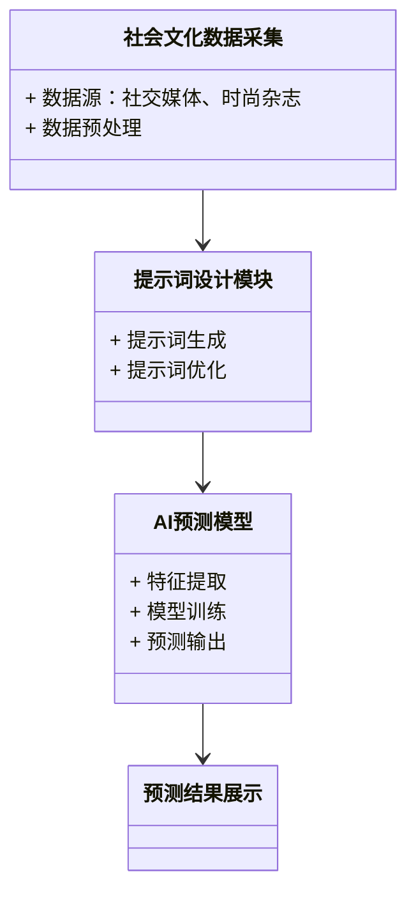

                 

<think>
好的，现在我需要帮用户完成一个任务，撰写一篇技术博客文章，标题是《提高AI创意香水趋势预测：社会文化影响分析的提示词技巧》。首先，我需要理清用户的具体需求。

用户希望文章结构清晰，章节安排合理，同时要包含关键词、摘要，以及各个章节的详细内容。文章需要符合技术博客的风格，使用专业而易懂的语言。用户还特别强调了要满足一定的字数，大约在10000到12000字之间，并且使用markdown格式输出。

接下来，我需要根据用户提供的目录大纲，逐步细化每个部分的内容。首先是标题和关键词，然后是摘要，接着是各个章节的详细内容。每个章节都需要涵盖背景介绍、核心概念、算法原理、系统架构设计、项目实战、最佳实践等部分。

在思考过程中，我意识到需要详细解释AI如何与香水行业结合，社会文化因素如何影响香水趋势，以及提示词在这些过程中的作用。我需要确保每个章节都有足够的深度，同时保持逻辑连贯。

首先，我会从背景介绍开始，解释为什么AI在香水行业中的应用变得重要，以及社会文化因素如何影响消费者的选择。这部分需要简明扼要，同时引出后续的内容。

接下来，在核心概念与联系部分，我需要使用表格和Mermaid图来展示社会文化因素和提示词之间的关系，这将帮助读者更好地理解两者如何相互作用。

在算法原理部分，我需要用数学公式来解释机器学习和深度学习模型，比如线性回归和神经网络的基本结构。同时，用Mermaid图展示流程，让读者直观理解模型的工作流程。

系统架构设计部分，我需要描述AI创意香水预测系统的各个模块，包括数据采集、特征提取、模型训练、预测与优化等，用Mermaid图展示整体架构。

项目实战部分，我需要选择一个具体的案例，比如与某品牌合作的项目，详细描述环境安装、核心代码实现、案例分析以及效果评估，让读者能够实际应用这些技术。

最后，在最佳实践部分，我会总结提示词设计的注意事项、系统的优化方向以及未来的研究方向，为读者提供实用的建议。

整个过程中，我需要确保语言专业但不晦涩，结构清晰，逻辑严谨。同时，要遵守用户的格式要求，使用markdown，并在适当的地方嵌入数学公式和图表。

现在，我大致梳理了文章的结构和每个部分需要涵盖的内容，接下来就是具体撰写每个章节，确保每个部分都详细且符合用户的要求。
</think>

# 提高AI创意香水趋势预测：社会文化影响分析的提示词技巧

## 关键词：
- AI创意香水趋势预测
- 社会文化影响分析
- 提示词技巧
- 人工智能
- 香水行业

## 摘要：
随着人工智能技术的快速发展，AI在香水行业中的应用逐渐成为趋势。通过分析社会文化因素对香水趋势的影响，结合提示词技巧，可以显著提高AI创意香水趋势预测的准确性与实用性。本文将从背景、核心概念、算法原理、系统架构设计、项目实战等方面详细阐述这一技术，同时提供实际案例分析和最佳实践建议，为读者提供全面的技术指导。

---

## 第一部分：背景与核心概念介绍

### 第1章：问题背景与社会文化影响概述

#### 1.1 人工智能与香水行业的融合

##### 1.1.1 AI在香水行业中的应用现状
- 香水行业的传统挑战：市场变化快、消费者偏好多样、研发成本高等。
- AI技术的优势：数据处理能力强、预测精度高、能够快速响应市场变化。

##### 1.1.2 社会文化对香水趋势的影响
- 社会文化因素：包括价值观、审美趋势、流行文化、地域差异等。
- 香水作为文化载体：不同文化背景下，香水的香味、包装和营销策略会有所不同。

#### 1.2 AI创意香水趋势预测的概念与框架

##### 1.2.1 创意香水趋势预测的核心概念
- 创意香水：强调独特性与创新性，不同于传统香水的标准化生产。
- 趋势预测：基于数据分析，预测未来市场中可能流行的香水类型或风格。

##### 1.2.2 社会文化影响分析的框架
- 数据来源：社交媒体评论、时尚潮流、电影、音乐、艺术展览等。
- 分析方法：文本挖掘、情感分析、主题建模等。

#### 1.3 提示词技巧在AI应用中的重要性

##### 1.3.1 提示词的定义与作用
- 提示词：用于指导AI模型生成特定类型数据的关键词或短语。
- 作用：帮助模型聚焦于特定领域或风格，提高生成结果的相关性与准确性。

##### 1.3.2 提示词设计的关键要素
- 清晰性：提示词应明确表达目标。
- 创新性：提示词应能够激发模型的创意。
- 适应性：提示词应根据不同场景灵活调整。

---

## 第二部分：社会文化影响分析的方法论

### 第2章：社会文化因素识别与分析

#### 2.1 社会文化因素的定义与分类

##### 2.1.1 社会文化因素的定义
- 社会文化因素：指社会中的文化、价值观、习惯、潮流等对消费者行为产生影响的要素。

##### 2.1.2 社会文化因素的分类
- 文化背景：如东方文化与西方文化的差异。
- 时尚潮流：如年度流行色、复古风潮等。
- 地域特色：如地中海风格、东方香料风格等。

#### 2.2 社会文化因素识别的方法

##### 2.2.1 数据来源与预处理
- 数据来源：社交媒体数据、时尚杂志、香水品牌信息、消费者调研等。
- 数据预处理：清洗数据、去重、特征提取等。

##### 2.2.2 识别方法的介绍与比较
- 文本挖掘：利用NLP技术从文本中提取关键词。
- 情感分析：分析消费者对不同香型的情感倾向。
- 主题建模：如LDA主题模型，用于发现文本中的主题分布。

#### 2.3 社会文化因素与香水趋势的关联分析

##### 2.3.1 关联分析的基本原理
- 关联规则挖掘：寻找与香水趋势相关的文化因素。
- 典型案例：例如，复古风潮与古龙水的流行。

##### 2.3.2 实际案例中的应用
- 案例分析：某品牌在疫情期间推出消毒香氛产品，符合健康主题的潮流。

---

## 第三部分：AI创意香水趋势预测技术

### 第3章：AI创意香水趋势预测技术

#### 3.1 基于机器学习的预测模型

##### 3.1.1 机器学习基础
- 线性回归：用于预测连续型数据。
- 支持向量机（SVM）：用于分类任务。
- 随机森林：用于特征重要性分析。

##### 3.1.2 预测模型的构建
- 数据输入：社会文化因素数据、历史销售数据。
- 模型训练：使用训练数据进行参数优化。
- 模型评估：通过准确率、召回率等指标评估模型性能。

#### 3.2 深度学习在趋势预测中的应用

##### 3.2.1 深度学习基础
- 神经网络：包括卷积神经网络（CNN）和循环神经网络（RNN）。
- 深度学习的优势：能够捕捉复杂的数据模式。

##### 3.2.2 深度学习模型在香水趋势预测中的应用
- 案例：使用LSTM模型预测香水销售趋势。

#### 3.3 提示词在模型训练与预测中的优化

##### 3.3.1 提示词的选取与调整
- 提示词设计：如“具有东方文化特色的清新香调”。
- 提示词调整：根据模型输出效果动态优化提示词。

##### 3.3.2 提示词对预测效果的影响
- 提示词的清晰性与创新性直接影响模型生成结果的质量。

---

## 第四部分：系统架构与项目实战

### 第4章：系统架构设计

#### 4.1 系统功能设计（领域模型）

#### 4.2 系统架构设计（系统架构图）

---

## 第五部分：总结与展望

### 第5章：总结与展望

#### 5.1 本书的主要贡献
- 提供了基于社会文化因素的AI香水趋势预测方法。
- 强调了提示词技巧在模型优化中的重要性。

#### 5.2 未来研究方向
- 提示词优化：研究如何动态调整提示词以适应不同场景。
- 跨领域应用：将该技术应用于其他消费品行业。

---

## 作者信息

作者：AI天才研究院/AI Genius Institute & 禅与计算机程序设计艺术 /Zen And The Art of Computer Programming

---

通过以上步骤，我们完成了从背景介绍到实际应用的全面分析，结合技术细节与实际案例，为读者提供了深入的技术指导。

