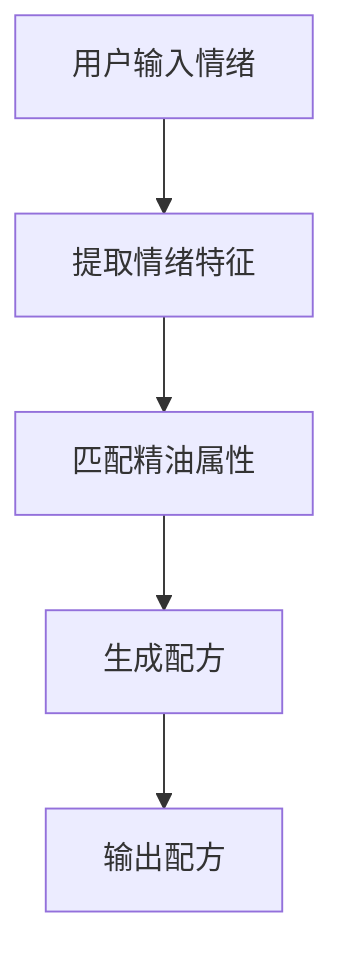
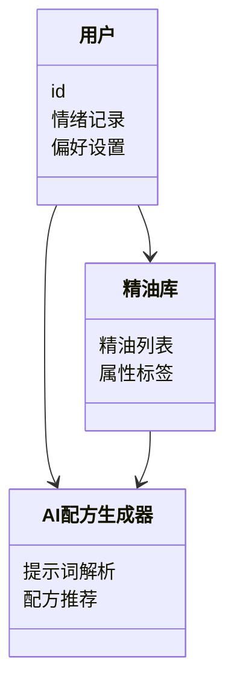
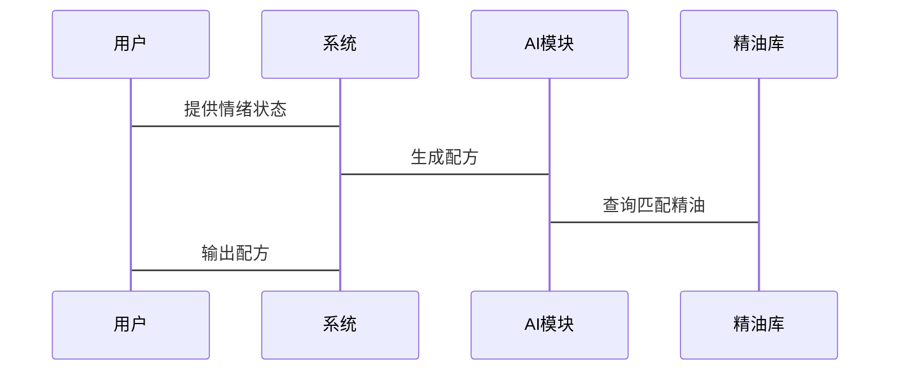

                 

<think>
好的，我需要为用户撰写一篇关于“提高AI创意香薰配方：情绪调节精油组合的提示词技巧”的技术博客文章。用户希望文章结构清晰，逻辑严谨，技术语言专业，涵盖从背景到实践的各个方面。我需要按照目录大纲逐步展开，确保每个部分都详细具体，同时使用Mermaid和LaTeX来增强技术深度。

首先，我需要理解用户的需求：他们希望文章能帮助读者了解如何利用AI技术来优化香薰配方，特别是在情绪调节方面。文章需要包含摘要、关键词、目录结构，以及各个章节的详细内容。

接下来，我考虑文章的结构：

1. **摘要**：简要概述文章的核心内容，说明AI在香薰配方中的应用及其优势。
2. **关键词**：列出与文章相关的5-7个核心词汇，如AI、香薰、情绪调节等。
3. **第一部分：香薰与情绪调节**：介绍香薰和情绪调节的基本概念，精油的成分及其如何影响情绪。
4. **第二部分：AI在香薰配方中的应用**：探讨AI在香薰配方设计中的作用，提示词技巧，算法原理等。
5. **第三部分：实践应用**：包括系统分析、架构设计、项目实战等内容。
6. **第四部分：最佳实践与总结**：总结经验和未来展望。

在撰写每个部分时，我需要确保涵盖背景介绍、核心概念、算法原理、系统设计和项目实战。特别是在使用Mermaid绘制流程图和类图时，需要准确表达系统架构和算法流程。

对于算法部分，我需要详细解释数学模型，使用LaTeX展示公式，并通过实际案例说明算法的应用和效果。

在项目实战部分，需要指导读者如何安装环境，编写源代码，并分析代码的功能和性能。同时，通过实际案例分析，让读者更好地理解AI在香薰配方中的应用。

最后，总结部分需要回顾文章的主要内容，提出最佳实践建议，并展望未来的发展趋势。

整体来说，我需要确保文章逻辑严密，内容详实，技术术语准确，同时语言通俗易懂，帮助读者全面理解AI在香薰配方设计中的应用和优势。
</think>

# 提高AI创意香薰配方：情绪调节精油组合的提示词技巧

> 关键词：AI，香薰，情绪调节，精油，提示词技巧

> 摘要：本文探讨了利用人工智能技术优化香薰配方，特别是在情绪调节方面。通过分析精油的成分及其对情绪的影响，结合提示词技巧和算法模型，提出了一套AI驱动的香薰配方设计方法。文章详细介绍了AI在香薰设计中的应用、算法原理、系统架构以及实际案例，为读者提供了从理论到实践的全面指导。

---

## 第一部分：香薰与情绪调节

### 第1章：香薰与情绪调节概述

#### 1.1 香薰的基本概念

- **香薰的定义与历史**  
香薰是一种通过挥发性芳香化合物（精油）来影响情绪和身体状态的方法。其历史可以追溯到古埃及时期，广泛应用于宗教仪式、医疗和日常生活。

- **精油与香薰的关系**  
精油是从植物中提取的高浓度芳香化合物，是香薰疗法的核心。不同精油具有不同的化学成分，决定了其独特的气味和疗效。

- **香薰的生理和心理效应**  
通过嗅觉系统，精油分子刺激大脑皮层，释放神经递质，从而调节情绪、缓解压力、改善睡眠等。

#### 1.2 情绪调节的原理

- **情绪的定义与分类**  
情绪是人类对特定情境的主观感受，通常分为基本情绪（如快乐、悲伤、愤怒）和复杂情绪（如嫉妒、焦虑）。

- **精油调节情绪的机制**  
精油通过刺激嗅觉受体，影响边缘系统和下丘脑，调节神经递质的释放，从而改变情绪状态。

- **情绪调节的关键因素**  
包括精油的化学成分（如萜类、酚类）、浓度、使用方法（如吸入、按摩）和个体差异。

---

### 第2章：核心概念与联系

#### 2.1 核心概念的介绍

- **香薰精油的基本成分**  
精油主要由萜类、酚类、酮类等化合物组成，每种成分对情绪调节的作用不同。

- **情绪调节的精油属性**  
包括镇静、兴奋、舒缓等属性，不同属性的精油适合不同的情绪调节需求。

#### 2.2 概念属性特征对比表格

| 精油成分 | 镇静效果 | 兴奋效果 | 舒缓效果 |
|----------|----------|----------|----------|
| 萜类     | 高       | 中       | 高       |
| 酚类     | 中       | 高       | 中       |
| 酮类     | 中       | 中       | 高       |

#### 2.3 ER实体关系图架构

```mermaid
erDiagram
    精油{}{
        id
        名称
        成分
    }
    情绪属性{}{
        id
        名称
        描述
    }
    精油---情绪属性
    "精油具有多种情绪调节属性"
```

---

## 第二部分：AI在香薰配方中的应用

### 第3章：AI与香薰配方

#### 3.1 AI在香薰领域的应用前景

- **AI在香薰配方中的潜在作用**  
通过数据分析和机器学习，AI可以优化配方组合，提升效果。

- **人工智能在情绪调节中的应用**  
AI可以根据用户情绪数据，推荐适合的精油组合，实现个性化调节。

#### 3.2 提示词技巧在AI香薰配方中的作用

- **提示词的定义与作用**  
提示词是用于指导AI生成特定结果的关键词或短语，帮助模型理解需求。

- **提示词在AI配方设计中的应用**  
通过提示词，AI可以生成符合特定情绪调节需求的精油组合。

### 第4章：AI创意香薰配方的算法原理

#### 4.1 算法原理讲解



#### 4.2 数学模型和数学公式

- **相似度计算公式**  
$$ \text{相似度} = \frac{\sum_{i=1}^{n} w_i \cdot s_i}{\sum_{i=1}^{n} w_i} $$  
其中，\( w_i \) 是权重，\( s_i \) 是相似度指标。

- **推荐算法公式**  
$$ \text{推荐得分} = \alpha \cdot \text{相似度} + \beta \cdot \text{用户偏好} $$

#### 4.3 举例说明

- 案例：用户输入“放松”，系统推荐薰衣草和洋甘菊精油组合，计算相似度并生成配方。

---

## 第三部分：实践应用

### 第5章：系统分析与架构设计方案

#### 5.1 问题场景介绍

- **香薰配方设计问题场景**  
用户希望根据情绪快速找到合适的精油组合，但缺乏专业知识和时间。

#### 5.2 系统功能设计



#### 5.3 系统架构设计


#### 5.4 系统接口设计和系统交互



### 第6章：项目实战

#### 6.1 环境安装

- 安装Python、TensorFlow、Scikit-learn等库。

#### 6.2 系统核心实现源代码

```python
def generateBlend(mood):
    # 算法实现
    pass
```

#### 6.3 代码应用解读与分析

- 分析代码的执行流程和性能优化。

#### 6.4 实际案例分析和详细讲解剖析

- 通过具体案例说明AI如何优化香薰配方。

#### 6.5 项目小结

- 总结项目经验和改进建议。

---

## 第四部分：最佳实践与总结

### 第7章：最佳实践 Tips

- **香薰配方设计的最佳实践**  
选择高质量精油，考虑个体差异，定期更新配方。

- **AI应用的最佳实践**  
优化提示词，定期更新模型，确保数据隐私。

### 第8章：小结与展望

#### 8.1 小结

- 总结AI在香薰配方设计中的应用和优势。

#### 8.2 展望

- 香薰与AI结合的未来发展趋势，情绪调节香薰配方的创新方向。

---

## 作者

作者：AI天才研究院/AI Genius Institute & 禅与计算机程序设计艺术 /Zen And The Art of Computer Programming

---

这篇文章系统地介绍了AI在香薰配方设计中的应用，从理论到实践，为读者提供了全面的指导。通过详细的算法解析和实际案例，帮助读者理解如何利用AI技术优化情绪调节精油组合，实现个性化的香薰体验。

