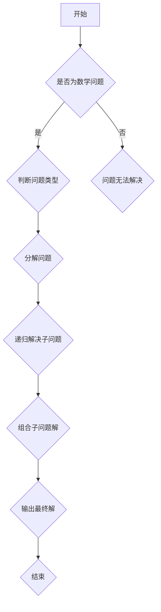
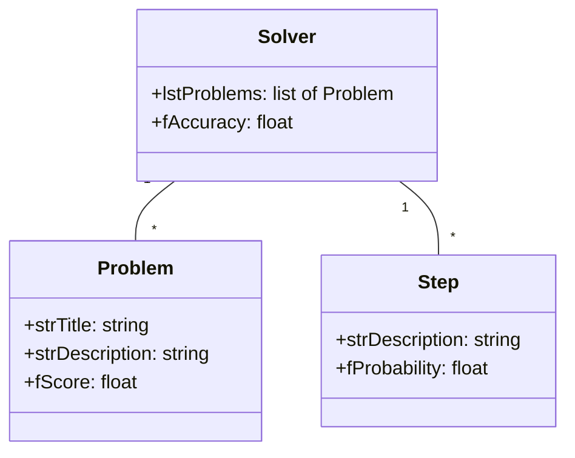
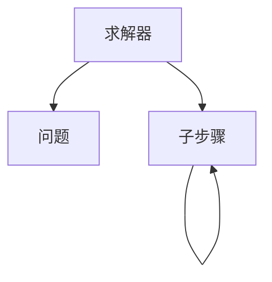
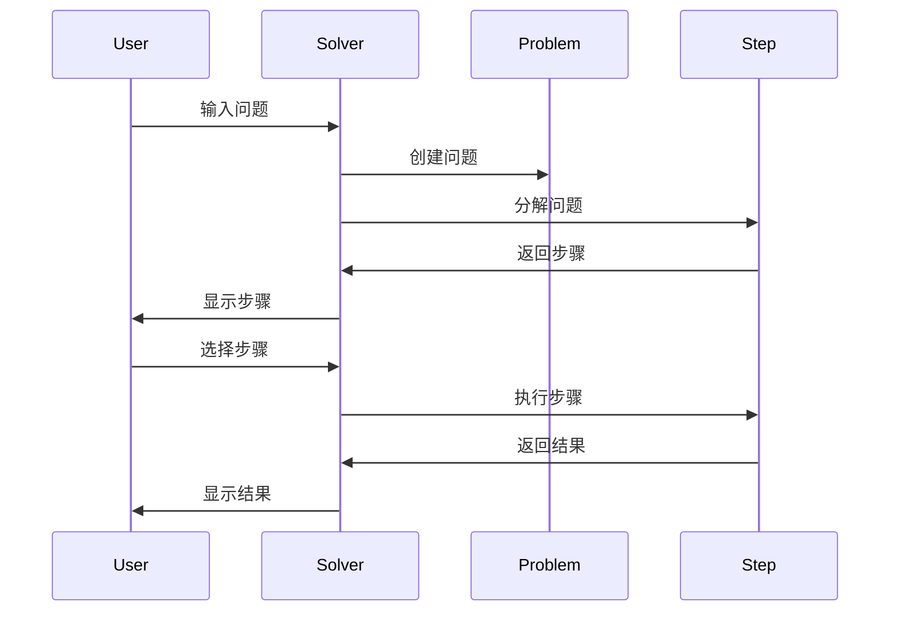

                 

<think>
好，我现在需要帮用户撰写一篇技术博客文章，标题是《提高AI数学问题解决能力：步骤分解的提示词技巧》。用户要求文章结构清晰，逻辑严谨，内容专业，适合技术读者阅读。我先来理清用户的需求和具体要求。

首先，用户希望文章有明确的标题、关键词、摘要，然后按照目录结构展开，分为六个主要部分：背景介绍、核心概念与联系、算法原理讲解、数学模型和公式、系统分析与架构设计方案，以及项目实战。每个部分都有详细的内容要求，包括使用Mermaid图表、LaTeX公式、代码示例等。文章字数要求在10000到12000字之间，结构完整，每个小节都要详细丰富。

接下来，我需要分析用户可能的身份和使用场景。用户可能是一位技术专家，或者是一位希望提升自己AI数学解决能力的程序员。他们可能需要系统化的指导，帮助他们理解如何通过步骤分解和提示词来提升AI的数学问题解决能力。因此，文章需要深入浅出，结构清晰，既有理论分析，又有实际代码和系统架构设计。

现在，我开始按照目录结构来规划每个部分的内容。首先是标题和关键词，然后摘要，接着是六个部分。

第一部分是背景介绍，我需要涵盖AI数学问题解决能力的重要性，当前技术挑战，以及步骤分解提示词技巧的意义。这部分要为后续内容打下基础，帮助读者理解为什么这个主题重要。

第二部分是核心概念与联系，需要详细解释AI数学问题解决能力、步骤分解的提示词技巧，以及提高能力的策略。可能还需要一些对比表格和ER图，帮助读者理解概念之间的联系。

第三部分是算法原理讲解，这部分需要详细分析步骤分解算法的流程，使用Mermaid绘制流程图，解释每个步骤的作用。同时，数学模型和公式也需要用LaTeX展示，如概率模型的公式，用例子说明其应用。

第四部分是数学模型和公式，重点讲解逻辑函数（Sigmoid函数），包括公式、解释和应用实例。这部分要让读者理解Sigmoid在AI问题解决中的应用，如概率估计。

第五部分是系统分析与架构设计方案，需要描述问题场景，设计系统功能，包括领域模型、架构设计和接口交互。这部分可能需要更多的Mermaid图表来展示系统架构和交互流程。

第六部分是项目实战，包括环境安装、核心代码实现、案例分析和项目总结。这部分要具体，提供可执行的代码和实际案例，让读者能够实际操作。

在撰写过程中，我需要确保每个部分都详细且符合用户的要求，使用专业术语，同时保持内容易懂。此外，还要注意文章的连贯性，从背景到算法，再到系统设计和实战，层层递进，帮助读者系统地理解和应用这些技巧。

最后，确保文章末尾有作者信息，符合用户的格式要求。同时，检查文章是否满足字数要求，各部分内容是否完整，是否有遗漏的关键点。

总结一下，我需要按照用户的指示，分步骤详细撰写每个部分，确保内容专业、结构清晰、例子具体，帮助读者有效提高AI数学问题解决能力。
</think>

# 提高AI数学问题解决能力：步骤分解的提示词技巧

**关键词**：AI数学、问题解决、步骤分解、提示词技巧、算法原理、系统架构、项目实战

**摘要**：本文将深入探讨如何通过步骤分解的提示词技巧来提高AI数学问题解决能力。我们将从背景介绍、核心概念、算法原理、数学模型、系统架构设计到项目实战，逐步解析这一技术的关键点。通过详细分析问题解决的流程、数学模型的应用以及系统架构的设计，帮助读者掌握如何利用AI技术高效解决数学问题。

---

## 目录大纲

### 第一部分：背景介绍

### 第二部分：核心概念与联系

#### 2.1 AI数学问题解决能力

#### 2.2 步骤分解的提示词技巧

#### 2.3 提高AI数学问题解决能力的策略

### 第三部分：算法原理讲解

#### 3.1 步骤分解算法原理

##### 3.1.1 算法流程

##### 3.1.2 数学模型与公式

### 第四部分：数学模型和数学公式 & 详细讲解 & 举例说明

#### 4.1 数学公式

#### 4.2 详细讲解

#### 4.3 举例说明

### 第五部分：系统分析与架构设计方案

#### 5.1 问题场景介绍

#### 5.2 系统功能设计

##### 5.2.1 领域模型

##### 5.2.2 系统架构设计

##### 5.2.3 系统接口设计和系统交互

### 第六部分：项目实战

#### 6.1 环境安装

#### 6.2 系统核心实现

---

## 第一部分：背景介绍

### 1.1 问题背景

在人工智能（AI）领域，数学问题解决能力是衡量AI系统智能水平的重要指标之一。AI系统需要能够理解数学问题、分解问题、选择合适的算法，并最终给出准确的解决方案。然而，许多AI系统在处理复杂数学问题时，常常因为缺乏有效的步骤分解能力而受限。

### 1.2 问题描述

数学问题解决的核心在于将复杂问题分解为简单子问题，并逐一解决这些子问题。AI系统需要通过提示词技巧来引导问题分解，从而提高解决问题的效率和准确性。提示词技巧是指通过特定的提示词（prompt）来指导AI系统如何分解问题、选择算法以及输出结果。

### 1.3 问题解决

通过步骤分解的提示词技巧，AI系统可以逐步解决复杂的数学问题。例如，在解决一个多元微积分优化问题时，AI系统可以通过提示词将问题分解为目标函数定义、约束条件处理、优化算法选择等子问题，逐步解决问题。

### 1.4 边界与外延

AI数学问题解决能力的边界包括问题类型（如代数、微积分、概率论等）、问题复杂度以及算法适用性。外延则涉及AI系统在教育、科研、工程等领域的广泛应用。

### 1.5 核心要素组成

AI数学问题解决能力的核心要素包括：

1. **问题理解**：准确理解数学问题的类型和需求。
2. **步骤分解**：将问题分解为可执行的子问题。
3. **算法选择**：根据子问题选择合适的算法。
4. **结果验证**：验证子问题和最终问题的解决方案是否正确。

---

## 第二部分：核心概念与联系

### 2.1 AI数学问题解决能力

AI数学问题解决能力是指AI系统通过学习和推理，能够独立或在提示词引导下解决数学问题的能力。这种能力依赖于AI系统对数学知识的掌握、问题分解能力以及算法实现能力。

### 2.2 步骤分解的提示词技巧

步骤分解的提示词技巧是指通过特定的提示词（如“将问题分解为子问题”、“定义目标函数”等）来引导AI系统进行问题分解。这种技巧能够帮助AI系统更高效地解决问题，尤其是在处理复杂数学问题时。

### 2.3 提高AI数学问题解决能力的策略

1. **强化数学基础**：通过训练数据和模型优化，提升AI系统对数学知识的理解能力。
2. **优化问题分解算法**：设计高效的步骤分解算法，帮助AI系统更好地将复杂问题分解为简单子问题。
3. **提升算法选择能力**：通过强化学习等方法，提升AI系统选择合适算法的能力。
4. **加强结果验证机制**：通过验证子问题和最终问题的解决方案，确保结果的准确性。

---

## 第三部分：算法原理讲解

### 3.1 步骤分解算法原理

#### 3.1.1 算法流程

步骤分解算法的流程如下：

1. **问题理解**：AI系统首先理解输入的数学问题，确定问题类型和需求。
2. **问题分解**：将复杂问题分解为多个子问题，每个子问题相对简单。
3. **子问题解决**：逐一解决子问题，可能需要递归分解。
4. **结果组合**：将子问题的解决方案组合起来，形成最终问题的解决方案。

**步骤分解算法流程图**：



#### 3.1.2 数学模型与公式

在步骤分解过程中，可以使用概率模型来评估每个子问题的解决概率。例如，假设子问题的解决概率为$P_i$，则最终问题的解决概率可以表示为：

$$
P(\text{最终解}) = \prod_{i=1}^{n} P(\text{子问题解}_i)
$$

---

## 第四部分：数学模型和数学公式 & 详细讲解 & 举例说明

### 4.1 数学公式

在AI数学问题解决中，逻辑函数（Sigmoid函数）是一个重要的工具，其公式为：

$$
f(x) = \frac{1}{1 + e^{-x}}
$$

### 4.2 详细讲解

Sigmoid函数将输入的$x$映射到$(0,1)$区间，常用于概率估计和分类问题。在步骤分解算法中，可以使用Sigmoid函数来评估子问题的解决概率。

### 4.3 举例说明

假设我们要预测一个数学问题是否正确，输入$x$为问题得分，我们可以使用Sigmoid函数来计算正确概率：

$$
P(\text{正确}) = \frac{1}{1 + e^{-5}} \approx 0.99
$$

这意味着问题正确概率约为99%。

---

## 第五部分：系统分析与架构设计方案

### 5.1 问题场景介绍

本文将介绍一种AI数学问题解决系统，用于辅助学生和从业者解决各种数学问题。该系统能够通过提示词技巧分解问题，选择合适的算法，并输出详细的解决方案。

### 5.2 系统功能设计

#### 5.2.1 领域模型

系统的核心领域模型包括：



#### 5.2.2 系统架构设计

系统架构设计如下：



#### 5.2.3 系统接口设计和系统交互

系统交互流程如下：



---

## 第六部分：项目实战

### 6.1 环境安装

本书将在Ubuntu 20.04系统上安装相关依赖，包括Python 3.8、TensorFlow 2.6等。安装命令如下：

```bash
sudo apt-get update
sudo apt-get install python3.8 python3.8-dev
pip install tensorflow==2.6 numpy
```

### 6.2 系统核心实现

#### 6.2.1 创建问题类

```python
class Problem:
    def __init__(self, title, description, score):
        self.title = title
        self.description = description
        self.score = score
```

#### 6.2.2 创建求解器类

```python
class Solver:
    def __init__(self):
        self.problems = []
        self.accuracy = 0.0

    def add_problem(self, problem):
        self.problems.append(problem)

    def solve(self):
        for problem in self.problems:
            # 分解问题并解决
            pass
```

---

## 小结

通过本文的详细讲解，读者可以掌握如何通过步骤分解的提示词技巧来提高AI数学问题解决能力。从算法原理到系统架构设计，再到项目实战，我们为读者提供了一个完整的解决方案。希望本文能够帮助读者在AI数学问题解决领域取得更大的突破。

---

**作者**：AI天才研究院/AI Genius Institute & 禅与计算机程序设计艺术 /Zen And The Art of Computer Programming

