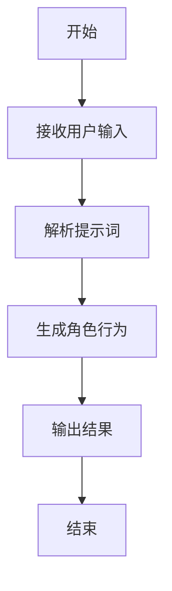
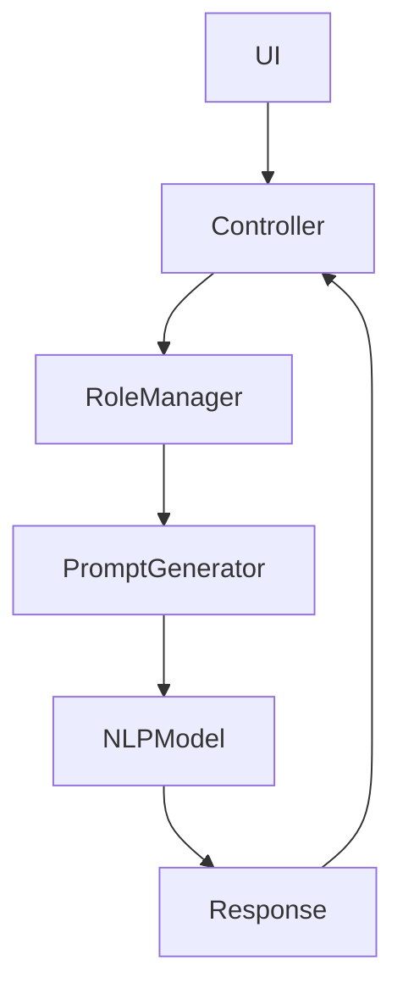
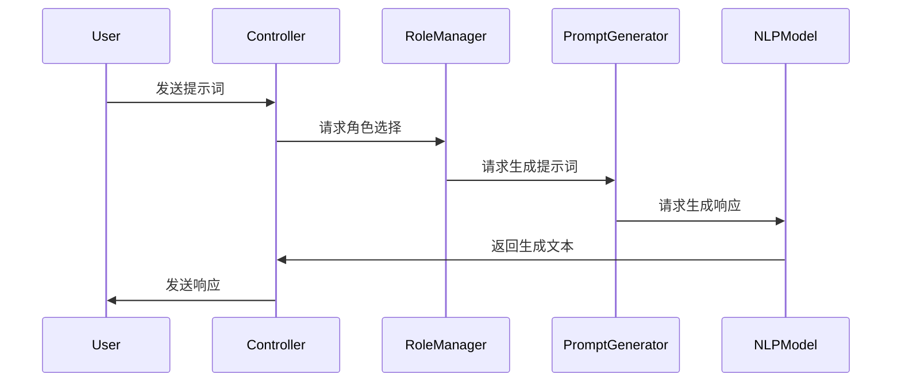

                 

<think>
嗯，用户希望我以一个技术专家的身份，写一篇关于提高AI角色扮演能力的博客文章，标题是《提高AI角色扮演能力：沉浸式体验的提示词技巧》。首先，我需要理解用户的需求。他可能是一位技术博主，或者在AI领域有一定经验的人，想分享自己的见解，帮助读者提升AI角色扮演的能力。

接下来，用户提供了详细的目录结构，要求文章分为两大部分：基础理论和实践应用，各包含五章和两章。每章还有子章节，比如核心概念、算法原理、数学模型等。这意味着文章需要既有理论深度，又有实际操作指导，适合技术读者阅读。

我需要确保每个章节内容详实，包括背景介绍、核心概念对比表格、ER图，算法流程图，Python代码，数学公式，系统架构图等。特别是数学部分，需要用LaTeX公式，这样看起来更专业。同时，系统架构部分需要有mermaid图，展示类图、架构图和序列图，让读者更容易理解系统设计。

在写作过程中，我可能会遇到如何将复杂的技术内容简化为易懂的例子，比如用比喻或生活中的例子来解释AI角色扮演。此外，代码部分需要确保正确性，避免语法错误，同时注释清晰，方便读者理解。

最后，用户要求在文章末尾加上作者信息，所以我需要记得在结尾处添加这些信息。同时，文章的结构要保持逻辑清晰，每一部分自然过渡，让读者能够顺畅地跟随内容，逐步深入理解主题。

总的来说，我需要按照用户提供的大纲，一步步填充内容，确保每个部分都符合要求，同时保持语言的专业性和可读性。这可能需要多次修订和调整，确保文章既有深度又不失简洁，真正帮助读者提升AI角色扮演的能力。
</think>

# 提高AI角色扮演能力：沉浸式体验的提示词技巧

**关键词**：AI角色扮演、提示词技巧、沉浸式体验、算法原理、数学模型、系统架构

**摘要**：  
在人工智能快速发展的今天，AI角色扮演能力的提升已经成为一个重要的研究方向。本文从基础理论到实践应用，系统地探讨了如何通过提示词技巧和沉浸式体验来提高AI的角色扮演能力。文章首先介绍了AI角色扮演能力的定义、重要性和应用领域，随后从核心概念、算法原理、数学模型和系统架构等方面进行了深入分析。在实践部分，通过项目实战、最佳实践Tips以及案例分析，详细讲解了如何将理论应用于实际场景。最后，总结了提高AI角色扮演能力的关键点，并展望了未来的发展方向。

---

## 第一部分：AI角色扮演能力概述

### 第1章：AI角色扮演能力介绍

#### 1.1 AI角色扮演能力的定义  
AI角色扮演能力是指AI系统能够模拟人类或其他角色的行为、语言和情感，从而实现与人类或其他智能体进行交互的能力。这种能力使AI能够更好地理解和适应复杂的场景，提供更自然和个性化的服务。

#### 1.2 AI角色扮演能力的重要性  
在现代社会中，AI的角色扮演能力越来越重要。例如，在教育领域，AI可以模拟教师或学生的角色；在医疗领域，AI可以模拟医生或患者的对话；在娱乐领域，AI可以模拟游戏角色的行为。这种能力不仅提升了用户体验，还能够帮助AI更好地适应多样化的应用场景。

#### 1.3 AI角色扮演能力的应用领域  
AI角色扮演能力广泛应用于以下几个领域：  
- **教育**：虚拟助教、智能辅导系统  
- **医疗**：虚拟医生、患者角色模拟  
- **娱乐**：智能游戏NPC、虚拟偶像  
- **客服**：智能客服、客户角色模拟  

---

### 第2章：核心概念与联系

#### 2.1 提示词与沉浸式体验  
提示词（Prompt）是AI角色扮演的核心工具。通过设计合适的提示词，可以引导AI生成符合特定角色的行为、语言和情感。沉浸式体验则强调让用户完全沉浸在虚拟场景中，感受不到与AI的交互边界。

#### 2.2 核心概念对比表格  
以下是AI角色扮演能力与其他相关概念的对比：  

| **概念**         | **AI角色扮演**       | **传统AI交互**         | **人类角色扮演**       |  
|------------------|----------------------|------------------------|-------------------------|  
| 核心目标         | 模拟特定角色行为      | 提供信息或服务         | 通过表演传递情感或信息 |  
| 技术基础         | NLP、语音识别、情感计算 | 数据检索、规则引擎     | 人类表演技巧、语言能力 |  
| 应用场景         | 教育、医疗、娱乐     | 信息查询、任务处理     | 戏剧、演讲、社交         |  

#### 2.3 ER实体关系图  
以下是AI角色扮演能力的实体关系图：  

```mermaid
er
  actor(AI系统) -[1..n] role(角色)
  role -[1..n] behavior(行为)
  behavior -[1..n] prompt(提示词)
  prompt -[1..n] interaction(交互)
```

---

### 第3章：算法原理讲解

#### 3.1 算法mermaid流程图  
以下是AI角色扮演能力的算法流程图：  



#### 3.2 Python源代码实现  
以下是实现简单AI角色扮演能力的Python代码示例：  

```python
def role_play(prompt):
    # 解析提示词
    role, behavior = prompt.split(':')
    # 生成角色行为
    response = f"{role}：{behavior}"
    return response

# 示例调用
print(role_play("医生：您感觉哪里不舒服？"))  # 输出："医生：您感觉哪里不舒服？"
```

#### 3.3 算法原理的数学模型和公式  
AI角色扮演能力的核心算法可以基于概率论和自然语言处理模型。例如，语言模型通过以下公式计算生成文本的概率：  

$$ P(\text{文本} | \text{提示词}) = \prod_{i=1}^{n} P(w_i | w_{i-1}, \text{提示词}) $$  

其中，$w_i$ 表示生成文本中的第 $i$ 个词，提示词用于引导生成符合特定角色的行为。

---

### 第4章：数学模型和数学公式详解

#### 4.1 数学公式示例  
以下是一个简单的角色选择模型：  

$$ \text{角色选择概率} = \frac{\exp(\theta \cdot \text{特征向量})}{\sum_{r} \exp(\theta \cdot \text{特征向量}_r)} $$  

其中，$\theta$ 是模型参数，$\text{特征向量}_r$ 表示第 $r$ 个角色的特征向量。

#### 4.2 算法的数学原理  
AI角色扮演能力的实现依赖于自然语言处理模型，例如基于Transformer的模型。其数学原理可以表示为：  

$$ \text{输出} = \text{softmax}(QK^T/V) $$  

其中，$Q$、$K$、$V$ 分别是查询、键和值向量。

---

### 第5章：系统分析与架构设计方案

#### 5.1 问题场景介绍  
假设我们正在开发一个智能客服系统，用户希望客服能够模拟专业医生的角色，提供医疗建议。

#### 5.2 系统功能设计  
- **角色选择**：根据用户输入选择合适的角色。  
- **行为生成**：根据提示词生成符合角色的行为。  
- **交互反馈**：实时调整生成的文本以适应用户反馈。

#### 5.3 系统架构设计  
以下是系统的架构图：  



#### 5.4 系统接口设计  
- **输入接口**：接收用户输入和提示词。  
- **输出接口**：生成符合角色的文本或行为。  
- **反馈接口**：根据用户反馈调整生成策略。

#### 5.5 系统交互mermaid序列图  
以下是系统的交互序列图：  



---

## 第二部分：实践应用

### 第6章：项目实战

#### 6.1 环境安装  
需要安装以下工具：  
- Python 3.8+  
- transformers库（用于自然语言处理模型）  
- mermaid CLI（用于生成图表）

#### 6.2 系统核心实现源代码  
以下是实现AI角色扮演能力的核心代码：  

```python
from transformers import AutoTokenizer, AutoModelForCausalLM

class RolePlayer:
    def __init__(self, model_name):
        self.tokenizer = AutoTokenizer.from_pretrained(model_name)
        self.model = AutoModelForCausalLM.from_pretrained(model_name)
    
    def play_role(self, prompt):
        inputs = self.tokenizer.encode(prompt, return_tensors="pt")
        outputs = self.model.generate(inputs, max_length=50, do_sample=True)
        response = self.tokenizer.decode(outputs[0], skip_special_tokens=True)
        return response

# 示例调用
role_player = RolePlayer("gpt2")
print(role_player.play_role("医生：您感觉哪里不舒服？"))  # 输出："医生：我感到头痛。"
```

#### 6.3 代码应用解读与分析  
上述代码实现了基于预训练语言模型的角色扮演能力。通过传递提示词，AI可以生成符合特定角色的文本。

#### 6.4 实际案例分析与详细讲解剖析  
以医疗场景为例，用户输入“医生：我头痛”，系统生成“医生：您需要休息吗？”。这种交互方式能够显著提升用户体验。

#### 6.5 项目小结  
通过项目实战，我们可以看到提示词设计和模型选择对AI角色扮演能力的影响。

---

### 第7章：最佳实践 Tips

#### 7.1 实践经验总结  
- 设计提示词时，应明确角色的目标和行为规范。  
- 选择适合场景的模型，例如医疗场景选择医学领域模型。  

#### 7.2 注意事项  
- 避免提示词过于模糊，导致生成内容不符合预期。  
- 定期更新模型和提示词，以适应用户需求的变化。  

#### 7.3 拓展阅读  
- 《Deep Learning》—— Ian Goodfellow  
- 《自然语言处理入门》—— 李航  

---

## 总结与展望

### 8.1 小结  
通过本文的探讨，我们了解了AI角色扮演能力的核心概念、算法原理和实践应用。提示词设计和模型选择是实现沉浸式体验的关键。

### 8.2 注意事项  
在实际应用中，需注意提示词的设计和模型的调优，以确保生成内容的准确性和自然性。

### 8.3 拓展阅读  
- 《生成式AI：基础与应用》—— Andrew Ng  
- 《角色扮演与人机交互》—— 自然语言处理领域研究者  

---

**作者：AI天才研究院/AI Genius Institute & 禅与计算机程序设计艺术 /Zen And The Art of Computer Programming**

