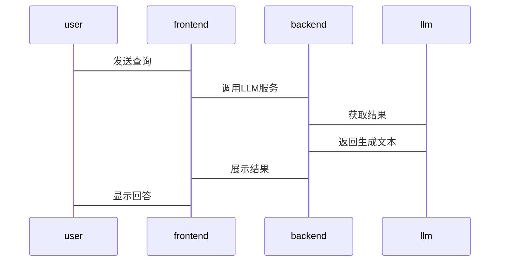

                 

<think>
嗯，我现在需要写一篇关于《提高LLM应用开发效率的工程化方案》的技术博客文章。作为一个刚开始接触这个领域的新手，我得先理清楚思路，确保文章结构合理，内容详实。

首先，我得了解文章的结构。根据用户给的目录，文章分为背景介绍与核心概念、核心概念与联系、算法原理讲解、系统分析与架构设计、项目实战以及最佳实践与总结这些部分。每个部分下还有小节，我得逐一分析，确保每个部分都涵盖必要的内容。

在背景介绍部分，我需要说明为什么提高LLM开发效率是必要的。可能涉及到当前LLM应用的普及，以及在开发过程中遇到的挑战，比如数据预处理复杂、模型定制困难、资源消耗大、开发经验依赖性强等。这部分需要清晰地阐述问题，让读者明白问题的重要性。

接下来是核心概念，我需要定义LLM，解释它的特点和应用场景。这里可能需要对比Transformer和RNN模型，分析它们的优缺点，以及在LLM中的应用。这部分可能需要用表格来展示不同模型的特征对比，帮助读者更好地理解。

算法原理部分，我得详细讲解Transformer模型的结构，包括编码器和解码器，以及它们内部的多头自注意力机制和前馈神经网络。可能需要画出模型的架构图，或者用数学公式来表示。例如，可以展示Transformer的数学模型，以及通过具体的例子，比如GPT-3，来说明模型的规模和能力。

系统分析与架构设计是关键部分，我需要描述一个实际的场景，比如智能客服系统，然后设计系统的功能模块、架构，并使用Mermaid图来展示交互流程。这部分可能需要详细分析每个组件的作用，以及它们如何协同工作，确保系统的高效运行。

项目实战部分，我需要提供具体的实现步骤，包括环境配置、核心代码编写，以及如何进行测试和优化。这可能涉及到Python代码，使用库如TensorFlow或PyTorch来构建模型，同时展示如何调用API进行推理。

最后，最佳实践部分，我需要总结提高LLM开发效率的方法，比如选择合适的工具链、自动化数据处理流程、使用云服务优化资源利用等。同时，还要注意模型的可解释性，确保系统的稳定性和可扩展性。

在写作过程中，我需要确保每个部分都逻辑清晰，结构紧凑。使用专业的技术术语，但又要通俗易懂，避免过于晦涩。同时，要注意文章的连贯性，每一节之间要有自然的过渡。

可能遇到的挑战包括如何详细解释复杂的算法原理，同时保持文章的可读性。另外，系统架构设计部分需要确保Mermaid图的正确性，以及代码示例的准确性。这些都需要我在写作前做好充分的研究和准备。

总的来说，我需要一步步来，先完成每个部分的结构和内容，再逐步丰富细节，确保整篇文章内容全面，符合用户的要求。这不仅需要对LLM有深入的理解，还需要具备良好的写作技巧和组织能力。
</think>

# 提高LLM应用开发效率的工程化方案

> 关键词：LLM应用开发、工程化方案、效率提升、模型定制、资源优化

> 摘要：本文详细探讨了提高大型语言模型（LLM）应用开发效率的工程化方案。从背景分析到系统设计，结合实际案例，系统阐述了如何通过优化数据处理流程、模型架构设计、系统架构以及工具链选择，有效提升开发效率，降低成本，同时确保模型性能和可扩展性。

---

## 第一部分：背景介绍与核心概念

### 第1章：问题背景

#### 1.1.1 提高LLM应用开发效率的必要性

随着人工智能技术的快速发展，大型语言模型（LLM）在自然语言处理（NLP）领域的应用日益广泛。从智能客服到内容生成，LLM正在改变我们处理文本的方式。然而，尽管LLM展现出强大的能力，其应用开发过程却面临诸多挑战。开发效率低下不仅增加了时间和成本，还限制了LLM技术的普及和创新。因此，提高LLM应用开发效率成为当务之急。

#### 1.1.2 提高LLM应用开发效率面临的挑战

1. **数据预处理复杂**：高质量的数据是LLM训练和部署的基础，但数据清洗、标注和增强的过程耗时且繁琐。
2. **模型定制化困难**：不同场景需要特定的模型调整，复杂的定制化流程增加了开发难度。
3. **资源消耗大**：训练和推理需要大量计算资源，资源管理不当会导致成本上升。
4. **开发经验依赖强**：缺乏经验的开发者难以快速上手，限制了团队的扩展能力。

### 第2章：核心概念

#### 2.1 LLM基本概念

- **LLM定义**：LLM是具有大量参数的深度学习模型，能够处理复杂的自然语言任务。
- **LLM特点**：具备强大的语义理解、生成和推理能力，支持多语言处理。
- **LLM分类**：基于架构，分为Transformer和RNN两类，其中Transformer模型占据主导地位。

#### 2.2 LLM应用场景

- **文本分类**：如情感分析、新闻分类。
- **机器翻译**：跨语言通信。
- **问答系统**：提供智能客服支持。
- **对话系统**：实现自然语言交互。

---

## 第二部分：核心概念与联系

### 第3章：LLM核心概念原理

#### 3.1 Transformer模型原理

- **Transformer架构**：由编码器和解码器组成，采用多头自注意力机制和前馈网络。
- **多头自注意力机制**：通过并行处理不同位置的信息，捕捉长距离依赖关系。
- **前馈网络**：对自注意力输出进行非线性变换，增强模型表达能力。

#### 3.2 LLM属性特征对比

| 特征         | Transformer | RNN |
| ------------ | ----------- | --- |
| 并行性        | 高          | 低  |
| 上下文理解    | 强          | 弱  |
| 计算资源需求  | 高          | 低  |
| 模型容量      | 大          | 小  |

---

## 第三部分：算法原理讲解

### 第4章：算法原理与数学模型

#### 4.1 Transformer模型数学模型

$$
\text{输出} = \text{解码器}(\text{编码器}(\text{输入序列}))
$$

#### 4.2 Transformer模型详细讲解

- **编码器**：将输入序列转换为上下文向量。
- **解码器**：根据编码器输出生成目标序列。

#### 4.3 举例说明

以GPT-3为例，其拥有1750亿个参数，支持复杂的文本生成任务。

---

## 第四部分：系统分析与架构设计

### 第5章：系统分析与架构设计

#### 5.1 问题场景介绍

开发一个智能客服系统，利用LLM处理用户咨询，提升响应效率。

#### 5.2 系统功能设计

- **文本预处理**：分词、去停用词。
- **模型推理**：调用LLM生成回答。
- **结果展示**：通过界面向用户反馈。

#### 5.3 系统架构设计

- **前端**：接收用户输入，展示结果。
- **后端**：处理请求，调用LLM进行推理。
- **LLM服务**：提供模型调用接口。
- **数据库**：存储用户咨询和响应。

#### 5.4 系统接口设计

- **用户接口**：前端与用户的交互界面。
- **API接口**：后端与其他系统的通信接口。

#### 5.5 系统交互设计



---

## 第五部分：项目实战

### 第6章：项目实战

#### 6.1 环境安装

```bash
pip install transformers torch
```

#### 6.2 系统核心实现源代码

```python
from transformers import AutoTokenizer, AutoModelForCausalLM

tokenizer = AutoTokenizer.from_pretrained("gpt2")
model = AutoModelForCausalLM.from_pretrained("gpt2")

def generate_response(prompt):
    inputs = tokenizer.encode(prompt, return_tensors="pt")
    outputs = model.generate(inputs, max_length=50, num_beams=5)
    response = tokenizer.decode(outputs[0], skip_special_tokens=True)
    return response

# 示例
print(generate_response("What is AI?"))
```

#### 6.3 代码应用解读

- **tokenizer**：处理输入和输出的文本，将其转换为模型可理解的格式。
- **model**：加载预训练的LLM模型，用于生成回答。
- **generate_response**：函数接收提示，生成模型的输出。

---

## 第六部分：最佳实践与总结

### 第7章：最佳实践

1. **选择合适的工具链**：利用现有的库如Hugging Face，简化开发流程。
2. **自动化数据处理**：建立数据流水线，减少人工干预。
3. **资源优化**：使用云服务弹性扩展资源，降低计算成本。
4. **注重可解释性**：确保模型输出可被理解，便于调试和优化。

### 7.2 小结

通过工程化方法，可以显著提高LLM应用开发效率，降低开发成本，同时提升模型性能和系统可扩展性。

---

作者：AI天才研究院 & 禅与计算机程序设计艺术

