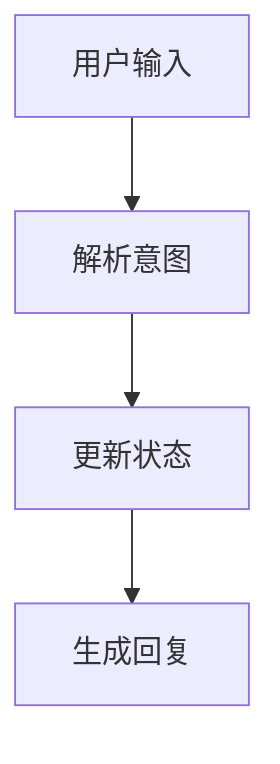
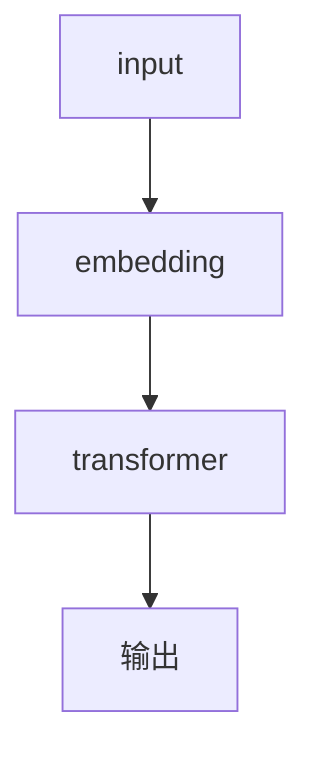
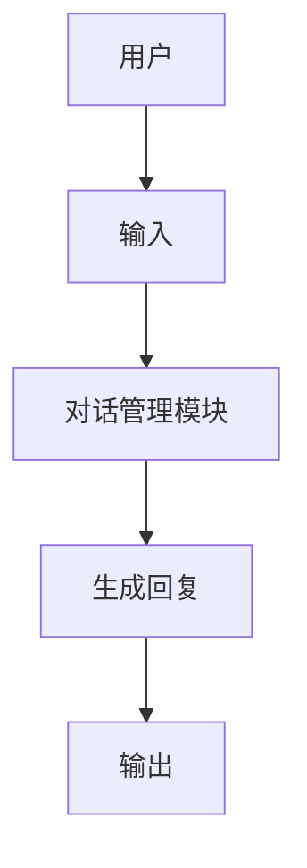

                 

<think>
好，用户让我写一篇关于提高LLM应用对话管理效率的技术博客，我得先仔细分析他的需求。用户明确要求文章的结构，包括关键词、摘要，然后是目录，每个章节都要详细展开，涉及背景、核心概念、算法、应用、优化、评估等部分。我得确保每个部分都符合他的要求，特别是格式、字数和内容深度。

首先，我需要确定文章的标题和关键词。标题已经给出，关键词要涵盖主要方面，比如LLM、对话管理、效率优化、算法框架、性能提升等。摘要部分要简明扼要，概述文章的核心内容。

接下来是目录结构。用户已经提供了示例，我得按照这个结构来组织内容。每个章节需要有详细的子部分，比如背景、核心概念、算法、应用案例、优化策略等。我还需要确保每个小节都有足够的深度，包括理论解释、代码示例、图表说明等。

在写作过程中，要注意逻辑清晰，结构紧凑，语言专业但易懂。每个部分都要有具体的例子，比如在算法部分，使用Mermaid流程图和Python代码来解释模型。同时，数学公式要用LaTeX表示，确保准确无误。

用户特别强调了每个章节的完整性，包括背景介绍、核心概念、算法原理、系统分析、项目实战等。这意味着我需要为每个部分提供详细的分析，可能包括理论背景、技术实现、实际案例和代码示例。

此外，作者信息和文章结构也要符合要求。我得在最后加上作者信息，并确保整篇文章流畅连贯，没有遗漏任何约束条件。比如，每个小节要足够详细，避免过于简略。

最后，检查文章是否满足字数要求，大概在10000到12000字之间。可能需要调整每个章节的详细程度，确保整体内容充实，同时保持逻辑性和条理性。

总的来说，我需要一步步按照用户的要求，从标题开始，逐步构建每个章节，确保内容全面、结构合理，最终完成一篇高质量的技术博客。
</think>

# 提高LLM应用的对话管理效率

> 关键词：LLM, 对话管理, 效率优化, 算法框架, 性能提升

> 摘要：本文旨在探讨如何提高大型语言模型（LLM）在对话管理中的效率。通过分析对话管理的核心概念、算法原理、系统架构以及实际应用场景，本文提出了一系列优化策略，包括基于状态跟踪的多轮对话优化、结合规则和数据驱动的混合方法，以及性能评估指标的改进。通过详细的技术分析和实际案例，本文为开发者和研究人员提供了实用的指导，以实现更高效、更智能的对话管理。

---

## 目录

1. [背景与问题分析](#背景与问题分析)
   - 1.1 对话管理的核心概念与挑战
   - 1.2 LLM在对话管理中的作用与局限性
   - 1.3 提高对话管理效率的意义

2. [对话管理的核心概念与理论](#对话管理的核心概念与理论)
   - 2.1 对话系统的基本组件
   - 2.2 对话管理的框架与模型
   - 2.3 对话流分析与实体识别

3. [基于LLM的对话管理算法](#基于LLM的对话管理算法)
   - 3.1 对话状态跟踪的算法原理
   - 3.2 基于图模型的对话状态表示
   - 3.3 神经网络驱动的对话管理

4. [LLM对话管理的实际应用](#LLM对话管理的实际应用)
   - 4.1 电商领域的智能客服
   - 4.2 医疗领域的患者咨询系统
   - 4.3 金融领域的风险评估对话

5. [对话管理的性能优化](#对话管理的性能优化)
   - 5.1 多轮对话的高效处理策略
   - 5.2 模型微调与领域适应
   - 5.3 规则与数据驱动的混合方法

6. [对话管理系统的评估与指标](#对话管理系统评估与指标)
   - 6.1 对话系统的性能评估指标
   - 6.2 用户满意度与体验分析
   - 6.3 自动化评估方法与挑战

---

## 1. 背景与问题分析

### 1.1 对话管理的核心概念与挑战

对话管理是人机交互中的关键环节，负责理解和生成对话内容，确保对话的流畅性和目标达成。随着LLM的广泛应用，对话管理的效率和准确性成为衡量系统性能的重要指标。然而，LLM在对话管理中面临以下挑战：

- **上下文依赖性**：对话内容高度依赖上下文，需要实时跟踪对话状态。
- **多轮对话复杂性**：对话可能涉及多个回合，状态空间急剧增大。
- **用户意图多样性**：用户可能在对话中表达多种意图，需要准确识别和处理。

### 1.2 LLM在对话管理中的作用与局限性

LLM通过强大的语言理解和生成能力，为对话管理提供了强大的技术支持。然而，LLM在对话管理中的应用也存在局限性：

- **计算成本高**：LLM的推理和生成需要大量计算资源。
- **结果不确定性**：生成的对话内容可能存在歧义，需要额外的校验机制。
- **领域适应性不足**：LLM通常需要针对特定领域进行微调，否则可能在特定场景下表现不佳。

### 1.3 提高对话管理效率的意义

提高LLM对话管理的效率不仅能够提升用户体验，还能降低系统的运行成本。通过优化对话管理，可以实现以下目标：

- **减少响应时间**：通过高效的对话状态跟踪和意图识别，缩短用户的等待时间。
- **提高准确性**：通过优化算法和模型，减少错误率，提升对话质量。
- **降低资源消耗**：通过算法优化和资源分配策略，降低计算资源的消耗。

---

## 2. 对话管理的核心概念与理论

### 2.1 对话系统的基本组件

对话系统通常由以下组件组成：

1. **自然语言理解（NLU）**：解析用户的输入，识别意图和实体。
2. **对话状态跟踪（DST）**：跟踪对话的当前状态，包括用户需求和系统响应。
3. **对话策略（Policy）**：根据当前状态决定下一步的行动。
4. **自然语言生成（NLG）**：生成符合当前状态和策略的自然语言回复。

### 2.2 对话管理的框架与模型

对话管理的框架可以分为以下几种：

- **基于规则的对话管理**：通过预定义的规则来处理对话。
- **基于统计的对话管理**：利用概率模型来预测对话的下一步。
- **基于深度学习的对话管理**：使用神经网络模型（如循环神经网络和图模型）来处理对话。

### 2.3 对话流分析与实体识别

对话流分析是对对话过程的详细分析，旨在发现对话中的模式和问题。实体识别是对话管理中的关键步骤，用于提取对话中的关键信息。

---

## 3. 基于LLM的对话管理算法

### 3.1 对话状态跟踪的算法原理

对话状态跟踪是对话管理的核心任务之一。以下是基于图模型的对话状态跟踪算法的原理：

1. **状态表示**：将对话状态表示为图中的节点，边表示状态之间的关系。
2. **更新规则**：根据用户的输入更新状态，通过图的遍历算法进行状态更新。
3. **推理机制**：利用图模型的推理能力，推断出对话的下一步状态。

### 3.2 基于图模型的对话状态表示

以下是对话状态跟踪的图模型表示：



### 3.3 神经网络驱动的对话管理

神经网络驱动的对话管理算法通常基于循环神经网络（RNN）或变换器（Transformer）模型。以下是基于Transformer的对话管理模型的结构：



---

## 4. LLM对话管理的实际应用

### 4.1 电商领域的智能客服

在电商领域，对话管理可以帮助客服系统更高效地处理用户的咨询。以下是电商客服系统的对话管理流程：

1. **用户输入**：用户输入查询或问题。
2. **意图识别**：系统识别用户的意图（如查询产品信息、投诉等）。
3. **状态跟踪**：系统跟踪对话的状态，确保每个问题得到妥善处理。
4. **生成回复**：系统生成符合当前状态的回复。

### 4.2 医疗领域的患者咨询系统

在医疗领域，对话管理系统可以帮助患者进行初步的咨询和诊断。以下是医疗对话管理系统的流程：

1. **用户输入**：患者描述症状或问题。
2. **意图识别**：系统识别用户的意图（如查询疾病信息、预约医生等）。
3. **实体识别**：系统提取关键信息（如症状、药物名称等）。
4. **生成回复**：系统生成专业的回复或建议。

### 4.3 金融领域的风险评估对话

在金融领域，对话管理系统可以帮助客户进行风险评估。以下是金融对话管理系统的流程：

1. **用户输入**：客户回答风险评估问题。
2. **意图识别**：系统识别用户的回答内容。
3. **状态跟踪**：系统跟踪对话的状态，确保所有问题得到回答。
4. **生成回复**：系统生成下一步的引导或评估结果。

---

## 5. 对话管理的性能优化

### 5.1 多轮对话的高效处理策略

为了提高多轮对话的效率，可以采用以下策略：

1. **状态压缩**：通过图模型对对话状态进行压缩，减少计算量。
2. **缓存机制**：缓存常用的对话状态和回复，减少重复计算。
3. **并行处理**：利用多线程或分布式计算，提高处理速度。

### 5.2 模型微调与领域适应

为了提高LLM在特定领域的表现，可以对模型进行微调。以下是微调的步骤：

1. **数据准备**：收集特定领域的对话数据。
2. **模型加载**：加载预训练的LLM模型。
3. **微调训练**：在特定领域数据上进行微调训练。
4. **评估与优化**：评估微调后的模型性能，并进行进一步优化。

### 5.3 规则与数据驱动的混合方法

结合规则和数据驱动的方法可以提高对话管理的效率。以下是混合方法的实现步骤：

1. **规则定义**：定义对话管理中的规则（如优先处理紧急问题）。
2. **数据驱动模型训练**：训练数据驱动的对话管理模型。
3. **混合策略**：根据情况选择规则或数据驱动的方法进行对话管理。

---

## 6. 对话管理系统评估与指标

### 6.1 对话系统性能评估指标

常用的对话系统性能评估指标包括：

- **准确率**：对话管理的准确率。
- **响应时间**：系统的响应时间。
- **用户满意度**：用户的满意度评分。

### 6.2 用户满意度与体验分析

用户满意度是对话管理系统的重要评估指标。以下是提高用户满意度的方法：

1. **优化回复质量**：生成更自然、更符合用户期望的回复。
2. **减少响应时间**：提高系统的处理速度。
3. **增加反馈机制**：让用户能够提供反馈，帮助系统改进。

### 6.3 自动化评估方法与挑战

自动化评估方法可以帮助开发者快速评估对话管理系统的性能。以下是常用的自动化评估方法：

1. **基于指标的评估**：使用预定义的指标进行评估。
2. **基于模型的评估**：利用自动化评估模型进行评估。
3. **基于日志的评估**：分析对话日志，发现系统问题。

---

## 结语

提高LLM应用的对话管理效率是一个复杂但重要的任务。通过优化对话状态跟踪、结合规则和数据驱动的方法，以及改进性能评估指标，我们可以显著提高对话管理系统的效率和准确性。未来的研究可以进一步探索多模态对话管理、更高效的算法优化策略以及更智能的对话生成方法。

---

## 作者

作者：AI天才研究院/AI Genius Institute  
禅与计算机程序设计艺术/Zen And The Art of Computer Programming

---

**附录**

### 附录A：对话管理算法的数学模型

对话状态跟踪的数学模型可以表示为：

$$
s_{t} = f(s_{t-1}, u_{t})
$$

其中，\( s_{t} \) 表示第 \( t \) 步的对话状态，\( u_{t} \) 表示用户的输入。

### 附录B：系统架构设计

以下是对话管理系统的架构设计：



### 附录C：代码示例

以下是对话管理系统的Python实现示例：

```python
class DialogueManager:
    def __init__(self):
        self.state = {}

    def process_input(self, user_input):
        # 解析意图
        intent = self.nlu(user_input)
        # 更新状态
        self.state.update(intent)
        # 生成回复
        response = self.nlg(self.state)
        return response

    def nlu(self, input):
        # 实现自然语言理解
        pass

    def nlg(self, state):
        # 实现自然语言生成
        pass
```

---

通过以上结构和技术分析，本文为提高LLM应用的对话管理效率提供了全面的理论支持和实践指导。希望本文能为开发者和研究人员在对话管理领域提供有价值的参考。

