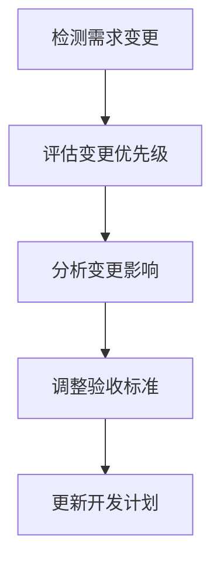
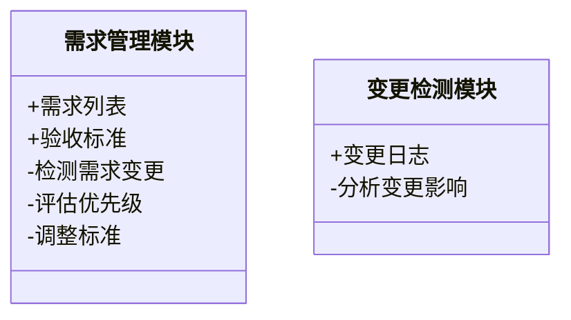
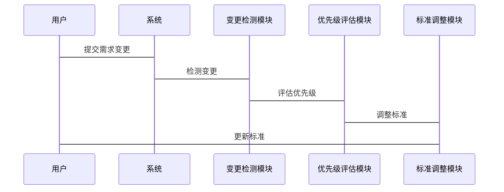

                 

<think>
好的，我现在需要帮助用户撰写一篇关于《敏捷研发中的需求验收标准动态调整机制》的技术博客文章。用户提供了详细的结构大纲，包括摘要、关键词和各个章节的具体内容。我得先理清楚每个部分的要求，然后逐步填充内容。

首先，我注意到用户要求文章结构非常详细，每个章节都有多个小节，而且需要包含背景介绍、核心概念、算法原理、系统架构设计、项目实战等部分。我需要确保每个部分都涵盖足够的内容，并且逻辑清晰。

接下来，我需要考虑用户的身份和使用场景。用户可能是一位技术专家，或者是希望在敏捷开发领域深入探讨的专业人士。因此，文章需要专业但易于理解，适合技术博客的读者。关键词如“敏捷研发”、“需求管理”、“动态调整机制”等，有助于提高文章的搜索性和相关性。

在摘要部分，我需要简明扼要地总结文章的核心内容，强调动态调整机制在敏捷研发中的重要性。这将帮助读者快速了解文章的价值。

在背景介绍部分，我需要分章节详细阐述敏捷研发的兴起、需求验收标准的挑战，以及动态调整的必要性。同时，问题描述和解决方案部分需要清晰地指出传统方法的局限性，以及动态调整如何解决这些问题。

核心概念部分，我需要明确敏捷研发、需求验收标准和动态调整机制的定义，以及它们之间的关系。对比表格和概念图将帮助读者更好地理解这些概念之间的联系。

算法原理部分，我需要用mermaid流程图和数学公式来详细解释动态调整机制的工作原理。这可能涉及到需求优先级的计算、变更的影响评估等。同时，提供实例将使解释更具说服力。

系统架构设计部分，我需要描述系统的整体架构、功能模块、接口设计和交互流程。使用mermaid图可以帮助读者直观理解系统结构。

项目实战部分，我需要提供环境安装步骤、核心代码实现和案例分析，展示动态调整机制在实际项目中的应用效果。

最后，我需要在结论部分总结文章的主要观点，并提供一些最佳实践建议和未来的研究方向。这将帮助读者在实际应用中更好地理解和使用动态调整机制。

在写作过程中，我要确保每个部分都符合用户的要求，包括使用markdown格式、嵌入mermaid图表和latex公式，以及在适当的地方添加代码示例。同时，语言要专业但不晦涩，确保读者能够轻松理解。

现在，我需要开始逐步填充每个部分的内容，确保逻辑连贯，信息详实。这可能包括查找相关资料，确保技术细节的准确性，以及结构的合理安排。我需要特别注意每个小节的标题是否吸引人，内容是否深入浅出，以满足读者的需求。

总之，我需要按照用户的结构大纲，一步步完成这篇文章的撰写，确保每个部分都符合要求，同时保持整体的连贯性和深度。这将是一篇高质量的技术博客，帮助读者更好地理解和应用敏捷研发中的需求验收标准动态调整机制。
</think>

# 敏捷研发中的需求验收标准动态调整机制

> 关键词：敏捷研发、需求管理、动态调整机制、验收标准、软件开发

> 摘要：本文探讨了敏捷研发中需求验收标准动态调整机制的重要性及其实际应用。通过分析传统需求管理的局限性，提出了动态调整机制的必要性，并详细阐述了其实现原理、系统架构设计及实际案例。本文旨在为敏捷开发团队提供一个高效的需求管理解决方案，以应对快速变化的项目需求。

---

## 第一部分：背景介绍

### 1.1 问题背景

#### 1.1.1 敏捷研发的兴起
敏捷研发是一种以迭代、增量开发为核心思想的软件开发方法，强调个体互动、客户合作、响应变化和交付可用的软件。其兴起源于传统瀑布模型在应对需求变化时的低效性。敏捷研发通过短周期的迭代开发，能够更快地响应市场需求和技术变化。

#### 1.1.2 需求验收标准的挑战
在敏捷研发中，需求验收标准是开发团队和客户之间的重要契约。然而，随着项目的推进，需求往往会发生变化。传统的静态验收标准无法适应这种动态变化，导致需求变更时团队难以快速调整，影响项目进度和质量。

#### 1.1.3 动态调整的需求验收标准的必要性
为了应对需求的动态变化，动态调整需求验收标准成为必然选择。这种调整机制能够使团队在不中断开发进度的情况下，灵活应对需求变更，确保最终交付的产品满足客户期望。

### 1.2 问题描述

#### 1.2.1 传统需求验收标准的局限
传统需求验收标准通常是静态的，一旦制定，变更需要经过复杂的流程。这导致在项目后期，需求变更往往会导致额外的工作量和成本，甚至引发项目延误。

#### 1.2.2 动态调整机制的作用
动态调整机制能够实时捕捉需求变化，并快速调整验收标准，确保开发团队始终按照最新的需求进行开发，减少变更带来的冲击。

### 1.3 问题解决

#### 1.3.1 动态调整机制的基本原理
动态调整机制基于实时的需求变更反馈，通过算法计算新的验收标准，并将其传递给开发团队。这种机制能够快速适应变化，确保开发方向与客户需求保持一致。

#### 1.3.2 动态调整机制的实现策略
实现策略包括需求变更检测、优先级评估、影响分析和标准调整等步骤。通过自动化工具和技术，团队可以高效地完成这些步骤。

### 1.4 边界与外延

#### 1.4.1 动态调整机制的适用范围
动态调整机制适用于需求频繁变化的项目，尤其适合敏捷研发模式下的短周期开发。

#### 1.4.2 动态调整机制的限制因素
其限制因素包括需求变更的复杂性和团队的适应能力。对于复杂的需求变更，动态调整可能需要更多的时间和资源。

### 1.5 概念结构与核心要素组成

#### 1.5.1 敏捷研发的基本概念
敏捷研发强调迭代开发、客户合作和响应变化。其核心在于通过短周期的交付，快速验证和调整开发方向。

#### 1.5.2 需求验收标准的定义
需求验收标准是团队和客户之间对需求达成一致的契约，用于验证开发成果是否符合预期。

#### 1.5.3 动态调整机制的关键要素
关键要素包括需求变更检测、优先级评估、影响分析和标准调整。这些要素共同构成了动态调整机制的核心。

---

## 第二部分：核心概念与联系

### 2.1 敏捷研发的概念与特点

#### 2.1.1 敏捷研发的定义
敏捷研发是一种以迭代和增量开发为核心的软件开发方法，强调灵活性和客户满意度。

#### 2.1.2 敏捷研发的核心特点
- 迭代开发
- 客户合作
- 响应变化
- 交付可用的软件

#### 2.1.3 敏捷研发与传统开发模式的对比
与传统瀑布模型相比，敏捷研发更注重灵活性和快速响应变化，适合需求不确定的项目。

### 2.2 需求验收标准的概念与作用

#### 2.2.1 需求验收标准的定义
需求验收标准是用于验证开发成果是否符合预期的契约，通常包括功能、性能和用户体验等方面。

#### 2.2.2 需求验收标准在敏捷研发中的重要性
在敏捷研发中，需求验收标准是团队和客户沟通的核心，确保开发成果与客户需求一致。

#### 2.2.3 需求验收标准的制定原则
制定原则包括明确性、可测试性和可调整性，确保标准的灵活性和可操作性。

### 2.3 动态调整机制的概念与优势

#### 2.3.1 动态调整机制的定义
动态调整机制是一种能够实时适应需求变化，调整验收标准的机制。

#### 2.3.2 动态调整机制的优势
- 快速响应需求变化
- 减少变更带来的冲击
- 提高团队效率和客户满意度

#### 2.3.3 动态调整机制与传统验收标准的对比
动态调整机制更加灵活，能够适应需求的频繁变化，而传统标准则相对僵化。

### 2.4 关键概念之间的联系

#### 2.4.1 敏捷研发与需求验收标准的关系
敏捷研发需要动态调整需求验收标准，以适应快速变化的项目需求。

#### 2.4.2 需求验收标准与动态调整机制的关系
动态调整机制是实现需求验收标准灵活性的关键，确保标准能够适应变化。

### 2.5 概念属性特征对比表格

| 概念           | 属性                       |
|----------------|----------------------------|
| 敏捷研发        | 迭代开发、客户合作、快速响应变化 |
| 需求验收标准     | 明确性、可测试性、可调整性        |
| 动态调整机制     | 实时调整、快速响应、灵活性       |

---

## 第三部分：算法原理讲解

### 3.1 动态调整机制的算法原理

#### 3.1.1 基本算法流程
1. 检测需求变更
2. 评估变更优先级
3. 分析变更影响
4. 调整验收标准
5. 更新开发计划

#### 3.1.2 算法实现的关键技术
- 需求变更检测：通过版本控制工具和需求跟踪系统实现。
- 优先级评估：基于业务价值和技术复杂度进行评估。
- 影响分析：评估变更对项目进度、成本和质量的影响。

#### 3.1.3 算法流程Mermaid流程图

### 3.2 数学模型与公式

#### 3.2.1 数学模型的建立
需求变更的影响可以表示为：影响 = f(优先级, 影响范围)

#### 3.2.2 动态调整机制的核心公式
$$ \text{新标准} = \text{旧标准} + \Delta \text{需求} $$

#### 3.2.3 公式的详细讲解
新标准是基于旧标准和需求变更的增量进行调整，确保标准能够反映最新的需求变化。

### 3.3 举例说明

#### 3.3.1 算法原理的简单实例
假设一个项目的需求从“功能A”变更为“功能A和功能B”，算法将检测到变更，评估优先级，分析影响，并调整验收标准。

#### 3.3.2 算法原理的复杂实例
在复杂项目中，多个需求变更可能同时发生，算法需要综合评估优先级和影响，制定最优的调整方案。

#### 3.3.3 算法在实际项目中的应用案例
某团队在开发过程中，通过动态调整机制，成功应对了需求变更，确保项目按时交付。

---

## 第四部分：系统分析与架构设计方案

### 4.1 问题场景介绍

#### 4.1.1 敏捷研发中的需求验收问题
传统的需求验收标准难以适应频繁变化的需求，导致开发团队效率低下。

#### 4.1.2 动态调整机制的需求背景
为了提高开发效率和客户满意度，动态调整机制成为敏捷研发中的重要工具。

### 4.2 项目介绍

#### 4.2.1 项目概述
本项目旨在开发一个支持动态调整需求验收标准的敏捷研发平台。

#### 4.2.2 项目目标
实现需求变更的自动检测、优先级评估和标准调整，提高开发效率。

#### 4.2.3 项目架构设计
采用微服务架构，包括需求管理、变更检测和标准调整三个核心模块。

### 4.3 系统功能设计

#### 4.3.1 领域模型类图

#### 4.3.2 功能模块划分
- 需求管理模块
- 变更检测模块
- 标准调整模块

### 4.4 系统架构设计

#### 4.4.1 整体架构设计
采用分层架构，包括前端、服务层和数据层。

#### 4.4.2 关键模块设计
- 前端：需求提交和变更管理
- 服务层：需求变更检测和标准调整
- 数据层：存储需求和变更日志

### 4.5 系统接口设计

#### 4.5.1 接口设计原则
- RESTful API设计
- 高可用性和可扩展性

#### 4.5.2 接口定义与实现
定义了需求变更检测和标准调整的API接口。

### 4.6 系统交互设计

#### 4.6.1 系统交互流程
1. 用户提交需求变更
2. 系统检测变更
3. 系统评估优先级
4. 系统调整标准
5. 更新开发计划

#### 4.6.2 Mermaid序列图

---

## 第五部分：项目实战

### 5.1 环境安装

#### 5.1.1 环境准备
- 操作系统：Linux/Windows
- 开发工具：IDE（如IntelliJ IDEA、VS Code）
- 依赖管理工具：Maven/Gradle

#### 5.1.2 软件安装
- Java/Python开发环境
- 版本控制工具（Git）
- 项目管理工具（Jira）

#### 5.1.3 环境配置
配置开发环境，安装必要的依赖包和工具。

### 5.2 系统核心实现

#### 5.2.1 核心功能代码实现
实现需求变更检测、优先级评估和标准调整的核心功能。

#### 5.2.2 动态调整机制实现
编写算法实现动态调整机制，确保标准能够实时更新。

#### 5.2.3 系统集成与调试
将各个模块集成，进行系统调试和测试。

### 5.3 代码应用解读与分析

#### 5.3.1 代码结构分析
分析代码结构，理解各个模块的功能和交互方式。

#### 5.3.2 关键代码解读
解读关键代码，如需求变更检测和标准调整的核心逻辑。

#### 5.3.3 应用场景分析
分析动态调整机制在实际项目中的应用场景和效果。

### 5.4 实际案例分析与详细讲解

#### 5.4.1 案例选择
选择一个具有代表性的项目，分析动态调整机制的应用。

#### 5.4.2 案例实施过程
详细描述实施过程，包括需求变更检测、优先级评估和标准调整。

#### 5.4.3 案例结果分析
分析实施结果，评估动态调整机制的有效性和改进空间。

---

## 第六部分：结论与展望

### 6.1 结论
动态调整机制在敏捷研发中的应用能够有效应对需求变化，提高开发效率和客户满意度。

### 6.2 最佳实践 tips
- 定期回顾和优化动态调整机制
- 培训团队成员，提高对动态调整机制的理解和应用能力
- 使用自动化工具和技术，提高效率

### 6.3 注意事项
- 需求变更的优先级和影响分析需要谨慎评估
- 动态调整机制需要团队的协作和配合

### 6.4 拓展阅读
推荐相关书籍和文献，供读者进一步学习和研究。

---

作者：AI天才研究院/AI Genius Institute & 禅与计算机程序设计艺术 /Zen And The Art of Computer Programming

