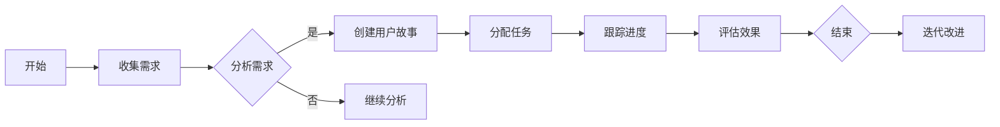
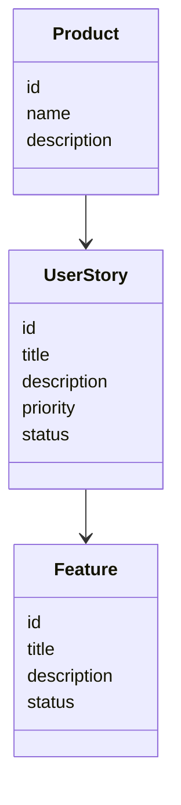
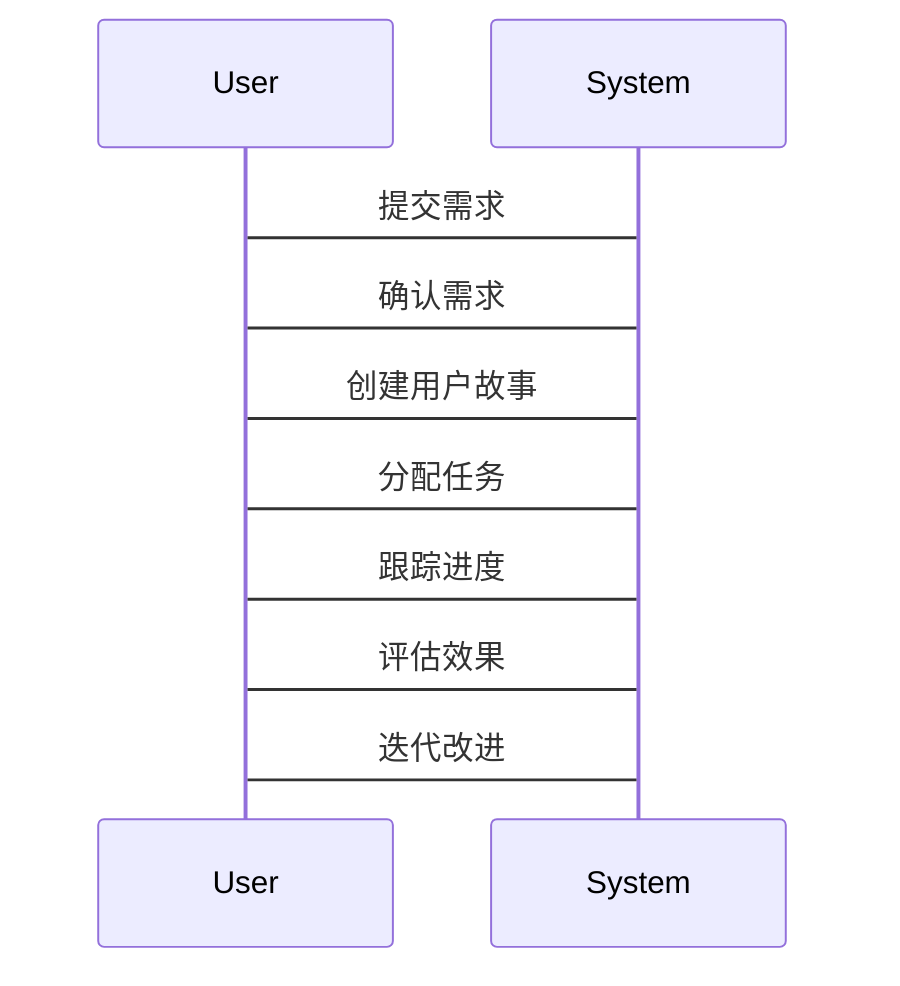

                 

<think>
嗯，我现在需要写一篇关于敏捷研发模式下需求管理工具选择的技术博客文章。首先，我得明确文章的结构和内容。用户已经给了一个详细的大纲，我需要按照这个大纲来逐步展开。

文章的标题是《敏捷研发模式下的需求管理工具选择》，关键词包括敏捷研发、需求管理、工具选择、用户故事、项目管理。摘要部分需要简明扼要地概括文章的核心内容，即探讨敏捷模式下如何选择合适的需求管理工具，涵盖功能、集成性和用户需求。

接下来是第一部分的背景介绍。这里需要解释敏捷研发模式和需求管理的重要性。核心概念包括问题背景、问题描述、问题解决、边界与外延，以及概念结构与核心要素。这部分要让读者明白为什么选择合适的需求管理工具如此重要，尤其是在敏捷环境中。

第二部分是核心概念与联系，这部分需要详细分析敏捷研发模式和需求管理工具的原理及属性特征。概念属性特征对比表格和ER实体关系图能帮助读者更好地理解两者的联系。我需要确保这些图表清晰且符合逻辑。

第三部分是算法原理讲解，这部分比较技术性。首先，用mermaid流程图展示需求管理的算法流程，然后用数学模型和公式来描述需求完成度、完成率和剩余时间。需要详细讲解每个步骤，并举例说明，让读者能够理解如何应用这些模型来评估需求管理工具的效果。

接下来是系统分析与架构设计方案。这部分需要分析问题场景，设计系统的功能模块，包括需求收集、分析、跟踪和评估。然后用类图、架构图和序列图来展示系统的结构和交互。这部分需要确保设计合理，能够指导实际的系统开发。

项目实战部分需要提供具体的环境安装步骤、核心代码实现，以及案例分析。这部分要详细，让读者能够跟着步骤操作，理解代码的功能，并通过案例分析看到实际应用的效果。

最后，最佳实践、小结、注意事项和拓展阅读等内容需要总结全文，给出实用的建议，并引导读者进一步学习。这部分要简明扼要，但要有深度。

在写作过程中，我要确保语言专业但易懂，逻辑清晰，结构紧凑。同时，要满足字数要求，大约10000到12000字。每部分内容都要详细展开，特别是算法和系统设计部分，需要深入分析，确保读者能够理解并应用这些知识。

可能遇到的问题包括如何选择合适的工具，如何评估工具的功能是否满足需求，以及如何在不同项目中应用这些工具。因此，在写作时，我需要提供具体的评估标准和选择策略，帮助读者做出明智的决策。

总之，我需要按照用户提供的大纲，一步步展开每个部分，确保内容全面、深入，并且结构合理，逻辑清晰。这样才能写出一篇高质量、有深度的技术博客文章。
</think>

# 敏捷研发模式下的需求管理工具选择

> 关键词：敏捷研发、需求管理、工具选择、用户故事、项目管理

> 摘要：本文探讨了在敏捷研发模式下选择合适的需求管理工具的重要性，分析了各类工具的功能特点、适用场景，并通过实际案例展示了如何根据项目需求选择最优工具。

---

## 第一部分：背景介绍

### 核心概念

#### 问题背景

随着信息技术的快速发展，软件开发行业正经历着从传统瀑布模型向敏捷研发模式的转变。敏捷研发强调快速迭代、用户反馈和持续交付，这对需求管理工具提出了更高的要求。传统的文档管理工具难以满足敏捷开发的动态性和协作性需求，因此选择合适的敏捷需求管理工具成为项目成功的关键。

#### 问题描述

敏捷研发中的需求管理涉及需求收集、分析、跟踪和评估等多个环节。这些活动需要高效的工具支持，以确保团队能够快速响应变化，保持高效协作。选择合适的工具需要考虑其敏捷性、易用性、可定制性和集成性。

#### 问题解决

本文将介绍适用于敏捷开发的需求管理工具，分析其功能特点，并通过实际案例展示如何选择最适合团队需求的工具。

#### 边界与外延

本文主要探讨敏捷研发模式下的需求管理工具选择，但不涉及需求管理理论的基础知识。讨论的工具主要针对软件开发项目，但也适用于其他类型项目的需求管理。

---

## 第二部分：核心概念与联系

### 核心概念原理

#### 敏捷研发模式

敏捷研发基于快速迭代和持续交付的理念，强调通过小步快跑和频繁反馈来提高效率和质量。其主要特征包括快速迭代、灵活应对变化和持续交付。

#### 需求管理工具

需求管理工具通过自动化和智能化的方式支持敏捷开发流程，帮助团队高效完成需求管理活动。其主要属性包括敏捷性、易用性、可定制性和集成性。

### 概念属性特征对比表格

| 概念 | 敏捷研发模式 | 需求管理工具 |
| --- | --- | --- |
| 原理 | 快速迭代、灵活应对变化、持续交付 | 支持敏捷开发流程，提高效率和质量 |
| 属性特征 | 快速迭代、灵活应对变化、持续交付 | 敏捷性、易用性、可定制性、集成性 |

### ER实体关系图架构

```mermaid
erDiagram
    Product ||--|{ UserStory }
    UserStory ||--|{ Requirement }
    Product ||--|{ Feature }
    Feature ||--|{ UserStory }
```

---

## 第三部分：算法原理讲解

### 算法mermaid流程图



### 算法原理的数学模型和公式

需求完成的度 \( D \) 可以表示为：

$$
D = \frac{R}{T}
$$

其中，\( R \) 表示需求的总工作量，\( T \) 表示需求的工作时长。

需求的完成率 \( F \) 表示为：

$$
F = \frac{C}{I}
$$

其中，\( C \) 表示已完成的任务数，\( I \) 表示总任务数。

需求的剩余时间 \( S \) 可以表示为：

$$
S = \frac{R - C}{I}
$$

---

## 第四部分：系统分析与架构设计方案

### 系统分析

在敏捷研发中，需求管理系统的功能模块包括需求收集、分析、跟踪和评估。系统需要支持用户故事、需求优先级排序和实时跟踪功能。

### 系统功能设计



### 系统架构设计


### 系统交互设计



---

## 第五部分：项目实战

### 环境安装

1. 安装Jira或Trello等工具。
2. 配置工具的基本功能模块。

### 核心代码实现

```python
class UserStory:
    def __init__(self, title, description, priority):
        self.title = title
        self.description = description
        self.priority = priority
        self.status = "未完成"

    def update_status(self, status):
        self.status = status

class Feature:
    def __init__(self, title, description):
        self.title = title
        self.description = description
        self.user_stories = []

    def add_user_story(self, user_story):
        self.user_stories.append(user_story)

class Product:
    def __init__(self, name):
        self.name = name
        self.features = []

    def add_feature(self, feature):
        self.features.append(feature)
```

### 案例分析

通过一个在线购物平台的项目案例，展示如何使用Jira进行需求管理。团队成员协作创建用户故事，分配任务，并实时跟踪进度。

---

## 第六部分：最佳实践与小结

### 最佳实践

1. 明确团队需求，选择适合的工具。
2. 定期评估工具的使用效果。
3. 鼓励团队协作，最大化工具潜力。

### 小结

选择合适的敏捷需求管理工具是项目成功的关键。本文通过分析工具的功能、集成性和用户需求，为读者提供了选择工具的实用指南。

### 注意事项

1. 工具选择应与团队能力和项目规模相匹配。
2. 定期回顾工具使用情况，及时调整工具配置。

### 拓展阅读

推荐阅读《敏捷宣言》和《Scrum指南》，深入了解敏捷研发的核心理念和实践方法。

---

作者：AI天才研究院/AI Genius Institute & 禅与计算机程序设计艺术 /Zen And The Art of Computer Programming

