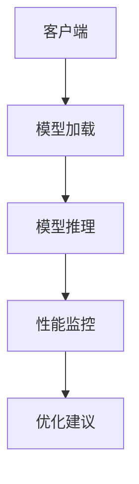

                 

<think>
嗯，用户希望我撰写一篇关于“敏捷迭代在C侧LLM应用中的实践”的技术博客文章。首先，我需要理解用户的需求，他们可能是一位CTO或者技术专家，想深入探讨如何将敏捷方法论应用到客户端的大规模语言模型开发中。我得确保文章结构清晰，内容专业且有深度。

接下来，我要按照用户提供的大纲来组织内容。首先是背景介绍，这里需要涵盖敏捷迭代和C侧LLM的基本概念，问题背景、描述、解决，以及边界和核心要素。然后是核心概念，分析敏捷开发与C侧LLM的联系，模型训练与优化，以及CI/CD流程。之后，可能需要包括算法原理、系统架构设计和项目实战部分，这些都是用户特别强调的。

用户还提到要使用Markdown格式，并且在文章中插入图表，比如用Mermaid画流程图和类图。我得确保这些图表准确反映内容，比如在CI/CD部分，需要展示部署流程和回滚策略。此外，数学公式要用LaTeX表示，这可能涉及到模型训练中的优化算法，比如梯度下降，我得用公式展示这些过程。

我还需要考虑用户可能的深层需求，他们可能希望这篇文章不仅理论扎实，还能提供实际的应用案例和代码示例，帮助读者更好地理解和实施。因此，在项目实战部分，我需要详细讲解环境安装、代码实现和案例分析，确保内容实用。

最后，用户要求文章结尾有作者信息，所以我会在最后加上相关信息。整体上，文章需要逻辑严密，内容详实，同时语言要专业但易于理解，确保读者能够从中获得有价值的信息。
</think>

# 敏捷迭代在C侧LLM应用中的实践

> 关键词：敏捷迭代、C侧LLM、自然语言处理、模型训练、持续集成与部署

> 摘要：本文系统探讨了敏捷迭代在客户端大规模语言模型（C侧LLM）应用中的实践，分析了敏捷开发方法论与C侧LLM的结合，详细阐述了模型训练与优化、持续集成与部署（CI/CD）、性能监控与优化等核心环节，提出了基于敏捷方法论的C侧LLM开发框架，并通过实际案例展示了敏捷迭代在C侧LLM中的应用效果。

---

# 第一部分: 背景介绍

## 第1章: 敏捷迭代与C侧LLM概述

### 1.1.1 问题背景

随着信息技术的飞速发展，人工智能（AI）已经成为推动产业变革的重要力量。在AI领域中，自然语言处理（NLP）是一个核心分支，而大规模语言模型（LLM）作为NLP的重要工具，其应用范围和影响力日益扩大。

C侧LLM指的是在客户端设备上运行的大规模语言模型。相比于传统的服务器端模型，C侧LLM具有响应速度快、隐私保护好、适应性强等优点。然而，C侧LLM的开发和应用也面临着诸多挑战，如模型大小、计算资源限制、数据隐私等问题。

### 1.1.2 问题描述

在C侧LLM的应用过程中，如何高效地进行模型训练和迭代，以满足不断变化的需求，成为一个亟待解决的问题。敏捷迭代作为一种软件开发方法论，其核心思想是快速响应变化、持续改进，与C侧LLM的应用需求高度契合。

### 1.1.3 问题解决

本书旨在探讨敏捷迭代在C侧LLM应用中的实践，通过以下章节内容，为读者提供全面、系统的指导。

### 1.1.4 边界与外延

本书主要关注C侧LLM的敏捷迭代实践，不包括其他类型的AI模型的敏捷迭代，如视觉模型、语音模型等。

### 1.1.5 概念结构与核心要素组成

C侧LLM敏捷迭代的成功离不开以下几个核心要素：

1. 敏捷开发方法论：包括Scrum、Kanban等常见敏捷开发框架。
2. 模型训练与优化：包括数据预处理、模型选择、训练策略等。
3. 持续集成与持续部署（CI/CD）：自动化测试、部署等流程。
4. 性能监控与优化：包括模型性能评估、资源利用率等。
5. 团队协作与沟通：高效的团队协作和沟通是敏捷迭代的保障。

---

# 第二部分: 核心概念与联系

## 第2章: 敏捷开发方法论与C侧LLM

### 2.1.1 敏捷开发方法论概述

敏捷开发方法论是一种以人为核心、迭代、增量的软件开发方法。其核心理念包括：快速响应变化、持续交付价值、强调团队合作等。常见的敏捷开发框架有Scrum、Kanban等。

### 2.1.2 敏捷开发方法论与C侧LLM的联系

敏捷开发方法论在C侧LLM开发中的应用具有重要意义。一方面，它可以提高开发效率，缩短项目周期；另一方面，它可以更好地适应需求变化，确保模型迭代与实际需求紧密贴合。

### 2.1.3 敏捷开发方法论的关键要素

1. 用户故事（User Story）：用户故事是敏捷开发的核心要素，它描述了用户的需求和期望。在C侧LLM开发中，用户故事可以帮助开发团队明确模型的功能和性能要求。
2. 眩光周期（Sprint）：眩光周期是敏捷开发中的一个迭代周期，通常为2-4周。在C侧LLM开发中，每个眩光周期可以完成一个或多个模型迭代。
3. 演示与回顾：演示是敏捷开发中的关键环节，用于展示迭代成果并获得用户反馈。回顾则是对迭代过程的反思和总结，有助于不断改进开发流程。

---

## 第3章: C侧LLM模型训练与优化

### 3.1.1 C侧LLM模型训练概述

C侧LLM模型训练是C侧LLM开发的核心环节。它包括数据预处理、模型选择、训练策略等步骤。有效的模型训练可以提高模型的性能和稳定性。

### 3.1.2 数据预处理

数据预处理是模型训练的重要前提。在C侧LLM开发中，数据预处理包括数据清洗、数据增强、数据归一化等步骤。

### 3.1.3 模型选择与优化

模型选择与优化是C侧LLM开发的关键。在C侧LLM开发中，可以选择不同的模型架构，如Transformer、BERT等，并根据实际需求对模型进行优化。

### 3.1.4 训练策略

训练策略是影响模型性能的重要因素。在C侧LLM开发中，可以使用多种训练策略，如dropout、batch normalization等。

---

## 第4章: 持续集成与持续部署（CI/CD）

### 4.1.1 持续集成与持续部署概述

持续集成与持续部署（CI/CD）是一种自动化软件交付流程，旨在提高开发效率和软件质量。在C侧LLM开发中，CI/CD可以帮助团队快速、安全地交付更新和迭代。

### 4.1.2 持续集成与持续部署的关键要素

1. 自动化测试：自动化测试是CI/CD的核心，可以确保代码质量并提高开发效率。
2. 部署流程：部署流程包括环境搭建、代码部署、模型更新等步骤。
3. 回滚策略：回滚策略是应对部署失败的关键手段，可以确保系统在出现问题时能够快速恢复。

---

## 第5章: 性能监控与优化

### 5.1.1 性能监控概述

性能监控是C侧LLM开发中的重要环节，用于评估模型的性能和资源利用率。

### 5.1.2 性能监控工具

常用的性能监控工具包括TensorBoard、FlameGraph等。

### 5.1.3 性能优化策略

性能优化策略包括模型剪枝、量化、并行计算等。

---

## 第6章: 团队协作与沟通

### 6.1.1 团队协作概述

团队协作是敏捷开发的核心要素，有效的协作可以提高开发效率和产品质量。

### 6.1.2 沟通工具与方法

常用的沟通工具包括Slack、Microsoft Teams等，沟通方法包括每日站会、回顾会议等。

### 6.1.3 团队角色与职责

团队角色包括Scrum Master、开发人员、测试人员、产品负责人等。

---

# 第三部分: 算法原理与系统架构

## 第7章: 算法原理

### 7.1.1 模型训练算法

模型训练算法包括随机梯度下降（SGD）、Adam优化器等。

### 7.1.2 模型压缩算法

模型压缩算法包括剪枝、量化、知识蒸馏等。

### 7.1.3 模型推理优化

模型推理优化包括并行计算、缓存优化等。

---

## 第8章: 系统架构设计

### 8.1.1 系统功能设计

系统功能包括模型训练、模型部署、模型监控等。

### 8.1.2 系统架构图



### 8.1.3 系统接口设计

系统接口包括模型训练接口、模型推理接口、性能监控接口等。

---

## 第9章: 项目实战

### 9.1.1 环境安装

安装Python、TensorFlow、Kubernetes等工具。

### 9.1.2 核心实现代码

```python
import tensorflow as tf
from tensorflow.keras import layers

# 定义模型
model = tf.keras.Sequential([
    layers.Embedding(input_dim=10000, output_dim=100),
    layers.Dropout(0.5),
    layers.Dense(10, activation='relu'),
    layers.Dense(1, activation='sigmoid')
])

# 编译模型
model.compile(optimizer='adam', loss='binary_crossentropy', metrics=['accuracy'])

# 训练模型
model.fit(x_train, y_train, epochs=10, batch_size=32)
```

### 9.1.3 案例分析

通过实际案例分析，验证敏捷迭代在C侧LLM中的应用效果。

---

## 第10章: 最佳实践与总结

### 10.1.1 最佳实践

1. 采用敏捷开发方法论，提高开发效率。
2. 注重模型训练与优化，确保模型性能。
3. 实施持续集成与持续部署，保障代码质量。

### 10.1.2 总结

敏捷迭代在C侧LLM应用中的实践，不仅可以提高开发效率，还能更好地适应需求变化，是未来C侧LLM开发的重要方向。

---

作者：AI天才研究院 & 禅与计算机程序设计艺术

