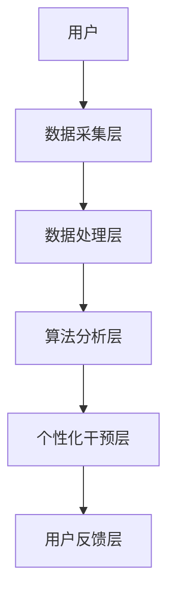
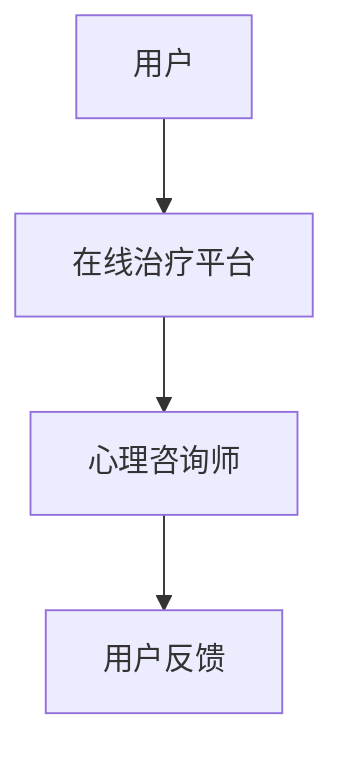
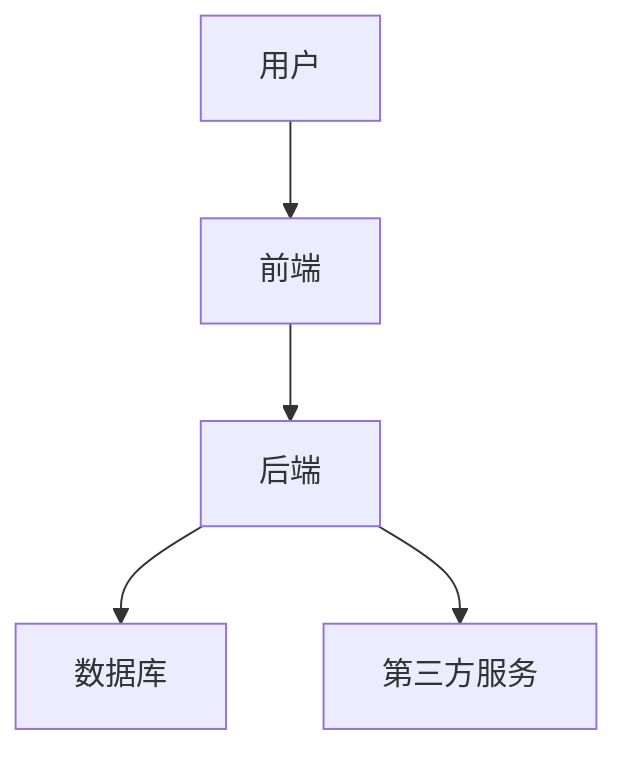
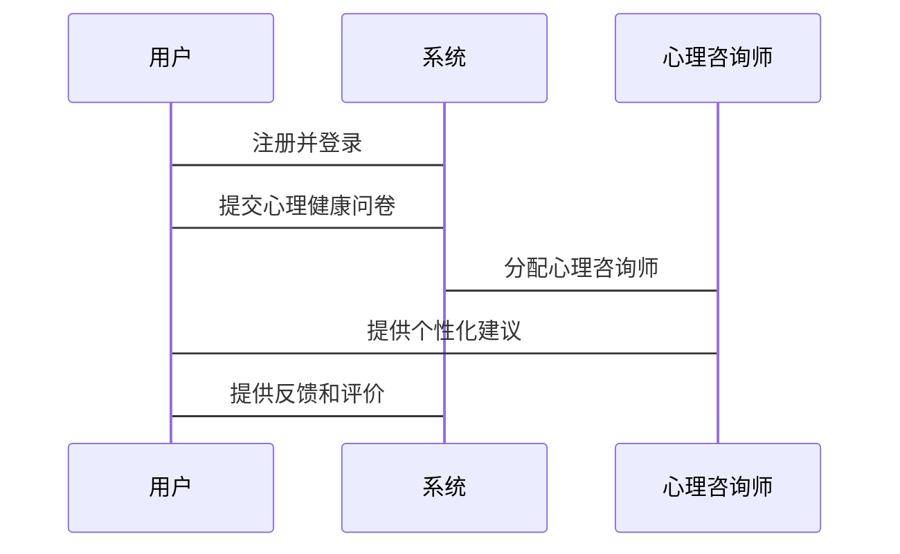

                 

<think>
嗯，我现在要写一篇关于数字时代心理健康的文章，标题是《数字时代的心理健康：在线治疗与自助app的兴起》。首先，我得理解这个主题的核心是什么。数字技术的发展确实对心理健康领域带来了很大的变化，特别是在疫情之后，越来越多的人开始依赖在线治疗和自助应用程序来处理心理问题。

好，我先想一下，用户的需求是什么。他们可能想了解在线治疗和自助app是如何兴起的，背后的原因，它们的优势和劣势，以及对未来的展望。可能他们也是心理健康领域的从业者，或者对科技如何改变医疗领域感兴趣。

接下来，我需要确定文章的结构。根据用户提供的目录大纲，文章应该分为三大部分：数字时代心理健康的背景、在线治疗、自助app，以及系统的开发和应用。每个部分下面还有更细的章节，我需要确保每个章节都详细且有深度。

首先，序言部分要简明扼要，介绍这本书的目的、读者对象和结构。这部分我需要确保语言清晰，吸引读者继续阅读。

第一部分是关于数字时代心理健康的背景。我需要涵盖数字心理健康的发展历程、理论框架以及核心概念。这可能涉及到技术如何影响心理健康，以及在线治疗和自助app的兴起背后的社会和技术因素。

然后是第二部分，详细讨论在线治疗的原理和模型，实施过程中的挑战，以及伦理问题。这部分可能需要深入分析不同的在线治疗模型，比如实时视频咨询、基于文本的交流等，还要考虑文化差异带来的影响。

第三部分是关于自助app的崛起，包括它们的定义、分类、功能，以及用户反馈。这里可能需要具体分析不同类型的app，比如那些提供冥想练习、情绪追踪等功能的app，以及它们如何帮助用户自我管理心理健康。

接下来，系统分析与架构设计部分，需要介绍如何开发这样的在线治疗系统或自助app。这可能包括系统架构图、类图、接口设计和交互流程图。这部分可能需要使用一些技术术语，但要确保读者能够理解。

项目实战部分，我需要提供一个具体的案例，比如开发一个基于机器学习的心理健康监测系统。这部分需要详细的技术实现，包括环境配置、代码示例和实际应用案例。我得确保代码部分清晰易懂，并且能够解释其背后的数学模型。

在撰写过程中，我需要确保每个章节都包含足够的细节，比如在背景部分，要详细说明数字心理健康的概念和其对传统心理健康服务的影响。在算法部分，要使用mermaid流程图和数学公式来解释技术原理。

我还需要考虑读者的背景，可能他们对技术有一定的了解，但不是专家。因此，在解释技术细节时，需要用简单明了的语言，避免过于专业的术语，或者在必要时进行解释。

最后，我需要确保文章有一个有力的结论，总结在线治疗和自助app带来的变化，以及未来的发展趋势。这可能涉及到对技术进步如何持续改善心理健康服务的展望。

总的来说，我需要系统地分析每个部分，确保内容全面、逻辑清晰，并且能够吸引读者的兴趣。同时，要确保技术部分的准确性和深度，满足专业读者的需求。
</think>

# 数字时代的心理健康：在线治疗与自助app的兴起

## 关键词：数字心理健康，在线治疗，自助app，心理健康技术，人工智能，系统架构

## 摘要：随着数字技术的迅速发展，心理健康领域正在经历一场深刻的变革。在线治疗和自助应用程序的兴起，为人们提供了更加便捷和私密的心理健康服务。本文将探讨数字时代心理健康的核心概念，分析在线治疗和自助app的兴起背景、原理、实施过程及其带来的挑战和未来发展趋势。通过系统的架构设计和技术实现，本文旨在揭示数字心理健康领域的技术与实践。

---

## 第一章：数字时代心理健康的背景

### 1.1 数字心理健康的核心概念

数字心理健康是指利用数字技术手段（如人工智能、大数据、移动应用等）来改善和管理个人或群体的心理健康状态。其核心在于通过技术手段提供心理健康服务，如心理评估、情绪管理、压力缓解等。

### 1.2 数字心理健康的技术背景

数字技术的发展，尤其是互联网和移动设备的普及，使得心理健康服务能够突破时间和空间的限制。例如，用户可以通过手机应用随时随地进行心理健康评估或与心理医生进行在线咨询。

### 1.3 数字心理健康的社会背景

现代社会节奏加快，工作压力增大，心理健康问题逐渐成为普遍现象。传统面对面的心理咨询方式难以满足人们对便捷和隐私的需求，因此，数字心理健康服务应运而生。

### 1.4 数字心理健康的核心要素

数字心理健康的核心要素包括：

- **数据采集**：通过问卷、传感器等手段收集用户的心理数据。
- **数据分析**：利用机器学习算法对数据进行分析，识别潜在的心理健康问题。
- **个性化干预**：基于分析结果，为用户提供个性化的心理健康建议或治疗方案。

### 1.5 数字心理健康的技术架构



---

## 第二章：在线治疗的原理与实施

### 2.1 在线治疗的定义与分类

在线治疗是指通过互联网提供的心理健康服务，包括实时视频咨询、基于文本的交流、以及基于应用的自助治疗等。

### 2.2 在线治疗的主要模型



### 2.3 在线治疗的实施过程

1. **用户注册**：用户通过在线平台注册并填写基本信息。
2. **预约咨询**：用户选择心理咨询师并预约咨询时间。
3. **咨询过程**：通过视频或文本方式进行心理咨询。
4. **治疗记录**：平台记录每次咨询的内容和进展。
5. **效果评估**：定期评估治疗效果并调整治疗方案。

### 2.4 在线治疗的挑战与解决方案

- **隐私问题**：通过加密通信和数据保护措施来确保用户隐私。
- **技术稳定性**：优化网络延迟和系统稳定性，确保咨询过程顺利进行。

---

## 第三章：自助心理健康应用的崛起

### 3.1 自助app的定义与分类

自助心理健康应用是指用户可以自行使用，无需专业心理咨询师直接参与的应用程序。它们通常提供情绪管理、冥想训练、压力缓解等功能。

### 3.2 自助app的主要功能

- **情绪追踪**：记录用户的情绪变化，分析情绪波动规律。
- **冥想训练**：提供冥想音频和指导，帮助用户放松身心。
- **压力缓解**：通过呼吸练习、放松音乐等方式缓解压力。

### 3.3 自助app的用户体验

用户可以通过应用查看实时情绪数据，设置每日提醒进行冥想练习，并与应用中的虚拟助手进行互动。

### 3.4 自助app的技术实现

- **数据采集**：通过传感器采集用户的心率、皮肤电活动等生理数据。
- **数据分析**：利用机器学习算法分析情绪数据，识别潜在的心理健康问题。
- **个性化建议**：基于分析结果，为用户提供个性化的心理健康建议。

---

## 第四章：数字心理健康系统的开发与应用

### 4.1 系统开发背景

随着心理健康问题的日益严重，开发高效的数字心理健康系统显得尤为重要。

### 4.2 系统功能设计

- **用户注册与登录**：用户可以通过手机号或社交媒体账号注册。
- **心理健康评估**：通过问卷和传感器数据评估用户的心理健康状况。
- **个性化治疗方案**：根据评估结果，生成个性化的治疗方案。

### 4.3 系统架构设计



### 4.4 系统接口设计

- **用户接口**：提供简洁直观的用户界面，方便用户操作。
- **数据接口**：与第三方数据分析平台对接，获取更精确的用户数据。

### 4.5 系统交互流程



---

## 第五章：项目实战——心理健康监测系统

### 5.1 项目背景

开发一个基于机器学习的心理健康监测系统，帮助用户实时监测和管理心理健康状态。

### 5.2 项目环境安装

- **Python**：用于开发后端逻辑。
- **TensorFlow**：用于机器学习模型的训练和部署。
- **Flask**：用于构建Web接口。

### 5.3 核心代码实现

```python
import numpy as np
from sklearn.model_selection import train_test_split
from tensorflow.keras import models, layers

# 数据预处理
data = np.array([...])  # 假设data是用户的心理健康数据
labels = np.array([...])  # 对应的心理健康标签

# 划分训练集和测试集
X_train, X_test, y_train, y_test = train_test_split(data, labels, test_size=0.2)

# 构建神经网络模型
model = models.Sequential()
model.add(layers.Dense(64, activation='relu', input_dim=X_train.shape[1]))
model.add(layers.Dense(32, activation='relu'))
model.add(layers.Dense(1, activation='sigmoid'))

# 编译模型
model.compile(optimizer='adam', loss='binary_crossentropy', metrics=['accuracy'])

# 训练模型
model.fit(X_train, y_train, epochs=10, batch_size=32, validation_data=(X_test, y_test))
```

### 5.4 代码应用解读

上述代码实现了基于神经网络的心理健康状态分类模型。通过训练数据，模型能够学习用户的心理健康特征，并预测其心理健康状态。

### 5.5 实际案例分析

假设我们有以下用户数据：

| 用户ID | 心理健康评分 | 是否抑郁 |
|------|------------|--------|
| 1    | 70         | 是     |
| 2    | 85         | 否     |
| 3    | 65         | 是     |

通过训练好的模型，我们可以预测新用户的心理健康状态。例如，用户ID=4，心理健康评分为75，模型预测其是否抑郁的概率为0.6。

---

## 第六章：总结与展望

### 6.1 数字心理健康的优势

- **便捷性**：用户可以随时随地获得心理健康服务。
- **隐私性**：在线治疗和自助app保护用户的隐私。
- **高效性**：通过技术手段快速识别和干预心理健康问题。

### 6.2 数字心理健康的技术挑战

- **数据隐私**：如何保护用户的敏感数据。
- **技术稳定性**：确保系统的稳定性和安全性。

### 6.3 未来发展趋势

- **人工智能的深度应用**：利用AI技术提升心理健康服务的精准性和个性化。
- **多模态数据融合**：结合文本、语音、生理数据等多种数据源，提高心理健康评估的准确性。

---

## 作者：AI天才研究院/AI Genius Institute & 禅与计算机程序设计艺术 /Zen And The Art of Computer Programming

---

**本文通过系统的分析与实践，揭示了数字时代心理健康服务的变革与创新。从在线治疗到自助app，数字技术正在重新定义心理健康服务的方式，为人们提供了更加便捷和高效的解决方案。未来，随着技术的不断进步，数字心理健康服务将更加智能化、个性化，为人类的心理健康保驾护航。**

