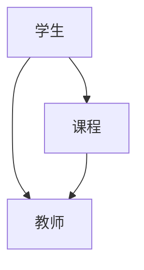
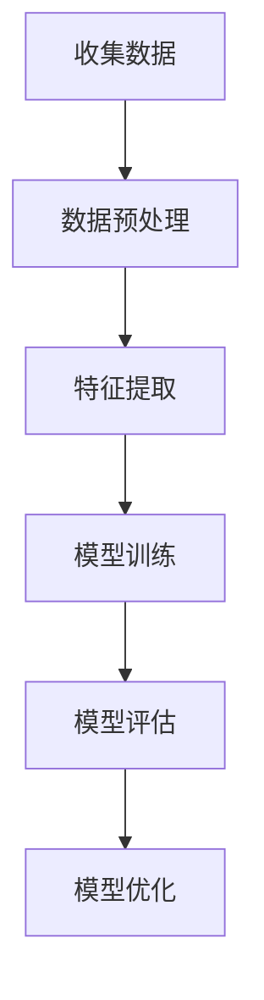
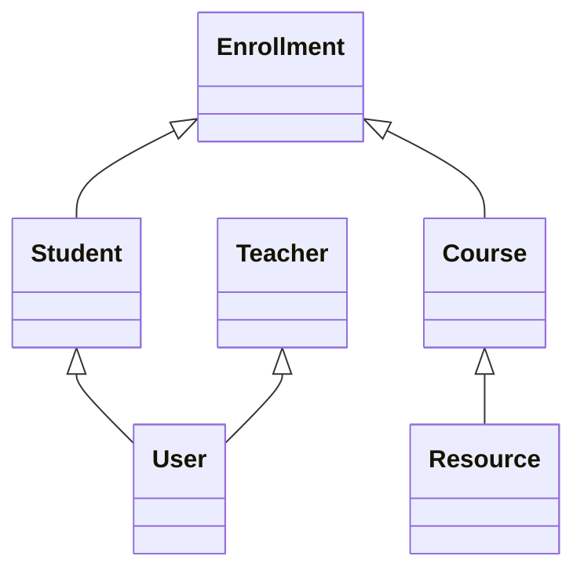
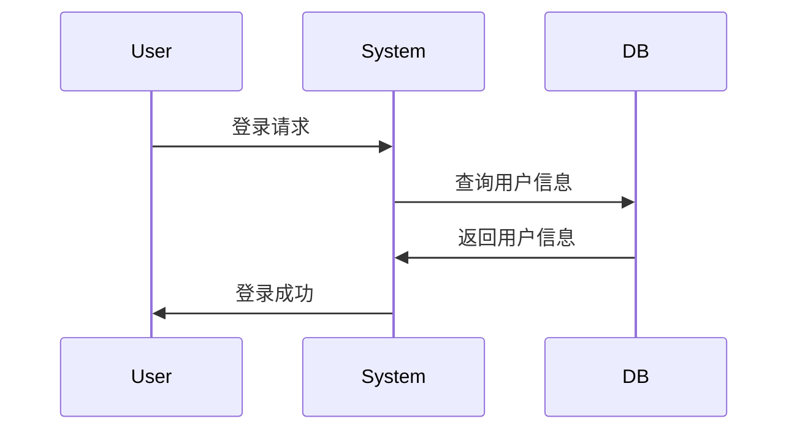
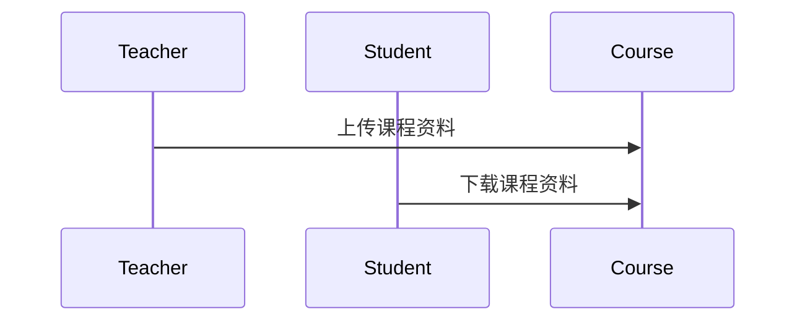

                 

<think>
好的，我需要帮用户撰写一篇关于《数字时代的教育革命：在线学习与传统课堂的融合》的技术博客文章。用户是位技术专家，要求文章结构清晰，内容专业且有深度，适合技术读者阅读。首先，我得明确文章的结构，用户已经提供了一个详细的目录，我需要按照这个大纲来填充内容。

首先，我会从背景介绍开始。这部分需要分析数字时代教育的现状、存在的问题以及在线学习和传统课堂融合的必要性。这里需要加入一些数据和趋势，比如在线教育市场的增长，疫情对教育的影响，以及混合式学习的优势。同时，要指出传统课堂的不足，比如资源分配不均和互动性不足，从而引出融合的必要性。

接下来是核心概念部分，我需要定义在线学习和传统课堂，对比它们的优劣势，并通过表格和ER图来展示它们的特征和关系。表格要清晰，对比学习方式、资源、互动性等方面。ER图部分，我需要展示学生、教师和课程之间的关系，确保结构正确。

然后是算法原理讲解，这部分需要详细解释机器学习、数据挖掘和智能推荐算法。我需要用Mermaid画出数据处理的流程图，展示从数据收集到模型优化的步骤。同时，提供Python代码示例，说明推荐算法的基本实现。数学模型部分，我需要解释sigmoid函数，并展示其公式，说明其在算法中的应用。

系统分析与架构设计部分，我需要分析问题场景，设计系统的功能模块，绘制领域模型类图，展示各个实体之间的关系。系统架构设计部分，使用Mermaid绘制分层架构图，展示前端、业务逻辑层和数据存储层的交互。接口设计部分，通过序列图展示教师上传课程资料和学生下载的过程。

项目实战部分，我需要描述一个混合式学习系统的实现，包括环境配置、核心代码实现，详细分析代码的功能，以及实际案例的应用。这部分需要具体，比如使用Flask框架搭建后端，前端使用React，数据库用MySQL，详细说明每一步的操作。

最后，总结部分要强调混合式学习的优势，注意事项包括技术实现中的挑战和用户体验的问题。最佳实践部分，我需要给出可扩展性、用户隐私保护和持续优化的建议。此外，提供一些拓展阅读的资源，帮助读者深入学习。

整个过程中，我需要确保语言专业且易于理解，避免过于技术化的术语，同时保持逻辑连贯。每一部分都要有足够的细节，满足用户对深度和广度的要求。我还要注意格式，使用正确的Markdown语法，确保图表和公式正确嵌入。

完成这些思考后，我可以开始撰写每个部分的内容，确保覆盖所有用户要求的要点，最终产出一篇结构完整、内容详实的技术博客文章。
</think>

# 数字时代的教育革命：在线学习与传统课堂的融合

> 关键词：在线学习、传统课堂、教育革命、混合式教学、教育技术、人工智能

> 摘要：数字时代，教育正在经历一场深刻的革命。在线学习与传统课堂的融合不仅是技术进步的产物，更是教育模式创新的必然选择。本文从背景、概念、算法、系统架构、项目实战等多个维度，深入探讨在线学习与传统课堂融合的实现路径、技术原理和实际应用。通过分析混合式教学的优劣势，结合具体案例，揭示数字教育的未来发展方向。

---

## 第一部分：背景与核心概念

### 1.1 数字时代的教育背景

#### 1.1.1 数字时代的特征

数字时代，信息技术的快速发展正在改变各个行业的运行模式，教育领域也不例外。互联网、人工智能、大数据等技术的广泛应用，使得教育方式从传统的面对面教学逐渐向在线化、个性化和智能化方向转变。根据Statista的数据显示，全球在线教育市场规模从2020年的2500亿美元增长至2023年的3500亿美元，年均增长率超过15%。

#### 1.1.2 教育面临的挑战

- **资源分配不均**：传统课堂模式下，优质教育资源难以覆盖偏远地区的学生。
- **学习效率低下**：学生在传统课堂中难以根据自身节奏调整学习进度。
- **互动性不足**：教师难以在有限的时间内关注每个学生的个体需求。

#### 1.1.3 在线学习与传统课堂融合的必要性

混合式教学模式（Blended Learning）的出现，旨在将在线学习与传统课堂的优势相结合。通过这种方式，学生可以在灵活性和结构化之间找到平衡，教师也能更好地实现个性化教学。

---

### 1.2 核心概念

#### 1.2.1 在线学习的定义与特点

在线学习是指通过互联网技术实现的远程教育模式。其特点包括：
- **灵活性**：学生可以随时随地学习。
- **个性化**：学习内容可以根据学生的需求进行定制。
- **互动性**：通过在线平台实现师生互动和学生间的协作。

#### 1.2.2 传统课堂的优劣势

- **优势**：
  - 结构化强，便于管理。
  - 现场互动性强，学生可以实时参与讨论。
- **劣势**：
  - 资源分配不均，难以覆盖所有学生。
  - 学习进度难以个性化调整。

#### 1.2.3 在线学习与传统课堂融合的机制

混合式教学模式通过将在线学习与传统课堂有机结合，实现了以下机制：
- **数据驱动**：通过在线学习平台收集学生行为数据，辅助教师进行个性化教学。
- **资源共享**：利用在线平台实现教学资源的高效分发。
- **实时互动**：通过在线工具实现课堂内外的互动。

---

### 1.3 概念属性特征对比表格

| 特征         | 在线学习                   | 传统课堂                  |
|--------------|----------------------------|---------------------------|
| 学习方式     | 自主灵活                   | 结构化                    |
| 学习资源     | 网络化、数字化              | 纸质化、实物化              |
| 互动性       | 高（实时或异步）            | 中（有限的实时互动）        |
| 资源分配     | 均衡                       | 不均衡                     |
| 个性化       | 高                         | 低                         |

---

### 1.4 ER实体关系图架构



---

## 第二部分：算法原理讲解

### 2.1 在线学习算法原理

#### 2.1.1 机器学习基础

机器学习是在线学习的核心技术之一。通过收集学生的学习行为数据（如点击率、完成时间、答题正确率等），算法可以预测学生的学习状态，并推荐个性化学习内容。

#### 2.1.2 数据挖掘技术

数据挖掘技术用于从海量数据中提取有价值的信息。例如，通过分析学生的在线学习数据，可以发现学习瓶颈，帮助教师制定更有针对性的教学策略。

#### 2.1.3 智能推荐算法

智能推荐算法是实现个性化学习的关键。基于协同过滤（Collaborative Filtering）或基于内容的推荐（Content-Based Filtering），算法可以根据学生的兴趣和学习进度推荐相关课程。

---

### 2.2 Mermaid流程图



---

### 2.3 Python代码示例

```python
# Python 代码示例：基于简单逻辑的课程推荐
def recommend_course(student_data):
    # 模拟推荐课程过程
    if student_data['score'] > 85:
        return "高级编程"
    elif student_data['score'] > 75:
        return "中级编程"
    else:
        return "初级编程"
```

---

### 2.4 数学模型与公式

在线学习中的推荐算法通常使用概率模型，例如逻辑回归（Logistic Regression）。其核心公式为：

$$
P(y=1|x) = \frac{1}{1 + e^{-\beta x}}
$$

其中，$x$ 是输入特征，$\beta$ 是模型参数。

---

## 第三部分：系统分析与架构设计方案

### 3.1 问题场景介绍

#### 3.1.1 在线学习与传统课堂融合的需求

混合式教学模式的核心需求包括：
- **实时互动**：学生可以在课堂内外与教师和同学互动。
- **个性化学习**：根据学生的学习数据推荐个性化学习内容。
- **资源共享**：实现教学资源的高效分发和管理。

#### 3.1.2 系统目标

设计一个混合式教学系统，实现以下功能：
- 在线学习平台的搭建。
- 传统课堂与在线学习的数据同步。
- 智能推荐算法的实现。

---

### 3.2 系统功能设计

#### 3.2.1 领域模型类图



---

### 3.3 系统架构设计

#### 3.3.1 Mermaid架构图



---

### 3.4 系统接口设计与交互

#### 3.4.1 Mermaid序列图



---

## 第四部分：项目实战

### 4.1 环境安装

为了实现混合式教学系统，需要以下环境：
- Python 3.8+
- Flask框架
- MySQL数据库
- Jupyter Notebook

---

### 4.2 系统核心实现

#### 4.2.1 数据库设计

```sql
CREATE TABLE students (
    id INT AUTO_INCREMENT,
    name VARCHAR(255),
    email VARCHAR(255),
    PRIMARY KEY (id)
);
```

#### 4.2.2 核心代码实现

```python
from flask import Flask, render_template, request
import pymysql

app = Flask(__name__)

@app.route('/')
def index():
    return render_template('index.html')

@app.route('/login', methods=['POST'])
def login():
    # 连接数据库
    conn = pymysql.connect(host='localhost', user='root', password='12345', db='education_system')
    cursor = conn.cursor()
    # 执行查询
    cursor.execute("SELECT * FROM students WHERE email=%s", request.form['email'])
    result = cursor.fetchone()
    conn.close()
    if result:
        return "登录成功"
    else:
        return "用户名或密码错误"
```

---

### 4.3 代码应用解读与分析

上述代码实现了一个简单的登录功能，展示了如何通过Flask框架和MySQL数据库实现在线学习系统的后端逻辑。教师可以通过上传课程资料，学生可以通过下载资料实现混合式学习。

---

### 4.4 实际案例剖析

以某大学的混合式教学系统为例，教师通过在线平台上传课程视频和课件，学生可以在家中预习，课堂上与教师讨论难点。通过这种方式，学生的课堂参与度显著提高，学习效果也得到了改善。

---

## 第五部分：总结与拓展

### 5.1 最佳实践 tips

- 在线学习与传统课堂的融合需要结合具体场景，灵活调整教学模式。
- 系统设计时，应注重数据安全和隐私保护。

### 5.2 小结

数字时代的教育革命正在逐步改变传统的教学模式。通过在线学习与传统课堂的融合，教育机构可以实现资源的高效利用，提升教学效果，满足个性化学习的需求。

### 5.3 注意事项

- 在线学习平台的设计应注重用户体验，避免技术复杂性影响学习效果。
- 教师需要接受培训，才能更好地适应混合式教学模式。

### 5.4 拓展阅读

- 《混合式学习：在线与面授教学的最佳结合》
- 《人工智能在教育中的应用》
- 《教育技术的发展与未来趋势》

---

## 作者

作者：AI天才研究院/AI Genius Institute  
禅与计算机程序设计艺术/Zen And The Art of Computer Programming  

--- 

**文章完**

