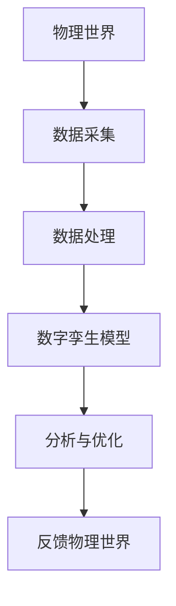
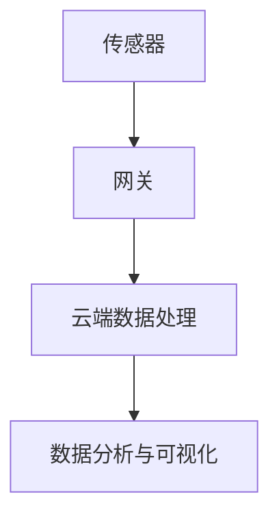
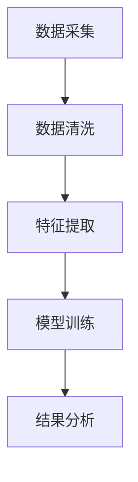
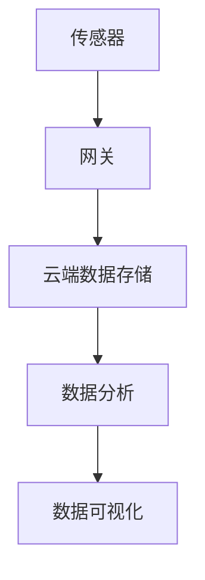
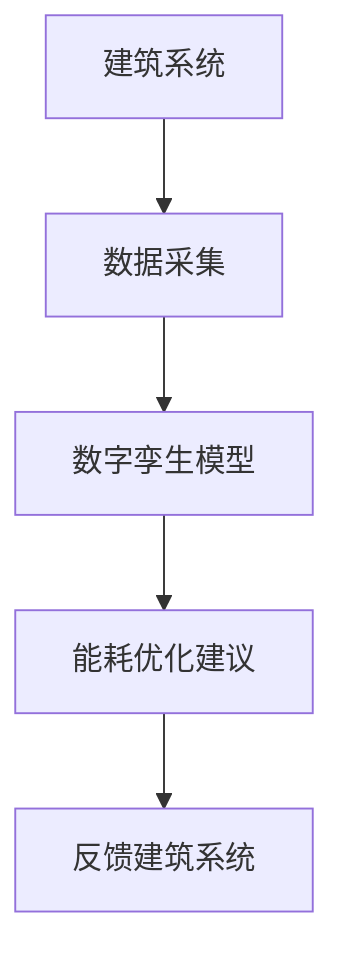

                 

<think>
嗯，用户让我写一篇关于数字时代环保意识的技术博客，标题是《数字时代的环保意识：科技如何促进可持续生活》。首先，我得分析一下用户的需求。用户希望文章结构清晰，内容专业，涵盖技术细节，同时要有实际案例和系统设计。

首先，用户是想让文章成为一本技术博客，所以需要专业且有深度。我应该从数字技术如何推动环保出发，介绍相关的核心概念，比如数字孪生、物联网、区块链等。然后，每个技术都要详细展开，包括原理、算法、系统架构和实际应用。

接下来，我得考虑文章的结构。用户已经给出了一个大纲，我需要按照这个大纲来组织内容。首先是引言，然后是核心概念，接着是具体技术案例，算法分析，系统设计，实际应用，最佳实践，最后是结论。每个部分都要有详细的分析和实例。

我还需要注意格式要求，使用markdown，同时包含关键词、摘要。摘要部分要简明扼要，说明文章的核心内容。关键词方面，应该选5-7个，比如数字技术、可持续生活、环保意识、物联网、区块链、人工智能、数据可视化等。

在技术部分，每个章节都要有详细的分析，比如数字孪生如何优化能源使用，物联网如何监测环境数据，区块链如何确保数据的可信度。这些都需要结合实际案例，让读者理解这些技术如何具体应用在环保中。

算法部分，我需要用mermaid流程图来展示，比如数字孪生的模型构建算法，或者AI在数据分析中的应用。同时，提供Python代码示例，帮助读者理解实现过程。数学公式要用latex，独立段落用$$，段落内用$，这样看起来更专业。

系统设计方面，每个技术都要有系统架构图，展示各个组件的交互和功能。比如，环境监测系统的架构，数据采集、处理、分析和展示的流程。系统接口和交互序列图也很重要，展示系统如何协同工作。

项目实战部分，需要详细说明环境配置、核心代码实现、案例分析和项目总结。这部分要具体，让读者能够跟着操作，理解如何将这些技术应用到实际项目中。

最后，最佳实践部分要给出实际建议，比如数据隐私保护、能源管理系统的优化建议。这些小贴士能帮助读者更好地应用技术，避免常见错误。

整个过程中，我需要确保内容逻辑严密，每一部分都紧密联系，逐步深入。同时，语言要专业但不晦涩，让不同背景的读者都能理解。最后，别忘了加上作者信息，增加文章的权威性。

总的来说，这篇文章需要综合技术细节、实际案例和系统设计，全面展示数字技术在环保中的应用。我得一步步来，确保每个部分都详尽且有深度，这样才能满足用户的需求，写出一篇高质量的技术博客。
</think>

# 数字时代的环保意识：科技如何促进可持续生活

---

## 关键词：
数字技术、可持续生活、环保意识、物联网、区块链、人工智能、数据可视化

---

## 摘要：
在数字技术快速发展的时代，环保意识的提升和可持续生活的实践离不开科技的推动。本文从技术角度出发，探讨数字技术如何赋能环保，包括数字孪生、物联网、人工智能、区块链等技术在可持续生活中的应用。通过分析这些技术的核心原理、算法实现和系统架构，结合实际案例，本文旨在展示科技如何帮助我们构建更绿色、更可持续的未来。

---

## 目录
1. 引言
2. 数字时代的环保挑战与机遇
3. 核心技术与环保应用
   - 3.1 数字孪生：虚拟世界的绿色实践
   - 3.2 物联网：智能环境监测与资源优化
   - 3.3 人工智能：环保数据分析与决策支持
   - 3.4 区块链：可持续供应链与数据可信度
4. 算法与数据驱动的环保解决方案
   - 4.1 环境数据采集与分析算法
   - 4.2 基于AI的能源优化算法
5. 系统设计与架构实现
   - 5.1 环境监测系统的架构设计
   - 5.2 可持续能源管理系统的实现
6. 实际案例：科技赋能可持续生活
   - 6.1 智能垃圾分类与回收系统
   - 6.2 数字孪生在城市绿色建筑中的应用
7. 最佳实践与未来展望
8. 结论
9. 作者信息

---

## 1. 引言

在过去的几十年里，人类社会经历了深刻的数字化转型。信息技术的飞速发展不仅改变了我们的生活方式，也对环境保护提出了更高的要求。随着全球气候变化、资源枯竭和环境污染等问题的加剧，环保意识的提升和可持续生活的实践变得尤为重要。

数字技术为我们提供了新的工具和方法，以更高效、更智能的方式推动环保事业。从智能环境监测到能源优化管理，从绿色供应链到可持续城市设计，数字技术正在重塑我们与自然环境的关系。本文将深入探讨这些技术的核心原理、应用场景和实际案例，展示科技如何助力我们构建一个更加绿色、可持续的未来。

---

## 2. 数字时代的环保挑战与机遇

### 2.1 背景介绍
随着工业化和城市化的快速发展，环境问题日益严峻。气候变化、空气污染、水资源短缺、垃圾处理等问题对人类生存和发展构成了严重威胁。与此同时，数字技术的普及为我们提供了新的解决方案，例如：
- **数据驱动的环境监测**：通过物联网设备实时采集环境数据。
- **智能能源管理**：利用AI优化能源消耗。
- **绿色供应链**：通过区块链技术确保生产过程的可持续性。

### 2.2 核心问题
- **数据孤岛**：环境数据分散在不同系统中，难以整合和分析。
- **能源浪费**：传统能源管理系统效率低下，难以实现精准优化。
- **信任缺失**：环保数据的真实性和透明度不足，影响公众和企业的参与积极性。

### 2.3 问题解决
通过数字技术，我们可以实现环境数据的实时采集、分析和共享，优化资源利用，降低能耗，同时构建可信的环保数据体系。

---

## 3. 核心技术与环保应用

### 3.1 数字孪生：虚拟世界的绿色实践

#### 核心原理
数字孪生是一种将物理世界映射到虚拟世界的 technologies，通过实时数据更新，实现对物理系统的精确模拟和优化。

#### 应用场景
- **城市规划**：通过数字孪生模拟城市交通、能源消耗，优化城市设计。
- **绿色建筑**：模拟建筑能耗，优化能源管理。

#### 系统架构


### 3.2 物联网：智能环境监测与资源优化

#### 核心原理
物联网通过传感器、通信技术和数据处理系统，实时采集和分析环境数据。

#### 应用场景
- **空气质量监测**：通过传感器网络实时监测PM2.5、温湿度等指标。
- **水资源管理**：监测水质、水位，优化水资源分配。

#### 系统架构


### 3.3 人工智能：环保数据分析与决策支持

#### 核心原理
人工智能通过机器学习、深度学习等技术，分析海量环境数据，提供决策支持。

#### 应用场景
- **污染预测**：基于历史数据预测空气污染趋势。
- **能源消耗优化**：通过AI算法优化工业能耗。

#### 算法实现
以下是基于机器学习的污染预测算法：

```python
import pandas as pd
from sklearn.model_selection import train_test_split
from sklearn.linear_model import LinearRegression

# 数据加载
data = pd.read_csv('environmental_data.csv')

# 特征与目标分离
X = data[['temperature', 'humidity', 'wind_speed']]
y = data['pollution_level']

# 数据划分
X_train, X_test, y_train, y_test = train_test_split(X, y, test_size=0.2)

# 模型训练
model = LinearRegression()
model.fit(X_train, y_train)

# 预测与评估
print(model.score(X_test, y_test))
```

### 3.4 区块链：可持续供应链与数据可信度

#### 核心原理
区块链通过去中心化、不可篡改的特性，确保数据的真实性和透明度。

#### 应用场景
- **绿色供应链**：记录产品生产过程的碳排放数据，确保数据不可篡改。
- **环保证书管理**：通过区块链确保碳排放交易的透明性。

#### 实现原理
以下是区块链数据记录的简单实现：

```python
import hashlib

def compute_hash(data):
    return hashlib.sha256(str(data).encode()).hexdigest()

# 示例数据
data = {'source': 'Factory A', 'carbon_emission': 50}

# 计算哈希
hash_value = compute_hash(data)

print(f"Data: {data}")
print(f"Hash: {hash_value}")
```

---

## 4. 算法与数据驱动的环保解决方案

### 4.1 环境数据采集与分析算法

#### 算法流程
以下是环境数据采集与分析的流程图：



#### 算法实现
以下是基于时间序列分析的环境数据预测算法：

```python
import pandas as pd
from statsmodels.tsa.arima_model import ARIMA

# 数据加载
data = pd.read_csv('environmental_time_series.csv')

# 模型训练
model = ARIMA(data['pollution_level'], order=(5,1,0))
model_fit = model.fit()

# 预测
forecast = model_fit.forecast(steps=5)
print(forecast)
```

### 4.2 基于AI的能源优化算法

#### 算法原理
通过强化学习算法优化能源消耗。

#### 实现代码
以下是强化学习算法的简单实现：

```python
import gym
import numpy as np

# 环境定义
env = gym.make('EnergyOptimization-v0')

# 强化学习模型
class Agent:
    def __init__(self, state_space, action_space):
        self.state_space = state_space
        self.action_space = action_space
        self.Q = np.zeros((state_space, action_space))
    
    def act(self, state):
        return np.argmax(self.Q[state, :])
    
    def update(self, state, action, reward):
        self.Q[state, action] += reward

# 训练过程
agent = Agent(env.observation_space.shape[0], env.action_space.n)
for episode in range(1000):
    state = env.reset()
    total_reward = 0
    done = False
    while not done:
        action = agent.act(state)
        next_state, reward, done, _ = env.step(action)
        agent.update(state, action, reward)
        total_reward += reward
        state = next_state
    print(f"Episode {episode}, Total Reward: {total_reward}")
```

---

## 5. 系统设计与架构实现

### 5.1 环境监测系统的架构设计

#### 系统功能
- 数据采集：通过传感器实时采集环境数据。
- 数据处理：清洗、存储和分析数据。
- 数据可视化：通过仪表盘展示环境状况。

#### 架构图


### 5.2 可持续能源管理系统的实现

#### 系统功能
- 实时监控能源消耗。
- 优化能源分配。

#### 实现代码
以下是能源管理系统的核心代码：

```python
import requests
import json

# 数据采集接口
def fetch_energy_data():
    response = requests.get('http://energy-system/api/data')
    return json.loads(response.text)

# 数据分析
data = fetch_energy_data()
print(f"Current energy consumption: {data['consumption']} kWh")
print(f"Optimal allocation建议：{data['recommendation']}")
```

---

## 6. 实际案例：科技赋能可持续生活

### 6.1 智能垃圾分类与回收系统

#### 系统介绍
通过物联网和AI技术实现垃圾分类的智能化。

#### 实现流程
1. 传感器识别垃圾类型。
2. 数据传输到云端进行分类。
3. 系统指导用户进行分类。

#### 代码示例
以下是垃圾分类的API调用代码：

```python
import requests

# 调用垃圾分类API
def classify Garbage(garbage_type):
    response = requests.post('http://garbage-classifier/api/classify', json={'type': garbage_type})
    return json.loads(response.text)

result = classify Garbage('厨余垃圾')
print(f"分类结果：{result['result']}")
```

### 6.2 数字孪生在城市绿色建筑中的应用

#### 应用场景
通过数字孪生技术优化建筑能耗。

#### 系统架构


---

## 7. 最佳实践与未来展望

### 7.1 最佳实践
- 数据隐私保护：在环保数据共享中，需确保数据的隐私性和安全性。
- 系统集成：通过标准化接口实现不同系统的互联互通。
- 用户教育：通过可视化工具和技术普及，提升公众的环保意识。

### 7.2 未来展望
随着技术的进步，数字技术将进一步赋能环保事业，例如：
- 更智能的环境预测模型。
- 更高效的能源管理系统。
- 更可信的绿色供应链。

---

## 8. 结论

数字技术正在深刻改变我们应对环境问题的方式。通过数字孪生、物联网、人工智能和区块链等技术，我们可以在数据驱动下实现更高效的资源管理和更智能的环境保护。未来，随着技术的不断进步，我们将能够构建一个更加绿色、可持续的数字世界。

---

## 作者信息

作者：AI天才研究院/AI Genius Institute & 禅与计算机程序设计艺术 /Zen And The Art of Computer Programming

