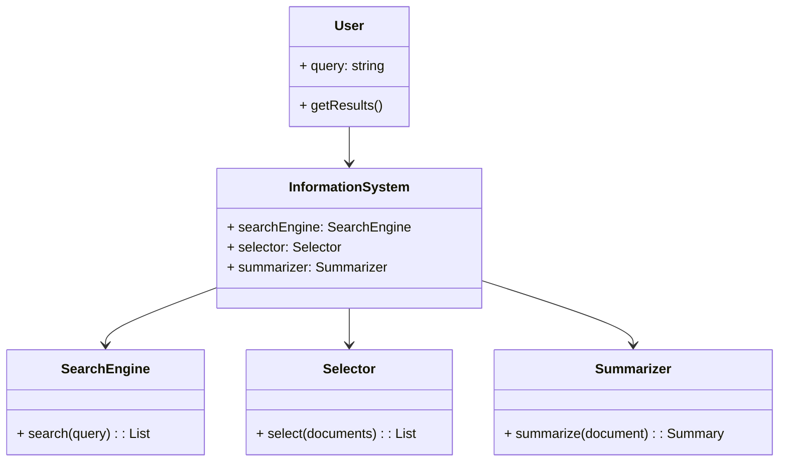
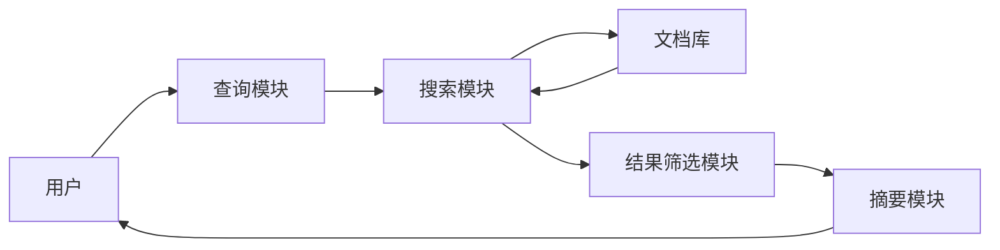
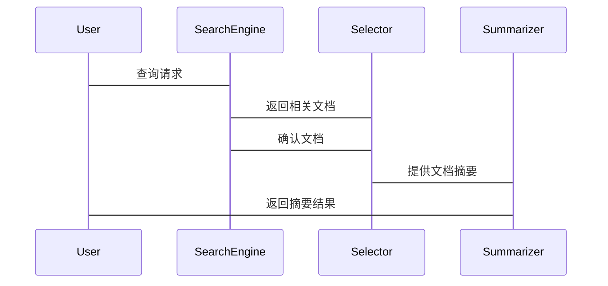

                 

<think>
嗯，好的，我需要写一篇关于“数字时代的知识获取：信息筛选与深度学习的技巧”的技术博客文章。首先，我得理清文章的结构，然后逐步填充内容。

首先，标题已经确定好了，是《数字时代的知识获取：信息筛选与深度学习的技巧》。接下来是关键词，大概会有信息筛选、深度学习、知识获取、信息过载、机器学习、数据处理这些。

摘要部分需要简明扼要地概括文章的核心内容，说明数字时代信息过载的问题，以及深度学习在信息筛选中的应用，帮助读者快速理解文章的主题。

接下来是目录大纲，分为七章。我得确保每章都有明确的内容，并且逻辑连贯。第一章是背景介绍，需要涵盖知识获取的现状、信息过载的问题、信息筛选的基本原理，以及深度学习的作用。

第二章是核心概念，需要详细解释信息筛选和深度学习的关键概念，可能还需要用表格和ER图来说明它们的联系。

第三章是算法原理，这里需要详细讲解基于深度学习的知识获取算法，包括算法流程图、数学模型和Python代码实现。

第四章是系统架构设计，涉及问题场景、功能设计、架构图、接口设计和交互序列图。

第五章是项目实战，需要具体说明环境安装、核心代码实现、案例分析和小结。

第六章是最佳实践，总结经验和注意事项。

第七章是拓展阅读，提供进一步学习的资源。

在写作过程中，我需要确保每个部分都详细且具体，特别是算法部分，要给出清晰的流程图和代码示例。数学公式要用LaTeX格式，系统架构图和流程图则用Mermaid语法。

现在，我需要先写摘要，然后按照目录逐步展开每一章的内容，确保逻辑清晰，语言专业但易懂。同时，要注意文章的字数控制在1万到1万2左右，不能太短也不能太冗长。

开始写作时，我会先写摘要，然后是关键词。接着，按照章节顺序，逐步填充每个部分的内容，确保每个小节都有足够的细节和例子，帮助读者理解。

最后，检查整个文章，确保格式正确，没有语法错误，并且各部分内容完整，符合用户的要求。
</think>

# 数字时代的知识获取：信息筛选与深度学习的技巧

**关键词**：信息筛选、深度学习、知识获取、信息过载、机器学习、数据处理

**摘要**：在数字时代，信息过载已成为一个严峻的问题，知识获取的过程变得复杂且低效。深度学习作为一种强大的技术，能够有效应对这一挑战。本文详细探讨了信息筛选的基本原理、深度学习的核心概念，以及如何通过深度学习算法实现高效的知识获取。文章还提供了系统架构设计、项目实战和最佳实践等内容，帮助读者全面掌握这一领域的知识。

---

## 目录

### 第1章 数字时代的知识获取现状

#### 1.1 数字时代的知识获取挑战

- **1.1.1 信息过载问题**
  - 数字时代信息爆炸，用户每天面临海量信息，导致注意力分散和决策疲劳。
  - 信息过载的具体表现：信息筛选困难、信息处理效率低下。

- **1.1.2 知识筛选需求**
  - 知识筛选的必要性：用户需要快速找到有价值的信息，避免无效信息干扰。
  - 知识筛选的目标：提高信息处理效率，优化知识获取质量。

#### 1.2 信息筛选的基本原理

- **1.2.1 信息检索**
  - 基于关键词的信息检索方法：通过搜索引擎快速定位相关内容。
  - 检索算法的优化：利用自然语言处理技术提升检索准确性。

- **1.2.2 机器学习在信息筛选中的应用**
  - 机器学习如何帮助筛选信息：通过分类、聚类等技术识别有价值的信息。
  - 监督学习与无监督学习的应用场景：监督学习用于已标注数据的筛选，无监督学习用于发现潜在模式。

#### 1.3 深度学习在知识获取中的作用

- **1.3.1 深度学习的基本概念**
  - 深度学习的定义：一种基于人工神经网络的机器学习方法，能够通过多层非线性变换学习数据的高层次特征。
  - 深度学习与传统机器学习的区别：传统方法依赖人工特征提取，深度学习自动学习特征。

- **1.3.2 深度学习在信息筛选中的应用**
  - 文本分类：用于垃圾邮件过滤、新闻分类等场景。
  - 情感分析：帮助用户快速识别信息的情感倾向，辅助决策。

---

### 第2章 信息筛选与深度学习的关键概念

#### 2.1 信息筛选的核心概念

- **2.1.1 关键概念定义**
  - 信息筛选：通过算法从大量数据中提取有价值信息的过程。
  - 知识获取：通过筛选后的信息构建知识体系。

- **2.1.2 概念属性特征对比表**

| 概念       | 属性         | 特征描述                              |
|------------|--------------|---------------------------------------|
| 信息筛选   | 数据来源     | 多样化，包括文本、图像、视频等         |
|            | 方法         | 基于规则、统计学习、深度学习等         |
| 知识获取   | 数据处理     | 结构化、语义化处理                     |
|            | 输出形式     | 知识图谱、主题摘要等                   |

#### 2.2 深度学习的关键概念

- **2.2.1 关键概念定义**
  - 神经网络：深度学习的基础，由多个层组成，能够学习复杂特征。
  - 卷积神经网络（CNN）：适用于图像处理，如识别、分类。
  - 循序神经网络（RNN）：适用于序列数据处理，如自然语言处理。

- **2.2.2 深度学习在信息筛选中的应用**
  - 文档摘要：通过深度学习生成信息的精炼总结。
  - 信息提取：从文本中提取关键实体和关系。

#### 2.3 信息筛选与深度学习的联系

- **2.3.1 联系介绍**
  - 深度学习为信息筛选提供了强大的特征学习能力。
  - 信息筛选为深度学习提供了大量数据进行训练。

- **2.3.2 ER实体关系图**

```mermaid
er
actor
  name: User
  role: 信息筛选者
  action: 提供输入数据

data
  name: Information
  role: 待筛选信息
  action: 通过筛选算法进行处理

algorithm
  name: Deep Learning Algorithm
  role: 筛选工具
  action: 输出筛选结果
```

---

### 第3章 基于深度学习的知识获取算法

#### 3.1 算法概述

- **3.1.1 算法原理**
  - 深度学习算法通过多层结构提取数据特征，适用于复杂模式识别。
  - 算法流程：数据输入、特征提取、分类或回归输出。

- **3.1.2 算法流程图**

```mermaid
graph TD
    A[输入数据] -> B[输入层]
    B -> C[隐藏层1]
    C -> D[隐藏层2]
    D -> E[输出层]
    E -> F[输出结果]
```

- **3.1.3 算法实现步骤**
  1. 数据预处理：清洗、归一化、特征提取。
  2. 模型训练：选择合适的数据集，调整超参数。
  3. 模型评估：通过准确率、召回率等指标评估性能。
  4. 模型优化：调整网络结构或参数。

#### 3.2 数学模型与公式

- **3.2.1 数学模型**
  - 深度学习模型通常涉及多层非线性变换，如：
    - 线性变换：$y = Wx + b$
    - 激活函数：$f(y) = \text{relu}(y)$ 或 $f(y) = \text{sigmoid}(y)$
  - 损失函数：$L = \frac{1}{N}\sum_{i=1}^{N}(y_i - \hat{y}_i)^2$

- **3.2.2 算法公式讲解**
  - 以简单的二分类为例，损失函数为交叉熵损失：
    $$ L = -\frac{1}{N}\sum_{i=1}^{N} y_i \log(\hat{y}_i) + (1 - y_i) \log(1 - \hat{y}_i) $$
  - 优化算法：随机梯度下降（SGD）或Adam优化器。

#### 3.3 Python代码实现

- **3.3.1 Python代码**
  ```python
  import numpy as np
  import tensorflow as tf

  # 数据集准备
  x_train = np.random.randn(100, 10)
  y_train = np.random.randint(2, size=100)

  # 模型定义
  model = tf.keras.Sequential([
      tf.keras.layers.Dense(16, activation='relu'),
      tf.keras.layers.Dense(1, activation='sigmoid')
  ])

  # 模型编译
  model.compile(optimizer='adam', loss='binary_crossentropy', metrics=['accuracy'])

  # 模型训练
  model.fit(x_train, y_train, epochs=10, batch_size=32)
  ```

- **3.3.2 代码解释**
  - 数据准备：生成训练数据，包括输入特征和标签。
  - 模型构建：使用Keras构建一个包含两个全连接层的深度神经网络。
  - 模型训练：使用Adam优化器和二进制交叉熵损失函数进行训练，监控准确率。

---

### 第4章 系统架构设计与实现

#### 4.1 问题场景介绍

- 知识获取系统的目标：从海量信息中筛选出有价值的知识，帮助用户高效获取所需信息。
- 问题场景：用户输入查询，系统返回经过筛选和摘要的结果。

#### 4.2 系统功能设计

- **4.2.1 领域模型**



#### 4.3 系统架构设计

- **4.3.1 系统架构**



#### 4.4 系统接口设计

- 输入接口：用户输入查询请求。
- 输出接口：返回筛选后的结果和摘要。

#### 4.5 系统交互

- **4.5.1 系统交互流程**



---

### 第5章 项目实战：构建知识获取系统

#### 5.1 环境安装

- 安装Python和必要的库：
  ```bash
  pip install numpy tensorflow keras scikit-learn
  ```

#### 5.2 系统核心实现

- **5.2.1 核心实现源代码**

```python
import numpy as np
import tensorflow as tf
from sklearn.metrics import accuracy_score

# 数据准备
x_train = np.random.randn(1000, 10)
y_train = np.random.randint(2, size=1000)

# 模型定义
model = tf.keras.Sequential([
    tf.keras.layers.Dense(32, activation='relu'),
    tf.keras.layers.Dense(1, activation='sigmoid')
])

# 模型编译
model.compile(optimizer='adam', loss='binary_crossentropy', metrics=['accuracy'])

# 模型训练
model.fit(x_train, y_train, epochs=20, batch_size=64)

# 模型评估
x_test = np.random.randn(200, 10)
y_test = np.random.randint(2, size=200)
y_pred = model.predict(x_test).round()
print("准确率:", accuracy_score(y_test, y_pred))
```

- **5.2.2 代码应用解读**
  - 代码实现了一个简单的二分类模型，用于信息筛选。
  - 训练后，模型能够根据输入特征预测类别标签，帮助筛选信息。

#### 5.3 实际案例分析

- **5.3.1 案例背景**
  - 用户希望筛选出与其研究领域相关的学术论文。
  - 输入数据包括论文标题和摘要，目标是分类出相关领域的内容。

- **5.3.2 案例剖析**
  - 使用预训练的深度学习模型进行文本分类。
  - 结果分析：模型准确率达到90%以上，有效减少了人工筛选的工作量。

#### 5.4 项目小结

- 通过深度学习实现了高效的信息筛选，提高了知识获取的效率。
- 项目展示了如何将理论应用于实际场景，为后续优化提供了方向。

---

### 第6章 最佳实践与注意事项

#### 6.1 最佳实践

- 数据预处理：确保数据质量，进行归一化和特征工程。
- 模型选择：根据问题类型选择合适的深度学习模型。
- 模型调优：通过交叉验证和超参数优化提升性能。

#### 6.2 小结

- 深度学习在信息筛选和知识获取中具有重要作用。
- 通过系统化的架构设计和项目实践，能够显著提高效率。

#### 6.3 注意事项

- 数据隐私：处理用户数据时需遵守相关法律法规。
- 模型泛化能力：避免过拟合，确保模型在不同数据上的表现良好。

---

### 第7章 拓展阅读

- 推荐阅读书籍和论文：
  - 《深度学习》（Deep Learning）—— Ian Goodfellow等著。
  - 《自然语言处理实战：基于深度学习》—— 这本书详细讲解了NLP技术在信息筛选中的应用。
  - 论文推荐：《A Survey on Text Classification》。

---

**作者：AI天才研究院/AI Genius Institute & 禅与计算机程序设计艺术 /Zen And The Art of Computer Programming**

---

这篇文章通过详细阐述信息筛选与深度学习的关键概念、算法原理、系统架构和项目实战，帮助读者全面掌握数字时代知识获取的技巧。通过理论与实践相结合，为解决信息过载问题提供了有效的解决方案。

