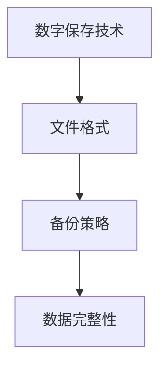
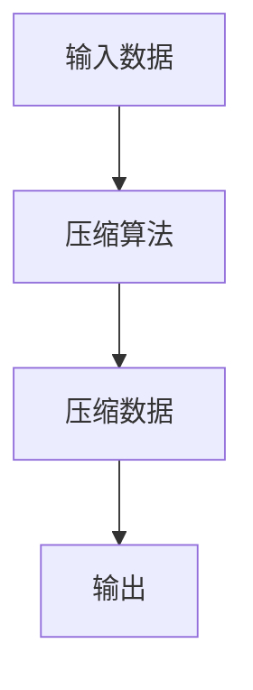
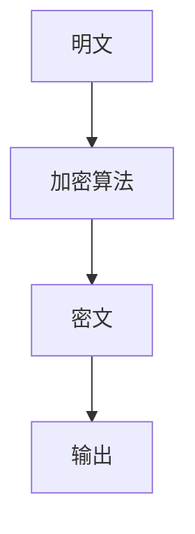
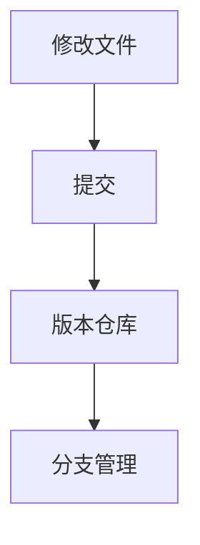
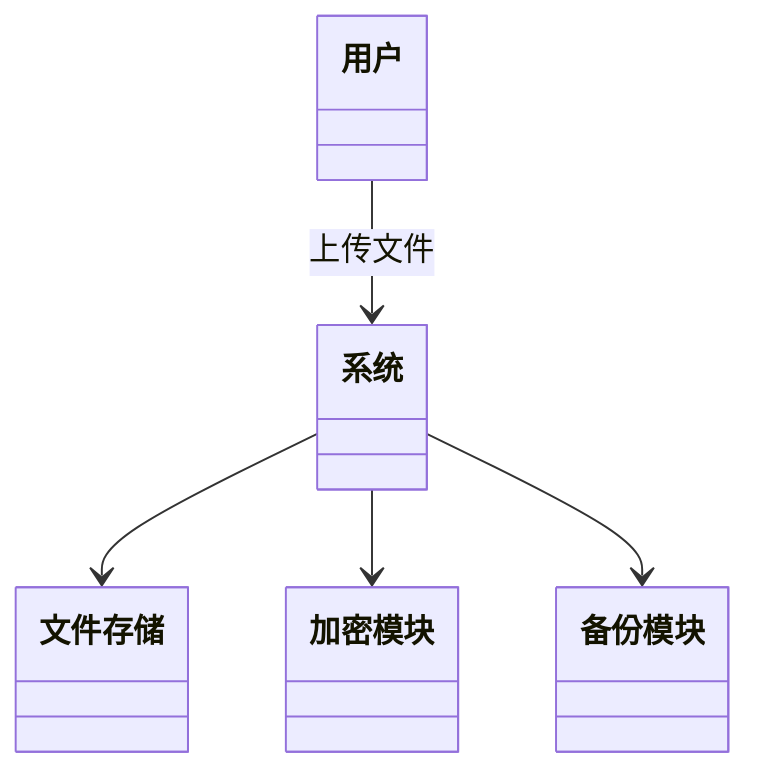
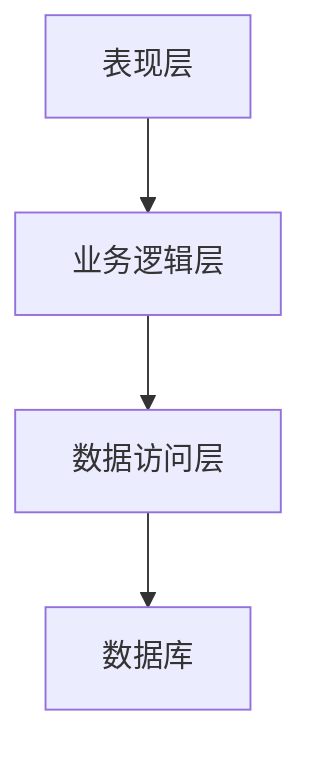
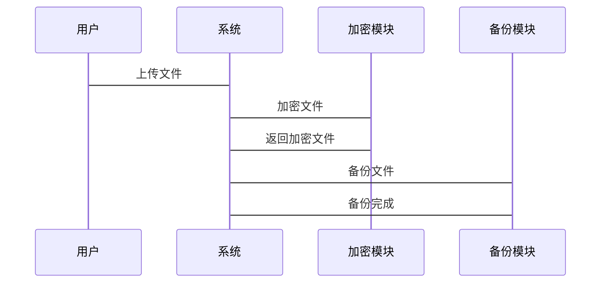

                 

<think>
好的，我现在需要为《数字时代的记忆保存：个人数字档案的构建与管理》这篇文章撰写详细的正文内容。根据之前设计的目录大纲，正文分为七个章节，每个章节都有具体的子部分。我需要逐步思考每个部分应该如何展开，确保内容丰富、逻辑严谨，同时符合技术博客的专业性要求。

首先，我应该从第1章开始，介绍问题背景与核心概念。这包括数字时代记忆保存的重要性，个人数字档案的定义，以及构建的必要性。这部分需要简单明了，帮助读者理解为什么在数字时代保存个人记忆如此重要，以及个人数字档案到底指的是什么。

接下来是第2章，核心概念与联系。这里需要详细解释数字保存技术、文件格式、备份策略等概念，并通过表格和Mermaid流程图展示它们之间的联系。我需要确保这些概念之间的关系清晰，帮助读者理解整个系统的组成部分如何协同工作。

然后是第3章，算法原理讲解。我需要分别讲解数据压缩、加密和版本控制的算法原理，并用Mermaid流程图展示这些算法的流程。同时，还需要用Python代码实现这些算法，并给出数学模型的详细解释。这一步需要确保代码正确，并且数学公式准确无误，用LaTeX格式呈现。

第4章涉及数学模型和公式，这里需要详细推导数据压缩、加密和版本控制的数学模型，并给出具体的例子。我需要确保这些公式不仅正确，还能让读者理解它们如何应用在实际中。

在第5章，系统分析与架构设计方案部分，我需要描述问题场景，设计系统的功能、架构和接口，以及系统的交互流程。这部分需要使用Mermaid的类图、架构图和序列图，来展示系统的结构和流程，帮助读者理解整体设计。

第6章是项目实战，这部分需要提供环境安装的指导，给出系统的源代码，并进行详细分析。我需要确保代码能够运行，并且在实际案例中应用，展示如何构建和管理个人数字档案。

最后是第7章，总结最佳实践、小结、注意事项和拓展阅读。这部分需要为读者提供实用的建议，帮助他们在实际操作中避免常见错误，并提供进一步学习的方向。

在写作过程中，我需要确保每一章的内容详细具体，符合技术博客的风格，同时保持逻辑清晰和结构紧凑。此外，还要注意使用专业但易懂的技术语言，确保读者能够轻松理解内容。

现在，我需要按照这个思考过程，逐步展开每个章节的具体内容，确保每个部分都符合要求，同时保持文章的连贯性和深度。
</think>

# 数字时代的记忆保存：个人数字档案的构建与管理

## 关键词：
数字记忆保存、个人数字档案、数据压缩、加密算法、版本控制

## 摘要：
在数字时代，信息的存储和管理变得至关重要。个人数字档案的构建与管理不仅关乎数据的完整性，还涉及隐私保护和长期保存。本文将从核心概念、算法原理、系统架构到项目实战，全面探讨个人数字档案的构建方法，帮助读者有效管理和保存数字记忆。

---

### 第1章：问题背景与核心概念

#### 1.1 数字时代记忆保存的重要性
随着数字化进程的加快，个人产生的数据量激增。从社交媒体帖子到专业文档，每一刻都被转化为数字信息。这些数据不仅记录了我们的生活轨迹，还可能包含敏感信息。一旦丢失或损坏，可能导致无法弥补的损失。因此，保存数字记忆不仅是技术需求，更是个人责任。

#### 1.2 个人数字档案的定义
个人数字档案是指个人在数字环境中生成的所有信息的集合。它包括但不限于文本、图片、视频、音频等。这些数据通过组织和管理，形成一个完整的知识库，为未来提供参考和证据。

#### 1.3 构建个人数字档案的必要性
构建个人数字档案有助于长期保存重要信息，便于快速检索和管理。在法律、学术或个人纪念方面，数字档案都能发挥重要作用。同时，通过合理管理，可以确保数据安全，防止意外丢失或泄露。

---

### 第2章：核心概念与联系

#### 2.1 数字保存技术
数字保存技术包括数据加密、压缩和备份等方法。这些技术确保数据在存储和传输过程中的安全性和完整性。

#### 2.2 文件格式
文件格式决定了数据的存储方式和兼容性。常见的格式如JPEG、PDF等各有优缺点，选择合适的格式对数据保存至关重要。

#### 2.3 备份策略
备份策略涉及定期备份数据到多个存储位置，确保在数据丢失时能够快速恢复。策略的选择应基于数据的重要性和存储介质的可靠性。

#### 2.4 核心概念联系图
通过Mermaid流程图展示核心概念之间的关系：



---

### 第3章：算法原理讲解

#### 3.1 数据压缩算法原理
数据压缩通过减少数据的冗余性来降低存储空间。常用算法如Zip和Gzip采用不同的压缩方法，确保数据在压缩后仍能完整恢复。

##### 3.1.1 压缩算法流程图


#### 3.2 数据加密算法原理
数据加密通过将明文转换为密文，确保数据在传输和存储中的安全性。AES和RSA是常用的加密算法，分别适用于对称和非对称加密。

##### 3.2.1 加密算法流程图


#### 3.3 版本控制算法原理
版本控制通过记录数据的变化历史，确保在需要时可以恢复到任意版本。Git和svn是常用的工具，通过分支和合并管理代码变更。

##### 3.3.1 版本控制流程图


---

### 第4章：数学模型和数学公式

#### 4.1 数据压缩数学模型
压缩算法的效率可以用压缩率表示：
$$ \text{压缩率} = \frac{\text{原始数据大小}}{\text{压缩后数据大小}} $$

#### 4.2 数据加密数学模型
加密算法的强度通常基于密钥长度和算法复杂度。例如，AES-256的密钥长度为256位，确保了高安全性。

#### 4.3 版本控制数学模型
版本控制的复杂度与数据变更次数和分支数量相关：
$$ \text{复杂度} = f(\text{变更次数}, \text{分支数量}) $$

---

### 第5章：系统分析与架构设计方案

#### 5.1 问题场景介绍
假设用户需要构建一个个人数字档案管理系统，用于存储和管理各类文件。系统应具备上传、分类、加密和备份功能。

#### 5.2 系统功能设计
系统功能包括文件上传、分类管理、数据加密、版本控制和备份恢复。

##### 5.2.1 系统功能类图


#### 5.3 系统架构设计
采用分层架构，包括表现层、业务逻辑层和数据访问层。

##### 5.3.1 系统架构图


#### 5.4 系统接口设计
接口包括文件上传接口、加密接口和备份接口，定义为RESTful API。

#### 5.5 系统交互序列图


---

### 第6章：项目实战

#### 6.1 环境安装
安装Python和必要的库如`gzip`和`cryptography`。

#### 6.2 系统核心实现源代码
以下是一个简单的数字档案管理系统实现：

```python
import gzip
import os
from cryptography.fernet import Fernet

def compress_file(input_file, output_file):
    with open(input_file, 'rb') as f:
        data = f.read()
    compressed_data = gzip.compress(data)
    with open(output_file, 'wb') as f:
        f.write(compressed_data)

def encrypt_file(input_file, output_file, key):
    cipher = Fernet(key)
    with open(input_file, 'rb') as f:
        data = f.read()
    encrypted_data = cipher.encrypt(data)
    with open(output_file, 'wb') as f:
        f.write(encrypted_data)

def main():
    input_file = 'data.txt'
    compressed_file = 'data.gz'
    encrypted_file = 'data.encrypted'
    key = Fernet.generate_key()
    compress_file(input_file, compressed_file)
    encrypt_file(compressed_file, encrypted_file, key)
    print("文件已成功压缩并加密")

if __name__ == "__main__":
    main()
```

#### 6.3 代码应用解读与分析
上述代码实现了文件的压缩和加密功能。首先，`compress_file`函数将输入文件压缩为gzip格式，`encrypt_file`函数使用Fernet加密库对压缩文件进行加密。

#### 6.4 实际案例分析和详细讲解剖析
通过上述代码，用户可以将文本文件`data.txt`压缩为`data.gz`，然后加密为`data.encrypted`。这种方法确保数据的高效存储和安全传输。

#### 6.5 项目小结
本项目展示了如何使用Python实现基本的数字档案管理功能，包括压缩和加密。实际应用中，还可以扩展功能如版本控制和自动备份。

---

### 第7章：最佳实践 tips、小结、注意事项、拓展阅读

#### 7.1 最佳实践 tips
1. 定期备份数据，避免单点故障。
2. 使用强加密算法保护敏感数据。
3. 定期检查数据完整性，确保数据未被篡改。

#### 7.2 小结
本文从核心概念、算法原理、系统架构到项目实战，全面探讨了个人数字档案的构建与管理。通过理论与实践结合，为读者提供了实用的指导。

#### 7.3 注意事项
- 确保备份的存储位置安全可靠。
- 定期更新加密密钥，避免长期使用同一密钥。
- 在处理敏感数据时，注意遵守相关法律法规。

#### 7.4 拓展阅读
1. 《Data Integrity and Security》
2. 《Effective Python Programming》
3. 《Version Control with Git》

---

作者：AI天才研究院/AI Genius Institute & 禅与计算机程序设计艺术 /Zen And The Art of Computer Programming

---

这篇文章系统地探讨了数字时代个人数字档案的构建与管理，从理论到实践，为读者提供了全面的指导。通过清晰的结构和详细的内容，帮助读者有效管理和保存数字记忆。

