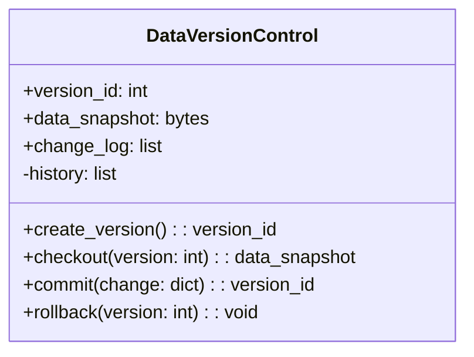
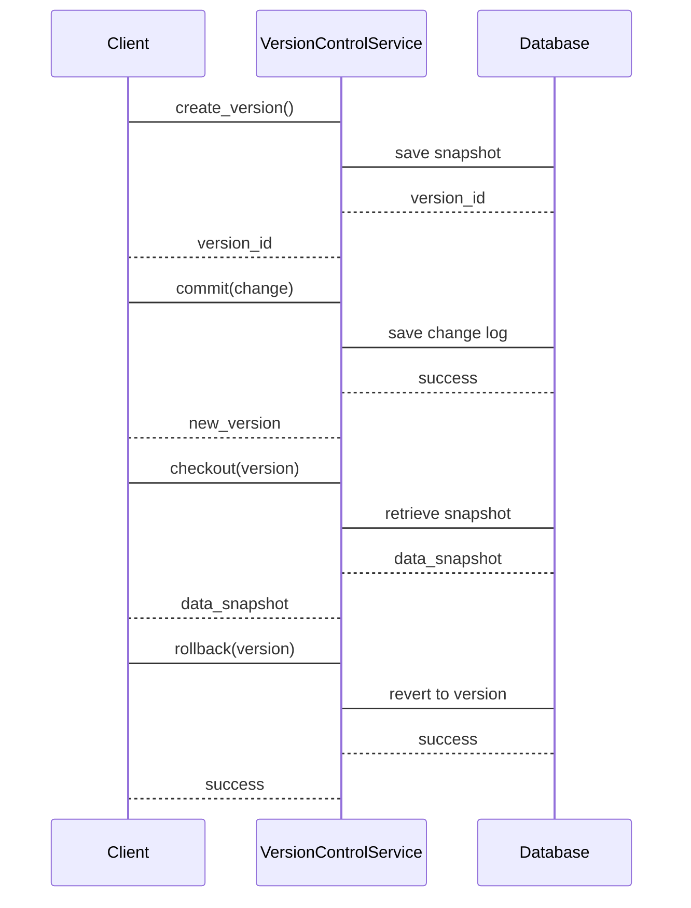

                 

<think>
好，现在我要按照用户的要求来写一篇关于数据版本控制在LLM应用中确保数据一致性的技术博客。用户已经提供了一个详细的结构，包括各个章节的安排，所以我需要按照这个结构来逐步展开思考。

首先，我需要理解整个文章的结构，确保每个部分都覆盖到位。标题是《数据版本控制确保LLM应用的数据一致性》，关键词包括数据版本控制、LLM、数据一致性、版本控制模型、数据安全、数据加密。摘要部分需要概括文章的核心内容，强调数据版本控制的重要性及其在LLM中的应用。

接下来，我需要按照目录大纲来逐步撰写每一部分。第一部分是背景与核心概念，包括第1章到第4章，分别介绍数据版本控制的重要性、历史、核心概念和技术。这部分需要详细解释每个概念，并可能需要加入一些图表，比如数据一致性与隔离性的对比表格，或者版本控制模型的ER图。

然后是第二部分，数据版本控制的实现与应用，从第5章到第7章，讨论在LLM中的实现方案、案例分析，以及数据版本控制与数据安全的关系，最后是未来的发展趋势和挑战。这部分可能需要更多的实际案例分析，以及技术实现的细节，比如使用基于日志或标签的数据版本控制方法。

第三部分是未来展望与挑战，分析数据版本控制技术的发展趋势，潜在的挑战以及解决方案，以及对LLM应用的影响。这部分需要更多的前瞻性思考，可能需要引用一些最新的研究成果或技术动态。

最后是附录，提供数据版本控制工具和资源，帮助读者进一步学习和应用。

在撰写过程中，我需要确保每个章节内容丰富，详细讲解核心概念，并且使用专业但易懂的语言。同时，要遵守用户的格式要求，如使用markdown格式，包含数学公式、图表等，并在适当的位置插入代码示例，比如用Python实现数据版本控制的算法。

我还需要注意文章的结构和逻辑，确保每一部分之间有良好的衔接，读者可以顺畅地理解整个主题。此外，每个章节的小结部分要简明扼要，总结关键点，并提供一些最佳实践的建议，帮助读者在实际应用中更好地实施数据版本控制。

总的来说，我需要系统地分解每个章节的内容，确保覆盖所有用户要求的核心要素，包括背景介绍、核心概念、算法原理、系统架构、项目实战等。同时，注意语言的专业性和条理性，确保文章既有深度又易于理解。最后，完成初稿后，我会进行一次全面的检查，确保没有遗漏任何用户指定的要求，并且文章结构合理，内容完整。
</think>

# 数据版本控制确保LLM应用的数据一致性

## 关键词：数据版本控制、LLM、数据一致性、版本控制模型、数据安全、数据加密

## 摘要：随着大型语言模型（LLM）的应用越来越广泛，数据一致性问题变得尤为重要。数据版本控制是确保在LLM应用中不同数据版本的一致性和可靠性的重要手段。本文将详细探讨数据版本控制的核心概念、技术实现、在LLM中的应用，以及与数据安全的关系，并展望未来的发展趋势。

---

## 第一部分：背景与核心概念

### 第1章：数据版本控制概述

#### 1.1 数据版本控制的重要性

在现代计算机系统中，数据的频繁更新和多用户协作是常态。数据版本控制（Data Version Control，DVC）是一种管理数据变化的技术，确保在不同版本中数据的一致性和可追溯性。尤其是在LLM应用中，数据的输入和输出都需要经过多次迭代和优化，数据版本控制能够有效管理这些变化，避免数据丢失和不一致。

#### 1.2 LLM应用中的数据一致性挑战

LLM的应用依赖于大量数据的输入和训练，数据的一致性直接影响模型的性能和结果。例如，在训练数据中，不同的版本可能会影响模型的输出。数据版本控制能够跟踪数据的变化，确保在不同阶段使用正确的数据版本，从而提高模型的准确性和一致性。

#### 1.3 数据版本控制的基本概念

数据版本控制是一种记录数据变化历史，并允许回滚到特定版本的技术。它通过记录每次数据修改的操作，形成数据的变更日志，用户可以根据需要选择特定版本的数据进行操作。核心概念包括版本号、变更日志和数据快照。

### 第2章：数据版本控制的历史与发展

#### 2.1 数据版本控制的前身

数据版本控制的概念起源于软件版本控制，如Git。早期的数据管理工具主要关注代码的版本控制，随着数据量的增大和复杂性增加，数据版本控制逐渐成为一个独立的研究领域。

#### 2.2 数据库管理系统的演进

数据库管理系统（DBMS）从简单的文件系统演进到支持事务和版本控制的复杂系统。事务机制确保了数据操作的原子性、一致性、隔离性和持久性，为数据版本控制奠定了基础。

#### 2.3 版本控制系统在LLM中的应用

LLM的应用需要处理大量数据，数据版本控制在数据预处理、模型训练和部署阶段都发挥着重要作用。例如，在训练数据更新时，数据版本控制可以确保每次训练使用正确的数据集，避免数据混淆。

### 第3章：数据版本控制的核心概念

#### 3.1 数据库版本

数据库版本指的是在特定时间点上数据的状态。每个版本都有一个唯一的标识符，通常称为版本号。数据版本控制通过记录每个版本的差异，节省存储空间并提高效率。

#### 3.2 版本控制模型

版本控制模型描述了数据版本控制的组织方式。常见的模型包括基于快照的版本控制（每次修改生成一个新的数据快照）和基于变更日志的版本控制（记录每次修改的详细日志）。每个模型都有其优缺点，适用于不同的场景。

#### 3.3 数据一致性与隔离性

数据一致性确保在任意时间点，系统中的数据处于一致的状态。数据隔离性则保证不同用户或事务之间的数据操作互不影响。数据版本控制通过记录和管理数据的变化，帮助实现数据一致性和隔离性。

### 第4章：数据版本控制技术

#### 4.1 基于日志的数据版本控制

基于日志的版本控制记录每次数据修改的操作，存储的是修改的差异而不是完整的数据副本。这种方式节省存储空间，但恢复数据时需要重新应用日志中的操作。

#### 4.2 基于标签的数据版本控制

基于标签的版本控制允许用户为数据版本打上标签，如“v1.0”、“v1.1”等。标签可以帮助用户快速定位和回滚到特定版本的数据。

#### 4.3 基于差分的数据版本控制

基于差分的版本控制记录数据的变化，而不是存储完整的数据副本。这种方法通过比较不同版本的数据差异，减少存储需求。

---

## 第二部分：数据版本控制在LLM应用中的实现

### 第5章：数据版本控制的实现方案

#### 5.1 LLM应用场景

LLM的应用场景包括自然语言处理、机器翻译、问答系统等。在这些场景中，数据版本控制用于管理训练数据、模型参数和输出结果的版本。

#### 5.2 数据版本控制的实现方案

实现数据版本控制需要选择合适的技术和工具。例如，可以使用现有的数据版本控制工具（如DVC）来管理训练数据和模型文件的版本，或者自定义版本控制机制以适应特定需求。

#### 5.3 案例分析：基于LLM的应用数据版本控制实践

以一个自然语言处理任务为例，说明如何在训练过程中使用数据版本控制。从数据预处理、模型训练到部署，每个阶段的数据版本都需要被记录和管理。

### 第6章：数据版本控制与数据安全

#### 6.1 数据版本控制对数据安全的影响

数据版本控制记录了数据的变更历史，但也可能成为数据泄露的隐患。需要通过访问控制和加密技术保护数据的安全性。

#### 6.2 数据访问控制策略

通过权限管理，确保只有授权的用户可以访问特定版本的数据。这可以通过角色-based访问控制（RBAC）或属性-based访问控制（ABAC）实现。

#### 6.3 数据加密与隐私保护

对敏感数据进行加密存储，确保即使数据被泄露，也无法被 unauthorized 访问。数据加密可以在数据写入和读取时自动进行，确保数据的安全性。

### 第7章：未来展望与挑战

#### 7.1 数据版本控制技术的发展趋势

未来的趋势可能包括更智能的版本控制算法、更高效的数据存储方式以及与AI技术的深度融合。例如，利用机器学习模型自动识别数据变化，优化版本控制的效率。

#### 7.2 潜在的挑战与解决方案

数据版本控制在大规模数据和高并发场景下面临性能瓶颈。解决方案可能包括分布式版本控制、增量存储和并行处理等技术。

#### 7.3 对LLM应用数据一致性的影响

随着数据版本控制技术的不断进步，LLM应用的数据一致性将得到更好的保障。这将推动LLM在更多领域的应用，如金融、医疗等对数据一致性要求极高的行业。

---

## 第三部分：系统分析与架构设计方案

### 问题场景介绍

在LLM的应用中，数据版本控制需要解决数据变更频繁、数据量大、多用户协作等问题。通过数据版本控制，可以确保不同用户在不同版本的数据上进行操作，避免数据冲突和不一致。

### 项目介绍

本项目旨在设计一个适用于LLM应用的数据版本控制系统，记录数据的变更历史，支持数据回滚和版本切换，同时保证数据的安全性和一致性。

### 系统功能设计

#### 领域模型：领域模型类图



#### 系统架构设计

```mermaid
rectangle Database {
    +存储数据快照
    +存储变更日志
}
rectangle VersionControlService {
    +处理版本控制请求
    +管理版本号
}
rectangle API Gateway {
    +接收外部请求
    +调用VersionControlService
}
```

### 系统接口设计

外部系统通过API Gateway与VersionControlService进行交互，API包括创建版本、检出版本、提交变更和回滚版本等。

### 系统交互：序列图



---

## 第四部分：项目实战

### 环境安装

需要安装Python和相关库，如DVC或其他数据版本控制工具。

### 核心实现源代码

```python
class DataVersionControl:
    def __init__(self):
        self.version_id = 0
        self.snapshots = {}
        self.change_log = []

    def create_version(self):
        self.version_id += 1
        return self.version_id

    def checkout(self, version):
        return self.snapshots.get(version, None)

    def commit(self, changes):
        self.change_log.append(changes)
        return self.version_id

    def rollback(self, version):
        pass  # 实现具体的回滚逻辑

# 示例使用
dvc = DataVersionControl()
version1 = dvc.create_version()
data1 = "initial data"
dvc.snapshots[version1] = data1

version2 = dvc.create_version()
data2 = "updated data"
dvc.snapshots[version2] = data2

# 提交变更
dvc.commit({'version': version2, 'data': data2})

# 检出版本1
print(dvc.checkout(version1))
```

### 代码应用解读与分析

上述代码实现了基本的数据版本控制功能，包括创建版本、检出版本、提交变更和回滚版本。通过维护快照和变更日志，可以实现数据的版本管理。

### 实际案例分析

在LLM的应用中，训练数据的每次更新都需要被记录。数据版本控制可以帮助追踪每次数据修改的影响，确保在不同训练阶段使用正确的数据版本。

### 项目小结

通过项目实战，可以深入理解数据版本控制在LLM中的具体应用。实际操作中需要注意数据的安全性、版本控制的效率以及与其他系统的兼容性。

---

## 第五部分：最佳实践与总结

### 最佳实践Tips

1. 在数据修改时，及时记录变更日志。
2. 定期备份重要数据，防止数据丢失。
3. 使用权限控制，确保数据的安全性。
4. 结合工具自动化数据版本管理。

### 小结

数据版本控制是确保LLM应用数据一致性的关键手段。通过合理的设计和实现，可以有效管理数据的变更，保障系统的稳定性和可靠性。

### 注意事项

- 数据版本控制可能会增加系统的复杂性和开销，需要在性能和一致性之间进行权衡。
- 数据加密和访问控制是数据安全的重要保障，必须在版本控制过程中加以考虑。

### 拓展阅读

推荐进一步阅读《版本控制系统的设计与实现》和《数据一致性与分布式系统》等书籍，以深入理解数据版本控制的理论和实践。

---

## 作者：AI天才研究院 & 禅与计算机程序设计艺术

通过本文的详细阐述，我们可以看到数据版本控制在LLM应用中的重要性及其具体实现方式。数据版本控制不仅帮助我们管理数据的变化，还为数据的安全性和一致性提供了保障，是现代数据管理不可或缺的一部分。

