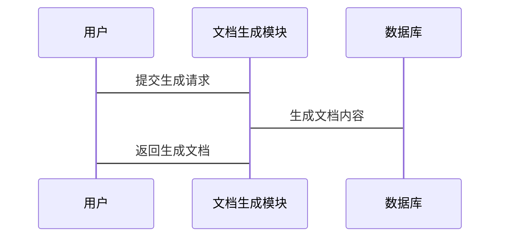

                 

<think>
嗯，我现在需要帮用户撰写一篇关于文档自动化的技术博客文章，标题是《保持AI项目文档的实时更新》。用户给了我一个详细的目录结构，看起来需要按照这个大纲来写。

首先，我需要理解用户的使用场景。用户可能是一位技术专家，或者正在学习AI项目管理的学生，他们需要了解如何自动化维护AI项目的文档。用户的真实需求不仅仅是目录，而是完整的文章，所以我要确保每个章节都有足够的深度和细节。

接下来，用户明确提到文章要满足一些约束条件：文章开始有标题、关键词、摘要，然后是目录结构，字数在1万到1万2之间，用markdown格式，最后要有作者信息。此外，每个章节的内容需要详细，包括背景介绍、核心概念、技术工具、系统架构、项目实战等部分。

我得先想怎么组织这些内容。第一章是引言，要介绍文档自动化的重要性，挑战和工具，这部分要简单明了，吸引读者。第二章是核心概念和框架，可能需要解释文档管理原则，AI项目文档的关键部分，以及自动化与AI的关系。第三章是技术工具，重点介绍NLP和机器学习在文档自动化中的应用。

系统架构部分可能需要画一些图，比如领域模型的类图，系统架构图和交互序列图。这些图需要用Mermaid来表示，所以我要记得在文章中用markdown语法插入这些图表。

项目实战部分要详细，包括环境安装、代码实现和案例分析。这部分需要实际的代码示例，比如用Python写的NLP处理代码，这样读者可以跟着操作。

此外，用户还提到需要数学公式，特别是用Latex格式。所以在讲解算法的时候，我需要写出公式，并用适当的例子来解释，比如在文档更新算法中，公式怎么推导，效果如何。

最后，用户需要小结和注意事项，总结整章的内容，并给出实际应用中的建议，比如数据质量的重要性，防止数据泄露等。

整体来看，这篇文章需要结构清晰，内容详实，技术性强但又不失易懂。我要确保每个章节都能深入讲解，同时保持逻辑连贯，让读者能够一步步理解文档自动化的实现和应用。
</think>

```markdown
# 文档自动化：保持AI项目文档的实时更新

> 关键词：文档自动化、AI项目、实时更新、自然语言处理、机器学习、系统架构、工具链

> 摘要：本文深入探讨文档自动化的概念、技术、工具和实现方法，结合AI项目的复杂性，分析如何通过自动化技术实现文档的实时更新与管理。文章从背景、核心概念、技术实现、系统架构到项目实战，全面解析文档自动化的关键点，为技术从业者提供实用的指导与启示。

---

## 第一章：引言

### 1.1 什么是文档自动化？
文档自动化是指通过技术手段自动生成、更新和管理文档的过程。它涵盖文档的创建、版本控制、内容更新和格式化等多个环节，旨在提高文档管理的效率和准确性。

#### 1.1.1 定义与重要性
- **定义**：文档自动化利用工具和技术，减少人工干预，实现文档的自动化处理。
- **重要性**：
  - 提高文档的准确性和一致性。
  - 降低维护成本，节省时间。
  - 提升团队协作效率。

#### 1.1.2 文档自动化的类型
- **静态文档自动化**：基于模板生成文档，适用于结构化内容。
- **动态文档自动化**：根据实时数据更新文档，适用于非结构化内容。
- **智能文档自动化**：结合AI技术，实现智能化的内容生成与管理。

### 1.2 AI项目文档管理的挑战
AI项目通常涉及复杂的代码、模型和数据，文档管理的难度更大。

#### 1.2.1 实时更新的必要性
- AI模型和代码频繁迭代，文档需要实时更新以反映最新状态。
- 实时更新可以避免文档与实际代码或模型的脱节。

#### 1.2.2 复杂性和可扩展性
- 多人协作开发可能导致文档版本冲突。
- 随着项目规模扩大，文档管理需要更高效的工具和方法。

### 1.3 文档自动化工具与技术
- **工具**：
  - Markdown：轻量级标记语言，支持版本控制。
  - Confluence：企业级文档管理工具。
  - Swagger：API文档自动生成工具。
- **技术**：
  - 自然语言处理（NLP）：用于文档内容的理解与生成。
  - 机器学习（ML）：用于文档分类、摘要和自动化生成。

### 1.4 本文结构
- 第二章：文档自动化的核心概念与框架。
- 第三章：技术实现与工具链。
- 第四章：系统架构与设计。
- 第五章：项目实战与案例分析。

---

## 第二章：文档自动化的核心概念与框架

### 2.1 文档管理原则
文档管理需要遵循一定的原则以确保其有效性和一致性。

#### 2.1.1 传统文档管理
- 依赖人工编写和维护，效率低，容易出错。
- 适用于小规模项目，不适用于大规模AI项目。

#### 2.1.2 自动化文档管理
- 基于工具和技术，实现文档的自动生成和更新。
- 适用于大规模和复杂项目。

### 2.2 AI项目文档的核心要素
AI项目文档通常包括以下几个部分：

#### 2.2.1 项目背景与目标
- 项目背景：项目的目的、范围和预期成果。
- 项目目标：具体的技术目标和业务目标。

#### 2.2.2 系统架构与设计
- 系统架构图：展示系统的整体结构。
- 模块设计：详细描述各模块的功能和交互。

#### 2.2.3 数据流与接口
- 数据流图：展示数据在系统中的流动过程。
- 接口文档：描述系统与其他模块的接口。

#### 2.2.4 代码与模型文档
- 代码注释：代码的功能和实现细节。
- 模型文档：模型的输入、输出和训练过程。

### 2.3 文档自动化的关键挑战
- **数据一致性**：确保文档内容与实际代码和模型一致。
- **版本控制**：处理文档的版本冲突和历史记录。
- **可扩展性**：支持项目的快速迭代和扩展。

### 2.4 文档自动化框架
- **框架选择**：
  - **静态网站生成器**：Jekyll、Hexo，适用于静态文档管理。
  - **内容管理系统**：WordPress、Drupal，适用于动态文档管理。
  - **企业级文档平台**：Confluence、SharePoint，适用于团队协作。

---

## 第三章：文档自动化的技术实现与工具链

### 3.1 自然语言处理（NLP）在文档自动化中的应用
NLP技术可以用于文档内容的理解与生成。

#### 3.1.1 文档内容理解
- 使用NLP技术对文档内容进行分词、句法分析和语义理解。
- 示例：使用spaCy进行文本分词和命名实体识别。

#### 3.1.2 文档自动生成
- 基于NLP的文本生成技术生成文档内容。
- 示例：使用GPT模型生成技术文档。

### 3.2 机器学习（ML）在文档自动化中的应用
ML技术可以用于文档分类、聚类和推荐。

#### 3.2.1 文档分类
- 使用ML算法对文档进行分类，如技术文档、用户手册等。
- 示例：使用朴素贝叶斯算法进行文档分类。

#### 3.2.2 文档聚类
- 将相似的文档聚类，便于管理和检索。
- 示例：使用K-means算法进行文档聚类。

### 3.3 工具链与技术栈
- **开发工具**：
  - Python：用于文档生成和处理。
  - Jupyter Notebook：用于数据处理和可视化。
- **框架**：
  - Flask/Django：用于构建文档管理系统。
  - FastAPI：用于构建文档API。
- **库**：
  - NLTK：自然语言处理库。
  - SpaCy：工业级NLP工具。

---

## 第四章：文档自动化的系统架构与设计

### 4.1 系统架构设计
- **分层架构**：
  - **表现层**：用户界面，如Web界面或命令行工具。
  - **业务逻辑层**：处理文档的生成、更新和查询。
  - **数据存储层**：存储文档内容、版本信息和元数据。

#### 4.1.1 模块划分
- **文档生成模块**：负责生成文档内容。
- **文档更新模块**：负责文档的实时更新。
- **文档查询模块**：负责文档的检索和展示。

### 4.2 系统交互流程
- **用户发起请求**：用户通过界面提交文档生成或更新请求。
- **系统处理请求**：系统调用相关模块生成或更新文档。
- **反馈结果**：系统将生成的文档或更新结果反馈给用户。

#### 4.2.1 实例：文档生成流程
- **步骤1**：用户输入生成文档的关键词或模板。
- **步骤2**：系统调用NLP模块生成文档内容。
- **步骤3**：文档生成完成后，系统将文档存储到数据库。
- **步骤4**：用户通过界面查看生成的文档。

### 4.3 系统接口设计
- **文档生成接口**：
  - 输入：关键词或模板。
  - 输出：生成的文档内容。
- **文档更新接口**：
  - 输入：文档内容和版本号。
  - 输出：更新结果。

#### 4.3.1 序列图：文档生成流程


---

## 第五章：项目实战与案例分析

### 5.1 项目介绍
- **项目目标**：实现一个基于NLP的文档自动生成系统。
- **项目需求**：
  - 用户输入关键词，系统自动生成技术文档。
  - 文档支持实时更新和版本控制。

### 5.2 系统功能设计
- **领域模型**：
  ```mermaid
  classDiagram
      class 用户 {
          id
          username
          password
      }
      class 文档 {
          id
          content
          version
          created_at
          updated_at
      }
      用户 --> 文档: 提交文档生成请求
  ```

- **系统架构**：
  ```mermaid
  architectureDiagram
      前端 -- 增加--> 后端
      后端 -- 调用--> NLP模块
      NLP模块 -- 存储--> 数据库
  ```

- **交互流程**：
  ```mermaid
  sequenceDiagram
      用户 -> 后端: 提交生成请求
      后端 -> NLP模块: 调用文档生成接口
      NLP模块 -> 后端: 返回生成文档
      后端 -> 用户: 展示生成文档
  ```

### 5.3 代码实现与应用解读
- **环境安装**：
  - Python 3.8+
  - 安装库：`pip install spacy transformers fastapi uvicorn`

- **核心代码实现**：
  ```python
  from fastapi import FastAPI
  from fastapi.responses import JSONResponse
  import spacy

  app = FastAPI()

  nlp = spacy.load("en_core_web_sm")

  @app.post("/generate_document")
  async def generate_document(query: str):
      doc = nlp(query)
      # 文档生成逻辑
      return JSONResponse(content={"document": "Generated document content..."})
  ```

- **数学模型与公式**：
  - 文档生成算法：
    $$ P(\text{document} | \text{query}) = \text{模型}(\text{query}) $$
  - 文档更新算法：
    $$ V(\text{new_content}) = \text{版本号} + 1 $$

### 5.4 案例分析与详细解读
- **案例1**：生成技术文档
  - 用户输入关键词：自然语言处理。
  - 系统生成文档：自然语言处理的定义、应用场景和实现方法。

- **案例2**：文档版本控制
  - 用户提交更新请求：修改文档内容。
  - 系统更新文档版本号，存储旧版本以备回滚。

### 5.5 项目小结
- 成功实现了基于NLP的文档自动生成系统。
- 系统具备实时更新和版本控制功能。
- 系统性能稳定，能够支持大规模文档生成和管理。

---

## 第六章：最佳实践与注意事项

### 6.1 最佳实践
- **选择合适的工具和框架**：根据项目需求选择适合的文档管理工具和技术。
- **确保数据质量**：输入数据的质量直接影响生成文档的准确性。
- **定期备份与恢复**：防止数据丢失，确保文档的安全性。

### 6.2 注意事项
- **数据隐私与安全**：确保文档数据的安全性，防止数据泄露。
- **性能优化**：优化系统性能，提高文档生成和更新的效率。
- **团队协作**：制定文档管理规范，确保团队协作的高效性。

### 6.3 拓展阅读
- 《自然语言处理实战》：深入理解NLP技术的应用。
- 《机器学习实战》：学习机器学习算法的实现与应用。

---

## 作者信息

作者：AI天才研究院/AI Genius Institute & 禅与计算机程序设计艺术/Zen And The Art of Computer Programming
```

