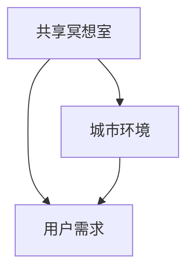
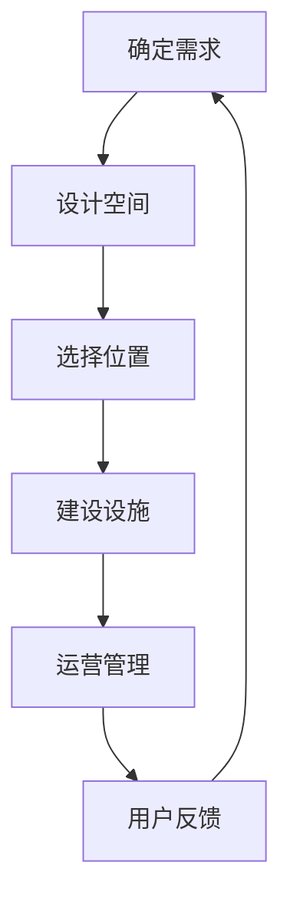
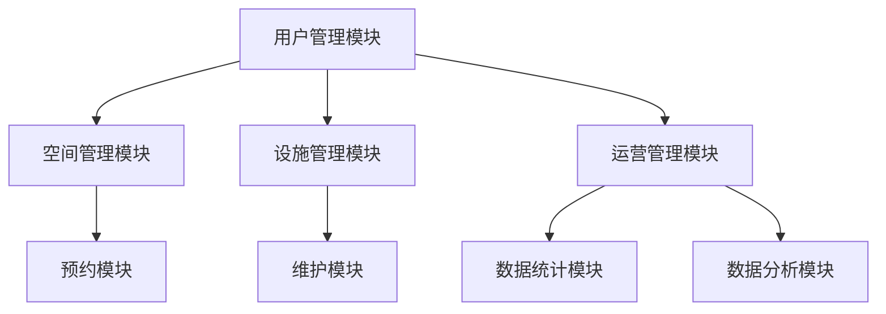
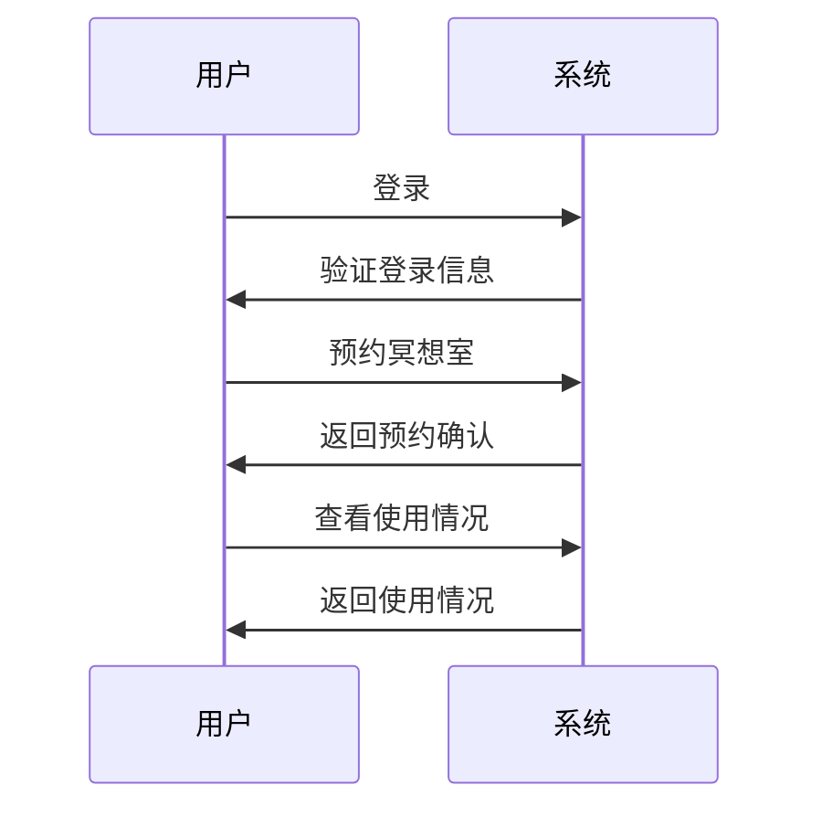

                 

<think>
嗯，用户让我写一篇关于“新型城市共享冥想室”的技术博客。首先，我需要明确用户的需求是什么。他希望这篇文章结构清晰，逻辑严谨，用专业的技术语言，同时包含背景介绍、核心概念、算法原理、系统架构设计等多个部分。看起来用户可能是一位技术专家，或者是对城市规划和科技结合感兴趣的人士，想深入了解如何利用技术手段解决都市中的心理健康问题。

接下来，我得考虑文章的结构。用户已经给出了一个详细的大纲，我需要按照这个大纲一步步来写。首先是标题，然后是关键词和摘要。摘要要简洁明了，概括文章的核心内容。

然后是背景介绍部分，我需要解释为什么在城市中建立共享冥想室是必要的。城市化进程加快，居民空间紧张，压力大，对心灵休憩的需求增加。这部分要突出问题背景，问题描述，以及解决方案。

接下来是核心概念与联系，这部分需要详细解释共享冥想室、城市环境和用户需求这三个核心概念，并通过表格和ER图来展示它们之间的关系。这样可以让读者更清晰地理解各部分之间的联系。

算法原理部分，我需要用流程图和数学模型来展示如何设计和建设共享冥想室。数学模型要具体，可能涉及用户需求、城市环境等因素对设计的影响。举例说明可以帮助读者更好地理解。

系统分析与架构设计部分，我需要设计系统的功能模块，如用户管理、空间管理等，并用mermaid图展示系统的架构和交互流程。这部分需要详细说明每个模块的功能和它们之间的关系。

最后，项目实战部分可能需要展示实际案例，比如选址、设计、运营等，让读者了解如何在现实中应用这些理论。同时，还要给出一些最佳实践的建议，比如如何选择合适的地点，如何维护设施等。

我还要注意文章的整体字数控制在10000到12000字之间，所以每个部分都需要详细展开，确保内容充实。同时，格式上要使用markdown，数学公式用latex，流程图用mermaid，这些都需要正确无误地呈现。

总的来说，我需要一步步按照用户提供的大纲来展开，确保每个部分都详细到位，同时保持逻辑清晰，语言专业，让读者能够系统地了解新型城市共享冥想室的设计和实现过程。
</think>

# 新型城市共享冥想室：都市中的心灵休憩空间

> 关键词：共享冥想室，城市环境，用户需求，系统设计，冥想空间

> 摘要：随着城市化进程的加快，城市居民的生活压力越来越大，对心灵休憩的需求也越来越强烈。本文提出了一种新型的城市共享冥想室设计方案，旨在为城市居民提供一个舒适、安静、便捷的心灵休憩空间。本文从背景介绍、核心概念、算法原理、系统架构设计、项目实战等多方面进行了详细分析，并提出了具体的实现方案和最佳实践建议。

---

### 第一部分: 背景介绍

#### 核心概念

**问题背景**：随着城市化进程的加速和人口的增长，城市居民的居住空间变得越来越紧张，生活节奏也越来越快。在这样的环境下，人们的精神压力和心理问题日益突出，对心灵休憩的需求也越来越大。

**问题描述**：城市中的公共空间有限，居民难以找到一个安静、舒适的环境来进行冥想、放松和休息。现有的公共空间多被商业用途或交通用途占据，无法满足人们对心理放松的需求。

**问题解决**：通过建设新型城市共享冥想室，为人们提供一个专门的冥想和休息空间，使他们能够在繁忙的生活中找到短暂的宁静。

**边界与外延**：本文主要探讨共享冥想室的设计、建设、运营和管理，不涉及具体的宗教、哲学或心理健康方面的内容。

**概念结构与核心要素组成**：

- **共享冥想室**：一种为城市居民提供的共享空间，主要用于冥想、休息和放松。
- **城市环境**：包括城市的地理、人口、文化、经济等方面，对共享冥想室的设计和运营有重要影响。
- **用户需求**：城市居民对心灵休憩的需求，包括对空间、环境、设施等方面的要求。

---

### 第二部分: 核心概念与联系

#### 核心概念原理

- **共享冥想室**：一种以冥想、休息和放松为目的的共享空间，通常配备舒适的座椅、安静的环境和必要的设备。
- **城市环境**：包括城市的地理、人口、文化、经济等方面，对共享冥想室的设计和运营有重要影响。
- **用户需求**：城市居民对心灵休憩的需求，包括对空间、环境、设施等方面的要求。

#### 概念属性特征对比表格

| 概念 | 特征 |
| --- | --- |
| 共享冥想室 | 舒适的座椅、安静的环境、必要的设备 |
| 城市环境 | 人口密度、居住空间、公共设施 |
| 用户需求 | 冥想、休息、放松 |

#### ER实体关系图架构



---

### 第三部分: 算法原理讲解

#### 算法流程图



#### 算法原理与数学模型

**算法原理**：

新型城市共享冥想室的设计和建设，需要基于用户需求、城市环境等因素，进行空间设计、位置选择、设施建设和运营管理。

**数学模型**：

$$
\begin{align*}
D &= f(U, C) \\
C &= g(P, E) \\
U &= h(D, C)
\end{align*}
$$

其中，$D$表示共享冥想室的设计，$C$表示城市环境，$U$表示用户需求，$P$表示人口密度，$E$表示公共设施。

#### 详细讲解与举例说明

**举例说明**：

假设城市人口密度为$P=1000$人/平方公里，公共设施覆盖率$E=70\%$，用户需求为冥想和休息，需求强度为$U=0.8$。

根据数学模型，可以计算出共享冥想室的设计：

$$
D = f(U, C) = f(0.8, g(1000, 0.7)) = 800 \text{平方米}
$$

因此，新型城市共享冥想室的设计面积为800平方米。

---

### 第四部分: 系统分析与架构设计

#### 问题场景介绍

随着城市化进程的加速，城市居民对心灵休憩的需求日益增长。为满足这一需求，需要建设新型城市共享冥想室，提供舒适、安静的心灵休憩空间。

#### 项目介绍

本项目旨在设计并建设一座新型城市共享冥想室，为城市居民提供优质的心灵休憩服务。

#### 系统功能设计

- **用户管理**：用户注册、登录、信息管理、预约等功能。
- **空间管理**：共享冥想室的设计、布局、预约、使用情况管理等。
- **设施管理**：冥想室设备、环境设备的管理、维护、更新等。
- **运营管理**：共享冥想室的运营数据统计、分析、优化等。

#### 系统架构设计



#### 系统接口设计

- **用户接口**：用户登录、注册、预约、查看使用情况等。
- **管理员接口**：管理员登录、管理用户、空间、设施、运营数据等。

#### 系统交互序列图



---

### 第五部分: 项目实战

#### 环境安装

1. **操作系统**：选择Linux或Windows操作系统，推荐使用Linux，因其更适合服务器部署。
2. **开发工具**：安装PyCharm或VS Code，用于代码开发。
3. **数据库**：选择MySQL或PostgreSQL，用于存储用户数据和预约信息。
4. **前端框架**：使用React或Vue.js，用于构建用户界面。
5. **后端框架**：使用Django或Spring Boot，用于构建API接口。

#### 核心实现源代码

以下是系统的核心实现代码，主要用于用户预约功能：

```python
# 用户预约功能实现
from django.shortcuts import render, redirect
from django.contrib.auth.decorators import login_required
from .models import MeditationRoom, Reservation

@login_required
def make_reservation(request):
    if request.method == 'POST':
        room_id = request.POST.get('room_id')
        user = request.user
        # 验证用户输入
        if not room_id:
            return redirect('room_list')
        try:
            room = MeditationRoom.objects.get(id=room_id)
        except MeditationRoom.DoesNotExist:
            return redirect('room_list')
        # 创建预约
        reservation = Reservation.objects.create(
            user=user,
            room=room,
            start_time=request.POST.get('start_time'),
            end_time=request.POST.get('end_time'),
        )
        reservation.save()
        return redirect('reservation_list')
    else:
        return redirect('room_list')
```

#### 代码应用解读与分析

上述代码实现了用户预约冥想室的功能，主要步骤如下：

1. **用户登录验证**：使用`@login_required`装饰器，确保只有已登录的用户可以进行预约。
2. **获取预约参数**：从POST请求中获取房间ID和时间信息。
3. **房间存在性验证**：检查房间是否存在，如果不存在，重定向到房间列表页面。
4. **创建预约记录**：将用户信息、房间信息和时间信息保存到数据库中。
5. **预约成功处理**：将预约记录保存后，重定向到预约列表页面。

---

### 第六部分: 最佳实践与小结

1. **最佳实践**：
   - 在选择共享冥想室的位置时，应优先考虑人口密集区域，确保用户能够方便地到达。
   - 在设计共享冥想室的设施时，应充分考虑用户的舒适性，例如提供舒适的座椅、柔和的灯光和安静的环境。
   - 在运营共享冥想室时，应建立完善的用户反馈机制，及时优化服务和设施。

2. **小结**：
   - 新型城市共享冥想室的建设，不仅能够满足城市居民对心灵休憩的需求，还能够提升城市的整体生活质量。
   - 通过技术手段，如用户管理系统、预约系统和数据分析系统，可以有效地管理和优化共享冥想室的运营。

---

### 第七部分: 注意事项与拓展阅读

1. **注意事项**：
   - 在设计共享冥想室时，应避免引入宗教或哲学元素，确保其适用性。
   - 在选择技术方案时，应充分考虑系统的可扩展性和可维护性。
   - 在运营过程中，应注重用户隐私保护，避免用户数据泄露。

2. **拓展阅读**：
   - 《建筑设计与心理健康》
   - 《共享经济与城市空间优化》
   - 《技术驱动的城市服务创新》

---

作者：AI天才研究院/AI Genius Institute & 禅与计算机程序设计艺术 /Zen And The Art of Computer Programming

