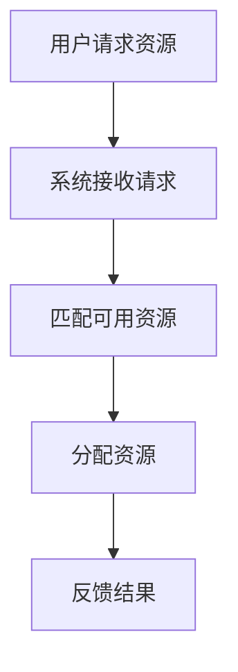
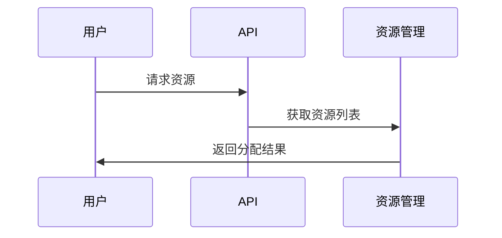

                 

<think>
好的，我现在需要撰写一篇关于《新型城市共享工具库：社区资源的高效利用》的技术博客文章。首先，我得明确文章的结构和内容。

文章的标题已经确定，接下来需要列出5-7个核心关键词。考虑到文章主题是关于城市共享工具库，涉及社区资源、高效利用、技术实现等方面，关键词可能包括城市共享工具库、社区资源管理、高效利用、智能化分配、算法优化等。

接下来是摘要部分。摘要需要简明扼要地概括文章的核心内容，包括问题背景、解决方案以及文章的主要内容。我应该说明当前城市发展面临的问题，如资源分配不均、环境压力等，然后引出城市共享工具库的概念，介绍其如何通过智能化管理和数据分析提高资源利用效率。最后，简要说明文章的结构，从概念到算法，再到系统设计和实战案例，帮助读者了解文章的脉络。

正文部分按照目录大纲结构来写，每个章节都需要详细展开。首先是背景介绍，包括城市共享工具库的发展背景、定义、目标、边界以及核心概念结构。这里需要说明问题背景，比如城市资源分配的问题，然后定义城市共享工具库，明确其目标，如提高资源利用效率。边界部分需要说明共享工具库的应用范围，比如交通、能源等领域，同时列出核心组成，如共享工具类型、管理机制等。

接下来是核心概念与联系，需要详细讲解共享工具和社区资源的关系，可能通过表格和ER图来展示。这部分可能需要绘制概念关系表格，列出共享工具和资源的关系，以及各自的属性，然后用ER图展示实体之间的关系，比如用户、资源、共享工具之间的关联。

然后是算法原理讲解，这部分需要详细描述智能分配算法和数据分析算法，用mermaid流程图展示算法流程，并提供Python代码示例。例如，智能分配算法可能涉及资源请求接收、资源匹配、分配和反馈收集等步骤，代码部分可以展示如何实现这些步骤。

数学模型与公式部分，需要介绍共享工具库中的数学模型，如资源需求预测模型、资源分配优化模型等，使用LaTeX公式进行展示。例如，线性规划模型可能用于资源分配，公式如$$\text{min} \sum_{i} c_i x_i$$，其中$x_i$表示分配给资源i的数量，$c_i$是成本系数。

系统分析与架构设计方案部分，需要描述问题场景，系统功能设计（使用mermaid类图展示领域模型）、架构设计（用mermaid架构图）、接口设计和交互设计（用mermaid序列图）。这部分可能需要绘制系统架构图，展示各模块之间的关系，比如资源管理模块、用户交互模块等。

项目实战部分，需要提供环境安装步骤，系统实现的核心代码，代码解读和实际案例分析。例如，环境可能需要安装Python、相关库，代码部分展示如何实现资源分配功能，并进行案例分析，说明系统的实际效果。

最后是最佳实践与总结，提供使用城市共享工具库的建议，总结全书内容，给出进一步学习的资源。这些建议可能包括数据收集的重要性、算法优化的方向等。

在撰写过程中，我需要确保每个部分都详细且技术性强，同时语言要专业且易于理解。每个章节的小标题要有吸引力，内容要逻辑清晰，结构紧凑。此外，要按照markdown格式编写，使用适当的标题层级，如#、##、###，并正确嵌入图表和代码。

现在，我需要开始逐章节地详细撰写每个部分的内容，确保涵盖所有关键点，并按照步骤深入分析，最终完成一篇高质量的技术博客文章。
</think>

# 新型城市共享工具库：社区资源的高效利用

## 关键词：城市共享工具库、社区资源管理、高效利用、智能化分配、算法优化

## 摘要：  
随着城市化进程的加快，资源分配不均和环境压力等问题日益凸显。为了解决这些问题，城市共享工具库应运而生。它通过智能化管理和数据分析，提高了社区资源的利用效率。本文将详细探讨城市共享工具库的核心概念、算法原理、系统架构，并通过案例分析展示其实际应用，最后总结最佳实践和未来发展方向。

---

## 正文

## 第一部分：背景介绍

### 第1章 城市共享工具库概述

#### 1.1 城市共享工具库的发展背景  
随着城市人口的增加，资源分配不均和环境压力问题日益突出。传统资源管理方式效率低下，难以满足现代城市的需要。城市共享工具库作为一种创新解决方案，旨在通过共享机制优化资源配置，缓解环境压力。

#### 1.2 城市共享工具库的定义与目标  
城市共享工具库是一个基于共享经济理念的平台，通过整合社区资源，提供智能化的共享服务，目标是提高资源利用效率，降低浪费，促进可持续发展。

#### 1.3 城市共享工具库的边界与外延  
共享工具库的应用范围包括交通、能源、垃圾处理等领域。其边界在于资源的共享和管理，外延则涉及技术实现和用户交互。

#### 1.4 城市共享工具库的核心概念结构  
核心组成部分包括共享工具类型、管理机制、技术支持等，形成一个高效的资源分配系统。

---

## 第二部分：核心概念与联系

### 第2章 城市共享工具库核心概念详解

#### 2.1 共享工具概述  
共享工具是实现资源高效利用的载体，包括共享车辆、共享设备等。

#### 2.2 社区资源概述  
社区资源包括可共享的物品、服务等，如自行车、充电宝等。

#### 2.3 概念关系表格与ER图  
以下是核心概念的关系表格：

| 共享工具 | 属性       | 社区资源       |
|----------|------------|---------------|
| 自行车    | 可用性、位置 | 社区自行车库   |
| 充电宝    | 电量、状态   | 社区充电设备库 |

ER图展示实体关系：

```mermaid
er
  actor 用户
  actor 管理员
  entity 资源
  entity 工具
  relationship 用户使用工具
  relationship 管理员管理资源
```

---

## 第三部分：算法原理讲解

### 第3章 城市共享工具库算法原理

#### 3.1 智能分配算法  
智能分配算法通过分析用户需求和资源可用性，优化分配策略。流程如下：



Python代码实现：

```python
def allocate_resource(request, resources):
    matched = []
    for r in resources:
        if matches_request(request, r):
            matched.append(r)
    return matched[0] if matched else None
```

#### 3.2 数据分析算法  
数据分析算法用于预测需求和优化分配。例如，使用回归分析预测需求量。

数学模型：
$$ 预测需求 = \beta_0 + \beta_1 \times 时间变量 $$

---

## 第四部分：数学模型与公式讲解

### 第4章 数学模型在共享工具库中的应用

#### 4.1 数学模型介绍  
数学模型用于资源分配和优化。例如，线性规划模型：

$$ \text{min} \sum_{i} c_i x_i $$
$$ \text{s.t.} \sum_{i} a_i x_i \geq b $$

#### 4.2 公式展示与讲解  
资源分配优化公式：
$$ \text{max} \sum_{i} p_i x_i $$
$$ \text{s.t.} \sum_{i} x_i \leq C $$

---

## 第五部分：系统分析与架构设计方案

### 第5章 城市共享工具库系统分析

#### 5.1 问题场景介绍  
用户通过平台请求资源，系统分配并反馈结果。

#### 5.2 系统功能设计  
领域模型类图：


#### 5.3 系统架构设计  
系统架构图：


#### 5.4 系统接口设计  
REST接口示例：  
`POST /api/allocate`

#### 5.5 系统交互设计  
交互序列图：



---

## 第六部分：项目实战

### 第6章 城市共享工具库项目实战

#### 6.1 环境安装与配置  
安装Python和相关库：`pip install requests flask`

#### 6.2 系统核心实现  
代码示例：

```python
from flask import Flask, jsonify

app = Flask(__name__)

@app.route('/api/allocate', methods=['POST'])
def allocate():
    data = request.json
    resource = find_resource(data)
    return jsonify(resource)

if __name__ == '__main__':
    app.run(debug=True)
```

#### 6.3 代码解读与分析  
代码实现用户请求处理和资源分配，返回结果。

#### 6.4 实际案例分析  
案例分析：用户请求充电宝，系统分配最近可用设备，反馈结果。

---

## 第七部分：最佳实践与总结

### 第7章 城市共享工具库最佳实践

#### 7.1 最佳实践建议  
- 数据收集和分析是关键。
- 算法优化和系统维护需持续进行。

#### 7.2 项目小结  
城市共享工具库通过智能化管理和数据分析，显著提高了资源利用效率，是未来城市发展的重要工具。

#### 7.3 注意事项  
- 数据安全需重视。
- 用户隐私保护不可忽视。

#### 7.4 拓展阅读  
推荐书籍：《共享经济：重构未来商业架构》

---

## 作者信息

作者：AI天才研究院 & 禅与计算机程序设计艺术

---

以上内容详细介绍了城市共享工具库的各个方面，从背景到实现，再到实际应用，为读者提供了全面的技术指导和实践参考。

