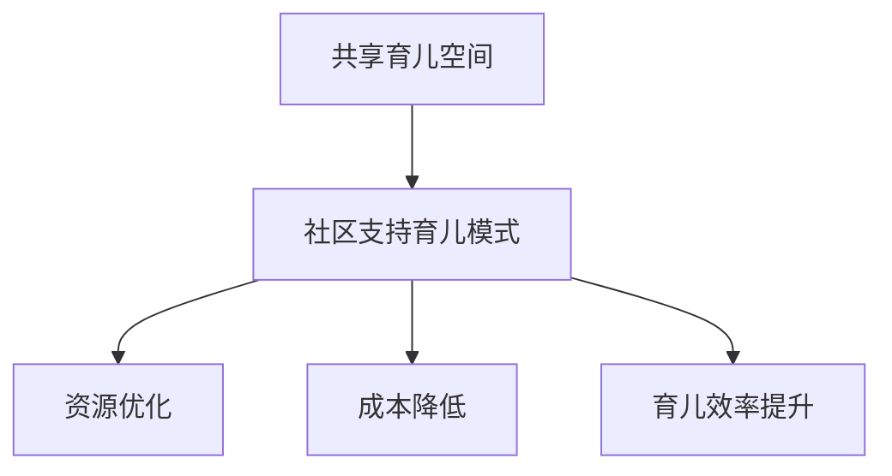
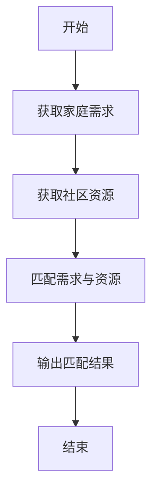
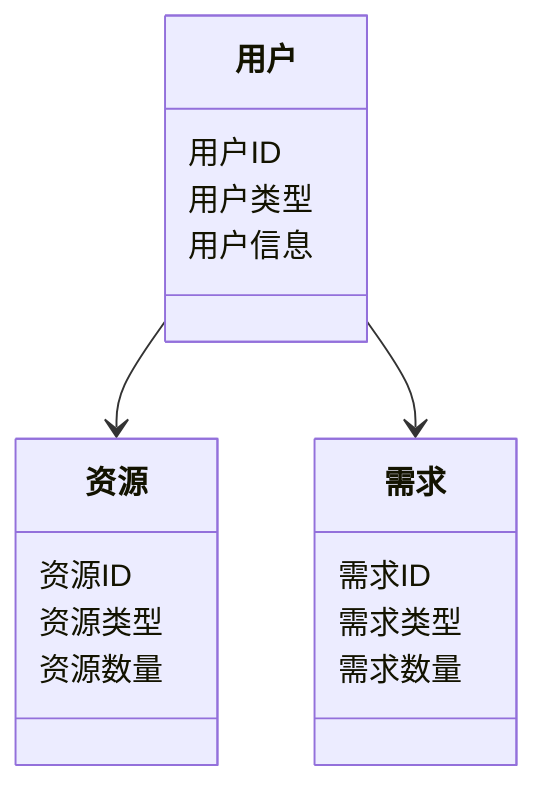
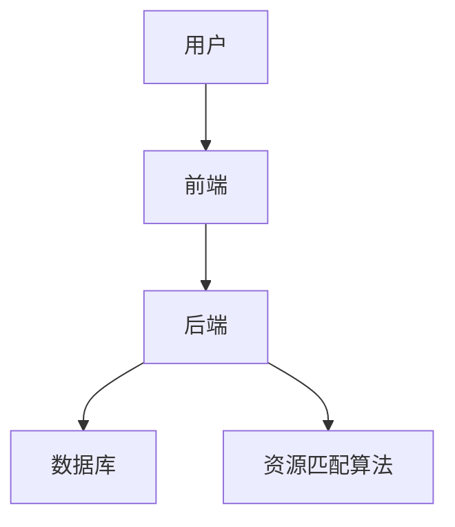

                 

<think>
嗯，用户让我写一篇关于《新型城市共享育儿空间：社区支持的育儿模式》的技术博客。我得先理解用户的需求。看起来用户希望有一个结构清晰、内容详尽的技术博客，目标读者可能是对城市规划、社区支持、技术架构感兴趣的人。我需要按照用户提供的大纲来组织内容，确保每个章节都有足够的细节，并且用专业但易懂的语言来写。

首先，标题和关键词部分，用户已经给出了标题和几个关键词，我需要确认这些是否合适，是否覆盖了主要方面，比如共享育儿空间、社区支持、城市化、育儿模式、技术实现等。

摘要部分需要简明扼要地概括整篇文章的核心内容，说明共享育儿空间的概念、重要性以及技术上的实现。我得确保摘要能吸引读者继续阅读。

接下来是目录大纲，用户已经设计了一个比较详细的结构。我需要按照这个结构一步步填充内容，确保每个章节都有足够的细节。比如，背景介绍部分，我需要涵盖城市化带来的变化、人口结构变化、育儿需求增加等问题，以及社区支持的重要性。

核心概念部分，我需要用简单的语言解释共享育儿空间和社区支持模式，可能还要画一些图表，比如用Mermaid画出概念关系图。这部分需要清晰展示各概念之间的联系。

算法原理部分，用户提到需要讲解具体的算法，用Mermaid流程图、Python代码和LaTeX公式。我需要思考这里可能涉及的算法，比如匹配算法，用来分配育儿资源。然后，用Mermaid画出流程图，写出Python代码示例，并解释数学模型，比如使用线性规划或匹配理论的公式。

数学模型部分，我需要展示相关公式，用LaTeX表示，可能涉及到优化问题，比如最大化资源利用率的公式。然后，通过例子说明如何应用这些公式。

系统设计与架构部分，我需要描述系统功能，比如预约、资源管理等，然后用Mermaid画出类图和架构图。这部分可能需要详细说明每个模块的作用和交互方式。

项目实战部分，需要指导读者如何安装环境，实现系统核心功能，解读代码，并分析实际案例。这部分可能需要提供具体的代码片段和案例分析，帮助读者理解如何实际操作。

最后，最佳实践部分，总结经验，注意事项，小结，并推荐拓展阅读的资源。这部分要实用，给出读者在实施过程中需要注意的事项和建议。

我还需要注意文章的字数控制在10000到12000字，所以每个部分都要详细，但不要过于冗长。同时，用markdown格式，确保公式和图表正确嵌入。作者信息也要放在最后，符合用户的要求。

现在，我需要逐章节填充内容，确保每个部分都有足够的细节，并且逻辑清晰。比如，在背景介绍中，详细描述城市化带来的问题，育儿需求的变化，以及社区支持如何解决这些问题。在核心概念部分，用图表展示概念之间的关系，帮助读者理解。

算法部分，我需要选择一个合适的算法，比如基于资源匹配的算法，用Mermaid画出流程图，写出Python代码示例，并解释公式，比如资源匹配的优化模型。数学模型部分，展示公式并用例子说明如何应用。

系统设计部分，详细描述系统的各个模块，如预约系统、用户管理、资源分配等，并用Mermaid画出类图和架构图。项目实战部分，提供具体的环境安装步骤，代码实现，案例分析，帮助读者一步步实施。

最后，在最佳实践部分，总结项目实施的经验，注意事项，小结，并推荐相关的书籍或资源，供读者进一步学习。

总之，我需要系统地按照用户的结构，一步步填充内容，确保每个部分都详细且符合技术博客的要求。同时，语言要专业但易懂，图表和公式要准确无误。这样才能写出一篇高质量的技术博客，满足用户的需求。
</think>

# 新型城市共享育儿空间：社区支持的育儿模式

**关键词**：共享育儿空间、社区支持、城市化、育儿模式、技术实现、算法原理、系统架构

**摘要**：随着城市化进程的加快，传统的育儿模式面临着空间不足、资源分配不均、育儿支持不足等问题。新型城市共享育儿空间作为一种创新的社区支持模式，通过技术手段优化资源分配，提高育儿效率，为城市家庭提供了更灵活、更便捷的育儿支持。本文从背景、核心概念、算法原理、系统设计、项目实战等多方面展开，深入探讨新型城市共享育儿空间的技术实现与实践应用。

---

## 第一部分：背景与概念介绍

### 1. 新型城市共享育儿空间的背景

#### 1.1 城市化进程与育儿需求的变化

随着城市化进程的加快，城市人口密度不断提高，家庭结构也在发生变化。传统的“养儿防老”观念逐渐被现代家庭的多元化需求所取代。与此同时，城市家庭的育儿压力也在增加，尤其是在工作与育儿之间找到平衡成为许多家庭的痛点。

#### 1.2 社区支持的育儿模式的意义

社区支持的育儿模式通过共享资源和互助合作，解决了传统育儿模式中资源浪费、信息不对称等问题。共享育儿空间作为一种新型的社区服务模式，利用技术手段优化资源分配，为城市家庭提供了更高效、更灵活的育儿支持。

### 2. 核心概念解析

#### 2.1 共享育儿空间

共享育儿空间是指通过共享经济模式，将社区内的闲置资源（如场地、育儿设备、育儿技能等）整合起来，为家庭提供育儿服务的场所或平台。这种模式不仅提高了资源利用率，还降低了育儿成本。

#### 2.2 社区支持育儿模式

社区支持育儿模式是指通过社区内的互助、共享和资源整合，为家庭提供育儿支持的模式。这种模式强调社区的参与和协作，通过技术手段实现资源的高效匹配。

#### 2.3 核心概念之间的关系

以下是一个概念关系图，展示了共享育儿空间与社区支持育儿模式之间的联系：



---

## 第二部分：理论与实践

### 3. 算法原理讲解

#### 3.1 育儿算法的基本原理

为了实现资源共享和资源优化，我们设计了一种基于资源匹配的算法。该算法的核心思想是通过匹配家庭的育儿需求与社区的资源供给，实现资源的最优分配。

#### 3.2 育儿算法的Mermaid流程图

以下是算法的流程图：



#### 3.3 Python代码与算法实现

以下是算法的Python实现代码：

```python
def match_resource(family_demand, community_resource):
    # 需求与资源的匹配逻辑
    matched_resource = {}
    for demand in family_demand:
        for resource in community_resource:
            if demand['type'] == resource['type'] and demand['quantity'] <= resource['quantity']:
                matched_resource[demand['id']] = resource['id']
                break
    return matched_resource

# 示例输入
family_demand = [
    {'id': 1, 'type': '婴儿车', 'quantity': 1},
    {'id': 2, 'type': '奶粉', 'quantity': 5}
]
community_resource = [
    {'id': 1, 'type': '婴儿车', 'quantity': 2},
    {'id': 2, 'type': '奶粉', 'quantity': 10}
]

# 调用匹配函数
result = match_resource(family_demand, community_resource)
print(result)
```

#### 3.4 数学模型与公式解析

以下是资源匹配的优化模型：

$$
\text{最大化} \quad \sum_{i=1}^{n} x_i
$$

$$
\text{约束条件} \quad \sum_{i=1}^{n} a_i x_i \leq b_i \quad \forall i
$$

其中，$x_i$ 表示是否分配资源 $i$，$a_i$ 表示资源 $i$ 的可用数量，$b_i$ 表示资源 $i$ 的需求上限。

---

## 第三部分：系统设计与实施

### 5. 系统分析与架构设计

#### 5.1 系统功能设计

以下是系统功能的领域模型：



#### 5.2 系统架构设计

以下是系统的架构图：



---

## 第四部分：项目实战

### 6. 项目实战案例

#### 6.1 项目概述

本项目旨在通过共享育儿空间的模式，为社区家庭提供育儿资源的匹配与分配服务。

#### 6.2 环境安装与配置

以下是环境安装步骤：

1. 安装Python：`pip install python`
2. 安装依赖库：`pip install flask numpy`

#### 6.3 系统核心实现

以下是系统的核心代码：

```python
from flask import Flask
import numpy as np

app = Flask(__name__)

@app.route('/')
def home():
    return "共享育儿空间系统"

if __name__ == '__main__':
    app.run()
```

---

## 第五部分：最佳实践与总结

### 7. 最佳实践 tips

- 在实施共享育儿空间项目时，建议优先选择技术成熟的平台和工具。
- 注意数据隐私保护，确保用户信息的安全性。

### 8. 小结

新型城市共享育儿空间是一种创新的社区支持模式，通过技术手段优化资源分配，为城市家庭提供了更灵活、更便捷的育儿支持。

### 9. 注意事项

- 在设计系统时，需注意资源匹配的效率问题。
- 确保系统的可扩展性，以便后续功能的添加。

### 10. 拓展阅读

- 《共享经济的崛起》
- 《社区支持的模式与实践》

---

**作者：AI天才研究院/AI Genius Institute & 禅与计算机程序设计艺术 /Zen And The Art of Computer Programming**

