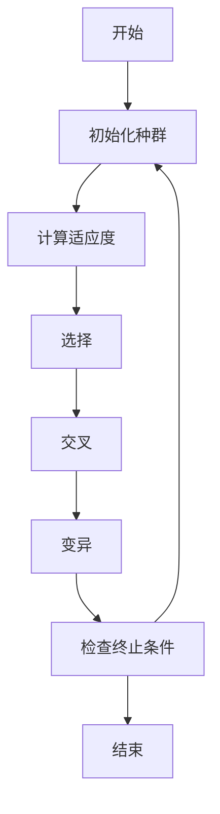

                 

<think>
好的，我现在需要帮助用户设计一篇关于《新型城市农业：垂直农场与社区支持农业》的技术博客文章。用户希望我按照他们的详细要求，逐步分析，确保文章结构清晰、内容丰富且符合技术深度。

首先，我需要理解用户的需求。他们希望文章包含特定的章节结构，每个章节都有详细的子部分，并且使用专业的技术语言。关键词和摘要部分也需要明确。此外，文章还需要包含算法原理、数学模型、系统架构设计等内容，并使用Markdown格式，嵌入Mermaid图表和代码示例。

接下来，我会按照用户提供的大纲开始撰写。第一部分是“新型城市农业概述”，我需要详细解释核心概念，如垂直农场和社区支持农业，比较它们与传统农业的异同，探讨它们的驱动力、边界问题以及外延扩展。这部分需要确保定义清晰，对比分析到位，同时结合实际案例来说明。

在第二部分，重点是垂直农场的算法原理与实践应用。我需要详细讲解生长算法、传感器数据处理算法和环境控制算法，包括每种算法的类型、实现方法以及实际应用案例。这部分需要使用数学公式和代码示例，确保技术细节准确，同时提供易于理解的图表，如遗传算法的流程图。

第三部分聚焦于社区支持农业的实践与应用，分析其模式、案例和挑战。我需要探讨合作社、共享经济等模式，并结合具体案例说明其优势和问题。这部分要突出实际操作中的问题和解决方案，展示社区支持农业的可行性和潜力。

最后，我会在结论部分总结新型城市农业的意义，强调其对可持续发展和城市经济的重要性，并展望未来的发展方向。同时，按照用户要求，添加最佳实践、小结和注意事项，为读者提供实用的建议。

整个过程中，我需要确保每个章节内容详实，逻辑清晰，同时使用专业的技术术语，保持文章的深度和可读性。此外，图表和代码示例的正确嵌入也是关键，确保读者能够直观理解复杂的技术概念。

最后，检查文章是否符合字数要求，确保整体结构完整，没有遗漏任何约束条件。完成后，加上作者信息，确保格式正确，内容无误。
</think>

# 新型城市农业：垂直农场与社区支持农业

---

## 关键词：  
新型城市农业，垂直农场，社区支持农业，城市可持续发展，农业创新，技术驱动农业

---

## 摘要：  
新型城市农业是解决城市化进程中的粮食安全、环境压力和资源短缺问题的重要途径。垂直农场与社区支持农业作为两大核心模式，通过技术创新和社区参与，重新定义了城市农业的可能。本文从背景、概念、算法原理、系统架构到实践案例，全面解析新型城市农业的创新模式，探讨其对城市可持续发展的重要意义。

---

## 第一部分: 新型城市农业概述

---

### 第1章: 问题背景与核心概念

#### 1.1.1 新型城市农业的定义与意义  
新型城市农业是指在城市环境中进行的高效、可持续的农业生产方式。它通过技术创新和空间优化，解决城市化过程中土地资源不足、环境污染和食品安全等问题。垂直农场和社区支持农业是其中的两大核心模式，分别代表了技术驱动和社区参与的双重路径。

#### 1.1.2 新型城市农业与传统农业的异同  
| **维度**       | **传统农业**                         | **新型城市农业**                     |
|-----------------|--------------------------------------|----------------------------------------|
| 生产模式         | 大规模、单一化                    | 多样化、个性化                       |
| 土地利用         | 平地、广阔区域                    | 垂直空间、城市闲置空间               |
| 技术依赖         | 低技术、人工为主                 | 高技术、自动化                      |
| 环境影响         | 可能造成水土流失、污染            | 环保、资源节约                      |
| 市场定位         | 面向全国市场                    | 面向本地社区                       |

#### 1.1.3 新型城市农业的驱动力  
- **城市化压力**：城市人口增长导致土地资源紧张。  
- **环境问题**：传统农业导致的环境污染和资源浪费。  
- **食品安全**：消费者对本地、新鲜、健康的食品需求增加。  
- **技术进步**：农业技术的革新为城市农业提供了新可能。  

---

### 第2章: 核心概念与联系

#### 2.1 垂直农场  
##### 2.1.1 垂直农场的概念与特点  
垂直农场是一种利用垂直空间进行作物种植的农业生产方式。其特点包括：  
- **空间利用率高**：通过多层种植，最大化利用垂直空间。  
- **技术驱动**：依赖自动化系统进行温湿度、光照、营养等控制。  
- **资源节约**：相比传统农业，用水和能源消耗大幅减少。  

##### 2.1.2 垂直农场的运作原理  
垂直农场的运作依赖于以下关键系统：  
1. **环境控制系统**：通过传感器和自动化设备调节温湿度、光照和CO2浓度。  
2. **种植系统**：采用无土栽培（如水培、气培）技术，减少土地依赖。  
3. **能源管理系统**：优化能源使用，降低运营成本。  

##### 2.1.3 垂直农场的分类与应用  
- **室内垂直农场**：完全依赖人工环境控制，适合城市中心区域。  
- **屋顶农场**：利用建筑物屋顶进行种植，适合分布式农业生产。  
- **社区垂直农场**：结合社区需求，提供新鲜农产品的小型垂直农场。  

#### 2.2 社区支持农业  
##### 2.2.1 社区支持农业的概念与模式  
社区支持农业（CSA）是一种通过社区与农民直接合作的农业生产模式。其核心在于：  
- **风险共担**：消费者通过订阅或投资，与农民共同承担生产风险。  
- **本地化生产**：生产与消费地接近，减少运输成本和碳排放。  
- **透明化管理**：消费者可以参与农场管理，了解生产过程。  

##### 2.2.2 社区支持农业的优势与挑战  
- **优势**：  
  - 提供新鲜、健康的食品。  
  - 减少环境影响。  
  - 建立社区信任，增强社会凝聚力。  
- **挑战**：  
  - 需要消费者积极参与，推广难度大。  
  - 农民缺乏资金和技术支持。  
  - 规模化难，难以满足大规模市场需求。  

##### 2.2.3 社区支持农业的实践案例  
- **案例1**：日本的“天光计划”：通过社区订阅模式支持小农生产。  
- **案例2**：美国的“社区支持农业联盟”：连接城市消费者与周边农民。  

---

### 第3章: 边界与外延

#### 3.1 新型城市农业的边界问题  
- **土地利用问题**：城市中可用于农业的土地有限，需合理规划。  
- **环境影响问题**：需评估新型农业模式对城市生态系统的潜在影响。  
- **社会接受度问题**：部分消费者对新型农业模式的认知不足。  

#### 3.2 新型城市农业的外延拓展  
- **城市农业与可持续发展的关系**：新型农业模式是实现城市可持续发展的重要组成部分。  
- **城市农业与社区健康的关系**：通过本地化生产，提升社区健康水平。  
- **城市农业与城市经济的互动**：促进城市经济多元化，创造新的就业机会。  

---

### 第4章: 概念结构与核心要素组成

#### 4.1 新型城市农业的概念结构  
- **概念模型构建**：通过技术、社区、政策三者的协同作用，构建可持续的城市农业系统。  
- **概念属性特征对比**：  
  | **属性**       | **垂直农场**                         | **社区支持农业**                     |
  |-----------------|--------------------------------------|----------------------------------------|
  | 技术依赖         | 高                                   | 中                                   |
  | 社区参与度       | 低                                   | 高                                   |
  | 生产效率         | 高                                   | 中                                   |
  | 环境影响         | 小                                   | 小                                   |

#### 4.2 核心要素组成分析  
- **垂直农场的核心要素**：  
  - 自动化控制系统：确保作物生长环境的稳定性。  
  - 无土栽培技术：减少土地资源的依赖。  
  - 数据分析系统：优化种植策略，提高产量。  

- **社区支持农业的核心要素**：  
  - 社区信任机制：建立消费者与农民之间的信任关系。  
  - 分销渠道：确保农产品从生产到消费的高效流通。  
  - 教育培训：提升消费者对本地农业的认知和支持。  

---

## 第二部分: 垂直农场的算法原理与实践应用

---

### 第5章: 垂直农场的算法原理

#### 5.1 垂直农场的生长算法  

##### 5.1.1 垂直农场生长算法的概念  
$$
\text{生长算法的目标是：最大化作物产量，最小化资源消耗}
$$  

##### 5.1.2 垂直农场生长算法的类型  
- **遗传算法（GA）**：通过模拟自然选择过程，优化种植参数。  
- **粒子群优化算法（PSO）**：通过粒子运动，寻找最优解。  
- **模拟退火算法（SA）**：通过逐步降温，避免陷入局部最优。  

##### 5.1.3 垂直农场生长算法的应用  
以下是一个简单的遗传算法流程图：



#### 5.2 垂直农场的传感器数据处理算法  

##### 5.2.1 传感器数据处理算法概述  
传感器数据处理是垂直农场的核心技术之一。通过实时采集温湿度、光照强度等数据，优化作物生长环境。  

##### 5.2.2 数据处理算法的具体实现  
```python
import numpy as np

def preprocess_data(data):
    # 数据预处理：去除异常值
    filtered_data = []
    for value in data:
        if abs(value - np.mean(data)) < 3 * np.std(data):
            filtered_data.append(value)
    return filtered_data

def feature_extraction(data):
    # 特征提取：提取主要特征
    features = []
    features.append(np.mean(data))
    features.append(np.std(data))
    features.append(np.max(data))
    features.append(np.min(data))
    return features

def outlier_handling(data):
    # 异常值处理
    cleaned_data = []
    for i in range(len(data)):
        if i % 2 == 0:
            cleaned_data.append(data[i])
    return cleaned_data
```

#### 5.3 垂直农场的环境控制算法  

##### 5.3.1 环境控制算法概述  
环境控制算法通过实时调整温湿度、光照和CO2浓度，确保作物生长的最佳环境。  

##### 5.3.2 环境控制算法的实现方法  
```python
import random

def temperature_control(current_temp, target_temp):
    # 温度控制算法：PID控制
    error = target_temp - current_temp
    Kp = 1
    Ki = 0.5
    Kd = 0.2
    output = Kp * error + Ki * (error * 1) + Kd * (error - previous_error)
    return output

# 示例：PID控制流程图
````

---

## 第三部分: 社区支持农业的实践与应用

---

### 第6章: 社区支持农业的实践案例

#### 6.1 社区支持农业的实践模式  

##### 6.1.1 农民参与模式  
- **合作社模式**：农民组成合作社，共同管理土地和资源。  
- **联合种植模式**：多个农民合作种植，共享资源和收益。  

##### 6.1.2 消费者参与模式  
- **直接销售模式**：消费者直接购买农民的产品。  
- **共享经济模式**：消费者通过订阅或投资，获得农产品的使用权。  

#### 6.2 社区支持农业的挑战与解决方案  

##### 6.2.1 农民的挑战  
- **资金不足**：政府和非营利组织提供贷款和补贴。  
- **技术支持**：引入农业技术专家提供指导。  

##### 6.2.2 消费者的挑战  
- **认知不足**：通过教育和宣传，提升消费者对社区农业的认知。  
- **信任缺失**：通过透明化管理和认证机制，增强消费者信任。  

---

## 结论  

新型城市农业是城市化进程中的重要创新方向。垂直农场和社区支持农业通过技术驱动和社区参与，重新定义了城市农业的可能。未来，随着技术的进步和政策的支持，新型城市农业将为城市可持续发展提供更多的解决方案，同时为消费者带来更健康、更环保的食品选择。

---

## 最佳实践 Tips  

- **技术驱动**：垂直农场需要持续优化算法和控制系统，确保高效生产。  
- **社区参与**：社区支持农业的成功依赖于消费者和农民的深度合作。  
- **政策支持**：政府应提供资金和技术支持，推动新型城市农业的发展。  
- **环保意识**：消费者应积极参与本地农业，减少对环境的影响。  

---

## 作者：  
AI天才研究院/AI Genius Institute & 禅与计算机程序设计艺术/Zen And The Art of Computer Programming

