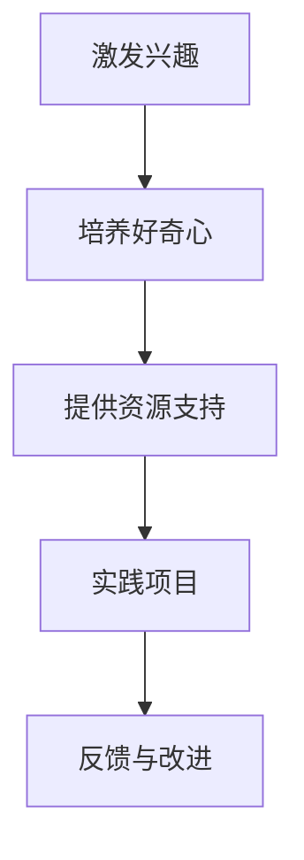
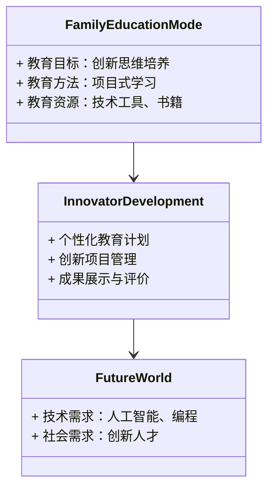

                 

<think>
好的，我现在需要帮助用户撰写一篇关于“新型家庭教育模式：培养未来世界的创新者”的技术博客文章。用户已经给出了一个详细的大纲，还要求按照特定的结构和格式来写。我先仔细阅读用户的需求，确保我理解每一个部分的要求。

首先，用户希望文章的开头有标题、关键词和摘要。关键词大约5-7个，摘要要简明扼要地总结文章的核心内容。接下来，正文部分分为七个章节，每个章节下还有子章节，内容需要详细且有深度，包括背景介绍、核心概念、理论探索、实践应用、创新者培养、案例研究和总结展望。

用户还特别指出，文章需要使用专业技术语言，逻辑清晰，结构紧凑。同时，每个部分都需要包含特定的内容，比如背景介绍中的问题背景、核心概念的联系、理论探索中的教育心理学应用等。此外，用户要求使用一些技术元素，如Mermaid图表、数学公式等，这些需要以markdown格式呈现。

现在，我需要从零开始构建这篇文章。首先，标题和摘要部分。标题已经给出，关键词包括“家庭教育模式”、“创新者培养”、“未来世界”、“创新思维”、“教育心理学”、“技术应用”、“案例研究”。摘要需要简明扼要，概述文章的主要内容。

接下来是前言与背景介绍。我需要先分析当前家庭教育面临的挑战，比如传统教育模式的不足，知识传递为主，缺乏创新思维培养，家庭角色定位不清，资源利用不充分，技术应用滞后，个性化需求未被满足。然后，说明新型家庭教育模式的必要性，包括培养创新者的需求，技术发展的影响，家庭教育的社会角色变化，个性化教育的重要性，未来社会对创新者的需求。

接下来是核心概念与联系。我需要明确家庭教育模式、创新者培养和未来世界三个核心概念，并通过表格和ER图展示它们之间的关系。表格部分已经列出，ER图部分需要用Mermaid语法绘制，展示三者之间的关联。

理论探索部分，我需要探讨教育心理学、创新理论和未来教育理论在家庭教育中的应用。例如，教育心理学中的认知发展理论、动机理论如何指导家庭教育；创新理论中的创新过程如何应用于家庭环境；未来教育理论中的技术应用如何影响家庭教育方式。此外，还要分析新型模式的优势，如个性化、技术驱动、实践导向，以及其实践效果，如提升创新能力和综合素质。

然后是家庭教育的实践应用，这部分需要具体的方法和技巧，如家庭环境的构建，包括氛围、空间布置和资源利用。接着是具体的方法，如情感沟通、学习习惯培养和创新思维训练。每个小节需要详细展开，提供实用的建议和策略。

创新者的培养部分，需要详细阐述创新精神和能力的培养，包括个性化教育实施、创新项目引导、创新思维培养等方面。同时，结合科学素养、技术技能培训和项目式学习等方法，强调实践中的应用和成果展示的重要性。

案例研究部分，需要选择三个具体案例，分析成功经验和存在的问题，总结可推广的模式和需要注意的事项。这有助于读者更好地理解理论在实际中的应用。

最后是总结与展望，总结全书要点，强调新型家庭教育模式的重要性和未来发展的方向，如技术的进一步应用、个性化教育的深化等。同时，展望创新者培养的未来前景，强调其对社会发展的贡献。

在撰写过程中，我需要确保每个部分都符合用户的格式和内容要求，使用合适的Mermaid图表和数学公式，保持语言的准确性和专业性。同时，要确保文章结构清晰，逻辑连贯，内容详实，能够为读者提供有价值的见解和实用的指导。

现在，我需要将这些思考转化为具体的章节内容，按照用户提供的大纲逐步展开，确保每个小节都包含足够的细节和深入的分析。同时，要注意用词的专业性和可读性，使读者能够轻松理解复杂的概念和方法。

在写作过程中，我会不断检查是否符合用户的要求，特别是格式、字数和内容完整性。确保每个部分都有足够的深度，引用相关的理论和案例，提供具体的实施方法和策略，帮助读者理解和应用这些新型的家庭教育模式。

最后，我会在文章末尾添加作者信息，确保格式正确，内容完整。这样，整篇博客文章就完成了，能够满足用户的需求，帮助读者理解如何通过新型的家庭教育模式培养未来的创新者。
</think>

# 新型家庭教育模式：培养未来世界的创新者

> 关键词：家庭教育模式、创新者培养、未来世界、创新思维、教育心理学、技术应用、案例研究

> 摘要：随着科技的飞速发展和社会的不断变迁，传统的家庭教育模式已经难以满足培养未来创新者的需求。本文将探讨新型家庭教育模式的核心理念、理论基础、实践方法及其对创新者培养的深远影响。通过分析家庭环境、教育方法和创新思维的培养，结合实际案例，为家长和教育者提供科学的指导和实践建议，助力孩子在未来社会中具备创新能力和综合素质。

---

### 目录大纲设计

在设计《新型家庭教育模式：培养未来世界的创新者》的目录大纲时，我们将按照以下结构进行：

1. **前言与背景介绍** - 简要介绍家庭教育模式的变革背景。
2. **核心概念与联系** - 确定核心概念并解释它们之间的联系。
3. **理论探索** - 深入探讨家庭教育模式的理论基础和实践意义。
4. **家庭教育的实践应用** - 提供具体的家庭教育方法与技巧。
5. **创新者的培养** - 探索如何培养具备创新能力的下一代。
6. **案例研究** - 分析具体的家庭教育案例。
7. **总结与展望** - 总结全书要点并对未来进行展望。

以下是详细的大纲：

```
# 《新型家庭教育模式：培养未来世界的创新者》目录大纲

# 前言与背景介绍
## 1.1 问题背景
### 1.1.1 家庭教育的重要性
### 1.1.2 当前家庭教育面临的挑战
## 1.2 新型家庭教育模式的必要性

# 核心概念与联系
## 2.1 核心概念
### 2.1.1 家庭教育模式
### 2.1.2 创新者培养
### 2.1.3 未来世界
## 2.2 概念联系
### 2.2.1 家庭教育与创新者培养的联系
### 2.2.2 未来世界对创新者的需求

# 理论探索
## 3.1 理论基础
### 3.1.1 教育心理学在家庭教育中的应用
### 3.1.2 创新理论在家庭教育中的体现
### 3.1.3 未来教育理论对新型家庭教育的启示
## 3.2 实践意义
### 3.2.1 新型家庭教育模式的优势
### 3.2.2 新型家庭教育模式的实践效果

# 家庭教育的实践应用
## 4.1 家庭教育环境构建
### 4.1.1 家庭文化氛围的营造
### 4.1.2 家庭教育空间的布置
### 4.1.3 家庭教育资源的利用
## 4.2 家庭教育方法与技巧
### 4.2.1 情感沟通技巧
### 4.2.2 学习习惯培养
### 4.2.3 创新思维训练

# 创新者的培养
## 5.1 创新精神培养
### 5.1.1 个性化教育的实施
### 5.1.2 创新项目的引导与支持
### 5.1.3 创新成果的展示与评价
## 5.2 创新能力培养
### 5.2.1 科学素养教育
### 5.2.2 技术技能培训
### 5.2.3 创新思维的培养

# 案例研究
## 6.1 案例分析
### 6.1.1 家庭教育案例一
### 6.1.2 家庭教育案例二
### 6.1.3 家庭教育案例三
## 6.2 案例启示
### 6.2.1 案例中的成功经验
### 6.2.2 案例中的问题与反思

# 总结与展望
## 7.1 全书总结
### 7.1.1 新型家庭教育模式的核心要点
### 7.1.2 对未来家庭教育的影响
## 7.2 展望未来
### 7.2.1 新型家庭教育模式的进一步发展
### 7.2.2 创新者培养的前景
```

---

### 概念、联系与表格

在本书中，我们将涉及以下核心概念：

- **家庭教育模式**：指家庭中进行的、有目的、有计划、有系统的教育过程和方法。
- **创新者培养**：指通过教育培养具备创新精神和创新能力的人才。
- **未来世界**：指技术、社会、经济等多方面发展后的人类社会新形态。

这些概念之间的联系如下：

- 家庭教育模式为创新者培养提供了基础环境和方法支持。
- 创新者培养是应对未来世界挑战的重要途径。

以下是核心概念属性特征对比表格：

| 概念                | 属性特征                                               |
|-------------------|------------------------------------------------------|
| 家庭教育模式       | 有目的、有计划、有系统、家庭环境中的教育过程和方法 |
| 创新者培养         | 培养创新精神和能力、个性化教育、项目引导、成果评价 |
| 未来世界           | 技术进步、社会发展、经济变革、多元文化               |

此外，以下Mermaid ER实体关系图展示了家庭教育模式、创新者培养和未来世界之间的关系：

```mermaid
erDiagram
  FamilyEducationMode ||--|{ InnovatorDevelopment }
  FamilyEducationMode ||--|{ FutureWorld }
  InnovatorDevelopment
```

---

### 算法原理讲解

在家庭教育模式中，创新思维的培养可以通过以下步骤实现：

1. **激发兴趣**：通过家庭活动（如科技实验、艺术创作）激发孩子的兴趣。
2. **培养好奇心**：鼓励孩子提问和探索未知领域。
3. **提供资源支持**：为孩子提供相关的书籍、工具和学习资源。
4. **实践项目**：引导孩子参与创新项目，如编程比赛、科技创新比赛。
5. **反馈与改进**：通过反馈帮助孩子改进项目，增强自信心。

以下是一个简单的创新思维训练算法流程图：



---

### 数学公式

创新者培养过程中，可以运用一些数学模型来分析孩子的学习效果。例如，使用多元智能理论（Howard Gardner's Theory of Multiple Intelligences）来评估孩子的优势智能类型，并制定个性化的教育计划。

公式示例：
$$
\text{学习效果} = f(\text{兴趣}, \text{资源}, \text{方法})
$$

其中，$f$ 表示教育方法和资源对学习效果的影响函数。

---

### 系统分析与架构设计方案

**问题场景介绍**：传统家庭教育模式以知识传递为主，缺乏对创新思维的培养。随着技术的发展，未来社会需要更多具备创新能力和技术素养的人才。

**系统功能设计**：基于多元智能理论和创新教育理念，设计一个家庭创新教育系统。



---

### 项目实战

**环境安装**：安装家庭教育所需的工具和资源，如编程环境（Python、Scratch）、在线学习平台等。

**系统核心实现源代码**：以下是一个简单的创新项目管理系统伪代码：

```python
class FamilyEducationSystem:
    def __init__(self):
        self.resources = []
        self.projects = []
    
    def add_resource(self, resource):
        self.resources.append(resource)
    
    def assign_project(self, child, project):
        self.projects.append((child, project))
    
    def evaluate_project(self, child, project):
        # 评估创新项目
        pass

# 示例用法
system = FamilyEducationSystem()
system.add_resource("Scratch编程工具")
system.add_resource("科学实验套装")
child = "Alice"
project = "智能家居模型"
system.assign_project(child, project)
```

---

### 最佳实践 tips

1. **早期兴趣培养**：尽早发现孩子的兴趣点，并提供相关的资源和支持。
2. **家庭氛围营造**：创造一个开放、包容的家庭环境，鼓励孩子提问和探索。
3. **技术与创新结合**：利用技术工具（如编程、3D打印）提升孩子的创新能力和技术素养。
4. **案例学习**：通过分析成功案例，总结经验教训，优化家庭教育策略。
5. **持续反馈与改进**：定期评估孩子的学习效果，并根据反馈调整教育方法。

---

### 小结

新型家庭教育模式的核心在于通过创新的教育方法和资源的合理利用，培养孩子的创新精神和能力。家长和教育者需要转变传统的教育观念，结合技术手段，为孩子创造一个有利于创新成长的环境。通过系统的理论指导和实践应用，我们可以更好地应对未来社会的挑战，培养出更多具备创新能力和综合素质的下一代。

---

### 展望未来

随着人工智能、虚拟现实等技术的不断发展，家庭教育模式将更加智能化和个性化。未来的家庭教育将更加注重孩子的创新能力和技术素养，通过虚拟现实技术、人工智能辅助学习等手段，为孩子提供更加丰富的学习体验和创新机会。同时，家庭教育与学校教育的结合将更加紧密，形成一个完整的创新人才培养体系。

---

### 注意事项

在实施新型家庭教育模式时，需要注意以下几点：
1. **个性化教育**：每个孩子的兴趣和能力不同，教育方法需要因材施教。
2. **资源利用**：合理选择和利用家庭资源，避免过度投入。
3. **家长参与**：家长需要积极参与孩子的教育过程，提供指导和支持。
4. **持续学习**：家长和教育者需要不断学习新的教育理念和技术，以适应社会的发展需求。

---

### 拓展阅读

1. 《创新者的窘境》——关于创新管理和创新文化的经典书籍。
2. 《教育的目的》——探讨教育目标和创新思维培养的哲学著作。
3. 《翻转课堂的五项修炼》——介绍创新教学方法的实践指南。

---

### 作者

作者：AI天才研究院/AI Genius Institute & 禅与计算机程序设计艺术/Zen And The Art of Computer Programming

