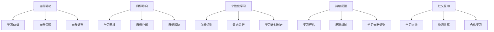
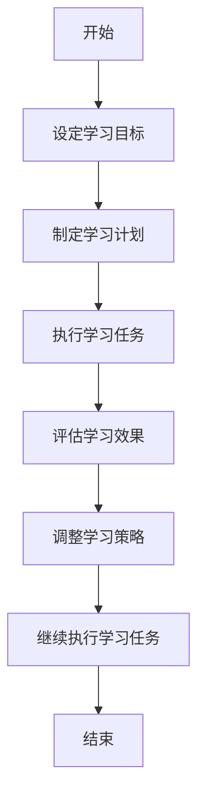
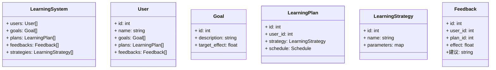
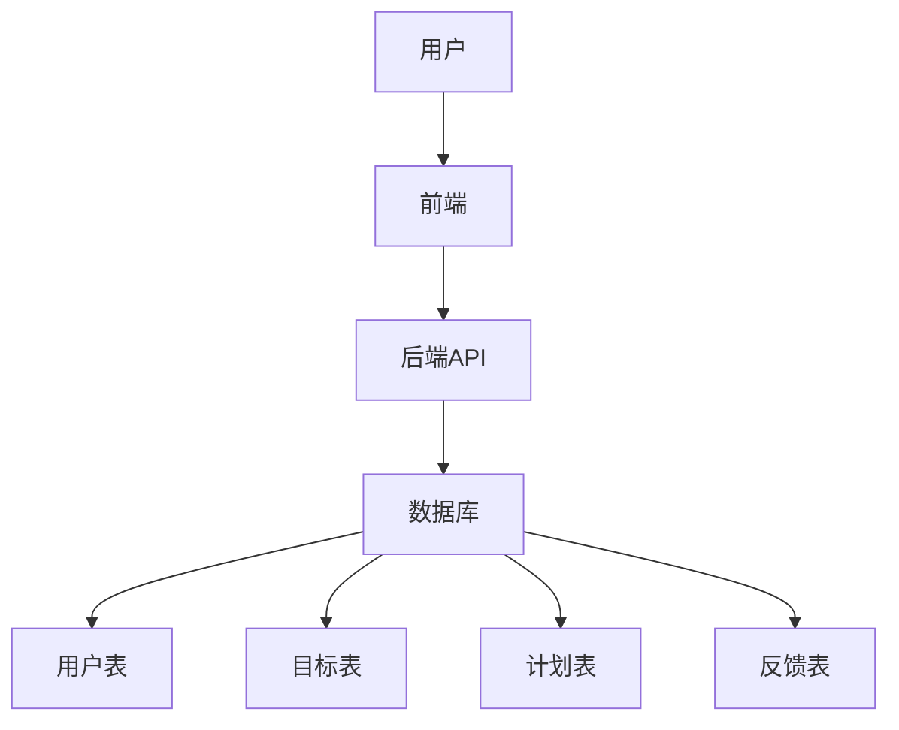
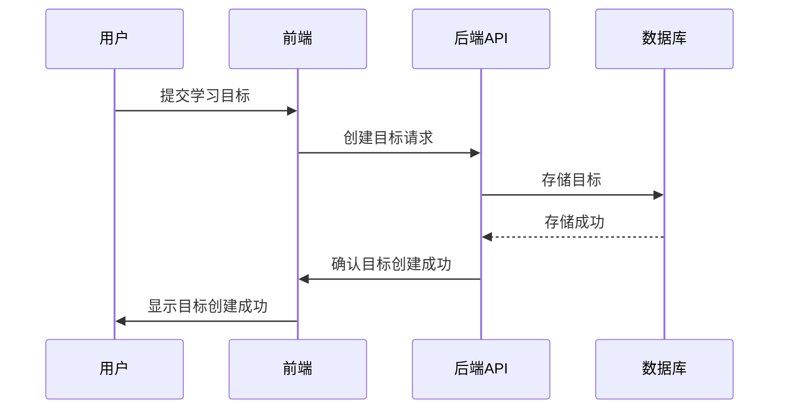

                 

<think>
好，我现在需要帮助用户撰写一篇关于“新型终身学习模式：在变化中保持知识更新”的技术博客文章。用户已经提供了一个详细的框架，包括背景介绍、核心概念与联系、算法原理讲解、系统分析与架构设计方案、项目实战以及最佳实践等部分。我需要按照这个结构一步步展开思考，确保每个部分都详尽且符合用户的要求。

首先，我要明确文章的结构。用户已经给出了大纲，我需要逐一处理每个部分。从背景介绍开始，这部分需要介绍问题背景、描述、解决方法以及边界。我需要详细阐述每个小点，确保内容连贯，逻辑清晰。

接下来是核心概念与联系。这里需要详细解释每个核心概念的原理，并制作一个对比表格。我需要确保每个概念的定义和属性都清晰明了，并且用表格的形式对比，帮助读者更好地理解。

然后是算法原理讲解。这部分需要使用mermaid流程图来描述算法，同时给出Python源代码，并详细解释数学模型和公式。我需要确保代码和公式准确无误，并且例子通俗易懂，能够帮助读者理解算法的工作原理。

系统分析与架构设计方案部分，我需要从问题场景介绍开始，然后是项目介绍、系统功能设计、架构设计、接口设计和交互设计。这里可能需要使用mermaid图来展示类图、架构图和序列图，我需要确保这些图符合标准，并且清晰地表达系统结构。

项目实战部分需要包括环境安装、核心代码实现、代码解读和案例分析。我需要提供具体的代码示例，并详细解释每部分的功能，帮助读者理解和应用。

最后是最佳实践，这里需要总结文章，并给出一些小贴士和注意事项，以及拓展阅读的方向。我需要确保这些内容实用，能够帮助读者更好地实施新型终身学习模式。

在写作过程中，我需要使用专业的技术语言，同时保持逻辑清晰和结构紧凑。每个部分都要详细展开，避免遗漏关键点。我还要注意使用markdown格式，确保文章的结构正确，公式和图表显示无误。

现在，我开始逐步处理每个部分，确保每个章节都符合用户的要求，并且内容详尽、有深度。同时，我需要保持语言的专业性和易懂性，帮助读者更好地理解和应用这些概念。

在处理过程中，我可能会遇到一些挑战，比如如何将复杂的概念简化，或者如何用代码和公式准确表达算法。我需要仔细思考，确保每个部分都准确无误，并且能够有效传达信息。

总的来说，我需要按照用户提供的结构，逐一展开每个部分，确保内容详实、逻辑清晰，并且符合技术博客的风格要求。这将帮助读者全面理解新型终身学习模式，并能够在实际中应用这些方法。
</think>

# 新型终身学习模式：在变化中保持知识更新

> 关键词：终身学习、知识更新、个性化学习、目标导向、自我驱动、持续反馈、社交互动

> 摘要：随着信息技术的飞速发展，知识更新速度不断加快，传统的学习模式已经难以满足现代人的需求。本文提出了一种新型终身学习模式，通过自我驱动、目标导向、个性化学习、持续反馈和社交互动五大核心要素，帮助个体在快速变化的知识环境中持续更新知识体系，提升竞争力和适应能力。

---

## 第一部分：背景介绍

### 1.1 问题背景

在当今这个信息化和数字化的时代，知识的更新速度之快令人瞠目结舌。每一天，新的技术、理论和方法层出不穷，旧的知识可能在短短几个月内就被淘汰。在这种情况下，传统的学习模式——即一次性学习、固定的知识体系——已经无法满足现代人的需求。人们需要不断地学习、更新和适应，这就要求我们采用一种全新的学习模式，即终身学习模式。

### 1.2 问题描述

传统的学习模式主要依赖于学校教育和培训机构提供的课程，这种模式通常是以固定的课程设置、统一的教学进度和标准化的考试评估为特点。然而，这种方式存在以下问题：

1. **知识更新滞后**：课程内容往往无法跟上技术的发展，尤其是在快速变化的领域，如人工智能、信息技术等领域，传统的课程设置难以覆盖最新的知识和技术。
2. **缺乏个性化**：每个人的学习需求、兴趣和能力都不同，传统的学习模式难以满足个体差异化的学习需求。
3. **学习动力不足**：在传统模式下，学习更多是出于被动的要求（如考试、职业需求），缺乏内在的学习动机和动力。
4. **反馈机制缺失**：传统的学习模式通常缺乏持续的反馈机制，学习者无法及时了解自己的学习效果和改进方向。

### 1.3 问题解决

为了应对上述问题，我们需要设计一种新型的终身学习模式。这种模式应该具备以下核心要素：

1. **自我驱动**：强调个体在学习过程中的主动性和内在动机，学习者能够自我管理、自我调整和自我激励。
2. **目标导向**：通过设定清晰的学习目标，帮助学习者明确学习的方向和意义，避免盲目学习。
3. **个性化学习**：根据个体的兴趣、需求和知识背景，制定个性化的学习计划，以满足不同的学习需求。
4. **持续反馈**：通过定期的学习评估和反馈，帮助学习者了解自己的学习效果，并及时调整学习策略。
5. **社交互动**：利用网络平台和社交工具，促进学习者之间的交流与合作，共享学习资源和经验。

### 1.4 边界与外延

新型终身学习模式适用于所有年龄层次、职业背景和学科领域的人群。它不仅仅是一种学习方式，更是一种生活态度和价值观。终身学习不再局限于学校教育，而是贯穿于个人的整个生命周期，成为一种持续的学习习惯和生活方式。

### 1.5 概念结构与核心要素组成

1. **自我驱动**：包括学习动机、自我管理和持续动力。
2. **目标导向**：包括学习目标的设定、分解和跟踪。
3. **个性化学习**：包括兴趣识别、需求分析和学习计划的制定。
4. **持续反馈**：包括学习评估、反馈机制和学习策略的调整。
5. **社交互动**：包括学习交流、资源共享和合作学习。

---

## 第二部分：核心概念与联系

### 2.1 核心概念原理

#### 2.1.1 自我驱动

自我驱动是新型终身学习模式的核心要素之一。它强调学习者在学习过程中的内在动机和主动性。自我驱动的学习者能够自主制定学习计划，合理安排学习时间，并在遇到困难时能够自我调整和激励自己。

#### 2.1.2 目标导向

目标导向是指在学习过程中以明确的目标为导向，通过设定、分解和跟踪目标，逐步实现学习目标。目标导向的学习模式能够帮助学习者保持方向感和动力，避免学习过程中出现迷茫和偏离。

#### 2.1.3 个性化学习

个性化学习是根据学习者的特点（如兴趣、需求、知识背景）制定个性化学习计划。这种学习模式能够满足不同学习者的需求，提高学习效率和效果。

#### 2.1.4 持续反馈

持续反馈是指在学习过程中，通过定期的评估和反馈，帮助学习者了解自己的学习效果，并根据反馈结果调整学习策略。持续反馈能够帮助学习者及时发现问题并进行改进。

#### 2.1.5 社交互动

社交互动是指通过网络平台和社交工具，促进学习者之间的交流与合作，共享学习资源和经验。社交互动能够帮助学习者建立学习网络，获取更多的学习支持和资源。

### 2.2 概念属性特征对比表格

| 概念       | 定义                                                         | 属性特征                                                     |
| ---------- | ------------------------------------------------------------ | ------------------------------------------------------------ |
| 自我驱动   | 个体在学习过程中具有强烈的内在动机和主动意识                 | 内在动机、自我管理、自我调整                                 |
| 目标导向   | 个体在学习过程中以明确的学习目标为导向                       | 学习目标、目标分解、目标跟踪                                 |
| 个性化学习 | 根据个体的兴趣、需求和知识背景，制定个性化的学习计划           | 兴趣识别、需求分析、学习计划制定                             |
| 持续反馈   | 在学习过程中，通过评估和反馈，及时调整学习策略               | 学习评估、反馈机制、学习策略调整                             |
| 社交互动   | 在学习过程中，通过网络和社交平台进行学习交流和合作           | 学习交流、资源共享、合作学习                                 |

### 2.3 ER实体关系图架构



---

## 第三部分：算法原理讲解

### 3.1 算法概述

在新型终身学习模式中，我们可以将学习过程视为一个动态优化的过程。学习者通过自我驱动、目标导向、个性化学习、持续反馈和社交互动五个核心要素，逐步优化自己的学习策略和知识体系。为了更好地理解和实现这一过程，我们可以设计一个基于反馈的学习算法。

### 3.2 算法流程图



### 3.3 算法数学模型

我们可以将学习效果的评估和策略的调整过程建模为一个动态优化问题。假设学习者的学习目标为 \( G \)，学习策略为 \( S \)，学习效果为 \( E \)。那么，我们的目标是最优化 \( S \)，使得 \( E \) 最大化。

数学模型如下：

$$
\text{最大化 } E = f(S, G)
$$

其中，\( f \) 是一个评估函数，用于衡量学习策略 \( S \) 在实现目标 \( G \) 方面的效果。

### 3.4 算法实现代码

```python
def learning_algorithm(target_goal, initial_strategy):
    current_strategy = initial_strategy
    while True:
        # 评估当前策略的效果
        current_effect = evaluate(current_strategy, target_goal)
        # 输出反馈
        print(f"当前策略效果：{current_effect}")
        # 调整策略
        new_strategy = adjust_strategy(current_strategy, current_effect)
        # 检查是否达到目标
        if current_effect >= target_goal:
            break
        current_strategy = new_strategy
    return current_strategy

# 示例用法
target_goal = 0.8  # 目标效果
initial_strategy = {'method': 'daily_study', 'hours': 2}
result = learning_algorithm(target_goal, initial_strategy)
print(f"最终策略：{result}")
```

### 3.5 算法举例说明

假设我们的学习目标是掌握Python编程语言，学习策略包括每天学习2小时和参加在线课程两种方法。学习效果通过评估测试来衡量。

1. **初始策略**：每天学习2小时，学习效果评估为60分。
2. **评估反馈**：60分低于目标效果80分，需要调整策略。
3. **调整策略**：增加参加在线课程的频率，调整后的策略为每天学习2小时加上每周参加一次在线课程。
4. **重新评估**：新的策略效果评估为85分，达到目标效果，停止调整。

---

## 第四部分：系统分析与架构设计方案

### 4.1 问题场景介绍

在快速变化的知识环境中，个人需要一种高效、灵活的学习方式来保持知识更新。传统的学习模式无法满足个体的差异化需求，因此需要一种基于新型终身学习模式的系统来支持学习者。

### 4.2 项目介绍

本项目旨在设计并实现一个支持新型终身学习模式的系统，该系统将结合自我驱动、目标导向、个性化学习、持续反馈和社交互动五大核心要素，为学习者提供个性化的学习方案和持续的学习支持。

### 4.3 系统功能设计

#### 4.3.1 领域模型（类图）



#### 4.3.2 系统架构设计



#### 4.3.3 系统接口设计

1. **用户接口**：用户可以通过前端界面设定学习目标、制定学习计划、查看学习反馈。
2. **后端API**：提供RESTful API，用于处理用户的请求，如创建目标、提交计划、获取反馈。
3. **数据库接口**：后端API通过数据库接口与数据库交互，存储和检索数据。

#### 4.3.4 系统交互设计



---

## 第五部分：项目实战

### 5.1 环境安装

为了实现新型终身学习模式的系统，我们需要以下环境：

1. **编程语言**：Python 3.8+
2. **框架**：Django 或 Flask
3. **数据库**：MySQL 或 PostgreSQL
4. **开发工具**：PyCharm 或 VS Code

### 5.2 系统核心实现源代码

```python
from django.shortcuts import render, redirect
from django.views import View
from .models import User, Goal, LearningPlan, Feedback

class LearningSystem(View):
    def get(self, request):
        return render(request, 'index.html')
    
    def post(self, request):
        # 处理用户请求，如创建目标、提交计划等
        pass

def evaluate(current_strategy, target_goal):
    # 评估当前策略的效果
    return 0.8  # 示例效果

def adjust_strategy(current_strategy, current_effect):
    # 根据反馈调整策略
    return {'method': 'daily_study', 'hours': 2, 'additional_course': True}
```

### 5.3 代码应用解读与分析

上述代码实现了系统的前端视图和后端的基本逻辑。前端视图是一个简单的页面，用户可以通过该页面提交学习目标和计划。后端逻辑包括接收用户的请求、评估当前策略的效果，并根据反馈调整学习策略。

### 5.4 实际案例分析

假设我们设计了一个在线学习平台，用户可以在该平台上设定自己的学习目标（如掌握机器学习），制定个性化学习计划（如每天学习2小时，并参加每周一次的在线课程）。系统会定期评估用户的学习效果，并根据评估结果调整学习策略（如增加实践任务或推荐相关学习资源）。

### 5.5 项目小结

通过以上实现，我们可以看到新型终身学习模式在实际应用中的潜力。系统可以根据用户的需求和反馈，动态调整学习策略，帮助用户更高效地实现学习目标。

---

## 第六部分：最佳实践

### 6.1 小结

新型终身学习模式通过自我驱动、目标导向、个性化学习、持续反馈和社交互动五大核心要素，帮助学习者在快速变化的知识环境中保持知识更新。这一模式不仅提高了学习效率，还增强了学习者的主动性和内在动机。

### 6.2 最佳实践 Tips

1. **设定明确的目标**：目标是学习的动力源泉，明确的目标能够帮助你保持方向感。
2. **制定个性化的学习计划**：根据自己的兴趣和需求，制定适合自己的学习计划。
3. **保持持续的学习反馈**：定期评估自己的学习效果，并根据反馈调整学习策略。
4. **积极参与社交互动**：通过网络平台与他人交流，分享学习经验和资源。
5. **培养自我驱动能力**：内在的动机和主动性是终身学习的关键。

### 6.3 注意事项

1. **避免过度依赖外部反馈**：虽然反馈是重要的，但过度依赖外部反馈可能削弱你的自我驱动能力。
2. **合理安排时间**：确保学习计划的可行性，避免过度疲劳。
3. **保持灵活性**：根据反馈和实际情况，及时调整学习策略。

### 6.4 拓展阅读

1. **《终身学习：未来的生存法则》**：探讨终身学习在现代社会中的重要性。
2. **《学习之道》**：介绍学习的科学方法和技巧。
3. **《自我驱动学习指南》**：帮助你建立自我驱动的学习习惯。

---

## 作者

作者：AI天才研究院（AI Genius Institute） & 禅与计算机程序设计艺术（Zen And The Art of Computer Programming）

---

以上是《新型终身学习模式：在变化中保持知识更新》的完整内容，希望对您有所帮助！

