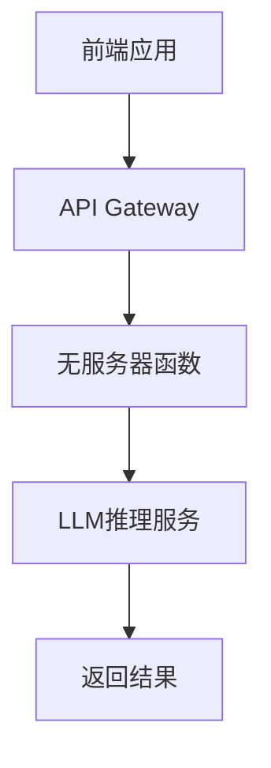
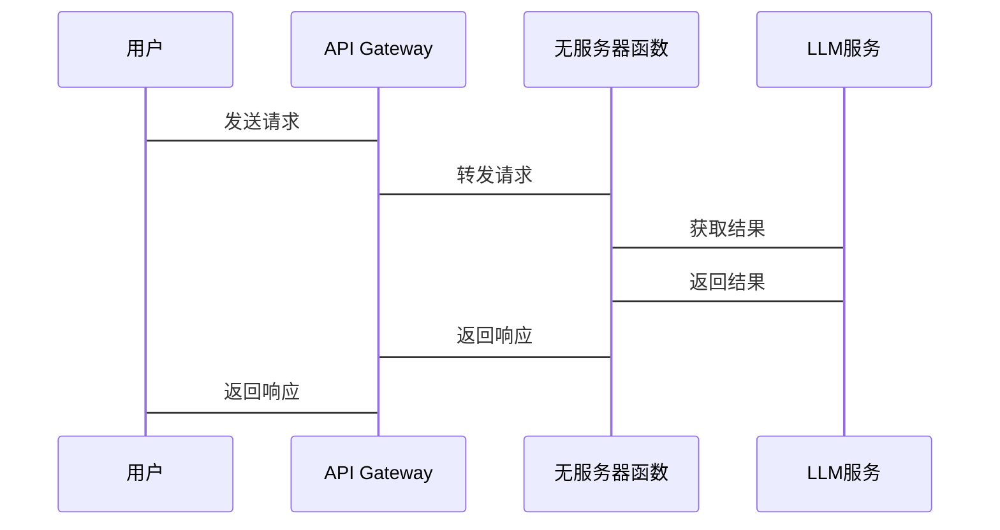

                 

<think>
嗯，好的，我需要写一篇关于《无服务器架构简化LLM应用的部署和管理》的技术博客文章。首先，我得理清文章的结构，确保涵盖所有必要的部分。

我先看看用户给的大纲，发现文章分为四个主要部分，每一部分又有多个章节。我需要按照这个结构来填充内容。首先，我会从引言开始，介绍无服务器架构的背景和重要性，然后引出LLM的应用和挑战。

接下来，第二部分是无服务器架构的基础知识，我需要详细讲解什么是无服务器架构，它的核心概念，发展历程，以及应用场景。这部分需要清晰明了，让读者能够理解无服务器架构的基本原理和优势。

第三部分是关于LLM的基础知识，包括定义、类型、关键技术、应用领域以及发展趋势和挑战。这部分需要帮助读者了解LLM的基本概念，以及它在不同领域中的应用，同时也要指出当前面临的问题。

第四部分是关键部分，探讨无服务器架构在LLM部署中的应用，包括优势、挑战、实现方法，以及最佳实践。这里需要详细分析无服务器架构如何解决LLM部署中的问题，并提供实际的解决方案和案例分析。

在写作过程中，我需要确保每个章节都有足够的细节和深度，使用专业的技术语言，同时保持逻辑清晰。我还需要加入一些图表和代码示例，帮助读者更好地理解概念。

考虑到用户的要求，我需要确保文章符合字数要求，大约在10000到12000字之间。这意味着每个章节都需要详细展开，提供丰富的信息和具体的例子。

最后，我会总结全文，强调无服务器架构在简化LLM部署和管理中的重要性，并指出未来的发展方向和潜力。同时，添加作者信息，确保文章的完整性和专业性。

在实际写作时，我可能会遇到一些挑战，比如如何将复杂的概念用简单易懂的语言表达出来，或者如何找到合适的图表和代码示例来支持论点。这时候，我需要反复推敲，确保内容准确且易于理解。

总之，我需要系统地按照大纲逐步填充内容，确保每个部分都详尽且有深度，同时保持整体结构的连贯性和逻辑性。通过这样的思考和规划，我相信能够写出一篇高质量的技术博客文章。
</think>

# 无服务器架构简化LLM应用的部署和管理

> 关键词：无服务器架构、LLM、部署管理、云计算、弹性伸缩

> 摘要：本文探讨了如何利用无服务器架构简化大型语言模型（LLM）的部署和管理，分析了无服务器架构的优势、挑战及解决方案，并通过实际案例展示了其在LLM应用中的潜力。

---

### 第一部分: 引言与背景介绍

#### 1. 引言

无服务器架构作为云计算的新兴模式，通过抽象底层资源，简化了应用部署和运维。本文旨在探讨无服务器架构如何简化LLM的部署和管理，提升企业效率。

#### 2. 问题背景

LLM的广泛应用面临资源需求大、管理复杂等问题，传统架构难以应对动态变化的流量和高昂的维护成本。

#### 3. 问题描述

无服务器架构在LLM应用中面临依赖外部服务、安全性问题及性能优化挑战。

#### 4. 问题解决

本文通过介绍无服务器架构、详细部署流程、最佳实践和案例分析，解决上述问题。

#### 5. 边界与外延

涵盖技术、应用和管理层面，聚焦无服务器架构与LLM的融合。

---

### 第二部分: 无服务器架构基础知识

#### 第2章: 无服务器架构概述

##### 2.1 无服务器架构的定义与核心概念

- **定义**：用户无需管理底层硬件，专注于业务逻辑。
- **核心概念**：事件驱动、按需分配、弹性伸缩。
- **与传统架构对比**：无服务器架构简化了运维，提高了资源利用率。

##### 2.2 发展历程与趋势

- **起源**：基于云计算的发展。
- **历程**：从虚拟机到容器再到无服务器。
- **未来趋势**：功能更强大，支持更多应用场景。

##### 2.3 应用场景

- **开发者友好**：快速部署和迭代。
- **企业转型**：支持数字化转型。
- **大数据分析**：高效处理海量数据。

##### 2.4 小结

无服务器架构在资源利用和管理简化方面优势明显，适用于多种场景。

---

### 第三部分: LLM应用基础知识

#### 第3章: 大型语言模型（LLM）基础

##### 3.1 定义与类型

- **定义**：基于深度学习的模型，处理自然语言任务。
- **类型**：分为通用和领域特定模型。
- **常见模型**：GPT、BERT、T5。

##### 3.2 关键技术

- **自适应学习**：模型根据输入调整参数。
- **深度神经网络**：多层次结构处理复杂数据。
- **注意力机制**：捕捉输入中的关键信息。

##### 3.3 应用领域

- **自然语言处理**：文本生成、情感分析。
- **智能问答**：自动回答问题。
- **语言翻译**：多语言转换。

##### 3.4 发展趋势与挑战

- **趋势**：模型更大、更通用。
- **挑战**：计算资源需求高，训练数据质量。

##### 3.5 小结

LLM技术发展迅速，应用广泛，但也面临资源和数据方面的挑战。

---

### 第四部分: 无服务器架构与LLM的融合应用

#### 第4章: 无服务器架构在LLM部署中的应用

##### 4.1 优势

- **弹性伸缩**：自动调整资源，应对流量波动。
- **成本优化**：按需付费，节省资源。
- **管理简化**：无需维护底层硬件。

##### 4.2 挑战

- **性能瓶颈**：无服务器函数冷启动影响响应时间。
- **安全性问题**：数据泄露风险。
- **资源依赖**：依赖云服务提供商。

##### 4.3 实现

- **模型训练与推理**：利用无服务器函数部署推理服务。
- **资源分配**：动态分配计算资源。
- **监控与优化**：实时监控性能，优化资源使用。

##### 4.4 最佳实践

- **性能优化**：选择合适的无服务器平台，优化代码。
- **安全性保障**：使用安全的API设计，加密数据传输。
- **成本控制**：合理配置资源，避免浪费。

##### 4.5 案例分析

- **项目实战**：部署一个LLM问答系统，使用AWS Lambda和SageMaker。
- **环境安装**：安装AWS CLI和相关工具。
- **代码实现**：编写无服务器函数，集成LLM模型。
- **案例分析**：分析项目效果，总结经验。

##### 4.6 小结

无服务器架构在LLM部署中具有明显优势，但也需应对挑战，通过最佳实践提升效率。

---

### 第五部分: 系统分析与架构设计方案

#### 5.1 问题场景介绍

LLM应用需要处理大量请求，传统架构难以弹性扩展，资源浪费且管理复杂。

#### 5.2 项目介绍

构建一个基于无服务器架构的LLM问答系统。

#### 5.3 系统功能设计

- **领域模型**：用户请求、LLM推理、结果返回。
- **架构设计**：前端、无服务器函数、LLM服务。
- **接口设计**：REST API接口，处理用户请求。

#### 5.4 系统架构图



#### 5.5 系统交互图



#### 5.6 小结

系统架构设计明确了各组件功能，确保高效交互。

---

### 第六部分: 项目实战

#### 6.1 环境安装

安装AWS CLI和必要的开发工具。

#### 6.2 核心实现

编写无服务器函数，集成LLM模型。

#### 6.3 代码解读

```python
import boto3
import json

def lambda_handler(event, context):
    # 初始化LLM模型
    # 调用模型进行推理
    # 返回结果
```

#### 6.4 案例分析

分析项目效果，优化资源使用，总结经验。

#### 6.5 小结

项目实战展示了无服务器架构的有效性，验证了设计的可行性。

---

### 第七部分: 最佳实践与注意事项

#### 7.1 最佳实践

- **性能优化**：选择合适的无服务器平台，优化代码。
- **安全性保障**：使用安全的API设计，加密数据传输。
- **成本控制**：合理配置资源，避免浪费。

#### 7.2 注意事项

- **资源限制**：无服务器函数有执行时间限制。
- **日志监控**：及时监控和处理错误。
- **版本管理**：保持代码和依赖的版本一致。

#### 7.3 拓展阅读

建议深入学习无服务器架构和LLM的相关技术资料。

---

### 第八部分: 总结

#### 8.1 小结

无服务器架构通过简化部署和管理，显著提升了LLM应用的效率和成本效益。

#### 8.2 展望

未来，无服务器架构与LLM的结合将更加紧密，推动更多创新应用。

---

作者：AI天才研究院 & 禅与计算机程序设计艺术

