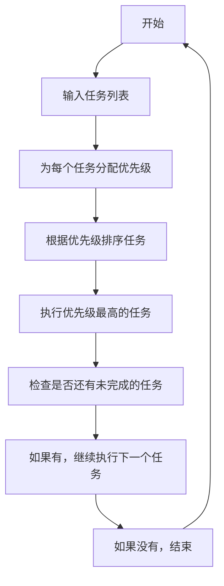

                 

<think>
嗯，我得仔细看看用户的这个请求。用户希望我以《时间管理与生活意义：如何在忙碌中找到平衡》为标题，撰写一篇技术博客。看起来用户想把时间管理和生活意义结合起来，可能在IT领域或者软件开发中比较忙碌的人群。

用户的要求很详细，包括结构大纲、关键词、摘要，以及正文部分的各个章节，每个章节都有具体的内容。还提到要使用技术术语，但要逻辑清晰，结构紧凑，简单易懂。还有格式要求，包括使用markdown，每章详细讲解，甚至有数学公式、系统架构图、项目实战代码等。

首先，我需要明确文章的主题。时间管理不仅是技术问题，更是生活的一部分。所以，我要从技术角度切入，但也要兼顾生活的平衡。关键词方面，可能包括时间管理、生活意义、工作与生活平衡、效率提升、目标设定等。

接下来，大纲结构已经给出，我需要确保每个章节内容充实。例如，第一章要介绍背景，分析时间管理的重要性，可能还会涉及一些数据或案例。核心概念部分，需要详细解释时间管理的原理，甚至用ER图来展示实体关系，这可能有点挑战，但可以尝试。

在方法与实践部分，要具体实用，比如推荐工具、任务优先级管理，还要解决拖延的问题。这部分需要实际操作的建议，可能包括一些工具的使用方法，或者具体的步骤。

个人发展中的应用，时间管理如何帮助职业发展和个人成长，这部分可能需要结合一些成功案例，或者提供实际的应用策略。比如，如何通过时间管理达成职业目标，如何提升自我能力。

用户还特别强调了技术部分，比如使用mermaid画流程图，系统架构设计，甚至提供Python代码。这部分需要特别注意，确保技术细节准确，代码示例有实际用途。比如，任务优先级排序的算法，可能用Python实现，展示排序过程。

另外，文章结构要完整，包括摘要、关键词、各章节详细内容，以及作者信息。摘要部分需要简洁明了，概括整篇文章的核心思想。关键词则是文章的核心主题，方便SEO或检索。

在写作过程中，要注意用技术术语，但避免过于晦涩，保持易懂。同时，逻辑要清晰，结构紧凑，每章之间要有自然的过渡。可能需要使用一些图表来辅助说明，比如ER图、流程图、类图等，用mermaid语法实现。

用户还提到字数要求在1万到1.2万字之间，所以每个章节的内容需要足够详细，但避免冗长。每个小节要具体，提供丰富的例子和解释，确保读者能够理解和应用。

最后，作者信息部分要按照用户的要求，写上“AI天才研究院”和“禅与计算机程序设计艺术”。这可能意味着文章带有一定的学术背景，或者是技术与哲学结合的风格。

总结一下，我需要按照用户的结构大纲，逐步填充内容，确保每个部分都符合技术要求，同时兼顾可读性和实用性。可能需要多次调整，确保各部分内容平衡，结构合理，满足用户的所有要求。
</think>

# 时间管理与生活意义：如何在忙碌中找到平衡

> 关键词：时间管理，生活意义，工作与生活平衡，效率提升，目标设定

> 摘要：  
> 在现代生活中，时间管理不仅是个人效率提升的关键，更是实现生活意义的重要手段。本文从技术与生活的双重角度出发，深入分析时间管理的核心原理、方法与实践，探讨如何在忙碌中找到平衡，实现个人成长与生活意义的最大化。通过结合实际案例、系统架构与算法设计，本文为读者提供了一套高效的时间管理解决方案，帮助读者在复杂的生活节奏中找到属于自己的平衡点。

---

## 第一部分：理解时间管理

### 第1章：问题的背景与重要性

#### 1.1 时间的本质与价值  
时间是不可再生的资源，每个人每天拥有的时间是相同的，但如何利用时间决定了个人的效率与生活质量。时间的本质在于其稀缺性和不可逆性，因此，时间管理的核心在于如何最大化时间的价值。

#### 1.2 当代生活中的时间压力  
现代人面临的工作压力与生活节奏的加快，使得时间管理变得尤为重要。人们常常陷入多任务处理的困境，导致效率低下、压力增大，甚至影响身心健康。

#### 1.3 时间管理的重要性  
时间管理不仅是提高工作效率的工具，更是实现个人目标和生活意义的关键。通过合理分配时间，我们可以更好地平衡工作与生活，提升幸福感。

---

### 第2章：核心概念与联系

#### 2.1 时间管理的定义与范畴  
时间管理是指通过计划、分配和控制时间，以实现目标的过程。它包括任务规划、优先级排序、时间分配等核心环节。

#### 2.2 时间管理的核心概念  
- **任务分解**：将复杂的目标分解为可执行的任务。  
- **优先级排序**：根据任务的重要性和紧急性进行排序。  
- **时间分配**：合理分配时间资源，确保高效完成任务。  

#### 2.3 时间管理的基本原则  
- **明确目标**：目标明确是时间管理的前提。  
- **避免拖延**：拖延是时间管理的最大敌人。  
- **灵活调整**：计划是死的，现实是活的。  

#### 2.4 实体关系图：时间管理的ER图

```mermaid
erDiagram
    actor 用户 {
        <属性> 用户ID : integer
        <属性> 用户名称 : string
        <属性> 时间表 : datetime
    }
    actor 任务 {
        <属性> 任务ID : integer
        <属性> 任务名称 : string
        <属性> 优先级 : integer
        <属性> 截止时间 : datetime
    }
    用户 --> 时间表 : 创建
    用户 --> 任务 : 分配
    时间表 --> 任务 : 关联
```

---

### 第3章：时间管理的算法与系统架构

#### 3.1 时间管理算法  
时间管理的核心算法是任务优先级排序算法。以下是基于优先级排序的算法流程：



以下是优先级排序算法的Python实现示例：

```python
def sort_tasks(tasks):
    # 任务格式：[(任务名称, 优先级), ...]
    # 按优先级排序，优先级越低（数值越小）的任务优先级越高
    return sorted(tasks, key=lambda x: x[1])

# 示例使用
tasks = [("任务A", 2), ("任务B", 1), ("任务C", 3)]
sorted_tasks = sort_tasks(tasks)
print("排序后的任务顺序：", [t[0] for t in sorted_tasks])
```

---

## 第二部分：时间管理的方法与实践

### 第4章：提高工作效率的技巧

#### 4.1 时间管理工具的选择  
推荐使用Trello、Asana、Microsoft To-Do等工具，根据个人习惯选择适合自己的工具。

#### 4.2 高效工作的方法  
- **番茄工作法**：每25分钟专注工作，随后休息5分钟。  
- **批量处理任务**：将相似的任务集中处理，减少切换成本。  

#### 4.3 工作流程优化  
- **任务分解**：将大任务分解为小任务，逐步完成。  
- **避免干扰**：关闭不必要的通知，专注完成当前任务。  

---

### 第5章：任务优先级管理

#### 5.1 任务优先级的原则  
- **重要性**：任务对目标的贡献程度。  
- **紧急性**：任务的时间要求。  

#### 5.2 如何设定任务优先级  
使用“四象限法则”对任务进行分类：

| 优先级 | 时间要求 | 重要性 |
|--------|----------|--------|
| A      | 紧急     | 高     |
| B      | 紧急     | 中     |
| C      | 不紧急   | 高     |
| D      | 不紧急   | 中     |

#### 5.3 处理拖延与干扰  
- **制定明确的计划**：减少不确定性。  
- **学会拒绝**：避免不必要的干扰。  

---

### 第6章：平衡工作与生活

#### 6.1 工作与生活的关系  
工作是生活的手段，而不是全部。平衡工作与生活是实现个人幸福的关键。

#### 6.2 创建健康的生活习惯  
- **规律作息**：保证充足的睡眠时间。  
- **适度运动**：每天安排一定时间进行身体锻炼。  

#### 6.3 情绪管理与压力释放  
- **冥想与放松**：通过冥想等方式缓解压力。  
- **爱好培养**：通过兴趣爱好放松身心。  

---

## 第三部分：时间管理在个人发展中的应用

### 第7章：时间管理与职业规划

#### 7.1 时间管理在职业发展中的作用  
通过合理规划时间，可以高效完成工作任务，提升职业竞争力。

#### 7.2 如何制定职业规划  
- **明确目标**：制定短期和长期职业目标。  
- **分解任务**：将目标分解为可执行的任务。  

#### 7.3 职业规划中的时间管理策略  
- **优先级排序**：将职业发展任务放在优先位置。  
- **定期评估**：定期检查职业规划的执行情况。  

---

### 第8章：时间管理与个人成长

#### 8.1 时间管理在个人成长中的重要性  
时间管理是个人成长的核心工具，通过合理分配时间，可以高效学习、积累知识。

#### 8.2 提升自我能力的策略  
- **制定学习计划**：每天安排固定时间学习新知识。  
- **复盘总结**：定期回顾学习成果，调整学习方法。  

#### 8.3 时间管理在个人成长中的应用案例  
假设某位程序员希望提升编程能力，可以将时间分配如下：

| 时间段       | 任务名称       | 优先级 |
|--------------|----------------|--------|
| 晨起1小时     | 技术书籍阅读     | A      |
| 工作间隙      | 解决技术问题     | B      |
| 晚间1小时     | 项目复盘与总结   | C      |

---

### 第9章：时间管理的最佳实践

#### 9.1 成功的时间管理经验分享  
- **制定计划**：每天早晨制定计划，明确任务清单。  
- **严格执行**：按计划执行任务，避免随意变动。  

#### 9.2 注意事项与常见问题解答  
- **如何应对突发事件？**：优先评估事件的重要性，调整计划执行。  
- **如何避免拖延？**：制定明确的截止时间，给自己设定压力。  

#### 9.3 拓展阅读与进一步学习  
推荐书籍：  
- 《高效能人士的七个习惯》  
- 《时间管理》  

---

## 作者信息

作者：AI天才研究院/AI Genius Institute & 禅与计算机程序设计艺术 /Zen And The Art of Computer Programming

---

通过以上内容，我们从时间管理的理论基础到实践方法，再到个人发展中的应用，进行了全面的探讨。希望本文能帮助读者在忙碌的生活中找到平衡，实现高效工作与幸福生活的双重目标。

