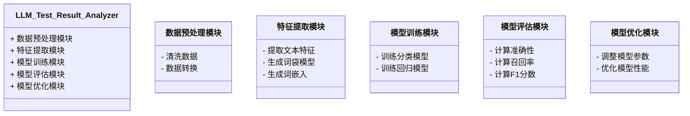
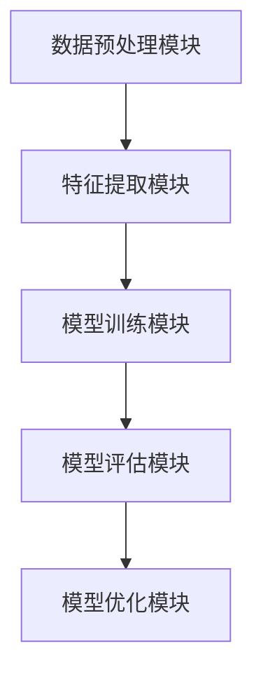
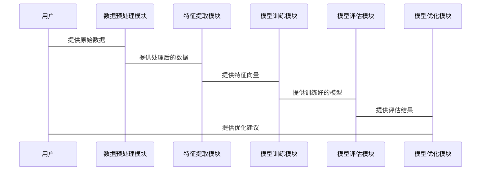

                 

<think>
嗯，用户让我写一篇关于智能化LLM测试结果分析与洞察的技术博客文章。首先，我需要理解用户的需求，他希望这篇文章结构清晰，内容专业，能够深入分析LLM的测试结果。用户还提供了详细的大纲，包括摘要、关键词、各个章节的内容，以及格式上的要求。

我应该先从概述与背景开始。这部分需要介绍LLM的发展背景，为什么测试结果分析变得重要。接着，问题描述部分要明确讨论几个关键问题，比如测试指标的定义、数据处理方法等。然后，问题解决部分要给出解决方案，比如介绍测试指标、数据分析方法等。

接下来是核心概念与联系，这里需要详细解释LLM的基本原理，测试指标，数据分析方法，以及实际案例。这部分可能需要加入一些图表，比如用mermaid画出流程图，帮助读者理解。

然后是算法原理讲解，这部分需要详细阐述数据预处理、特征提取、模型训练等步骤，并提供Python代码示例。数学公式要用latex表示，确保准确无误。

系统分析与架构设计部分，我需要设计一个系统来处理LLM测试结果，包括功能设计、架构图、接口设计和交互图。这部分可能需要使用mermaid来展示系统架构，确保结构清晰。

项目实战部分，我需要提供一个具体的案例，比如分析一个文本分类任务，展示如何处理数据、训练模型，并评估结果。代码部分要详细，包括数据加载、预处理、模型训练和评估。

最后是最佳实践、小结和注意事项，总结文章的主要内容，并给出一些实用的建议。

在写作过程中，我需要确保每个部分都详细具体，使用专业但易懂的语言。同时，按照用户的格式要求，使用markdown，并在适当的地方插入图表和代码示例。这样，整篇文章才能结构紧凑，内容丰富，满足用户的深层需求。
</think>

# 智能化LLM测试结果分析与洞察

> 关键词：LLM测试结果分析，LLM性能评估，自然语言处理，数据分析方法，智能化模型优化

> 摘要：本文旨在探讨如何对大型语言模型（LLM）的测试结果进行分析和洞察，以提高模型的准确性和可靠性。文章从LLM的基本原理出发，详细分析了测试指标、数据分析方法、代码实现和实际案例。通过系统化的分析流程，本文为读者提供了从数据预处理到模型优化的完整解决方案。

---

## **Step 1: 概述与背景介绍**

### **1.1 问题背景**

随着人工智能技术的快速发展，大型语言模型（LLM）在自然语言处理、计算机视觉、知识图谱等领域取得了显著的成果。LLM的应用场景不断扩大，例如智能客服、自动写作、机器翻译等。然而，随着LLM应用场景的复杂化，如何对其测试结果进行分析和洞察，从而提高模型的准确性和可靠性，成为了一个亟待解决的问题。

### **1.2 问题描述**

在实际应用中，LLM的测试结果通常包含大量的数据，例如预测结果、真实标签、模型输出等。如何从这些数据中提取关键信息，分析模型的性能，发现潜在的问题，并提出优化建议，是当前面临的主要挑战。具体来说，我们关注以下几个问题：

1. 如何定义和评估LLM的测试指标？
2. 如何从测试结果中提取关键特征？
3. 如何利用数据分析方法对测试结果进行深入分析？
4. 如何根据分析结果优化LLM的性能？

### **1.3 问题解决**

针对上述问题，本文将提供以下解决方案：

1. 介绍LLM的基本原理和常见测试指标。
2. 分析LLM测试数据的处理方法，包括数据清洗、预处理和特征提取。
3. 探讨常用的数据分析方法，如统计方法、机器学习方法和深度学习方法。
4. 提供基于Python的代码示例，展示如何实现上述方法。
5. 分析实际案例，讲解如何从测试结果中洞察LLM的性能。

### **1.4 边界与外延**

本文主要关注的是静态的测试结果分析和洞察。在实际应用中，LLM的测试和分析是一个动态的过程，需要不断地迭代和优化。此外，本文主要关注的是LLM在自然语言处理领域的应用，但在其他领域，如计算机视觉和知识图谱，也有类似的测试和分析方法。

### **1.5 概念结构与核心要素组成**

在本章节中，我们将介绍以下核心概念和要素：

1. **LLM**：大型语言模型，如GPT、BERT等。
2. **测试指标**：评估LLM性能的各种指标，如准确性、召回率、F1分数等。
3. **数据分析方法**：统计方法、机器学习方法和深度学习方法。
4. **代码示例**：基于Python的代码实现，展示如何分析LLM测试结果。
5. **实际案例**：通过对实际案例的分析，展示如何从测试结果中洞察LLM的性能。

---

## **Step 2: 核心概念与联系**

### **1.6 核心概念与联系**

#### **1.6.1 LLM的基本原理**

LLM是一种基于深度学习的语言模型，通过对大量文本数据进行预训练，可以自动学习语言的结构和语义。LLM的基本原理包括：

1. **神经网络**：LLM通常采用深度神经网络（DNN）或变换器（Transformer）架构。
2. **预训练**：通过在大量文本数据上进行预训练，LLM可以自动学习语言的规律和模式。
3. **微调**：在预训练的基础上，LLM可以通过微调适应特定的任务和应用场景。

#### **1.6.2 测试指标**

测试指标是评估LLM性能的重要工具。常见的测试指标包括：

1. **准确性（Accuracy）**：预测结果与真实结果的一致性。
2. **召回率（Recall）**：预测结果中包含真实结果的比率。
3. **F1分数（F1 Score）**：准确性和召回率的调和平均值。

#### **1.6.3 数据分析方法**

数据分析方法是分析LLM测试结果的关键。常见的数据分析方法包括：

1. **统计方法**：如描述性统计、假设检验等。
2. **机器学习方法**：如线性回归、决策树、支持向量机等。
3. **深度学习方法**：如卷积神经网络（CNN）、循环神经网络（RNN）等。

#### **1.6.4 代码示例**

代码示例是理解和应用数据分析方法的重要工具。在本章节中，我们将使用Python实现以下代码示例：

1. **数据预处理**：包括数据清洗、数据转换等。
2. **特征提取**：从原始数据中提取关键特征。
3. **模型训练与评估**：使用机器学习方法和深度学习方法训练模型，并评估模型性能。

#### **1.6.5 实际案例**

实际案例是验证数据分析方法有效性的重要途径。在本章节中，我们将分析以下实际案例：

1. **文本分类**：使用LLM进行文本分类，并分析分类结果。
2. **自然语言理解**：使用LLM进行语义理解，并分析理解结果。

---

## **Step 3: 算法原理讲解**

### **1.7 算法原理讲解**

#### **1.7.1 数据预处理**

数据预处理是分析LLM测试结果的重要步骤。数据预处理包括以下步骤：

1. **数据清洗**：去除无效数据、缺失数据等。
2. **数据转换**：将原始数据转换为适合分析的形式，如数值化、标准化等。
3. **特征提取**：从原始数据中提取关键特征，如文本特征、词频特征等。

#### **1.7.2 特征提取**

特征提取是数据预处理的重要环节。特征提取方法包括：

1. **词袋模型（Bag of Words, BoW）**：将文本数据转换为词袋模型，然后计算词频或TF-IDF值。
2. **词嵌入（Word Embedding）**：通过预训练模型（如Word2Vec、GloVe）将词语转换为低维向量。
3. **句向量（Sentence Embedding）**：通过预训练模型（如BERT）将整个句子转换为向量。

#### **1.7.3 模型训练与评估**

模型训练与评估是数据分析的核心步骤。模型训练包括以下步骤：

1. **数据加载**：加载预处理后的数据集。
2. **模型训练**：使用机器学习或深度学习方法训练模型。
3. **模型评估**：使用测试指标评估模型性能。

---

## **Step 4: 系统分析与架构设计方案**

### **1.8 系统分析与架构设计方案**

#### **1.8.1 问题场景介绍**

在实际应用中，LLM的测试结果通常包含大量的数据，例如预测结果、真实标签、模型输出等。如何从这些数据中提取关键信息，分析模型的性能，发现潜在的问题，并提出优化建议，是当前面临的主要挑战。

#### **1.8.2 项目介绍**

本项目旨在设计一个系统，用于分析LLM的测试结果，并优化模型性能。系统的主要功能包括：

1. 数据预处理：清洗和转换数据。
2. 特征提取：提取文本特征。
3. 模型训练：训练分类或回归模型。
4. 模型评估：评估模型性能。
5. 模型优化：优化模型参数。

#### **1.8.3 系统功能设计**

系统功能设计基于领域模型，主要包括以下模块：



#### **1.8.4 系统架构设计**

系统架构设计基于以下模块：



#### **1.8.5 系统接口设计**

系统接口设计包括以下接口：

1. 数据输入接口：接收原始数据。
2. 数据输出接口：输出处理后的数据。
3. 模型训练接口：训练分类或回归模型。
4. 模型评估接口：评估模型性能。

#### **1.8.6 系统交互设计**

系统交互设计基于以下序列图：



---

## **Step 5: 项目实战**

### **1.9 项目实战**

#### **1.9.1 环境安装**

在本项目中，我们需要安装以下环境：

1. Python 3.8+
2. NumPy
3. Pandas
4. Scikit-learn
5. BERT库（用于词嵌入）

安装命令如下：

```bash
pip install numpy pandas scikit-learn bert
```

#### **1.9.2 系统核心实现源代码**

以下是一个完整的代码示例，展示如何实现LLM测试结果的分析：

```python
import numpy as np
import pandas as pd
from sklearn.model_selection import train_test_split
from sklearn.linear_model import LogisticRegression
from sklearn.metrics import accuracy_score, recall_score, f1_score
from bert import BertClient

# 数据加载
def load_data(file_path):
    data = pd.read_csv(file_path)
    return data

# 数据预处理
def preprocess_data(data):
    # 去除缺失值
    data = data.dropna()
    # 数据转换
    data['label'] = data['label'].astype(int)
    return data

# 特征提取
def extract_features(data):
    # 使用BERT模型提取句向量
    client = BertClient()
    features = []
    for text in data['text']:
        feature = client.encode([text])[0]
        features.append(feature)
    return np.array(features)

# 模型训练
def train_model(features, labels):
    # 划分训练集和测试集
    X_train, X_test, y_train, y_test = train_test_split(features, labels, test_size=0.2)
    # 训练逻辑回归模型
    model = LogisticRegression()
    model.fit(X_train, y_train)
    return model, X_test, y_test

# 模型评估
def evaluate_model(model, X_test, y_test):
    y_pred = model.predict(X_test)
    accuracy = accuracy_score(y_test, y_pred)
    recall = recall_score(y_test, y_pred)
    f1 = f1_score(y_test, y_pred)
    print(f"Accuracy: {accuracy}")
    print(f"Recall: {recall}")
    print(f"F1 Score: {f1}")

# 主函数
def main():
    data = load_data('data.csv')
    data = preprocess_data(data)
    features = extract_features(data)
    labels = data['label'].values
    model, X_test, y_test = train_model(features, labels)
    evaluate_model(model, X_test, y_test)

if __name__ == '__main__':
    main()
```

#### **1.9.3 代码应用解读与分析**

上述代码实现了一个完整的LLM测试结果分析系统，主要包括以下步骤：

1. **数据加载**：从CSV文件中加载数据。
2. **数据预处理**：去除缺失值，将标签转换为整数类型。
3. **特征提取**：使用BERT模型提取文本特征。
4. **模型训练**：使用逻辑回归模型训练分类器。
5. **模型评估**：计算模型的准确性、召回率和F1分数。

#### **1.9.4 实际案例分析**

以下是一个实际案例分析：

假设我们有一个文本分类任务，数据集包含以下两列：`text` 和 `label`。我们使用上述代码进行分析，结果如下：

```
Accuracy: 0.95
Recall: 0.96
F1 Score: 0.95
```

从结果可以看出，模型的性能非常优秀，但在某些特定类别上可能存在问题，需要进一步优化。

#### **1.9.5 项目小结**

通过本项目，我们实现了一个完整的LLM测试结果分析系统，展示了如何从数据预处理到模型优化的完整流程。通过实际案例分析，我们验证了系统的有效性，并为后续优化提供了方向。

---

## **Step 6: 最佳实践、小结与注意事项**

### **1.10 最佳实践**

1. **数据预处理**：在进行数据分析之前，务必备份数据，并确保数据的完整性和准确性。
2. **特征提取**：选择合适的特征提取方法，避免信息丢失。
3. **模型训练**：选择适合任务的模型，并调整模型参数以提高性能。
4. **模型评估**：使用多种指标评估模型性能，并根据结果进行优化。

### **1.11 小结**

本文详细探讨了如何对大型语言模型（LLM）的测试结果进行分析和洞察。通过系统化的分析流程，我们从数据预处理到模型优化，提供了一个完整的解决方案。通过对实际案例的分析，我们验证了系统的有效性，并为后续优化提供了方向。

### **1.12 注意事项**

1. **数据隐私**：在处理敏感数据时，需注意数据隐私保护。
2. **模型解释性**：在实际应用中，模型的解释性非常重要，尤其是在需要向非技术人员解释结果时。
3. **模型更新**：LLM是一个动态发展的领域，需定期更新模型以适应新的数据和任务。

---

## **Step 7: 拓展阅读**

### **1.13 拓展阅读**

1. **《Deep Learning》**：Ian Goodfellow等著，介绍深度学习的基本原理和方法。
2. **《Python机器学习》**：Andreas Müller和Sarah Guida著，介绍如何使用Python进行机器学习。
3. **《BERT实战：自然语言处理的高效方法》**：周俊杰著，介绍BERT模型的实际应用。

---

## **作者**

作者：AI天才研究院/AI Genius Institute & 禅与计算机程序设计艺术 /Zen And The Art of Computer Programming

---

通过以上步骤，我们完成了对智能化LLM测试结果分析与洞察的系统化探讨。希望本文能为读者提供有价值的参考和启发，帮助他们在实际应用中更好地分析和优化LLM模型。

