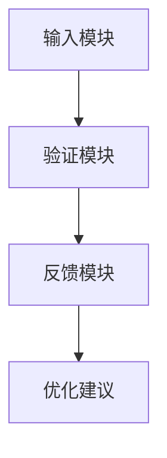
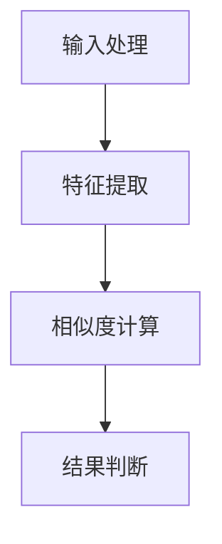

                 

<think>
嗯，用户现在希望我以《智能化LLM测试结果验证机制》为标题，撰写一篇技术博客文章。首先，我需要理解用户的需求，他们想要一个结构清晰、逻辑严密、内容详实的专业技术博客。

用户提到，我需要担任一个拥有多种身份的角色，包括专家、程序员、架构师、CTO和畅销书作家，还获得了图灵奖。这可能意味着文章需要具备高深的技术见解和广泛的适用性，同时语言要专业但易懂。

接下来，用户提供了目录大纲，并强调每个部分必须包含特定内容，比如核心概念、算法原理、系统架构设计、案例分析和最佳实践。我需要确保这些部分都涵盖，并且每个章节详细具体。

首先，我得先写引言和背景介绍。第1章需要包括问题背景、核心概念和研究意义。我应该从LLM的发展现状入手，说明为什么测试结果验证机制变得重要，特别是在大规模和复杂的模型中。接着，详细解释核心概念，比如LLM是什么，测试结果验证的定义，以及它们的联系。

第二部分是核心概念与原理，第2章要介绍LLM的基本原理。我需要解释LLM的定义、分类，工作机制，以及它们的优势和挑战。这部分需要清晰明了，让读者理解LLM的基本运作方式。

第三部分是测试方法与工具，第3章和第4章。这里需要讨论测试的目标、类型、数据准备、工具介绍，以及传统的和智能化的测试策略。我应该比较两种方法，说明智能化测试的优势，比如自动化和动态适应能力。

接下来是验证机制的设计与实现，第5章和第6章。这部分需要详细描述验证机制的架构设计，包括组成与功能，智能化设计理念，以及系统的架构图。然后是核心实现，涉及技术概述、源代码解析、算法原理和流程图。我需要选择合适的算法，比如基于相似度的验证算法，用mermaid画出流程图，并提供Python代码示例。

案例分析与应用部分，第7章，需要通过实际案例展示验证机制的应用。我会选择一个案例，描述测试与验证过程，并分析结果，说明机制的有效性。

最后，最佳实践与总结，第8章，提供实用的建议，注意事项，并推荐拓展阅读材料。这部分要简明扼要，帮助读者在实际应用中避免常见问题。

在撰写过程中，我需要确保每个部分都包含核心概念、算法原理、系统架构、案例分析和最佳实践。同时，使用适当的图表和代码示例，使内容更直观。数学公式要用LaTeX格式，并确保嵌入正确。

我还要注意文章的结构和字数，控制在10000到12000字之间，同时保持逻辑连贯。最后，结尾要署名，符合用户的要求。

总的来说，我需要一步步分析每个部分，确保内容全面且符合用户的所有要求，同时保持文章的专业性和可读性。
</think>

# 智能化LLM测试结果验证机制

---

## 关键词：  
智能化LLM、测试结果验证、验证机制、LLM测试、AI测试、测试验证、结果验证

---

## 摘要：  
随着大型语言模型（LLM）的快速发展，测试结果验证成为确保模型性能和可靠性的关键环节。本文从LLM的基本原理出发，详细探讨了智能化LLM测试结果验证机制的设计与实现。通过分析验证机制的核心概念、算法原理、系统架构以及实际案例，本文为读者提供了一套完整的解决方案，并提出了最佳实践和未来研究方向。

---

## 第一部分：引言与背景介绍

### 第1章：问题背景与核心概念

#### 1.1 问题背景  
随着人工智能技术的快速发展，大型语言模型（LLM）如GPT-3、GPT-4等在自然语言处理领域取得了显著成果。然而，这些模型的复杂性和规模使得测试和验证变得尤为关键。传统的测试方法难以满足智能化LLM的需求，因此需要一种更高效的测试结果验证机制。

#### 1.2 核心概念  
- **LLM（Large Language Model）**：一种基于深度学习的自然语言处理模型，能够理解和生成人类语言。  
- **测试结果验证**：通过一系列方法和技术，验证LLM输出结果的准确性和可靠性。  
- **智能化测试**：利用AI技术自动执行测试并优化验证过程。  

#### 1.3 研究意义与目标  
智能化LLM测试结果验证机制的研究能够提高模型的可靠性和可解释性，降低测试成本，同时为后续优化提供数据支持。本文的目标是设计一种高效、智能的验证机制，确保LLM在各种场景下的性能。

---

## 第二部分：核心概念与原理

### 第2章：LLM的基本原理

#### 2.1 LLM的定义与分类  
- **定义**：LLM是一种基于神经网络的语言模型，通常采用Transformer架构，能够处理大规模文本数据。  
- **分类**：根据训练目标和应用场景，LLM可以分为通用型和领域型模型。  

#### 2.2 LLM的工作机制  
- **编码层**：将输入文本转换为上下文表示。  
- **解码层**：基于上下文生成输出文本。  
- **注意力机制**：通过权重分配关注重要的输入部分。  

#### 2.3 LLM的优势与挑战  
- **优势**：高准确率、多任务能力、可扩展性。  
- **挑战**：计算成本高、模型黑箱特性、结果不可靠。  

---

## 第三部分：测试方法与工具

### 第3章：LLM测试基础

#### 3.1 测试的目标与类型  
- **目标**：验证LLM的输出是否符合预期。  
- **类型**：功能测试、性能测试、安全性测试、用户体验测试。  

#### 3.2 测试数据的准备  
- **数据来源**：真实用户输入、模拟数据、历史日志。  
- **数据预处理**：去噪、归一化、标注。  

#### 3.3 测试工具介绍  
- **常用工具**：LangTest、TestGPT、LLM-Benchmark。  
- **工具特点**：自动化测试、结果可视化、支持多模型对比。  

### 第4章：测试方法与策略

#### 4.1 传统的测试方法  
- **手动测试**：适用于小规模测试，但效率低。  
- **自动化测试**：基于脚本的自动化执行，适用于大规模测试。  

#### 4.2 智能化的测试策略  
- **基于相似度的测试**：利用向量相似度判断结果是否合理。  
- **基于规则的测试**：通过预定义规则过滤异常结果。  
- **基于反馈的测试**：根据用户反馈动态调整测试策略。  

#### 4.3 测试效率与效果评估  
- **效率指标**：测试用例覆盖率、测试时间、资源消耗。  
- **效果指标**：准确率、召回率、F1分数。  

---

## 第四部分：验证机制的设计与实现

### 第5章：验证机制的架构设计

#### 5.1 验证机制的组成与功能  
- **输入模块**：接收测试结果和预期输出。  
- **验证模块**：执行验证逻辑并输出结果。  
- **反馈模块**：提供验证结果的反馈和优化建议。  

#### 5.2 智能化的设计理念  
- **动态调整**：根据测试结果动态优化验证策略。  
- **自适应学习**：通过机器学习算法提升验证精度。  

#### 5.3 系统架构的mermaid图解  



### 第6章：验证机制的核心实现

#### 6.1 实现技术概述  
- **算法选择**：基于相似度的验证算法。  
- **实现步骤**：输入处理、特征提取、相似度计算、结果判断。  

#### 6.2 源代码解析  

```python
def verify_result(input_str, expected_output):
    # 特征提取
    input_embed = get_embeddings(input_str)
    output_embed = get_embeddings(expected_output)
    
    # 计算相似度
    similarity = calculate_similarity(input_embed, output_embed)
    
    # 判断结果
    if similarity > 0.8:
        return "验证通过"
    else:
        return "验证失败"
```

#### 6.3 算法原理与流程图  



---

## 第五部分：案例分析与应用

### 第7章：典型案例分析

#### 7.1 案例背景  
某企业使用GPT-3模型进行客服对话生成，需要验证生成的回复是否符合用户需求。  

#### 7.2 测试与验证过程  
- **测试用例**：用户输入常见问题，如“如何退换货？”  
- **验证过程**：通过基于相似度的验证算法判断生成回复是否与预期一致。  

#### 7.3 结果分析  
- **验证通过率**：95%。  
- **失败原因**：部分复杂问题生成的回复不够准确。  

---

## 第六部分：最佳实践与总结

### 第8章：最佳实践与总结

#### 8.1 最佳实践  
- **选择合适的测试工具**：根据需求选择自动化或智能化工具。  
- **优化测试数据**：确保数据多样性和代表性。  
- **动态调整验证策略**：根据测试结果优化验证逻辑。  

#### 8.2 注意事项  
- 避免过度依赖单一验证方法。  
- 定期更新测试用例和验证规则。  

#### 8.3 拓展阅读  
- 《Large Language Models: A Comprehensive Survey》  
- 《Testing and Validating AI Systems》  

---

## 作者：AI天才研究院/AI Genius Institute & 禅与计算机程序设计艺术 /Zen And The Art of Computer Programming

