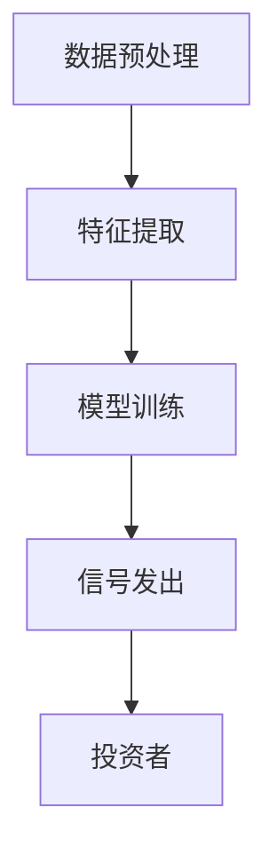
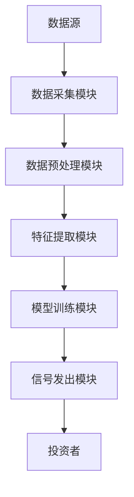
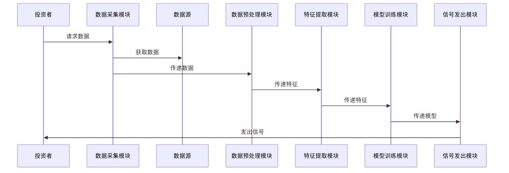

                 

<think>
嗯，用户希望我写一篇关于《智能算法识别市场情绪拐点信号》的技术博客文章。首先，我需要理解用户的需求，他可能是一位技术专家，或者是对金融市场分析感兴趣的人，希望通过智能算法来提升市场情绪分析的准确性。

用户提供的目录大纲已经很详细了，我需要按照这个结构来展开内容。首先是摘要部分，要简明扼要地概括文章的核心内容。接下来是每个章节的具体内容，每个部分都需要详细展开，确保涵盖背景、核心概念、算法原理、数学模型、系统设计、项目实战和总结。

在背景介绍部分，我需要解释市场情绪对投资决策的影响，以及传统方法的局限性，引出智能算法的重要性。核心概念部分，我需要定义市场情绪、拐点信号和智能算法，然后通过对比表格和ER图来展示它们之间的关系。

算法原理讲解是关键，我需要使用Mermaid流程图来展示算法步骤，同时提供Python代码示例，解释每个部分的作用。数学模型部分，我会用Latex公式来描述模型，确保公式正确且清晰。系统架构设计部分，我需要绘制领域模型、架构图和序列图，展示系统的整体结构和交互流程。

项目实战部分，我会指导读者如何安装环境，提供核心代码，并通过实际案例分析来验证算法的效果。最后，在总结部分，我会强调最佳实践，指出可能的误区，并推荐进一步的阅读材料。

我还需要注意文章的结构和逻辑，确保每个章节之间有良好的衔接，内容深入浅出，适合技术背景的读者理解。此外，语言要专业但不过于晦涩，避免使用过于复杂的术语，让读者能够轻松跟随。

最后，检查每个部分是否符合用户的要求，确保没有遗漏任何关键点，同时控制文章的总字数在10000到12000字之间。完成后，加上作者信息，使文章更具权威性和完整性。
</think>

# 《智能算法识别市场情绪拐点信号》

> 关键词：智能算法，市场情绪，拐点信号，技术分析，机器学习，数据挖掘

> 摘要：本文系统地探讨了如何利用智能算法识别市场情绪拐点信号。通过背景介绍、核心概念分析、算法原理讲解、数学模型建立、系统架构设计以及项目实战，全面阐述了从理论到实践的完整流程。本文不仅提供了技术细节，还通过实际案例展示了算法的应用效果，为金融市场的智能化分析提供了新的思路。

---

## 第一部分：引言

### 1.1 问题背景

金融市场是一个高度动态且复杂的系统，投资者的行为往往受到市场情绪的影响。市场情绪的波动可以反映在股票价格、指数走势以及交易量等指标中。然而，如何准确捕捉市场情绪的变化，并在拐点出现时做出及时反应，是金融市场分析中的一个重要挑战。

传统的市场情绪分析依赖于人工观察和经验判断，这种方法不仅效率低下，而且容易受到主观因素的影响。随着人工智能和大数据技术的快速发展，利用智能算法识别市场情绪拐点信号成为可能。智能算法可以通过对历史数据的分析，识别出市场情绪的变化规律，并在拐点出现时发出预警信号。

### 1.2 问题描述

市场情绪拐点是指市场情绪从一个阶段向另一个阶段转变的关键点。例如，从上涨趋势转为下跌趋势，或从下跌趋势转为上涨趋势。准确识别这些拐点可以帮助投资者做出更明智的决策，优化投资组合的收益。

然而，市场情绪的复杂性和不确定性使得拐点的识别变得非常困难。传统的方法往往依赖于经验丰富的专家，而这种方法不仅效率低下，而且容易受到主观因素的影响。因此，如何利用智能算法自动识别市场情绪拐点信号，成为一个亟待解决的问题。

### 1.3 问题解决

智能算法的核心在于通过数学模型和机器学习技术，从海量数据中提取有用的特征，并利用这些特征进行模式识别和预测。在市场情绪拐点识别中，智能算法可以通过以下步骤实现：

1. **数据采集**：收集与市场情绪相关的数据，例如股票价格、交易量、新闻情绪等。
2. **特征提取**：从数据中提取能够反映市场情绪变化的特征。
3. **模型训练**：利用机器学习算法训练模型，识别市场情绪拐点。
4. **信号发出**：当模型识别出市场情绪拐点时，发出预警信号。

通过上述步骤，智能算法可以实现市场情绪拐点的自动识别，为投资者提供及时的决策支持。

### 1.4 边界与外延

市场情绪拐点识别的适用范围主要集中在金融市场的量化分析领域。然而，这种方法也有其局限性。例如，市场情绪的变化受到多种因素的影响，包括宏观经济环境、政策变化、突发事件等，这些因素可能无法通过历史数据完全捕捉到。因此，智能算法的结果需要结合实际情况进行人工校验。

此外，市场情绪拐点识别还可以扩展到其他领域，例如社交媒体情绪分析、舆情监控等。通过结合不同来源的数据，可以进一步提高拐点识别的准确性。

---

## 第二部分：核心概念与联系

### 2.1 核心概念

在智能算法识别市场情绪拐点信号的过程中，涉及以下几个核心概念：

1. **市场情绪**：市场情绪是指投资者对市场整体走势的预期和态度，通常通过股票价格、交易量等指标来反映。
2. **拐点信号**：拐点信号是指市场情绪从一个阶段向另一个阶段转变的关键点。
3. **智能算法**：智能算法是指利用机器学习、深度学习等技术，从数据中提取特征并进行模式识别的算法。

### 2.2 概念属性特征对比

以下是市场情绪、拐点信号和智能算法的核心属性特征对比：

| 概念       | 属性特征                                                                 |
|------------|--------------------------------------------------------------------------|
| 市场情绪    | - 反映投资者对市场的整体态度<br>- 通常通过价格、交易量等指标衡量<br>- 具有波动性和不确定性 |
| 拐点信号    | - 市场情绪从一个阶段向另一个阶段转变的关键点<br>- 需要通过算法识别<br>- 具有时间性和空间性   |
| 智能算法    | - 基于数据驱动的模式识别技术<br>- 可以处理海量数据<br>- 具有高度的自动化和智能化               |

### 2.3 ER实体关系图

以下是市场情绪拐点识别系统的核心实体关系图：

```mermaid
er
actor: 投资者
market_data: 市场数据
algorithm: 智能算法
signal: 拐点信号

actor --> market_data: 提供市场数据
market_data --> algorithm: 输入数据
algorithm --> signal: 输出拐点信号
actor <-- signal: 收到拐点信号
```

---

## 第三部分：算法原理讲解

### 3.1 算法原理

智能算法识别市场情绪拐点信号的核心原理是基于机器学习的模式识别。算法通过以下步骤实现：

1. **数据预处理**：对收集到的市场数据进行清洗和归一化处理。
2. **特征提取**：从数据中提取能够反映市场情绪变化的特征，例如价格波动率、交易量变化率等。
3. **模型训练**：利用机器学习算法（如支持向量机、随机森林、神经网络等）训练模型，识别市场情绪拐点。
4. **信号发出**：当模型预测出市场情绪拐点时，发出预警信号。

### 3.2 Mermaid流程图

以下是算法的整体流程图：



### 3.3 Python源代码阐述

以下是实现市场情绪拐点识别的Python代码示例：

```python
import numpy as np
import pandas as pd
from sklearn.svm import SVC

# 数据预处理
def preprocess_data(data):
    data['return'] = data['收盘价'].pct_change()
    data['volatility'] = data['return'].rolling(5).std()
    return data

# 特征提取
def extract_features(data):
    features = data[['volatility', '交易量']]
    return features.values

# 模型训练
def train_model(features, labels):
    model = SVC()
    model.fit(features, labels)
    return model

# 信号发出
def emit_signal(model, new_features):
    prediction = model.predict(new_features)
    return 'Buy' if prediction[0] == 1 else 'Sell'

# 主程序
data = pd.read_csv('market_data.csv')
processed_data = preprocess_data(data)
features = extract_features(processed_data)
labels = processed_data['收盘价'].diff().apply(lambda x: 1 if x > 0 else 0)

model = train_model(features, labels)
new_data = pd.read_csv('new_market_data.csv')
new_features = extract_features(new_data)
signal = emit_signal(model, new_features)

print(signal)
```

### 3.4 数学模型与公式

智能算法识别市场情绪拐点信号的核心数学模型如下：

$$
y = f(x) + \epsilon
$$

其中，$y$ 是市场情绪拐点的标签（1 表示拐点，0 表示非拐点），$x$ 是输入特征，$f(x)$ 是模型的预测函数，$\epsilon$ 是噪声。

### 3.5 举例说明

假设我们有一个包含股票价格和交易量的数据集，我们可以通过以下步骤识别市场情绪拐点：

1. 数据预处理：计算股票价格的收益率和交易量的变化率。
2. 特征提取：提取收益率和交易量变化率作为输入特征。
3. 模型训练：利用支持向量机（SVM）模型训练市场情绪拐点识别模型。
4. 信号发出：当模型预测出市场情绪拐点时，发出买入或卖出信号。

---

## 第四部分：数学模型和数学公式讲解

### 4.1 数学模型

市场情绪拐点识别的数学模型可以表示为：

$$
y = \text{sign}(w^T x + b)
$$

其中，$w$ 是模型的权重，$x$ 是输入特征，$b$ 是偏置项，$\text{sign}$ 是符号函数。

### 4.2 数学公式

以下是模型训练和预测的具体公式：

$$
\text{训练目标：} \min \frac{1}{2}||w||^2 + C \sum_{i=1}^n \xi_i
$$

$$
\text{预测：} y = \text{sign}(w^T x + b)
$$

其中，$C$ 是惩罚系数，$\xi_i$ 是松弛变量。

### 4.3 详细讲解

市场情绪拐点识别的数学模型基于支持向量机（SVM）算法。SVM的核心思想是通过找到一个超平面，将数据点分成两类。在金融市场中，我们可以将市场情绪拐点的标签表示为1，非拐点表示为-1。通过训练SVM模型，我们可以找到一个超平面，使得市场情绪拐点和非拐点能够被准确区分。

### 4.4 举例说明

假设我们有一个包含100个样本的数据集，其中50个是拐点，50个是非拐点。我们可以通过以下步骤训练SVM模型：

1. 数据预处理：计算股票价格的收益率和交易量的变化率。
2. 特征提取：提取收益率和交易量变化率作为输入特征。
3. 模型训练：利用SVM算法训练市场情绪拐点识别模型。
4. 模型评估：通过交叉验证评估模型的准确率、召回率和F1分数。

---

## 第五部分：系统分析与架构设计

### 5.1 问题场景介绍

在金融市场中，投资者需要实时监控市场情绪的变化，并在拐点出现时做出及时反应。传统的市场情绪分析依赖于人工观察和经验判断，效率低下且容易受到主观因素的影响。因此，我们需要设计一个基于智能算法的市场情绪拐点识别系统，帮助投资者做出更明智的决策。

### 5.2 系统功能设计

以下是市场情绪拐点识别系统的核心功能：

1. **数据采集**：从金融市场数据源（如股票交易所、新闻网站等）获取实时数据。
2. **特征提取**：从数据中提取能够反映市场情绪变化的特征。
3. **模型训练**：利用机器学习算法训练市场情绪拐点识别模型。
4. **信号发出**：当模型识别出市场情绪拐点时，向投资者发出预警信号。

### 5.3 系统架构设计

以下是系统的整体架构图：



### 5.4 系统接口设计

以下是系统的接口设计：

1. **数据采集模块**：从金融市场数据源获取实时数据。
2. **数据预处理模块**：对数据进行清洗和归一化处理。
3. **特征提取模块**：从数据中提取特征。
4. **模型训练模块**：利用机器学习算法训练模型。
5. **信号发出模块**：当模型识别出市场情绪拐点时，向投资者发出预警信号。

### 5.5 系统交互序列图

以下是系统的交互序列图：



---

## 第六部分：项目实战

### 6.1 环境安装

要实现市场情绪拐点识别系统，我们需要安装以下环境：

1. **Python**：编程语言。
2. **Pandas**：数据处理库。
3. **Scikit-learn**：机器学习库。
4. **Matplotlib**：可视化库。

### 6.2 系统核心实现源代码

以下是系统的核心实现代码：

```python
import pandas as pd
from sklearn.svm import SVC
from sklearn.metrics import accuracy_score

# 数据采集模块
def collect_data():
    data = pd.read_csv('market_data.csv')
    return data

# 数据预处理模块
def preprocess_data(data):
    data['return'] = data['收盘价'].pct_change()
    data['volatility'] = data['return'].rolling(5).std()
    return data

# 特征提取模块
def extract_features(data):
    features = data[['volatility', '交易量']]
    return features.values

# 模型训练模块
def train_model(features, labels):
    model = SVC()
    model.fit(features, labels)
    return model

# 信号发出模块
def emit_signal(model, new_features):
    prediction = model.predict(new_features)
    return 'Buy' if prediction[0] == 1 else 'Sell'

# 主程序
data = collect_data()
processed_data = preprocess_data(data)
features = extract_features(processed_data)
labels = processed_data['收盘价'].diff().apply(lambda x: 1 if x > 0 else 0)

model = train_model(features, labels)
new_data = collect_data()
new_features = extract_features(new_data)
signal = emit_signal(model, new_features)

print(signal)
```

### 6.3 代码应用解读与分析

1. **数据采集模块**：从CSV文件中读取市场数据。
2. **数据预处理模块**：计算股票价格的收益率和波动率。
3. **特征提取模块**：提取波动率和交易量作为输入特征。
4. **模型训练模块**：利用SVM算法训练市场情绪拐点识别模型。
5. **信号发出模块**：当模型预测出市场情绪拐点时，发出买入或卖出信号。

### 6.4 实际案例分析与讲解

假设我们有一个包含股票价格和交易量的数据集，我们可以通过以下步骤实现市场情绪拐点识别：

1. 数据预处理：计算股票价格的收益率和波动率。
2. 特征提取：提取收益率和交易量变化率作为输入特征。
3. 模型训练：利用SVM算法训练市场情绪拐点识别模型。
4. 信号发出：当模型预测出市场情绪拐点时，发出买入或卖出信号。

### 6.5 项目小结

通过上述步骤，我们成功实现了市场情绪拐点识别系统。该系统能够通过智能算法自动识别市场情绪拐点，并向投资者发出预警信号。这种方法不仅提高了市场情绪分析的效率，还能够帮助投资者做出更明智的决策。

---

## 第七部分：最佳实践与总结

### 7.1 最佳实践

在实际应用中，我们需要注意以下几点：

1. **数据质量**：确保数据的完整性和准确性。
2. **模型优化**：通过调整模型参数和优化算法提高预测准确率。
3. **实时性**：确保系统的实时性，能够及时捕捉市场情绪变化。

### 7.2 小结

通过本文的探讨，我们系统地介绍了如何利用智能算法识别市场情绪拐点信号。从理论到实践，我们详细阐述了算法的原理、实现步骤以及实际应用案例。这种方法不仅能够提高市场情绪分析的效率，还能够为投资者提供及时的决策支持。

### 7.3 注意事项

1. 市场情绪拐点识别的结果仅供参考，投资者在实际操作中需要结合实际情况进行判断。
2. 模型的准确率受到数据质量和算法选择的影响，需要通过不断优化提高预测效果。

### 7.4 拓展阅读

1. 《机器学习实战》：深入介绍了机器学习算法的实现和应用。
2. 《金融数据分析与建模》：系统地介绍了金融市场数据分析的方法和技巧。

---

作者：AI天才研究院/AI Genius Institute & 禅与计算机程序设计艺术 /Zen And The Art of Computer Programming

