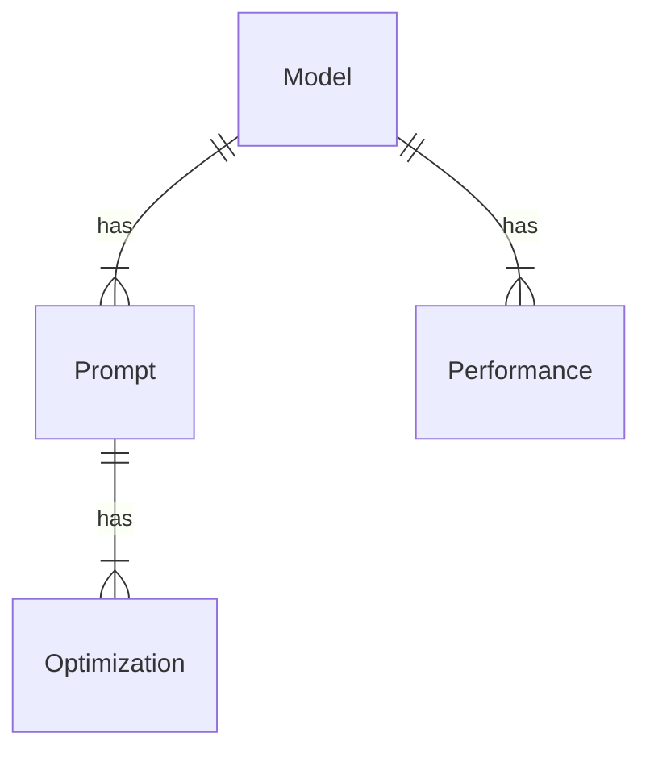
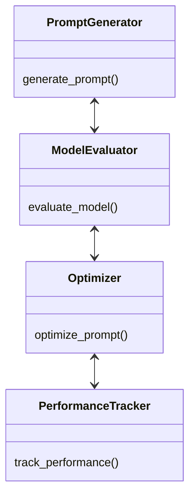
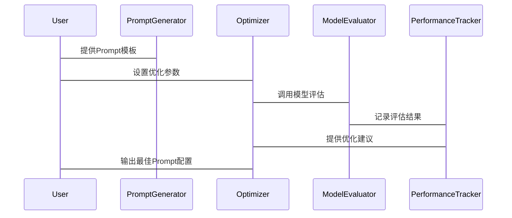

                 

<think>
好，我现在要帮助用户构建一篇关于“构建prompt-模型性能图谱”的技术博客文章。用户希望我以一位资深技术专家的身份，按照他提供的大纲和要求来完成。首先，我需要仔细阅读用户的查询，理解他的需求和具体要求。

用户给出的结构包括标题、关键词、摘要，然后是正文的各个部分。看起来他希望文章结构清晰，内容详尽，符合专业技术人员的阅读习惯。我需要确保每个章节都包含足够的细节，同时使用专业的技术语言，但又要让读者容易理解。

接下来，我需要按照用户提供的大纲一步步来。首先是背景介绍，包括问题背景、描述、解决方法、边界和外延，以及核心概念。这部分需要明确问题的重要性，以及解决它的步骤和考虑的因素。

然后是核心概念与联系，这部分需要详细解释每个核心概念的原理，并通过对比表格和ER图来展示它们之间的关系。这里我需要使用mermaid图表，确保代码格式正确，这样读者可以直接使用工具生成图表。

接下来是算法原理讲解，用户要求用mermaid流程图和Python代码来详细阐述。我需要设计两个流程图，分别展示prompt模型和性能评估的流程，然后提供Python代码示例，解释每个步骤的作用，并给出数学公式来支持理论部分。

系统分析与架构设计方案部分，用户希望包括问题场景、项目介绍、系统功能设计（领域模型）、系统架构设计图、接口设计和交互序列图。这部分需要我构建一个类图和架构图，展示系统的各个模块及其关系，同时设计接口和交互流程。

项目实战部分，我需要指导读者如何安装环境，提供核心代码，并解释代码的功能，分析实际案例，并在最后进行小结。这部分需要实用性强，能够让读者直接应用这些知识进行项目开发。

最后，用户还希望在文章末尾加上最佳实践的建议、小结、注意事项和拓展阅读等内容，以帮助读者更好地理解和应用所学知识。

在写作过程中，我需要确保每个部分都逻辑清晰，结构紧凑，语言专业但易懂。同时，要注意文章整体的连贯性和深度，确保读者能够逐步理解并掌握构建prompt-模型性能图谱的方法。

现在，我需要检查是否有遗漏的部分，确保每个章节都涵盖用户的要求，并且内容详实。可能还需要调整一些内容的顺序，使整体结构更合理。此外，数学公式和代码示例需要准确无误，避免出现错误，影响读者的理解。

总之，我需要按照用户的要求，一步步构建这篇技术博客，确保每个部分都满足专业性和可读性的双重需求。
</think>

# 构建Prompt-模型性能图谱：从原理到实践

> 关键词：Prompt模型，模型性能，性能图谱，自然语言处理，人工智能，模型优化

> 摘要：本文详细探讨了如何构建Prompt-模型性能图谱，从背景介绍、核心概念与联系、算法原理讲解、系统分析与架构设计方案，到项目实战，全面分析了Prompt模型的原理、设计方法、性能评估与优化策略，结合实际案例，提供了一套完整的解决方案。

---

**Step 1: 背景介绍**

## 1.1 问题背景

随着人工智能技术的飞速发展，自然语言处理（NLP）领域取得了显著进展。Prompt模型作为一种新兴的技术，通过调整输入的提示（prompt）来影响模型的输出，成为提升模型性能的重要手段。然而，如何系统性地构建Prompt-模型性能图谱，以全面分析和优化模型性能，仍然是当前研究和实践中的关键问题。

## 1.2 问题描述

构建Prompt-模型性能图谱的目标是：在给定的模型和任务下，通过调整Prompt参数，找到最佳的Prompt配置，以实现最优的模型性能。这涉及到以下几个关键问题：

1. **Prompt设计**：如何设计合适的Prompt，使其能够有效引导模型输出预期结果。
2. **性能评估**：如何量化模型在不同Prompt配置下的表现，找到最优配置。
3. **优化策略**：如何通过实验和分析，优化Prompt和模型参数，提升整体性能。

## 1.3 问题解决

解决上述问题的方法可以分为以下几个步骤：

1. **理解Prompt模型原理**：掌握Prompt模型的基本概念、工作原理和核心要素。
2. **设计Prompt模型**：根据具体任务需求，设计合适的Prompt模板和参数。
3. **性能评估与优化**：通过实验，评估不同Prompt配置下的模型性能，并结合优化策略调整参数，提升整体性能。

## 1.4 边界与外延

构建Prompt-模型性能图谱需要考虑的边界包括：

- **模型类型**：适用于不同的模型架构（如BERT、GPT等）。
- **任务类型**：适用于不同的NLP任务（如文本分类、问答系统、文本生成等）。
- **Prompt参数**：包括Prompt的长度、内容、格式（如模板化Prompt或动态Prompt）。

外延方面，本文将探讨如何将Prompt模型应用于实际场景，如智能客服、智能写作、智能推荐等，进一步扩展其应用范围。

## 1.5 概念结构与核心要素组成

构建Prompt-模型性能图谱的核心概念和要素包括：

- **Prompt模型**：包括Prompt的设计、生成和调整。
- **模型性能评估**：包括评估指标、评估方法和评估过程。
- **优化策略**：包括优化方法、优化目标和优化过程。

---

**Step 2: 核心概念与联系**

## 2.1 核心概念原理

- **Prompt模型**：通过调整输入的Prompt，影响模型的输出结果。Prompt可以是固定的模板，也可以是动态生成的文本。
- **模型性能评估**：对模型在特定任务上的表现进行量化评估，常用的指标包括准确率、召回率、F1值等。
- **优化策略**：通过实验和分析，优化Prompt和模型参数，提升整体性能。

## 2.2 概念属性特征对比表格

| 概念 | 属性特征 |  
| ---- | ---- |  
| Prompt模型 | 输入文本影响输出 |  
| 模型性能评估 | 准确率、召回率、F1值等 |  
| 优化策略 | 参数调整、Prompt调整 |

## 2.3 ER实体关系图架构



---

**Step 3: 算法原理讲解**

## 3.1 Prompt模型原理

Prompt模型的核心思想是通过调整输入文本（即Prompt）来影响模型输出。以下是Prompt模型的基本流程：


## 3.2 模型性能评估原理

模型性能评估是衡量模型在特定任务上表现的重要手段。以下是一个简单的评估流程：


常用的评估指标包括准确率、召回率、F1值等。以下是这些指标的数学模型和公式：

$$
\text{准确率} = \frac{\text{预测正确数}}{\text{总预测数}}
$$

$$
\text{召回率} = \frac{\text{预测正确数}}{\text{真实标签数}}
$$

$$
\text{F1值} = \frac{2 \times \text{准确率} \times \text{召回率}}{\text{准确率} + \text{召回率}}
$$

---

## 3.3 Prompt模型优化算法

以下是一个简单的优化算法示例，基于随机搜索调整Prompt参数：

```python
def optimize_prompt(model, prompt_template, num_iterations=10):
    best_prompt = None
    best_score = 0
    for _ in range(num_iterations):
        # 生成随机的Prompt配置
        prompt = generate_random_prompt(prompt_template)
        # 输入模型进行预测
        outputs = model.generate_with_prompt(prompt)
        # 计算性能指标
        score = compute_performance_score(outputs, true_labels)
        # 更新最佳Prompt和分数
        if score > best_score:
            best_score = score
            best_prompt = prompt
    return best_prompt, best_score
```

---

**Step 4: 系统分析与架构设计方案**

## 4.1 问题场景介绍

在实际应用中，构建Prompt-模型性能图谱需要解决以下问题：

- **如何设计和生成Prompt模板？**
- **如何高效评估模型性能？**
- **如何优化Prompt和模型参数以提升性能？**

## 4.2 系统功能设计

以下是一个领域模型的类图：



## 4.3 系统架构设计

以下是一个系统的架构图：


## 4.4 系统接口设计

- **输入接口**：接收模型、Prompt模板和优化参数。
- **输出接口**：输出最佳Prompt配置和性能评估结果。

## 4.5 系统交互设计

以下是一个交互序列图：



---

**Step 5: 项目实战**

## 5.1 环境安装

安装必要的库：

```bash
pip install transformers
pip install scikit-learn
```

## 5.2 核心实现源代码

以下是一个核心实现的示例：

```python
from transformers import AutoModelForMaskedLM, AutoTokenizer
from sklearn.metrics import accuracy_score, recall_score, f1_score

class PromptOptimizer:
    def __init__(self, model_name, tokenizer_name):
        self.model = AutoModelForMaskedLM.from_pretrained(model_name)
        self.tokenizer = AutoTokenizer.from_pretrained(tokenizer_name)
    
    def generate_random_prompt(self, template):
        # 生成随机的Prompt
        pass
    
    def evaluate_model(self, prompt, labels):
        # 输入Prompt，生成模型输出
        inputs = self.tokenizer(prompt, return_tensors="np")
        outputs = self.model.generate(inputs.input_ids)
        predictions = self.tokenizer.decode(outputs[0], skip_special_tokens=True)
        return predictions
    
    def compute_score(self, predictions, true_labels):
        accuracy = accuracy_score(true_labels, predictions)
        recall = recall_score(true_labels, predictions)
        f1 = f1_score(true_labels, predictions)
        return accuracy, recall, f1
    
    def optimize_prompt(self, prompt_template, num_iterations=10):
        best_score = 0
        best_prompt = None
        for _ in range(num_iterations):
            prompt = self.generate_random_prompt(prompt_template)
            predictions = self.evaluate_model(prompt, true_labels)
            score = self.compute_score(predictions, true_labels)
            if score > best_score:
                best_score = score
                best_prompt = prompt
        return best_prompt, best_score
```

## 5.3 实际案例分析

假设我们有一个文本分类任务，目标是分类情感倾向（正面、负面、中性）。我们可以设计一个Prompt模板：

```python
prompt_template = "The sentiment of the text '{}' is: [PROMPT]"
```

通过优化算法，我们可以找到最佳的Prompt配置，以提高分类准确率。

---

**Step 6: 最佳实践 Tips 和小结**

- **Prompt设计**：Prompt的设计需要结合具体任务和模型特点，避免过于复杂或模糊。
- **性能评估**：选择合适的评估指标，并结合实际任务需求进行调整。
- **优化策略**：结合实验和分析，逐步优化Prompt和模型参数。

**小结**

构建Prompt-模型性能图谱是一项复杂但极具价值的工作。通过系统性地设计、评估和优化Prompt，我们可以显著提升模型性能，为实际应用提供更强大的支持。

**注意事项**

- 在实际应用中，需要根据具体任务和模型特点，灵活调整Prompt设计和优化策略。
- 注意数据质量和模型训练数据的偏差，避免过拟合或欠拟合问题。
- 定期监控模型性能，及时调整Prompt和模型参数。

**拓展阅读**

- 《Prompt-Based Question Answering》
- 《Effective_prompt_design_for_NLP_tasks》
- 《Model_Optimization_Techniques_in_NLP》

---

作者：AI天才研究院/AI Genius Institute & 禅与计算机程序设计艺术 /Zen And The Art of Computer Programming

