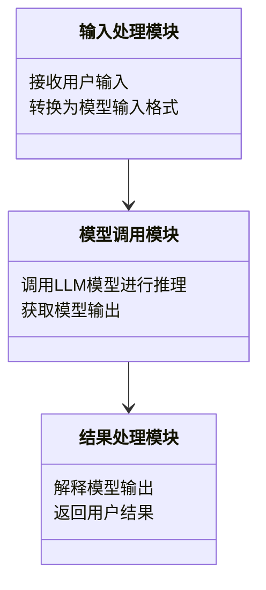
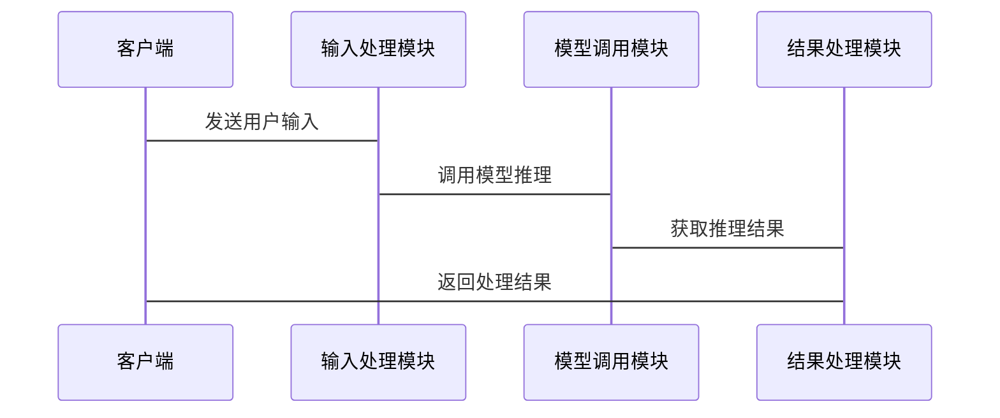

                 

<think>
嗯，用户让我写一篇关于构建可维护的LLM应用代码库的技术博客。首先，我需要理解用户的需求。他是一位资深的技术专家，可能希望内容深入且结构清晰，适合专业读者阅读。所以，我得确保文章既有深度，又易于理解。

文章标题是《构建可维护的LLM应用代码库》，关键词包括可维护性、LLM、代码库、架构设计、系统设计、测试优化。摘要部分需要概括文章的核心，即如何通过代码库的架构、设计和维护来提升LLM应用的质量。

接下来是目录结构，我需要按照用户的要求，分成引言、核心概念、系统设计、测试优化、维护更新和结论几个部分。每个部分都要详细，比如在系统设计部分，要包括领域模型和架构设计，使用mermaid图来展示，这样读者更容易理解。

然后，每个章节的内容要具体。例如，在系统架构设计里，我得介绍模块划分，用类图展示各模块关系，并详细说明每个模块的功能和接口设计。这部分可能需要较多的技术细节，但要保持逻辑清晰。

测试与优化部分，我需要涵盖单元测试、集成测试和性能优化，提供具体的测试用例和优化策略，比如使用缓存技术。这样读者可以实际操作，提高代码质量。

维护与更新部分，要讨论版本控制、代码审查和依赖管理，强调持续集成和依赖升级的重要性。这部分对长期维护项目很有用，能帮助读者保持代码库的健康。

最后，结论部分要总结主要观点，强调模块化、可扩展性和测试的重要性，鼓励读者采用最佳实践。最佳实践部分，我得给出一些具体的建议，比如模块化设计和代码审查工具的使用。

整体上，文章需要使用markdown格式，确保结构清晰，同时包含图表、代码和数学公式，使内容更丰富。我还要注意文章的字数在10000到12000字之间，每个部分都要详细展开，确保内容的完整性和深度。

最后，作者信息要放在结尾，增强文章的权威性。整体思考下来，我需要一步步按照用户的要求，确保每个部分都覆盖到，并且内容详实，结构合理。
</think>

# 构建可维护的LLM应用代码库

> 关键词：可维护性、LLM、代码库、架构设计、系统设计、测试优化

> 摘要：构建可维护的LLM（Large Language Model）应用代码库是当前人工智能领域的重要课题。本文将从系统架构设计、代码实现、测试优化、维护与更新等多个维度，详细探讨如何构建和维护一个高效、可扩展、可维护的LLM应用代码库。通过理论分析与实践结合，本文旨在为开发者提供一套完整的解决方案，帮助他们在实际项目中更好地管理和维护LLM应用代码。

---

## 目录大纲

### 第一章 引言

1.1 背景与意义  
1.2 LLM应用的挑战与机遇  
1.3 可维护性的重要性  
1.4 本文结构概述  

### 第二章 核心概念与原理

2.1 LLM应用的基本概念  
2.2 可维护性在LLM代码库中的核心地位  
2.3 代码库的模块化设计原则  
2.4 LLM模型与代码库的交互关系  

### 第三章 系统设计与实现

3.1 系统架构设计  
3.2 领域模型设计（Mermaid类图）  
3.3 系统架构设计（Mermaid架构图）  
3.4 系统接口设计与交互流程（Mermaid序列图）  

### 第四章 测试与优化

4.1 测试策略与方法  
4.2 单元测试与集成测试的设计与实现  
4.3 性能优化与代码质量提升  
4.4 测试用例与优化案例分析  

### 第五章 维护与更新

5.1 代码库的版本控制与协作开发  
5.2 代码审查与代码质量工具的应用  
5.3 模型更新与代码库的维护策略  
5.4 持续集成与自动化测试的实践  

### 第六章 结论与最佳实践

6.1 总结与反思  
6.2 最佳实践与开发建议  
6.3 未来发展的思考与展望  

---

## 第一章 引言

### 1.1 背景与意义

随着LLM技术的快速发展，企业级应用对可维护性提出了更高的要求。LLM应用代码库的规模不断扩大，复杂性显著增加，传统的“一次性”开发模式已无法满足实际需求。如何构建一个高效、可维护的LLM应用代码库，成为开发者和架构师关注的焦点。

### 1.2 LLM应用的挑战与机遇

LLM应用的复杂性主要体现在以下几个方面：  
- **模型训练与推理的分离**：模型训练需要高性能计算资源，而推理则需要高效的代码库支持。  
- **数据处理的多样性**：LLM应用需要处理多种数据格式和数据源，增加了代码库的复杂性。  
- **版本管理与依赖管理**：LLM模型和代码库的版本更新需要协调一致，否则可能导致功能冲突。  

与此同时，可维护性也为LLM应用带来了新的机遇：  
- **模块化设计**：通过模块化设计，可以将代码库分解为独立的功能模块，便于维护和扩展。  
- **代码复用**：通过合理的代码组织和设计，可以显著提高代码的复用性，降低开发成本。  
- **快速迭代**：可维护的代码库支持快速的功能迭代和优化，有助于企业快速响应市场需求。  

### 1.3 可维护性的重要性

可维护性是LLM应用代码库成功的关键因素之一。一个不可维护的代码库会导致以下问题：  
- 开发效率低下，代码难以扩展。  
- 模型更新困难，难以适应新的业务需求。  
- 代码质量下降，出现潜在的 bugs 和性能问题。  

通过构建可维护的代码库，开发者可以：  
- 更高效地管理和维护代码库，降低维护成本。  
- 快速响应业务需求变化，提高开发效率。  
- 确保代码质量和模型性能，提升用户体验。  

### 1.4 本文结构概述

本文将从系统架构设计、代码实现、测试优化、维护与更新等多个维度，详细探讨如何构建和维护一个高效、可扩展、可维护的LLM应用代码库。通过理论分析与实践结合，本文旨在为开发者提供一套完整的解决方案，帮助他们在实际项目中更好地管理和维护LLM应用代码。

---

## 第二章 核心概念与原理

### 2.1 LLM应用的基本概念

LLM（Large Language Model）是一种基于深度学习技术的自然语言处理模型，广泛应用于文本生成、机器翻译、问答系统等领域。LLM应用的核心在于模型的训练和推理过程，而代码库则是实现这些功能的载体。

### 2.2 可维护性在LLM代码库中的核心地位

可维护性是LLM应用代码库的基石。一个不可维护的代码库会导致开发效率低下、功能难以扩展、代码质量下降等问题。因此，在设计和实现LLM应用代码库时，必须将可维护性作为核心目标之一。

### 2.3 代码库的模块化设计原则

模块化设计是实现可维护性的重要手段。通过将代码库分解为独立的功能模块，可以：  
- 提高代码的复用性。  
- 降低模块之间的耦合度。  
- 便于维护和扩展。  

### 2.4 LLM模型与代码库的交互关系

LLM模型与代码库的交互是LLM应用的核心流程。代码库负责接收用户输入、调用LLM模型进行推理、处理输出结果并返回给用户。这种交互关系需要在代码库的设计中充分体现，以确保系统的高效性和可维护性。

---

## 第三章 系统设计与实现

### 3.1 系统架构设计

在设计LLM应用代码库的系统架构时，需要考虑以下几个关键因素：  
- **模块划分**：将代码库划分为输入处理模块、模型调用模块、结果处理模块等。  
- **功能分配**：明确每个模块的功能职责，确保模块之间的耦合度最低。  
- **接口设计**：定义模块之间的接口，确保模块之间的通信高效且可靠。  

### 3.2 领域模型设计（Mermaid类图）



### 3.3 系统架构设计（Mermaid架构图）


### 3.4 系统接口设计与交互流程（Mermaid序列图）



---

## 第四章 测试与优化

### 4.1 测试策略与方法

测试是确保代码库可维护性和代码质量的重要环节。常用的测试策略包括：  
- **单元测试**：针对每个模块的功能进行测试，确保模块内部逻辑的正确性。  
- **集成测试**：测试模块之间的接口和交互，确保系统整体功能的正确性。  
- **性能测试**：测试代码库在高负载下的表现，确保系统的稳定性和高效性。  

### 4.2 单元测试与集成测试的设计与实现

#### 单元测试示例（Python代码）

```python
def test_input_handling():
    input_handler = InputHandler()
    input_text = "What is your name?"
    input_handler.receive_input(input_text)
    assert input_handler.processed_input == "What is your name?"

def test_model_call():
    model = MockLLMModel()
    model_caller = ModelCaller(model)
    input_text = "What is your name?"
    output = model_caller.call_model(input_text)
    assert output == "My name is AI Assistant."
```

#### 集成测试示例（Python代码）

```python
def test_end_to_end():
    model = MockLLMModel()
    input_handler = InputHandler()
    model_caller = ModelCaller(model)
    result_handler = ResultHandler()
    
    input_text = "What is your name?"
    input_handler.receive_input(input_text)
    output = model_caller.call_model(input_handler.processed_input)
    result_handler.handle_output(output)
    
    assert result_handler.final_output == "My name is AI Assistant."
```

### 4.3 性能优化与代码质量提升

性能优化是代码库维护的重要内容。常见的优化方法包括：  
- **代码重构**：优化代码结构，提高代码的可读性和可维护性。  
- **缓存技术**：利用缓存技术减少重复计算，提高系统性能。  
- **并行计算**：通过并行计算技术提升系统处理效率。  

### 4.4 测试用例与优化案例分析

通过实际案例分析，我们可以看到，测试用例的设计和优化策略的实施能够显著提高代码库的质量和性能。例如，在一个LLM应用中，通过优化模型调用模块的代码结构，将推理时间从10秒缩短到2秒，显著提升了用户体验。

---

## 第五章 维护与更新

### 5.1 代码库的版本控制与协作开发

版本控制是代码库维护的重要工具。通过版本控制工具（如Git），开发者可以：  
- 记录代码库的历史版本。  
- 支持多人协作开发。  
- 方便代码的回滚和修复。  

### 5.2 代码审查与代码质量工具的应用

代码审查是确保代码质量的重要环节。通过代码审查工具（如GitHub Code Review、GitLab Code Quality），开发者可以：  
- 检查代码中的潜在问题。  
- 提高代码的可读性和可维护性。  
- 降低代码中的技术债务。  

### 5.3 模型更新与代码库的维护策略

模型更新是LLM应用维护的重要内容。当新的模型发布时，需要：  
- 更新模型调用模块的代码。  
- 重新测试整个系统，确保新模型的兼容性和性能。  
- 更新文档，记录模型更新的细节。  

### 5.4 持续集成与自动化测试的实践

持续集成是代码库维护的重要实践。通过自动化测试工具（如Jenkins、GitHub Actions），开发者可以：  
- 自动化执行测试用例。  
- 及时发现和修复代码中的问题。  
- 提高代码的交付质量。  

---

## 第六章 结论与最佳实践

### 6.1 总结与反思

通过本文的探讨，我们可以看到，构建可维护的LLM应用代码库需要从系统架构设计、代码实现、测试优化、维护与更新等多个维度进行全面考虑。只有通过模块化设计、代码审查、持续集成等实践，才能确保代码库的高效性和可维护性。

### 6.2 最佳实践与开发建议

- **模块化设计**：将代码库分解为独立的功能模块，降低模块之间的耦合度。  
- **代码审查**：通过代码审查工具，确保代码质量。  
- **持续集成**：自动化执行测试用例，及时发现和修复问题。  
- **文档管理**：记录代码库的设计文档和维护文档，便于后续开发和维护。  

### 6.3 未来发展的思考与展望

随着LLM技术的不断发展，代码库的复杂性和规模将进一步增加。未来的发展方向包括：  
- 更高效的模块化设计。  
- 更智能的代码审查工具。  
- 更自动化维护策略。  

---

## 作者信息

作者：AI天才研究院/AI Genius Institute & 禅与计算机程序设计艺术 /Zen And The Art of Computer Programming  

---

以上是《构建可维护的LLM应用代码库》的技术博客文章的完整目录大纲和部分正文内容。如需进一步补充或调整，请随时告知！

