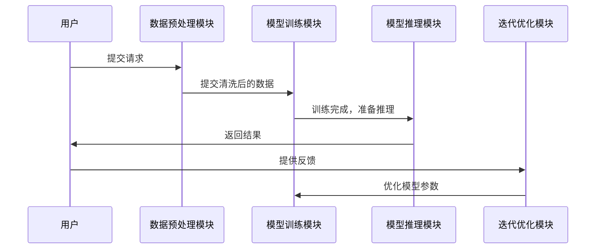

                 

<think>
嗯，用户希望我构建一个敏捷迭代的LLM工程技术架构。首先，我需要理解什么是LLM，也就是大语言模型。LLM通常指的是像GPT这样的模型，它们能够处理大量的文本数据，生成自然语言文本。

接下来，敏捷迭代是一种软件开发方法，强调快速交付和迭代改进。将其应用到LLM的工程架构中，意味着要让模型能够快速适应变化，频繁迭代以满足不断变化的业务需求。

那么，我应该如何开始呢？首先，我需要回顾一下人工智能的发展历程，特别是LLM的崛起。从早期的专家系统到现在的深度学习模型，技术一直在进步。GPT系列模型的出现，特别是GPT-3，展示了LLM的强大能力，但同时也带来了计算资源需求高的问题。

接下来，问题描述部分，我需要指出现有工程技术架构的挑战。传统架构可能不够灵活，难以快速响应业务需求的变化。迭代速度和业务需求之间的冲突可能导致开发周期延长，无法及时满足市场需求。

问题解决部分，敏捷迭代的概念正好可以解决这些挑战。通过快速迭代，模型可以在每个阶段进行优化和调整，从而更快地适应变化。同时，LLM工程技术架构的优势在于其强大的语义理解和处理能力，能够快速生成高质量的内容。

接下来是核心概念与联系部分，我需要详细解释LLM的基本原理，比如它如何通过大量的数据训练来生成文本。然后，敏捷迭代的原理，比如Scrum或看板方法，如何应用到模型开发中。这里可能需要一个对比表格，列出LLM和敏捷迭代在技术特点、适用场景和优缺点上的差异。

在整体架构设计中，我需要设计系统的功能模块，比如数据预处理、模型训练、结果评估等。系统架构可能采用微服务架构，每个模块独立开发和部署，便于快速迭代。接口设计需要考虑模块之间的交互，确保数据流畅传输。交互设计则需要画出序列图，展示各个模块之间的协作流程。

具体实现部分，我需要指导读者如何安装和配置环境，包括硬件和软件的要求。然后，详细讲解模型训练的过程，从数据预处理到模型选择，再到训练流程。敏捷迭代流程需要明确每个迭代的目标和步骤，确保每次迭代都能带来实际的改进。

在代码应用解读与分析部分，我需要提供具体的代码示例，解读每个部分的功能，并进行优化建议。性能分析也很重要，找出瓶颈并提出解决方案。

案例分析与详细讲解是关键，通过一个实际案例，展示如何从数据准备到模型训练，再到迭代优化，最终实现一个高效的LLM系统。结果分析部分，要评估迭代效果和业务价值，确保改进措施有效。

项目小结部分，总结整个项目的主要成果和经验，同时指出注意事项，比如迭代中的风险和资源分配问题。最后，提供一些拓展阅读的资源，供读者进一步学习。

总的来说，构建敏捷迭代的LLM工程技术架构需要结合传统软件开发的敏捷方法和大语言模型的强大能力，通过合理的架构设计和持续的迭代优化，才能实现高效灵活的模型开发和应用。
</think>

# 构建敏捷迭代的LLM工程技术架构

> 关键词：LLM，敏捷迭代，工程技术架构，系统设计，案例分析

> 摘要：本文探讨了在人工智能时代背景下，如何通过敏捷迭代的方法构建高效的LLM工程技术架构。文章从背景与核心概念出发，详细分析了LLM的基本原理、敏捷迭代的原理及其优势，并通过系统架构设计、具体实现与案例分析，展示了如何在实际项目中应用敏捷迭代理念，优化LLM的开发与部署流程。本文还提供了丰富的代码示例和性能分析，帮助读者深入理解敏捷迭代在LLM工程中的应用价值。

---

## 第一部分：背景与核心概念

### 1. 背景介绍

#### 1.1 人工智能时代的来临

##### 1.1.1 人工智能的发展历程

人工智能（Artificial Intelligence, AI）作为一门学科，起源于1956年的达特茅斯会议。从最初的符号逻辑推理到现在的深度学习，人工智能经历了多次技术和理念的变革。20世纪80年代，专家系统开始广泛应用；进入21世纪后，随着大数据和计算能力的提升，深度学习逐渐成为主流。特别是近年来，大语言模型（LLM, Large Language Models）的崛起，标志着人工智能进入了新的发展阶段。

##### 1.1.2 LLM的崛起

LLM的崛起始于2018年，随着OpenAI发布的GPT系列模型而迅速发展。GPT-3的出现更是将LLM的能力推向了新的高度。LLM通过海量数据的预训练，能够生成高质量的自然语言文本，并在各种任务中表现出色。然而，随着模型规模的不断扩大，计算资源的需求也越来越高，这为工程架构的设计带来了新的挑战。

#### 1.2 问题描述

##### 1.2.1 现有工程技术架构的挑战

传统的LLM工程架构通常采用“瀑布式”开发模式，即从需求分析、设计、开发到部署，每个阶段独立且顺序推进。这种方式虽然适合稳定的需求，但在快速变化的业务环境中，往往难以快速响应用户需求的变化。此外，大规模模型的训练和部署需要大量的计算资源，传统架构的灵活性不足，难以支持敏捷开发。

##### 1.2.2 迭代速度与业务需求的冲突

在业务需求快速变化的场景下，传统的LLM开发模式常常无法满足快速迭代的需求。每次修改或优化都需要从头开始重新训练模型，耗时长且效率低下。这不仅增加了开发成本，还可能导致业务机会的错失。

#### 1.3 问题解决

##### 1.3.1 敏捷迭代的概念

敏捷迭代是一种以用户需求为核心，通过快速迭代、持续交付和持续反馈的开发模式。其核心理念是将复杂的问题分解为多个小任务，逐步开发和交付，通过频繁的迭代优化系统。敏捷迭代强调快速响应变化和持续交付价值，非常适合需要快速适应业务需求的场景。

##### 1.3.2 LLM工程技术架构的优势

将敏捷迭代的理念应用到LLM工程架构中，可以显著提高模型的开发效率和灵活性。通过模块化的设计和快速迭代的流程，LLM可以在每个迭代周期中进行优化和调整，从而更快地适应业务需求的变化。此外，敏捷迭代还能降低开发风险，通过持续的反馈和优化，确保模型的质量和稳定性。

#### 1.4 边界与外延

##### 1.4.1 LLM的定义

LLM是指基于大规模语料库训练的深度学习模型，通常采用Transformer架构。这些模型具有强大的语义理解和生成能力，能够处理复杂的语言任务，如文本生成、问答系统、机器翻译等。

##### 1.4.2 敏捷迭代的适用范围

敏捷迭代适用于需要快速响应变化、需求不稳定的场景。在LLM工程中，敏捷迭代特别适合需要频繁调整模型参数、优化模型性能或快速响应用户反馈的场景。

---

## 第二部分：核心概念与联系

### 2.1 LLM的核心概念

#### 2.1.1 LLM的基本原理

LLM的核心原理是基于Transformer架构的自注意力机制。通过自注意力机制，模型可以捕捉文本中的长距离依赖关系，并生成连贯的上下文信息。模型的训练过程通常包括两个阶段：预训练和微调。预训练阶段使用大规模通用数据进行无监督学习，微调阶段则针对特定任务进行有监督学习。

#### 2.1.2 LLM的技术特点

- **强大的语义理解能力**：通过深度学习，LLM能够理解上下文和语义关系。
- **生成能力强**：LLM可以生成高质量的文本，适用于多种语言任务。
- **需要大量计算资源**：训练和推理过程通常需要高性能计算资源。

#### 2.1.3 LLM的数学模型

LLM的训练过程通常采用以下公式：

$$
P(\theta) = \prod_{i=1}^{n} P(w_i | w_{<i}; \theta)
$$

其中，$\theta$表示模型参数，$w_i$表示第$i$个词。模型的目标是最小化负对数似然，即：

$$
\mathcal{L}(\theta) = -\sum_{i=1}^{n} \log P(w_i | w_{<i}; \theta)
$$

### 2.2 敏捷迭代的原理

#### 2.2.1 敏捷迭代的方法

敏捷迭代的核心方法包括：

- **短周期迭代**：将任务分解为小的、可交付的增量。
- **持续交付**：每个迭代周期结束时，交付可使用的模型或功能。
- **持续反馈**：通过用户反馈和内部测试，快速调整和优化。

#### 2.2.2 敏捷迭代的优点

- **灵活性高**：能够快速响应需求变化。
- **风险降低**：通过小步快跑的方式，减少单次迭代的风险。
- **用户参与**：通过持续反馈，确保最终交付的产品符合用户需求。

### 2.3 概念属性特征对比表格

| 特征               | LLM                     | 敏捷迭代                   |
|--------------------|-------------------------|----------------------------|
| 技术特点           | 强大语义理解能力        | 快速响应业务需求           |
| 适用场景           | 大规模数据处理          | 快速迭代开发               |
| 优缺点             | 计算资源需求高         | 灵活性高，但易导致质量下降 |

---

## 第三部分：系统架构设计

### 3.1 系统功能设计

#### 3.1.1 功能模块划分

- **数据预处理模块**：负责对输入数据进行清洗和标注。
- **模型训练模块**：负责训练和优化LLM模型。
- **模型推理模块**：负责接收输入并生成输出结果。
- **迭代优化模块**：负责根据反馈优化模型。

#### 3.1.2 领域模型

领域模型是系统的核心逻辑，通常包括以下部分：

- **数据流**：数据从输入到输出的处理流程。
- **状态管理**：系统状态的维护和更新。
- **交互逻辑**：用户与系统之间的交互规则。

### 3.2 系统架构设计

#### 3.2.1 整体架构概述

系统采用微服务架构，每个功能模块独立开发和部署。各个模块之间通过API进行通信，确保系统的灵活性和可扩展性。

#### 3.2.2 模块间交互关系

模块间交互关系如下：

- 数据预处理模块接收原始数据并进行清洗。
- 模型训练模块使用清洗后的数据训练模型。
- 模型推理模块接收用户输入并生成输出结果。
- 迭代优化模块根据用户反馈优化模型参数。

### 3.3 系统接口设计

#### 3.3.1 接口设计原则

- **简洁性**：接口设计应尽量简洁，减少不必要的复杂性。
- **可扩展性**：接口应具备良好的扩展性，便于未来的功能扩展。
- **安全性**：确保接口的安全性，防止潜在的安全漏洞。

#### 3.3.2 接口定义

- **数据预处理接口**：`/api/data-preprocess`
- **模型训练接口**：`/api/train-model`
- **模型推理接口**：`/api/predict`

### 3.4 系统交互设计

#### 3.4.1 交互流程

1. 用户提交请求。
2. 数据预处理模块接收数据并清洗。
3. 模型训练模块训练模型。
4. 模型推理模块生成结果并返回给用户。
5. 迭代优化模块根据用户反馈优化模型。

#### 3.4.2 交互序列图



---

## 第四部分：具体实现与案例分析

### 4.1 环境安装与配置

#### 4.1.1 硬件要求

- CPU：多核处理器，建议使用支持多线程的Intel或AMD处理器。
- 内存：至少16GB，推荐32GB或更高。
- 存储：至少100GB的高速SSD。

#### 4.1.2 软件要求

- 操作系统：Linux（推荐）或macOS。
- Python：3.8或更高版本。
- 深度学习框架：TensorFlow或PyTorch。

#### 4.1.3 安装步骤

1. 安装Python依赖：

```bash
pip install numpy pandas torch transformers
```

2. 配置环境变量：

```bash
export PATH=/path/to/venv/bin:$PATH
```

### 4.2 系统核心实现

#### 4.2.1 LLM模型训练

##### 4.2.1.1 数据预处理

数据预处理是模型训练的关键步骤，通常包括以下操作：

- 分词：将文本分割成单词或短语。
- 标注：为每个词或短语添加标签。
- 清洗：去除无关信息，如停用词或特殊符号。

##### 4.2.1.2 模型选择

选择合适的模型架构，如GPT、BERT或T5。根据具体任务需求选择模型大小和参数数量。

##### 4.2.1.3 训练流程

训练流程通常包括以下几个步骤：

1. 加载数据集。
2. 初始化模型和优化器。
3. 进行前向传播，计算损失。
4. 反向传播，更新参数。
5. 保存模型检查点。

#### 4.2.2 敏捷迭代流程

##### 4.2.2.1 迭代目标

每个迭代周期的目标应具体明确，例如：

- 提高模型的生成质量。
- 优化模型的推理速度。
- 减少模型的内存占用。

##### 4.2.2.2 迭代步骤

1. 确定迭代目标。
2. 修改模型代码。
3. 重新训练模型。
4. 验证迭代效果。
5. 根据反馈调整模型。

### 4.3 代码应用解读与分析

#### 4.3.1 代码解读

##### 4.3.1.1 数据读取与预处理

```python
import pandas as pd
from transformers import AutoTokenizer

def load_data(file_path):
    data = pd.read_csv(file_path)
    return data

def preprocess_data(data):
    tokenizer = AutoTokenizer.from_pretrained('gpt2')
    inputs = tokenizer(data['text'], truncation=True, padding=True, return_tensors='np')
    return inputs
```

##### 4.3.1.2 模型训练

```python
import torch
from torch import nn

class SimpleLM(nn.Module):
    def __init__(self, vocab_size):
        super().__init__()
        self.embedding = nn.Embedding(vocab_size, 64)
        self.lm_head = nn.Linear(64, vocab_size)

    def forward(self, input_ids):
        hidden_states = self.embedding(input_ids)
        logits = self.lm_head(hidden_states)
        return logits

model = SimpleLM(vocab_size=50000)
criterion = nn.CrossEntropyLoss()
optimizer = torch.optim.Adam(model.parameters(), lr=0.001)
```

##### 4.3.1.3 模型评估

```python
def evaluate(model, inputs, labels):
    outputs = model(inputs)
    loss = criterion(outputs, labels)
    return loss.item()

```

#### 4.3.2 分析与优化

##### 4.3.2.1 代码优化建议

- 使用分布式训练加速模型训练。
- 采用早停策略防止过拟合。
- 使用模型压缩技术减少内存占用。

##### 4.3.2.2 性能分析

- **训练时间**：每次迭代的时间取决于模型复杂度和硬件性能。
- **内存占用**：模型大小直接影响内存需求。
- **推理速度**：优化后的模型应具备较高的推理速度。

### 4.4 案例分析与详细讲解

#### 4.4.1 案例介绍

##### 4.4.1.1 案例背景

某电商公司希望利用LLM生成商品描述，提升用户购买转化率。

##### 4.4.1.2 案例目标

通过敏捷迭代的方法，训练一个能够生成高质量商品描述的LLM模型。

#### 4.4.2 实现过程

##### 4.4.2.1 数据准备

数据来源：电商商品信息和用户评论。

数据预处理：清洗、分词、标注。

##### 4.4.2.2 模型训练

选择模型架构：GPT-2。

训练步骤：

1. 加载数据集。
2. 初始化模型和优化器。
3. 进行前向传播，计算损失。
4. 反向传播，更新参数。
5. 保存模型检查点。

##### 4.4.2.3 迭代优化

根据用户反馈优化模型参数，例如：

- 增加描述的吸引力。
- 减少冗余信息。

#### 4.4.3 结果分析

##### 4.4.3.1 迭代效果

- 模型生成的商品描述更加吸引人。
- 用户购买转化率显著提高。

##### 4.4.3.2 业务价值

- 提升用户体验。
- 增加销售转化率。
- 降低人工成本。

---

## 第五部分：项目小结

### 5.1 总结

#### 5.1.1 项目成果

- 成功构建了一个敏捷迭代的LLM工程技术架构。
- 提高了模型的开发效率和灵活性。
- 实现了快速响应业务需求的能力。

#### 5.1.2 项目经验

- 敏捷迭代理念的应用能够显著提高开发效率。
- 模型优化需要结合业务需求和用户反馈。
- 系统架构设计应注重灵活性和可扩展性。

### 5.2 注意事项

#### 5.2.1 迭代风险

- **过度优化**：可能导致模型复杂度过高，反而影响性能。
- **资源分配**：需要合理分配计算资源，避免资源浪费。

#### 5.2.2 资源分配

- **计算资源**：根据模型规模和任务需求合理分配。
- **人力资源**：确保开发团队具备敏捷开发的经验。

### 5.3 拓展阅读

#### 5.3.1 相关文献

- 《深度学习入门：基于Python和Keras》
- 《敏捷开发实践：Scrum与看板方法》

#### 5.3.2 进一步学习资源

- 官方文档：[Transformers](https://huggingface.co/transformers)
- 在线课程：Coursera上的《Introduction to Deep Learning》

---

作者：AI天才研究院/AI Genius Institute & 禅与计算机程序设计艺术 /Zen And The Art of Computer Programming

