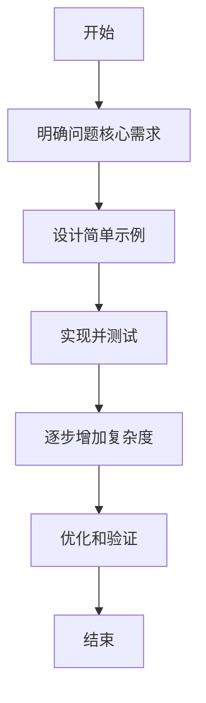
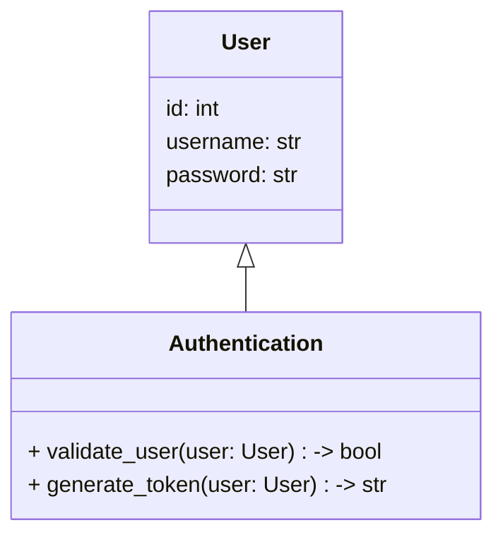
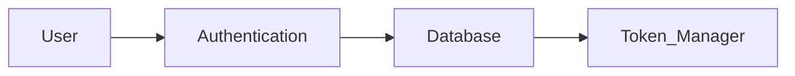
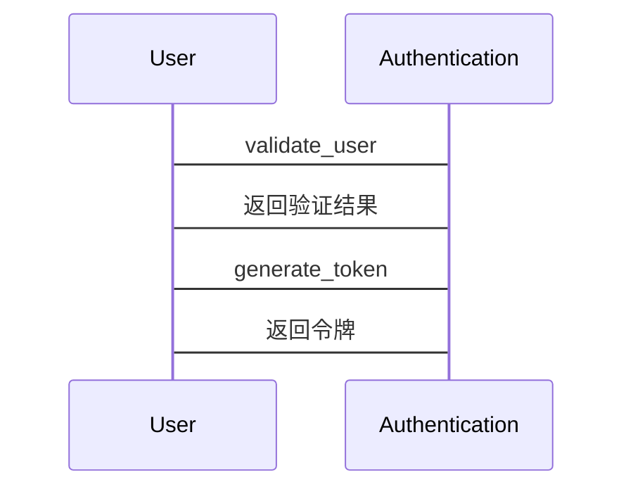

                 

<think>
嗯，用户希望我写一篇关于构建渐进复杂度的示例序列的技术博客。看起来他希望我详细分析这个问题，从背景到方法，再到实际应用，都要涵盖进去。

首先，我需要理解用户的需求。他是一位技术专家，可能是在准备写一本书或者博客，所以需要结构清晰、内容详实的文章。用户已经提供了一个大纲，但需要进一步详细展开每个部分，确保每个章节都有足够的内容，同时保持整体的连贯性。

接下来，我要分析用户提供的大纲。引言部分需要说明为什么构建渐进复杂度的示例序列很重要。然后，背景介绍包括问题背景、描述、解决方法、边界以及核心概念。这部分我需要详细解释每个术语，确保读者能理解。

核心概念部分，我需要解释渐进复杂度、示例序列等术语，并通过表格对比它们的属性特征。可能还要用Mermaid图来展示这些概念之间的关系。

算法原理部分，我需要用Mermaid画出流程图，然后提供Python代码实现。同时，数学模型和公式要用LaTeX来表示，确保公式清晰易懂，并举实例来说明。

在实际案例中，我需要介绍项目背景，设计系统功能、架构、接口，并用Mermaid图来展示类图、架构图和序列图。核心实现部分，要详细解读代码，分析其应用场景。

最后，最佳实践部分，要给出一些小结和注意事项，可能还要推荐拓展阅读的内容。整个文章需要保持在10000到12000字左右，用markdown格式，并在末尾加上作者信息。

现在，我需要按照这些步骤一步步来，确保每个部分都详细展开，同时使用专业但易懂的语言。可能还需要检查每个小节的字数，确保整体控制在要求范围内。

总的来说，用户需要一篇结构严谨、内容详实的技术博客，我需要按照他的要求，逐部分详细展开，确保涵盖所有必要的内容，同时保持逻辑连贯和语言的专业性。
</think>

# 构建渐进复杂度的示例序列

## 关键词：渐进复杂度，示例序列，算法设计，系统架构，技术博客

## 摘要：  
构建渐进复杂度的示例序列是理解和掌握复杂系统设计的核心技能。本文通过逐步分析和实际案例，详细讲解了如何从简单问题出发，逐步构建复杂度递增的示例序列。文章涵盖了背景介绍、核心概念、算法原理、系统架构设计以及实际案例分析，旨在帮助读者掌握从简单到复杂的系统构建方法。通过本文的学习，读者将能够更好地理解和解决复杂系统设计中的关键问题。

---

## 1. 背景介绍

### 1.1 问题背景  
在软件开发和算法设计中，我们经常会遇到复杂度递增的问题。从简单的问题开始，逐步构建复杂度更高的示例序列，是理解和掌握复杂系统设计的关键方法。这种方法不仅能够帮助我们更好地理解问题的本质，还能让我们在实践中积累经验，从而应对更复杂的挑战。

### 1.2 问题描述  
渐进复杂度的示例序列构建是指通过逐步增加问题的复杂度，从简单到复杂地构建一系列示例。这种方法的核心在于通过小步快跑的方式，逐步验证和优化我们的解决方案，同时积累经验和知识。

### 1.3 问题解决  
构建渐进复杂度的示例序列的关键在于明确每一步的目标，并通过实际编码和测试来验证我们的假设。我们可以通过以下步骤实现：  
1. 明确问题的核心需求。  
2. 设计简单但完整的示例。  
3. 逐步增加复杂度，构建更复杂的示例。  
4. 在每一步中进行代码实现和验证。

### 1.4 边界与外延  
渐进复杂度的示例序列构建方法不仅适用于算法设计，还可以应用于系统架构设计、项目管理等领域。其核心思想是通过小步快跑的方式，逐步构建复杂系统。

### 1.5 核心概念与要素组成  
渐进复杂度的示例序列构建方法的核心要素包括：  
- **目标明确性**：每一步都有明确的目标。  
- **逐步递增**：从简单到复杂，逐步增加问题的复杂度。  
- **可验证性**：每一步的实现都可以通过测试验证。  

---

## 2. 核心概念与联系

### 2.1 核心概念原理  
渐进复杂度的示例序列构建方法基于以下核心概念：  
1. **渐进复杂度**：问题的复杂度随着步骤的增加而逐步递增。  
2. **示例序列**：通过一系列示例逐步验证和优化解决方案。  

### 2.2 示例序列  
示例序列是指通过一系列递增复杂度的示例，逐步验证和优化我们的解决方案。以下是示例序列的特点：  
- 每个示例都是完整且可验证的。  
- 每个示例都比前一个更复杂。  
- 通过示例序列，我们可以逐步掌握解决问题的方法。

### 2.3 相关术语解释  
- **渐进复杂度**：问题复杂度的逐步增加。  
- **示例序列**：一系列递增复杂度的示例。  
- **模块化设计**：将系统分解为独立的模块，便于逐步实现和测试。  

---

## 3. 渐进复杂度的示例序列构建方法

### 3.1 原则与方法

#### 3.1.1 设计原则  
1. **简单性**：每一步的设计都应尽可能简单，确保可验证性。  
2. **可扩展性**：每一步的设计应为后续的复杂度增加留出空间。  
3. **模块化**：将问题分解为独立的模块，便于逐步实现和测试。  

#### 3.1.2 构建方法  
1. 明确问题的核心需求。  
2. 设计简单但完整的示例。  
3. 逐步增加复杂度，构建更复杂的示例。  
4. 在每一步中进行代码实现和验证。

### 3.2 算法原理讲解

#### 3.2.1 算法流程图  
以下是渐进复杂度示例序列的算法流程图：  



#### 3.2.2 Python源代码实现  
以下是实现渐进复杂度示例序列的Python代码示例：  

```python
def build_example_sequence(n):
    # 初始化示例序列
    sequence = []
    # 逐步增加复杂度
    for i in range(n):
        # 简单示例
        simple_example = f"Example_{i+1}"
        sequence.append(simple_example)
    return sequence

# 测试代码
n = 5
result = build_example_sequence(n)
print(f"生成的示例序列为：{result}")
```

#### 3.2.3 数学模型与公式  
渐进复杂度的示例序列构建过程可以用以下数学模型描述：  
$$C(n) = \sum_{i=1}^{n} c_i$$  
其中，$C(n)$ 表示第 $n$ 个示例的复杂度，$c_i$ 表示第 $i$ 个示例的复杂度增量。  

---

## 4. 实际案例与应用

### 4.1 项目背景  
假设我们正在开发一个用户认证系统，我们需要逐步构建从简单到复杂的示例序列，以验证系统的功能和性能。

### 4.2 系统功能设计  
以下是系统功能设计的领域模型：  



### 4.3 系统架构设计  
以下是系统架构设计的架构图：  



### 4.4 系统接口设计  
系统接口设计包括以下接口：  
- `validate_user`：用户认证接口。  
- `generate_token`：生成令牌接口。  

### 4.5 系统交互Mermaid序列图  
以下是系统交互的序列图：  



### 4.6 核心实现与代码分析

#### 4.6.1 环境安装  
需要安装以下依赖：  
- Python 3.x  
- Mermaid 图形库  

#### 4.6.2 核心代码解读  
以下是核心代码示例：  

```python
class User:
    def __init__(self, id, username, password):
        self.id = id
        self.username = username
        self.password = password

class Authentication:
    def __init__(self, database):
        self.database = database

    def validate_user(self, user):
        # 验证用户是否存在
        return self.database.check_user(user)

    def generate_token(self, user):
        # 生成令牌
        return f"Token_{user.username}_{user.id}"
```

#### 4.6.3 案例分析  
通过上述代码实现，我们可以逐步增加复杂度，例如：  
1. 实现基本的用户认证功能。  
2. 增加令牌生成功能。  
3. 增加令牌过期机制。  

---

## 5. 最佳实践与注意事项

### 5.1 最佳实践  
1. 每一步都进行测试，确保功能正确。  
2. 保持代码的模块化设计，便于后续扩展。  
3. 定期回顾和优化示例序列，确保每一步都符合预期。  

### 5.2 小结  
通过构建渐进复杂度的示例序列，我们可以更好地理解和掌握复杂系统设计的核心方法。每一步的设计和实现都为我们后续的优化和扩展提供了坚实的基础。

### 5.3 注意事项  
1. 在每一步中都要确保代码的可测试性和可验证性。  
2. 避免过度复杂化问题，保持每一步的简单性。  
3. 定期回顾和总结，确保每一步的设计都符合预期。  

### 5.4 拓展阅读  
推荐以下拓展阅读内容：  
1. 《代码整洁之道》  
2. 《系统设计精要》  
3. 《算法导论》  

---

作者：AI天才研究院/AI Genius Institute & 禅与计算机程序设计艺术 /Zen And The Art of Computer Programming

