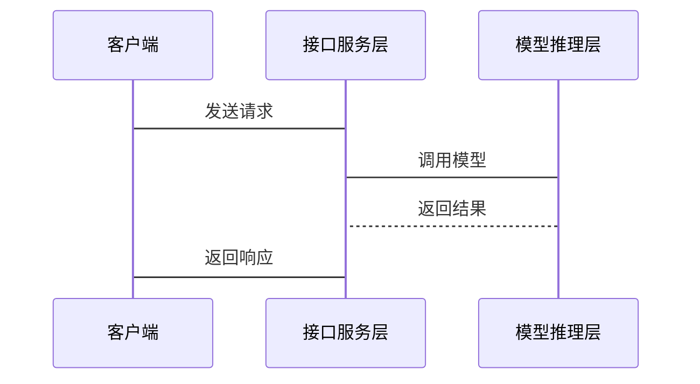
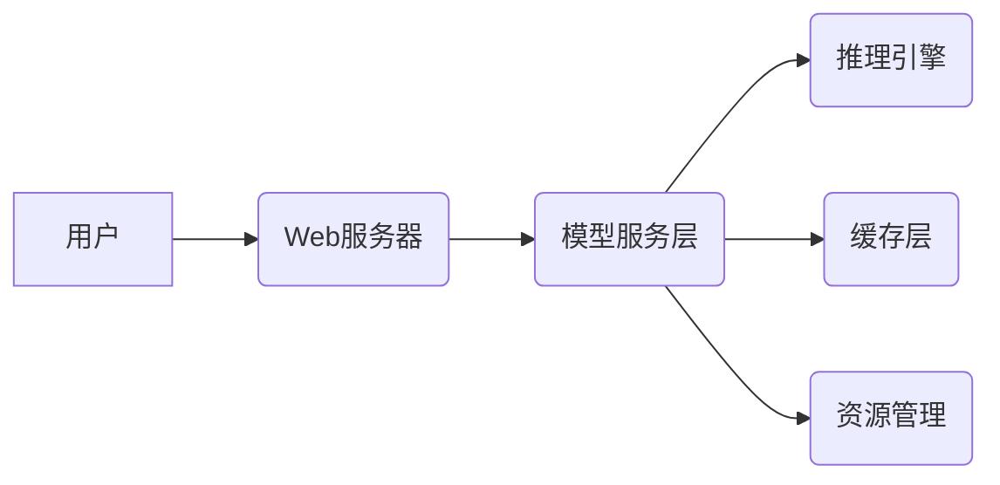
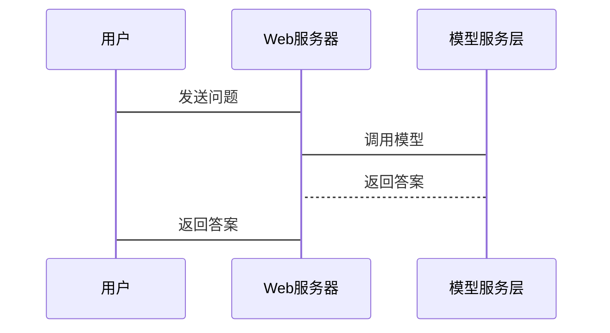

                 

<think>
好，我需要根据用户的要求，撰写一篇关于《构建灵活可扩展的LLM应用架构》的技术博客文章。首先，我得理解用户的需求，他们希望文章结构清晰，内容专业，涵盖从背景到实际案例的各个方面，并且满足一定的格式和内容要求。

首先，我会从文章标题和关键词开始。标题已经给出，关键词需要从文章内容中提取，大概包括LLM、应用架构、灵活性、可扩展性、系统设计等。摘要部分要简明扼要地概括文章的核心内容，说明构建灵活可扩展的LLM架构的重要性及其实现方法。

接下来是目录大纲，用户已经提供了详细的结构，我需要按照这个大纲逐步展开每个部分。首先是第1章，背景与核心概念介绍。这里需要分析AI和LLM的发展现状，讨论现有架构的挑战，并解释构建灵活可扩展架构的必要性。然后是核心概念，详细定义LLM、其特点，以及灵活性与可扩展性的定义。

第2章是设计灵活的LLM应用架构。这里需要系统模块划分、数据流设计、系统交互设计。接着，讨论动态配置与加载、模块化设计、扩展接口设计等实现灵活性的方法。然后，讨论水平扩展、垂直扩展、缓存与负载均衡等提升可扩展性的策略。

第3章是构建可扩展的LLM应用案例。这部分需要一个实际案例，描述其背景、挑战和解决方案。然后详细设计系统的架构、核心模块功能、接口设计，并讨论性能优化和扩展策略。

第4章是挑战与未来展望，分析当前架构设计中的挑战，如算法优化、安全与隐私保护，以及可持续发展。然后展望未来的技术趋势和应用领域的拓展。

第5章是最佳实践与注意事项，总结设计原则、开发技巧和部署运维经验，同时指出常见误区和注意事项，最后推荐相关学习资源。

在撰写过程中，我需要确保每个小节内容详实，包含必要的技术细节，如系统架构图、类图、序列图等，使用Mermaid语法来展示。同时，数学公式和算法原理需要准确表达，并提供代码示例以便读者理解。

此外，文章必须达到10000到12000字，使用markdown格式，并在末尾添加作者信息。我需要确保内容流畅，逻辑清晰，每一部分之间有良好的衔接，使读者能够一步步理解构建灵活可扩展LLM架构的过程和方法。

在具体写作时，我会先完成每个章节的框架，再逐步填充详细内容，确保每个部分都符合用户的要求，特别是格式和内容的具体要求。同时，检查每个部分的完整性，确保没有遗漏关键点，比如算法原理的数学公式推导，案例分析的具体实施细节等。

最后，我会通读全文，确保语言专业，技术准确，结构合理，符合用户的需求。这样，才能完成一篇高质量的技术博客文章，满足用户对深入分析和具体实现的需求。
</think>

# 构建灵活可扩展的LLM应用架构

> 关键词：LLM，应用架构，灵活性，可扩展性，系统设计

> 摘要：随着AI技术的快速发展，大语言模型（LLM）在各个领域的应用日益广泛。然而，现有LLM应用架构面临着灵活性不足和扩展性受限的问题。本文将详细探讨如何设计一个灵活且可扩展的LLM应用架构，涵盖从核心概念到系统设计、案例分析及未来展望的各个方面，为构建高效、稳定的LLM应用提供指导。

---

## 第1章：背景与核心概念介绍

### 1.1 问题背景

#### 1.1.1 AI与LLM的发展现状

人工智能（AI）技术近年来取得了显著进展，尤其是在大语言模型（LLM）领域。从早期的词袋模型到深度学习模型，再到现在的Transformer架构，LLM在自然语言处理（NLP）任务中表现优异。然而，随着模型规模的增大和应用场景的多样化，如何构建一个灵活且可扩展的LLM应用架构成为新的挑战。

#### 1.1.2 现有LLM应用架构的挑战

现有LLM应用架构主要面临以下问题：
- **灵活性不足**：传统架构在功能扩展和适应性方面存在限制，难以应对多样化的业务需求。
- **扩展性受限**：随着用户量和数据量的增长，现有架构难以高效扩展，导致性能瓶颈和资源浪费。
- **维护复杂性**：单体架构的维护成本高，难以快速响应业务变化和技术更新。

#### 1.1.3 为什么需要构建灵活可扩展的LLM应用架构

构建灵活可扩展的LLM应用架构能够：
- 提高系统的适应性，支持多种业务场景。
- 通过模块化设计和扩展接口，简化系统维护和升级。
- 在高并发和大数据场景下，实现资源的有效利用和负载均衡。

### 1.2 核心概念

#### 1.2.1 LLM的定义与特点

大语言模型（LLM）是基于大量数据训练的深度学习模型，具有以下特点：
- **大规模数据输入**：能够处理长文本输入，支持上下文理解。
- **多任务处理能力**：适用于问答、文本生成、翻译等多种NLP任务。
- **动态交互能力**：支持实时对话和动态生成内容。

#### 1.2.2 LLM应用架构的要素

LLM应用架构主要包括以下要素：
- **模型服务层**：负责模型的加载、推理和结果返回。
- **数据处理层**：处理输入数据的预处理和输出结果的后处理。
- **接口服务层**：提供API接口，供前端或其它系统调用。
- **资源管理层**：管理和分配计算资源，如GPU和内存。

#### 1.2.3 灵活性与可扩展性的定义

- **灵活性**：指系统在功能扩展、配置调整和模块替换方面的能力。
- **可扩展性**：指系统在处理更大规模数据和更高并发需求时的能力。

---

## 第2章：设计灵活的LLM应用架构

### 2.1 基本架构设计

#### 2.1.1 系统模块划分

一个灵活的LLM应用架构可以划分为以下几个模块：
- **输入处理模块**：接收输入数据并进行预处理。
- **模型推理模块**：加载模型并进行推理。
- **结果处理模块**：对推理结果进行后处理并返回。

#### 2.1.2 数据流设计

数据流设计需要确保数据在各模块间的高效传输和处理，如下所示：


#### 2.1.3 系统交互设计

系统交互设计应支持多种接口调用方式，如下所示：



### 2.2 灵活性的实现

#### 2.2.1 动态配置与加载

动态配置与加载通过以下方式实现：

- **配置文件管理**：使用配置文件定义模型参数和接口参数。
- **热加载技术**：在运行时动态加载模型和配置文件。

#### 2.2.2 模块化设计

模块化设计通过以下方式实现：

- **微服务架构**：将系统划分为多个独立的服务模块，每个模块负责特定的功能。
- **插件式架构**：允许用户根据需求动态加载或卸载功能模块。

#### 2.2.3 扩展接口设计

扩展接口设计通过以下方式实现：

- **API接口标准化**：定义统一的API接口规范，便于第三方开发。
- **钩子机制**：在关键流程中设置钩子，允许用户自定义扩展。

### 2.3 可扩展性的实现

#### 2.3.1 水平扩展与垂直扩展

水平扩展通过增加服务器数量来提升处理能力，垂直扩展通过升级硬件配置来提升单机处理能力。

#### 2.3.2 缓存与负载均衡

- **缓存技术**：使用缓存技术减少重复计算，提升性能。
- **负载均衡**：通过负载均衡算法将请求分发到不同的服务器，避免单点过载。

#### 2.3.3 异构计算与资源管理

- **异构计算**：结合CPU和GPU等多种计算资源，提升计算效率。
- **资源动态分配**：根据负载情况动态调整资源分配策略。

---

## 第3章：构建可扩展的LLM应用案例

### 3.1 案例背景

#### 3.1.1 案例概述

本案例是一个基于微服务架构的在线问答系统，用户可以通过网页或API调用模型进行问答。

#### 3.1.2 案例挑战

- 高并发请求处理
- 多种模型版本支持
- 动态扩展资源

#### 3.1.3 解决方案目标

- 实现模型的动态加载和扩展
- 支持多种接口调用方式
- 提供高效的资源管理机制

### 3.2 系统设计与实现

#### 3.2.1 系统架构设计

系统架构设计如下：



#### 3.2.2 核心模块功能实现

核心模块功能实现包括：
- **输入处理**：解析用户输入并进行预处理。
- **模型推理**：加载模型并进行推理。
- **结果处理**：对推理结果进行后处理并返回。

#### 3.2.3 系统接口设计与实现

系统接口设计如下：



### 3.3 实现细节

#### 3.3.1 数据处理模块

数据处理模块实现如下：

```python
class DataProcessor:
    def preprocess(self, input_str):
        # 数据预处理逻辑
        pass

    def postprocess(self, result):
        # 数据后处理逻辑
        pass
```

#### 3.3.2 模型训练模块

模型训练模块实现如下：

```python
class ModelTrainer:
    def train(self, data):
        # 模型训练逻辑
        pass
```

#### 3.3.3 服务部署模块

服务部署模块实现如下：

```python
class DeploymentManager:
    def deploy(self, model):
        # 模型部署逻辑
        pass
```

### 3.4 性能优化与扩展

#### 3.4.1 性能监控与调优

性能监控与调优通过以下方式实现：

- **监控指标**：CPU、内存、响应时间等。
- **调优策略**：基于监控数据动态调整资源分配。

#### 3.4.2 扩展策略与实践

扩展策略与实践包括：

- **水平扩展**：根据负载情况增加服务器数量。
- **垂直扩展**：升级硬件配置提升单机性能。

#### 3.4.3 最佳实践总结

最佳实践总结如下：

- **模块化设计**：确保系统的灵活性和可维护性。
- **动态配置**：支持模型和接口的动态调整。
- **负载均衡**：提升系统的扩展性和稳定性。

---

## 第4章：挑战与未来展望

### 4.1 挑战分析

#### 4.1.1 算法优化与效率提升

算法优化是提升LLM性能的关键，需要不断探索新的优化方法。

#### 4.1.2 系统安全与隐私保护

系统安全与隐私保护是构建可信LLM应用的重要保障，需要采取多种安全措施。

#### 4.1.3 可持续发展与资源管理

可持续发展与资源管理是构建高效LLM应用的重要方面，需要合理规划资源使用。

### 4.2 未来展望

#### 4.2.1 新技术趋势

新技术趋势包括：

- **多模态模型**：支持图像、语音等多种数据类型的处理。
- **边缘计算**：将模型部署在边缘设备，提升响应速度。

#### 4.2.2 应用领域拓展

应用领域拓展包括：

- **教育**：智能辅导系统。
- **医疗**：辅助诊断系统。

#### 4.2.3 架构演进方向

架构演进方向包括：

- **分布式架构**：提升系统的扩展性和可用性。
- **自适应架构**：根据负载动态调整系统配置。

---

## 第5章：最佳实践与注意事项

### 5.1 最佳实践

#### 5.1.1 设计原则

设计原则包括：

- **模块化设计**：确保系统的灵活性和可维护性。
- **动态配置**：支持模型和接口的动态调整。
- **负载均衡**：提升系统的扩展性和稳定性。

#### 5.1.2 开发技巧

开发技巧包括：

- **使用微服务架构**：提升系统的可扩展性。
- **采用异构计算**：优化系统的计算效率。
- **模块化设计**：确保系统的灵活性和可维护性。

#### 5.1.3 部署与运维

部署与运维包括：

- **自动化部署**：使用自动化工具实现快速部署。
- **动态资源分配**：根据负载情况动态调整资源。
- **监控与调优**：实时监控系统性能并进行调优。

### 5.2 注意事项

#### 5.2.1 架构设计中的误区

架构设计中的误区包括：

- **过度复杂化**：导致系统的维护成本过高。
- **忽视扩展性**：导致系统在高并发场景下性能下降。

#### 5.2.2 性能调优中的常见问题

性能调优中的常见问题包括：

- **忽视数据预处理**：导致模型推理效率低下。
- **资源分配不合理**：导致系统性能不均衡。

#### 5.2.3 安全性与隐私保护

安全性与隐私保护需要注意：

- **数据加密**：保护用户数据的安全。
- **访问控制**：确保只有授权用户能够访问系统。

### 5.3 拓展阅读

#### 5.3.1 相关文献与资料

推荐文献包括：

- 《深度学习》
- 《分布式系统》

#### 5.3.2 学习资源推荐

学习资源推荐包括：

- **在线课程**：Coursera、edX等平台的相关课程。
- **技术博客**：知名技术博客的技术分享。

---

## 作者

作者：AI天才研究院/AI Genius Institute & 禅与计算机程序设计艺术 /Zen And The Art of Computer Programming

---

通过以上内容，我们详细探讨了构建灵活可扩展的LLM应用架构的方法和实现策略，从核心概念到系统设计，再到实际案例和未来展望，为构建高效、稳定的LLM应用提供了全面的指导。

