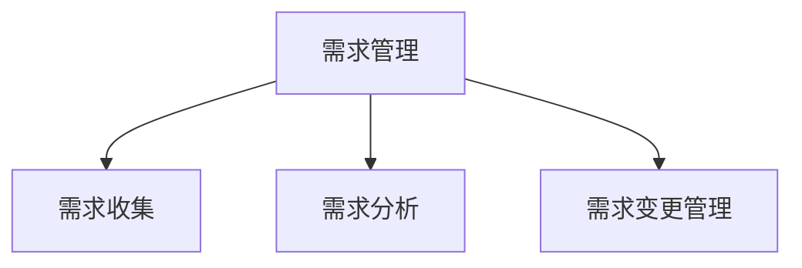
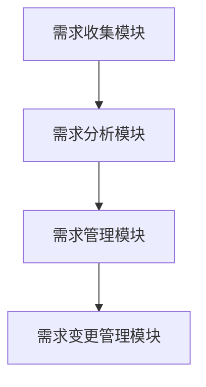

                 

<think>
好，我现在需要帮助用户构建一个灵活的需求管理框架，应对大型新应用开发的挑战。首先，我得理解用户的需求，他们可能是在开发一个大型项目，遇到了需求管理上的困难，需要系统化的方法来解决。

接下来，我得考虑如何从背景介绍开始，分析大型应用开发的挑战，比如需求变更频繁、团队协作复杂等。然后，明确需求管理的重要性，以及什么是灵活的需求管理框架，这可能涉及到模块化设计和适应变化的能力。

然后，我需要详细阐述核心概念，比如需求收集、分析、管理和变更管理。每个部分都需要深入讨论，可能包括不同的方法和技术。比如需求收集可以通过问卷、访谈等方式，而需求分析可能需要使用工具来建模。

在设计需求管理框架时，要分解成各个模块，每个模块的功能和相互关系。同时，选择合适的技术和工具，比如使用敏捷开发方法，或者选择特定的项目管理软件。系统架构设计可能需要考虑微服务架构，确保模块之间的松耦合。

实现部分，可能需要编写代码，比如使用Python或Java，设计数据库和接口。测试和集成也是关键步骤，确保系统稳定可靠。

优化与维护方面，需要策略来持续改进框架，处理用户反馈，确保框架能够适应变化。项目实战部分，需要通过具体案例来展示框架的应用，比如构建一个在线教育平台的需求管理框架，详细说明每个步骤。

最后，总结最佳实践，给出注意事项和未来拓展的方向，比如引入AI工具辅助需求分析，或者与其他系统集成。这样，整个框架就能灵活应对大型应用开发的各种挑战，帮助团队高效管理需求，提升开发效率和质量。
</think>

# 构建灵活的需求管理框架：应对大型新应用开发挑战

> 关键词：需求管理，框架设计，系统架构，敏捷开发，项目管理，模块化设计

> 摘要：在大型应用开发中，需求管理是确保项目成功的关键环节。本文将详细探讨如何构建一个灵活的需求管理框架，以应对开发过程中的各种挑战。通过分析需求管理的核心概念、设计框架的组成部分、选择合适的技术、实现系统架构，并通过实际案例展示如何优化和维护该框架，本文旨在为开发团队提供一套高效的需求管理解决方案，帮助他们在复杂项目中保持灵活性和高效性。

---

## 第一部分: 理解需求管理框架

### 第1章: 背景介绍

#### 1.1 问题背景

大型应用开发面临诸多挑战，其中之一是需求管理的复杂性。随着项目的扩展，需求会不断变化，团队成员之间的沟通不畅可能导致需求遗漏或变更失控。这些问题可能导致项目延期、成本增加，甚至失败。

#### 1.1.1 大型应用开发的挑战

- **需求变更频繁**：市场变化或用户反馈可能导致需求频繁调整。
- **团队协作复杂**：跨部门、跨国团队协作增加了需求管理的难度。
- **需求优先级冲突**：不同利益相关者的需求可能相互冲突，如何优先处理成为难题。

#### 1.1.2 需求管理的重要性

- 需求管理是确保项目目标与实际开发一致的关键。
- 通过有效的需求管理，可以减少误解，提高开发效率。
- 良好的需求管理能够帮助团队更好地应对变更，降低项目风险。

#### 1.1.3 灵活的需求管理框架的定义

- 灵活的需求管理框架是指能够适应变化、支持多种需求类型（如功能需求、非功能需求）的管理结构。
- 该框架应具备模块化设计，便于扩展和维护。

#### 1.1.4 研究目的与目标

- 目的：研究如何构建灵活的需求管理框架。
- 目标：设计一个能够适应复杂项目需求的管理框架，提高开发效率和项目成功率。

#### 1.1.5 边界与外延

- 边界：仅关注需求管理部分，不涉及具体开发实现。
- 外延：需求管理框架可以与其他项目管理工具（如JIRA）集成。

#### 1.1.6 核心概念与联系

- 核心概念包括需求收集、分析、优先级排序和变更管理。
- 这些概念之间相互关联，共同构成完整的管理流程。

---

### 第2章: 核心概念与联系

#### 2.1 需求管理的定义与属性

- **定义**：需求管理是通过系统化的方法收集、分析、记录和维护需求的过程。
- **属性**：
  - 完整性：确保所有需求都被记录。
  - 可追溯性：需求可以追溯到项目目标。
  - 可变更性：允许根据需要调整需求。

#### 2.1.1 需求管理的定义

需求管理是通过系统化的方法确保需求的完整性和一致性，支持项目的成功交付。

#### 2.1.2 需求管理的属性

| 属性         | 描述                                   |
|--------------|----------------------------------------|
| 完整性       | 确保所有需求都被记录和理解             |
| 可追溯性     | 需求可以追溯到项目目标                 |
| 可变更性     | 允许根据需要调整需求                   |
| 优先级       | 确定需求的处理顺序                     |
| 文档化       | 需求以文档形式记录                     |

#### 2.1.3 需求管理与相关概念的联系

以下是需求管理与其他相关概念的联系：

- **需求收集**：需求管理的第一步，确保需求来源多样且准确。
- **需求分析**：对收集到的需求进行分析，确保其可行性和一致性。
- **需求变更管理**：处理需求的变更，确保变更得到适当评估和实施。



---

## 第二部分: 需求管理框架的设计与实现

### 第3章: 需求管理框架的设计

#### 3.1 需求管理框架的组成部分

- **需求收集模块**：负责收集和整理需求。
- **需求分析模块**：对需求进行分析和验证。
- **需求管理模块**：记录和跟踪需求的整个生命周期。
- **需求变更管理模块**：处理需求变更，并评估变更对项目的影响。

#### 3.1.1 需求收集模块

需求收集模块是框架的核心模块，包括以下功能：

- 收集需求来源：与客户、利益相关者进行沟通，收集需求。
- 需求分类：将需求按类型（功能、非功能）进行分类。

#### 3.1.2 需求分析模块

需求分析模块负责对收集到的需求进行分析，包括：

- 需求分解：将复杂需求分解为更小的、可管理的部分。
- 需求验证：确保需求的可行性和一致性。

#### 3.1.3 需求管理模块

需求管理模块负责记录和跟踪需求的整个生命周期，包括：

- 需求文档化：将需求以文档形式记录。
- 需求优先级排序：根据项目目标和资源分配需求的优先级。

#### 3.1.4 需求变更管理模块

需求变更管理模块用于处理需求变更，包括：

- 变更请求：记录和评估变更请求。
- 变更影响分析：评估变更对项目的影响。

---

### 第4章: 需求管理框架的实现

#### 4.1 技术选型

选择合适的技术和工具是实现需求管理框架的关键。以下是一些常用工具和技术：

- **敏捷开发工具**：如JIRA、Trello。
- **需求管理软件**：如Sprintly、Backlog。
- **项目管理平台**：如Asana、Basecamp。

#### 4.2 系统架构设计

系统架构设计需要考虑模块之间的交互和数据流。以下是一个可能的架构设计：



#### 4.3 接口设计与实现

接口设计需要考虑模块之间的数据交互。例如，需求收集模块需要与需求分析模块共享数据，可以通过API实现。

---

### 第5章: 需求管理框架的优化与维护

#### 5.1 优化策略

- 定期回顾和优化需求管理流程。
- 引入自动化工具提高效率。

#### 5.2 持续维护与更新

- 定期更新需求文档，确保其准确性和完整性。
- 根据项目进展调整需求优先级。

#### 5.3 用户反馈与迭代

- 收集用户反馈，不断改进需求管理框架。

---

### 第6章: 项目实战：构建需求管理框架

#### 6.1 项目介绍

本章通过构建一个在线教育平台的需求管理框架，展示如何设计和实现一个灵活的需求管理框架。

#### 6.2 环境安装与配置

- 安装JIRA或其他需求管理工具。
- 配置项目管理平台。

#### 6.3 系统核心实现

- 使用JIRA收集需求。
- 使用Excel进行需求分析。

#### 6.4 代码应用解读与分析

- 代码示例：使用Python编写的需求管理模块。

```python
class Requirement:
    def __init__(self, id, description, priority):
        self.id = id
        self.description = description
        self.priority = priority

class RequirementManager:
    def __init__(self):
        self.requirements = []

    def add_requirement(self, requirement):
        self.requirements.append(requirement)

    def get_requirements(self):
        return self.requirements
```

#### 6.5 实际案例分析

通过案例分析，展示需求管理框架在实际项目中的应用。

#### 6.6 项目小结

总结项目实施的经验和教训，提出改进建议。

---

### 第7章: 最佳实践与拓展

#### 7.1 最佳实践技巧

- 保持需求文档的及时更新。
- 定期与利益相关者沟通，确保需求一致。

#### 7.2 注意事项

- 避免需求变更失控，确保变更经过充分评估。
- 避免需求过于复杂，确保需求分解合理。

#### 7.3 拓展阅读

- 《敏捷开发指南》
- 《需求管理的艺术》

---

## 作者：AI天才研究院 & 禅与计算机程序设计艺术

通过本文的详细分析和步骤讲解，我们构建了一个灵活的需求管理框架，帮助开发团队应对大型应用开发的挑战。希望本文对读者有所帮助！

