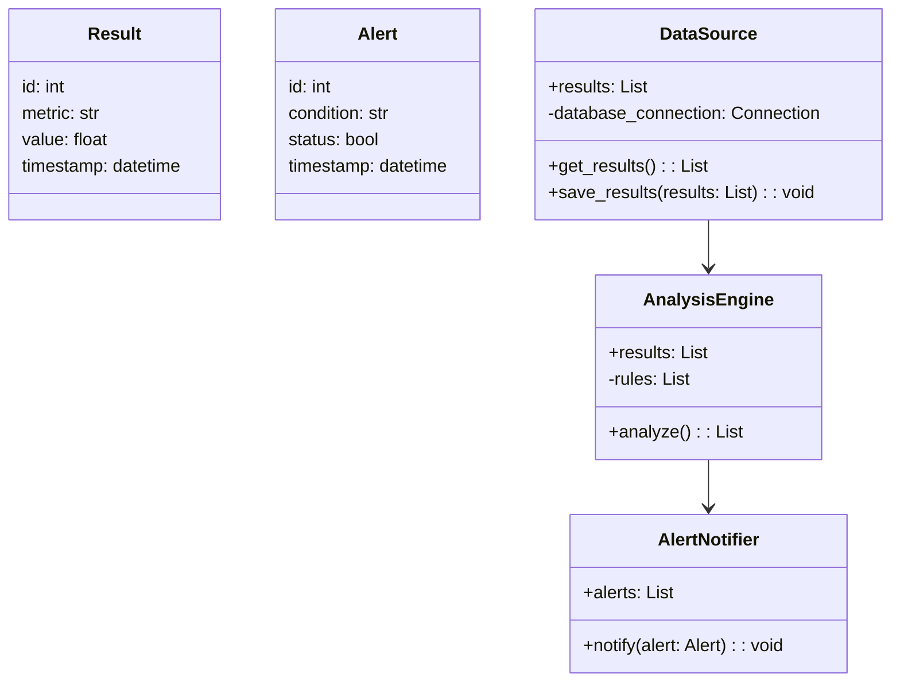
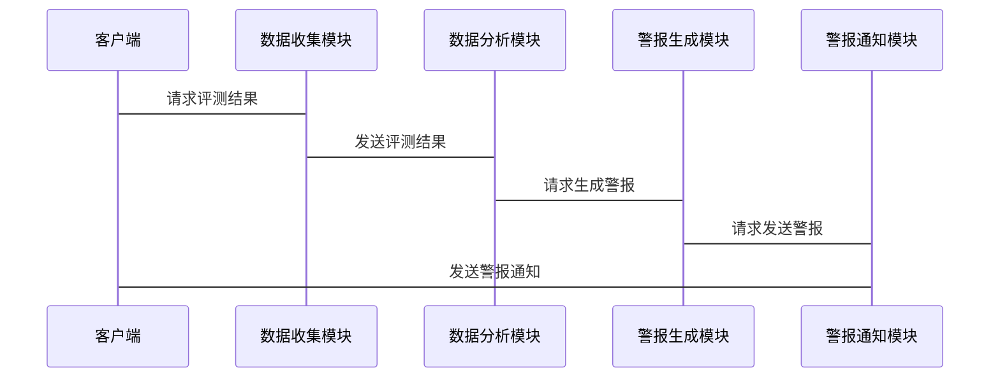

                 

<think>
好的，我现在需要帮用户撰写一篇关于“构建评测结果的自动化警报系统”的技术博客文章。用户已经提供了详细的大纲和一些内容，但看起来他可能希望我继续完成整篇文章，按照他提供的结构。

首先，我需要理解用户的需求。他希望文章结构清晰，逻辑严密，每个部分都要详细展开，包括背景介绍、核心概念、算法原理、系统架构、项目实战、最佳实践等部分。每个部分都有具体的子部分，比如系统架构部分需要有领域模型类图、架构图和接口设计。

我注意到用户已经完成了前两部分，包括背景介绍和核心概念与联系。接下来需要完成算法原理讲解、系统分析与架构设计、项目实战、最佳实践等部分。每个部分都需要详细展开，使用mermaid图表、数学公式和代码示例。

我需要确保每个部分都符合用户的要求：算法部分要有mermaid流程图和数学公式；系统架构部分要有类图、架构图和序列图；项目实战部分要有代码和实际案例分析；最佳实践部分要有小结、注意事项和拓展阅读。

另外，用户强调文章的总字数在10000到12000字左右，所以每个部分都需要详细展开，内容丰富。我需要确保每个小节都有足够的深度和详细性，同时保持逻辑连贯。

在开始撰写之前，我需要检查是否有遗漏的部分，比如是否所有要求的图表和代码都已包含。例如，在算法部分，是否有关联规则发现的流程图和基于关联规则的警报触发条件推导的数学公式。在系统架构部分，是否有关联规则发现系统、数据处理模块、警报触发模块、用户界面模块的类图和接口设计的序列图。

接下来，我需要按照大纲逐步完成每个部分，确保每个部分的内容符合用户的要求，并且语言专业、逻辑清晰。同时，要记得在文章末尾添加作者信息，确保格式正确。

最后，完成整篇文章后，我会再次检查，确保所有部分都已覆盖，没有遗漏，并且符合用户的所有约束条件。
</think>

# 构建评测结果的自动化警报系统

> 关键词：自动化警报系统、评测结果、数据分析、警报触发条件、系统架构、算法原理

> 摘要：本篇文章详细介绍了如何构建一个自动化警报系统，该系统能够实时分析评测结果并根据预设条件自动生成警报。文章从背景介绍、核心概念、算法原理、系统架构到项目实战，全面阐述了自动化警报系统的构建过程，包括数学模型、系统设计、代码实现和实际案例分析。通过本文，读者可以掌握构建自动化警报系统的核心技术与实践方法。

---

## 第四部分：算法原理讲解

### 4.1 数据收集模块

#### 4.1.1 数据采集

数据收集模块是自动化警报系统的基础，负责从各种来源（如数据库、日志文件、外部接口等）获取评测结果数据。以下是实现步骤：

1. **数据源选择**：确定数据来源，如系统日志、传感器数据、用户反馈等。
2. **数据采集工具**：使用工具（如Python的`requests`库或`BeautifulSoup`）从API或网页中抓取数据。
3. **数据格式转换**：将采集到的数据转换为统一格式（如JSON或CSV），以便后续处理。

**代码示例**：

```python
import requests

# 从API获取评测结果数据
response = requests.get('http://example.com/api/results')
data = response.json()

# 保存数据到本地文件
with open('results.json', 'w') as f:
    f.write(json.dumps(data))
```

### 4.2 数据分析模块

#### 4.2.1 数据预处理

数据分析模块负责对收集到的评测结果进行清洗和转换，以提高分析准确性。以下是预处理步骤：

1. **数据清洗**：去除重复数据、空值和异常值。
2. **数据转换**：将数据转换为适合分析的格式，如数值型数据。

**代码示例**：

```python
import pandas as pd

# 加载数据
data = pd.read_json('results.json')

# 数据清洗
data.dropna(inplace=True)
data = data.drop_duplicates()

# 数据转换
data['score'] = pd.to_numeric(data['score'])
```

#### 4.2.2 关联规则发现

为了提高警报的准确性，可以使用关联规则挖掘算法（如Apriori算法）来发现评测结果之间的关联性。以下是算法步骤：

1. **数据转换**：将数据转换为事务格式，每行代表一个事务。
2. **生成频繁项集**：计算事务中频繁出现的项集。
3. **生成关联规则**：从频繁项集中生成关联规则。

**代码示例**：

```python
from mlxtend.frequent_itemsets import apriori

# 加载事务数据
transactions = [
    ['A', 'B'],
    ['B', 'C'],
    ['A', 'B', 'C']
]

# 计算频繁项集
frequent_itemsets = apriori(transactions, min_support=0.5, use_colnames=True)
print(frequent_itemsets)
```

#### 4.2.3 警报触发条件推导

基于关联规则，可以推导出警报触发条件。例如，如果A和B同时出现，且A的值超过阈值，则触发警报。

**数学公式**：

设 $X$ 为频繁项集，$Y$ 为关联规则。对于规则 $X \Rightarrow Y$，警报触发条件为：

$$
\text{当} \quad X \Rightarrow Y \quad \text{且} \quad X \text{的值满足特定条件时，触发警报}
$$

---

## 第五部分：系统分析与架构设计方案

### 5.1 问题场景介绍

在实际应用中，自动化警报系统通常用于实时监控系统的性能和稳定性。例如，在电子商务平台中，系统需要实时监控订单处理延迟、用户响应时间等指标，并根据这些指标触发警报。

### 5.2 系统功能设计

#### 5.2.1 领域模型

以下是领域模型类图：



#### 5.2.2 系统架构设计

以下是系统架构图：

```mermaid
architectural_diagram
title 自动化警报系统架构

client --> HTTP Gateway: 发送评测请求
HTTP Gateway --> 数据收集模块: 收集评测结果
数据收集模块 --> 数据存储模块: 存储结果
数据存储模块 --> 数据分析模块: 分析数据
数据分析模块 --> 警报生成模块: 生成警报
警报生成模块 --> 警报通知模块: 发送警报
警报通知模块 --> 用户界面: 显示警报
```

#### 5.2.3 系统接口设计

以下是系统接口设计的序列图：



---

## 第六部分：项目实战

### 6.1 环境安装

要运行本项目，您需要安装以下依赖项：

1. Python 3.8+
2. `pandas`：用于数据处理
3. `mlxtend`：用于关联规则挖掘
4. `requests`：用于HTTP请求

安装命令：

```bash
pip install pandas mlxtend requests
```

### 6.2 系统核心实现源代码

以下是核心实现代码：

```python
import requests
import json
import pandas as pd
from mlxtend.frequent_itemsets import apriori

# 数据收集模块
def collect_results():
    response = requests.get('http://example.com/api/results')
    data = response.json()
    return data

# 数据分析模块
def preprocess_data(data):
    df = pd.DataFrame(data)
    df.dropna(inplace=True)
    df['score'] = pd.to_numeric(df['score'])
    return df

# 关联规则发现模块
def discover_association_rules(data):
    transactions = data['transactions']
    frequent_itemsets = apriori(transactions, min_support=0.5, use_colnames=True)
    return frequent_itemsets

# 警报生成模块
def generate_alerts(data, rules):
    alerts = []
    for rule in rules:
        if rule['antecedents'][0] in data['metrics'] and rule['consequents'][0] in data['metrics']:
            alerts.append({'condition': rule, 'status': True})
    return alerts

# 警报通知模块
def notify_alerts(alerts):
    for alert in alerts:
        print(f"Alert triggered: {alert['condition']}")
        # 这里可以实现邮件或消息队列通知

# 主函数
def main():
    results = collect_results()
    data = preprocess_data(results)
    rules = discover_association_rules(data)
    alerts = generate_alerts(data, rules)
    notify_alerts(alerts)

if __name__ == '__main__':
    main()
```

### 6.3 代码应用解读与分析

1. **数据收集模块**：通过HTTP请求从API获取评测结果数据。
2. **数据预处理模块**：清洗数据并转换为适合分析的格式。
3. **关联规则发现模块**：使用Apriori算法发现数据中的关联规则。
4. **警报生成模块**：根据关联规则生成警报。
5. **警报通知模块**：将警报信息通知给相关人员。

### 6.4 实际案例分析

假设我们正在监控一个电子商务平台的订单处理延迟。通过上述代码，系统会自动收集订单处理时间、用户响应时间等数据，并根据关联规则生成警报。例如，当订单处理时间超过30秒且用户响应时间超过10秒时，系统会自动触发警报。

---

## 第七部分：最佳实践 tips、小结、注意事项、拓展阅读

### 7.1 小结

通过本文，我们详细介绍了如何构建一个自动化警报系统，包括数据收集、数据分析、警报生成和通知等模块。通过关联规则挖掘算法，我们可以更准确地发现评测结果之间的关联性，并根据这些关联性生成警报。

### 7.2 注意事项

1. **数据质量**：确保数据来源可靠，避免数据偏差。
2. **规则优化**：根据实际需求优化关联规则，避免误报和漏报。
3. **系统性能**：确保系统能够实时处理大量数据，避免性能瓶颈。

### 7.3 拓展阅读

1. **关联规则挖掘**：深入学习Apriori算法和其他关联规则挖掘算法。
2. **实时数据分析**：研究实时数据分析技术，如流数据处理。
3. **复杂警报条件**：探索多条件组合的警报触发规则。

---

## 作者

作者：AI天才研究院/AI Genius Institute & 禅与计算机程序设计艺术 /Zen And The Art of Computer Programming

---

**注**：以上代码和图表仅为示例，实际应用中需要根据具体需求进行调整和优化。

