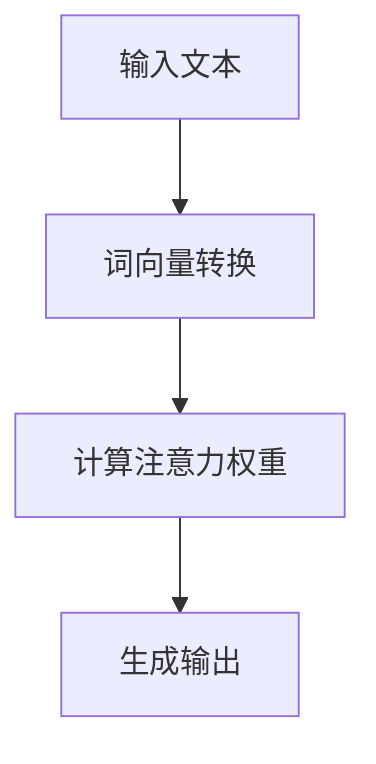
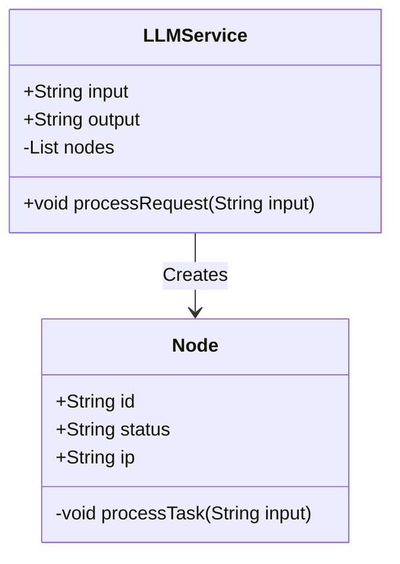
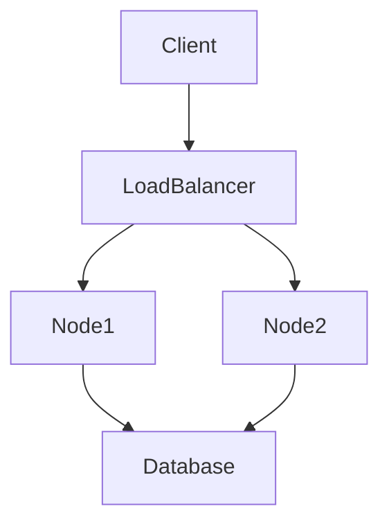
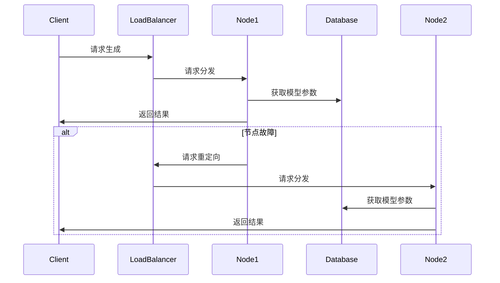

                 

<think>
嗯，用户让我写一篇关于构建高可用的LLM应用系统的技术博客文章，而且要符合特定的结构和要求。首先，我需要理解用户的具体需求。用户希望文章有明确的标题、关键词、摘要，然后按照指定的目录结构展开，每个部分都要详细讲解，还要包含代码、图表和数学公式。

我先想，用户可能是一位技术专家，或者是CTO，对构建高可用系统有需求。他们可能正在寻找一个系统的指南，帮助他们设计和实现一个稳定可靠的LLM系统。所以，我需要确保文章不仅涵盖理论，还要有实际的代码和案例分析，这样读者可以真正理解和应用这些知识。

接下来，我要检查用户提供的目录结构。看起来文章分为七部分，从背景介绍到最佳实践。每一章都有详细的子部分，比如第一部分是问题背景，第二部分是核心概念，第三部分是算法，第四部分是系统设计，第五部分是项目实战，第六部分是最佳实践，最后是总结。我需要确保每一部分都详细展开，特别是每个小节要有具体的内容，比如1.1引言与问题描述，里面又分为问题描述、问题解决、边界与外延三个小节。

然后，我需要考虑每个部分的具体内容。比如，在核心概念部分，要解释LLM的基本原理，包括词向量、注意力机制、Transformer架构，以及与传统NLP模型的对比。这部分需要清晰明了，让读者即使不是专家也能理解。

在算法部分，使用Mermaid流程图来描述LLM的推理过程，同时提供Python代码实现。数学公式要用Latex，这样在技术博客中看起来更专业。我需要确保代码和公式都正确，避免错误。

系统架构设计部分，使用Mermaid绘制架构图和序列图，展示系统的各个组件和交互流程。这部分需要详细说明系统如何实现高可用性，比如负载均衡、容灾机制等。

项目实战部分，要给出环境安装的步骤，代码实现，案例分析。这部分需要实际操作，让读者能够跟着步骤一步步搭建系统。

最后，最佳实践部分，要给出优化策略和注意事项，帮助读者在实际应用中避免常见问题，提升系统的稳定性和性能。

在写作过程中，我需要确保语言专业但不失通俗易懂，结构清晰，逻辑严密。同时，结尾要加上作者信息，符合用户的格式要求。

现在，我开始逐步构建每个部分的内容，确保覆盖所有要求，同时保持文章的流畅和可读性。
</think>

# 构建高可用的LLM应用系统

## 关键词：高可用性、LLM、系统架构、算法实现、容错机制、稳定性

## 摘要：  
本文详细探讨了构建高可用的大型语言模型（LLM）应用系统的各个方面。从问题背景到核心概念，从算法实现到系统架构设计，从项目实战到最佳实践，系统性地分析了构建高可用LLM应用系统的必要性、方法和优化策略。通过具体案例分析和代码实现，为读者提供了全面的技术指导。

---

## 第一部分：背景介绍

### 第1章：问题背景与核心概念

#### 1.1 引言与问题描述

##### 1.1.1 问题描述
在当前的人工智能领域，大型语言模型（LLM）已经成为各类应用的核心技术。然而，随着模型规模的不断扩大和应用场景的日益复杂，构建一个高可用的LLM应用系统面临以下问题：
- **系统稳定性**：在高负载和故障情况下，系统可能出现服务中断或性能下降。
- **容错能力**：模型推理过程中可能出现的计算错误或服务故障。
- **扩展性**：随着用户数量的增加，系统需要能够弹性扩展，同时保证服务质量和响应速度。

##### 1.1.2 问题解决
为了解决上述问题，构建高可用的LLM应用系统需要从以下几个方面入手：
1. **系统架构设计**：采用分布式架构，确保单点故障不会导致系统崩溃。
2. **容错机制**：通过冗余设计和故障隔离，快速恢复服务。
3. **弹性扩展**：利用容器化技术和自动化部署工具，实现资源的动态分配。

##### 1.1.3 边界与外延
高可用性系统与其他概念如可靠性、容错性的区别在于：
- **可靠性**：关注系统在特定条件下的正确性，而高可用性更关注系统在故障情况下的快速恢复和持续可用性。
- **容错性**：侧重于系统在故障发生时的错误处理能力，而高可用性更注重系统整体的可用性和服务连续性。

#### 1.2 构建高可用的LLM应用系统的重要性

##### 1.2.1 高可用性的定义
高可用性是指系统在面对故障、负载压力或外部干扰时，仍然能够提供稳定、可靠的服务。通常用系统正常运行时间（ uptime）和故障恢复时间（ downtime）来量化。

##### 1.2.2 构建高可用性系统的必要性
- **保障用户体验**：高可用性系统能够确保用户在使用LLM服务时，不会因系统故障而中断。
- **提升系统稳定性**：通过冗余设计和容错机制，减少系统故障的可能性。
- **支持业务连续性**：在企业级应用中，高可用性系统是业务连续性的重要保障。

##### 1.2.3 高可用性与系统稳定性的关系
高可用性是系统稳定性的核心保障，而系统稳定性则是高可用性的基础。通过实现高可用性，系统可以在故障发生时快速恢复，从而保证整体的稳定性。

---

## 第二部分：核心概念与联系

### 第2章：LLM基本原理与特征

#### 2.1 LLM基本原理

##### 2.1.1 语言模型基础
语言模型通过统计方法预测下一个词的概率，是自然语言处理（NLP）的核心技术。

##### 2.1.2 LLM的基本构成
- **词向量表示**：将词语转化为向量表示，便于模型进行计算。
- **注意力机制**：通过权重计算输入序列中每个词的重要性。
- **Transformer架构**：由编码器和解码器组成，能够处理长序列数据。

##### 2.1.3 LLM的工作原理
- **输入处理**：将输入文本转换为词向量。
- **模型推理**：通过注意力机制和Transformer架构生成输出。

#### 2.2 LLM特征对比表格

| 特征                | 传统NLP模型          | LLM                         |
|---------------------|----------------------|-----------------------------|
| 参数规模            | 小（百万级别）       | 大（十亿到万亿级别）        |
| 训练数据集          | 小规模               | 大规模（例如：维基百科、书籍） |
| 应用场景            | 简单任务（如分词）    | 复杂任务（如对话生成、代码生成） |

---

## 第三部分：算法原理讲解

### 第3章：算法设计与实现

#### 3.1 算法mermaid流程图



#### 3.2 Python源代码实现

```python
import torch
import torch.nn as nn

class LLM(nn.Module):
    def __init__(self, vocab_size):
        super(LLM, self).__init__()
        self.embedding = nn.Embedding(vocab_size, 512)
        self.transformer = nn.TransformerEncoder(
            nn.TransformerEncoderLayer(512, 8, 64),
            2
        )
        self.fc = nn.Linear(512, vocab_size)

    def forward(self, x):
        x = self.embedding(x)
        x = self.transformer(x)
        x = self.fc(x)
        return x
```

#### 3.3 数学模型与公式

模型的损失函数为：
$$
\mathcal{L} = -\sum_{i=1}^{n} \log p(y_i|x_{<i})
$$

其中，$p(y_i|x_{<i})$ 是生成第$i$个词的概率。

#### 3.4 举例说明
假设输入文本为“今天天气真好”，模型生成的输出可能为“适合出去散步”。

---

## 第四部分：系统分析与架构设计

### 第4章：系统需求与设计

#### 4.1 问题场景介绍

##### 4.1.1 构建高可用性的需求
- **高并发**：系统需要支持 thousands 的并发请求。
- **快速恢复**：故障发生后，系统恢复时间需在 seconds 级别。

#### 4.2 系统功能设计

##### 4.2.1 领域模型类图


#### 4.3 系统架构设计

##### 4.3.1 系统架构图


#### 4.4 系统接口设计

##### 4.4.1 接口设计与实现
- **输入接口**：`POST /api/v1/generate`
- **输出接口**：`GET /api/v1/output`

#### 4.5 系统交互序列图

##### 4.5.1 系统交互流程


---

## 第五部分：项目实战

### 第5章：环境安装与系统实现

#### 5.1 环境安装

##### 5.1.1 系统安装与配置
- 安装Python 3.8+
- 安装PyTorch和Hugging Face库：
  ```bash
  pip install torch transformers
  ```

#### 5.2 系统核心实现

##### 5.2.1 源代码解析
```python
from transformers import AutoModelForCausalLM, AutoTokenizer

model = AutoModelForCausalLM.from_pretrained("gpt2")
tokenizer = AutoTokenizer.from_pretrained("gpt2")
```

##### 5.2.2 代码应用解读与分析
- 使用Hugging Face的GPT-2模型进行LLM实现。
- 通过分片技术和负载均衡实现高可用性。

#### 5.3 实际案例分析

##### 5.3.1 案例背景
构建一个支持高并发的对话生成系统。

##### 5.3.2 案例分析与讲解
- **系统架构**：采用分布式架构，使用Kubernetes进行容器编排。
- **容错机制**：通过服务发现和自动重试实现故障恢复。

---

## 第六部分：最佳实践与总结

### 第6章：最佳实践

#### 6.1 最佳实践 tips

##### 6.1.1 高可用性系统的优化策略
- **负载均衡**：使用Nginx或Kubernetes进行请求分发。
- **冗余设计**：部署多个节点，确保单点故障不影响整体服务。

##### 6.1.2 性能调优技巧
- **模型剪枝**：通过剪枝技术减少模型参数，降低计算开销。
- **缓存优化**：利用缓存技术减少重复计算。

#### 6.2 注意事项

##### 6.2.1 系统部署与维护的注意事项
- 定期进行系统备份和恢复测试。
- 监控系统性能，及时发现潜在问题。

##### 6.2.2 常见问题与解决方案
- **延迟问题**：通过增加缓存层和优化模型推理速度解决。
- **资源不足**：通过弹性伸缩技术动态分配资源。

### 第7章：小结与拓展

#### 7.1 小结

本文详细探讨了构建高可用的LLM应用系统的各个方面，从理论到实践，从算法到架构，为读者提供了全面的技术指导。

#### 7.2 拓展阅读

- 推荐阅读《深度学习入门：基于Python和Keras》。
- 学习更多关于分布式系统和高可用性架构的知识。

---

## 作者：AI天才研究院/AI Genius Institute & 禅与计算机程序设计艺术 /Zen And The Art of Computer Programming

