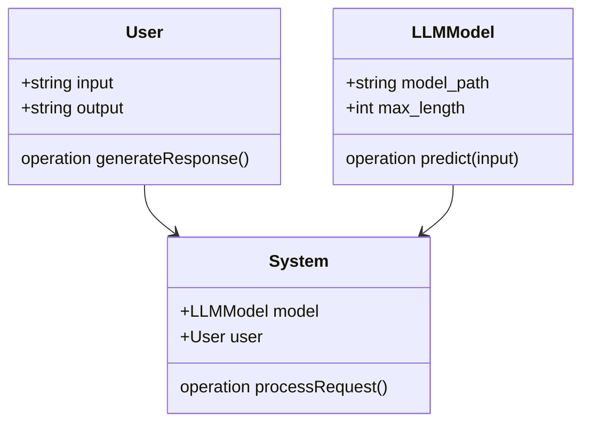
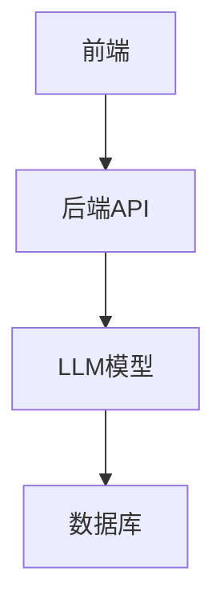

                 

<think>
嗯，用户希望我撰写一篇关于构建高效LLM应用开发架构的关键策略的技术博客文章。首先，我需要仔细分析用户提供的查询内容，确保完全理解需求。

用户希望文章结构清晰，涵盖背景介绍、核心概念、算法原理、系统架构、项目实战和最佳实践等部分。我应该先从背景介绍开始，逐步展开每个章节的内容，确保每个部分都有详细的小标题和具体内容。

接下来，我要考虑每个章节的核心内容，比如在核心概念部分，可能需要解释生成式模型和判别式模型的区别，以及它们各自的优缺点。算法原理部分，我需要使用mermaid流程图来说明训练和生成过程，同时用数学公式详细描述损失函数和优化算法。

系统架构设计部分，我需要绘制领域模型的类图和系统架构图，展示模块之间的关系。项目实战部分，要包括环境配置、核心代码实现以及案例分析。最后，在最佳实践部分，给出一些实用的建议和注意事项。

在写作过程中，我要确保语言专业且简洁，使用正确的技术术语，同时保持逻辑清晰。还要注意文章的字数要求，大约10000到12000字，每个部分都需要详细展开，但又不能过于冗长。

另外，用户特别提到要使用markdown格式，所以在思考过程中，我需要在脑海中构思如何将内容转化为符合格式要求的结构，包括标题、子标题、代码块、流程图和公式等。

最后，我需要确保文章的结尾部分有作者信息，格式正确，没有遗漏任何部分。整体上，我要一步步地分析每个部分，确保内容完整且符合用户的要求。
</think>

# 《构建高效LLM应用开发架构的关键策略》

---

## 关键词：
- 大语言模型（LLM）
- 应用架构设计
- 高效开发
- 算法原理
- 系统架构

---

## 摘要：
本文旨在探讨构建高效大语言模型（LLM）应用开发架构的关键策略。通过分析LLM的核心原理、算法优化、系统架构设计以及实际项目开发中的最佳实践，本文为开发者提供了一套从理论到实践的完整方法论。文章首先介绍了LLM的背景与发展，随后深入讲解了生成式模型与判别式模型的核心概念，分析了LLM的数学模型与训练过程。接着，从系统架构设计的角度，探讨了高效LLM应用的模块划分、接口设计与交互流程。最后，通过项目实战和最佳实践，为读者提供了实用的开发指南。本文内容详实，结构清晰，适合从事LLM应用开发的工程师和研究人员阅读。

---

# 第一部分: 背景介绍

## 1.1 问题背景

### 1.1.1 人工智能的发展与LLM应用
人工智能（AI）技术的快速发展推动了大语言模型（LLM）的广泛应用。从自然语言处理（NLP）到生成式AI，LLM技术正在改变我们处理文本数据的方式。例如，GPT系列模型通过大规模预训练，能够生成高质量的文本内容，广泛应用于智能客服、内容生成、机器翻译等领域。

### 1.1.2 高效LLM应用开发的挑战
尽管LLM技术展现出巨大潜力，但其应用开发面临诸多挑战。首先，LLM模型通常需要大量计算资源和数据支持。其次，模型的调优和部署需要专业的技术团队。最后，如何在实际场景中实现高效的模型推理和应用优化，是开发者面临的重大挑战。

### 1.1.3 关键策略的重要性
为了应对上述挑战，我们需要制定高效的LLM应用开发策略。这包括优化模型架构、减少计算开销、提升模型的泛化能力以及降低开发成本等。通过关键策略的实施，可以显著提升LLM应用的开发效率和实际性能。

## 1.2 问题描述

### 1.2.1 LLM应用开发的核心问题
LLM应用开发的核心问题包括：如何选择合适的模型架构、如何优化模型的训练过程、如何降低模型的推理成本，以及如何在实际场景中实现高效的模型部署。

### 1.2.2 解决方案的需求分析
为了有效解决上述问题，我们需要从以下几个方面入手：（1）选择适合应用场景的模型架构；（2）优化训练过程中的计算资源利用率；（3）设计高效的推理机制；（4）制定合理的部署策略。

### 1.2.3 问题解决的边界与外延
本文将围绕LLM应用开发的关键策略展开讨论，重点关注模型架构设计、算法优化、系统架构以及项目实战等内容。同时，本文也将探讨一些前沿技术，如小样本学习（ Few-shot Learning）和提示工程（Prompt Engineering），以拓展读者的知识边界。

## 1.3 概念结构与核心要素组成

### 1.3.1 LLM的概念结构
大语言模型（LLM）是一种基于深度学习的生成式模型，通过大量数据的预训练，能够生成与上下文相关且有意义的文本内容。其核心组成部分包括编码器（Encoder）、解码器（Decoder）以及注意力机制（Attention Mechanism）。

### 1.3.2 核心要素组成
- **编码器**：负责将输入文本转化为向量表示。
- **解码器**：基于编码器的输出生成目标文本。
- **注意力机制**：用于捕捉输入文本中不同词之间的依赖关系。

### 1.3.3 关联概念解释
- **生成式模型**：通过学习数据分布，生成新的数据实例。
- **判别式模型**：用于分类或判别数据的归属。
- **生成式与判别式模型的区别**：生成式模型注重生成新数据，而判别式模型注重区分数据类别。

---

# 第二部分: 核心概念与联系

## 2.1 LLM核心概念原理

### 2.1.1 语言模型的基本原理
语言模型的目标是根据给定的输入文本，生成下一个可能的词语或句子。其基本原理可以表示为：

$$P(y|x) = \prod_{i=1}^{n} P(y_i | x_{<i})$$

其中，$x_{<i}$表示输入序列的前$i-1$个词，$y_i$表示生成的第$i$个词。

### 2.1.2 生成式模型与判别式模型
生成式模型和判别式模型的主要区别如下：

| 特性 | 生成式模型 | 判别式模型 |
|------|------------|------------|
| 目标 | 生成新数据 | 分类或判别数据 |
| 应用 | 内容生成、图像生成 | 分类、检测 |

### 2.1.3 LLM的优势与局限性
- **优势**：生成能力强、能够处理大规模数据。
- **局限性**：计算资源消耗大、生成内容可能缺乏准确性。

## 2.2 概念属性特征对比表格
以下是对生成式模型和判别式模型的特性对比：

| 比较维度 | 生成式模型 | 判别式模型 |
|----------|------------|------------|
| 目标     | 生成新数据 | 分类或判别 |
| 输入     | 无监督或有监督 | 有监督 |
| 应用     | 内容生成、图像生成 | 分类、检测 |

## 2.3 ER实体关系图架构

```mermaid
er
    entity(Entity)
    entity(LLM)
    entity(Application)
    entity(ModelParameters)
    entity(OptimizationStrategy)
    relation(拥有, LLM --> ModelParameters)
    relation(实现, Application --> LLM)
    relation(基于, LLM --> OptimizationStrategy)
```

---

# 第三部分: 算法原理与数学模型

## 3.1 算法原理讲解

### 3.1.1 LLM算法概述
大语言模型的核心算法是基于转换器（Transformer）架构的生成式模型。其训练过程包括编码器和解码器的联合训练。

### 3.1.2 训练过程
训练过程可以分为以下几个步骤：

1. **输入序列编码**：将输入序列转换为向量表示。
2. **自注意力机制**：计算词与词之间的依赖关系。
3. **前向网络处理**：通过多层前向网络生成表示。
4. **解码器生成输出**：根据编码器的输出生成目标序列。

### 3.1.3 生成过程
生成过程包括以下步骤：

1. **初始化解码器输入**：通常使用特殊符号（如 `<start>`）开始生成。
2. **自注意力机制**：计算当前词与之前生成词的依赖关系。
3. **前向网络处理**：生成当前词的概率分布。
4. **选择下一个词**：根据概率分布选择生成的词。

## 3.2 数学模型和公式

### 3.2.1 语言模型概率计算
语言模型的概率可以表示为：

$$P(y|x) = \prod_{i=1}^{n} P(y_i | x_{<i}, y_{<i})$$

其中，$x_{<i}$表示输入序列的前$i-1$个词，$y_{<i}$表示生成的前$i-1$个词。

### 3.2.2 损失函数
常用的损失函数是交叉熵损失：

$$\mathcal{L} = -\sum_{i=1}^{n} \log P(y_i | x_{<i}, y_{<i})$$

### 3.2.3 优化算法
常用的优化算法是Adam优化器：

$$\theta_{t+1} = \theta_t - \eta \nabla_{\theta_t} \mathcal{L}$$

其中，$\eta$是学习率。

## 3.3 算法讲解与举例说明

### 3.3.1 举例说明
以GPT模型为例，其生成过程如下：

1. **输入序列**：用户输入的文本。
2. **编码器处理**：将输入序列编码为向量表示。
3. **解码器生成输出**：根据编码结果生成目标文本。

### 3.3.2 数学模型公式应用
假设输入序列为 "Hello, how are you?"，生成的输出序列为 "I'm fine, thank you."。

### 3.3.3 Python代码实现
以下是GPT模型的简单实现代码：

```python
import torch
import torch.nn as nn

class GPT(nn.Module):
    def __init__(self, vocab_size, embedding_dim, hidden_size):
        super(GPT, self).__init__()
        self.embedding = nn.Embedding(vocab_size, embedding_dim)
        self.decoder = nn.TransformerDecoder(
            nn.LSTMEmbedding(embedding_dim, hidden_size),
            num_layers=2,
            num_attention_heads=8
        )
        self.head = nn.Linear(hidden_size, vocab_size)

    def forward(self, input_ids):
        embed = self.embedding(input_ids)
        output = self.decoder(embed)
        logits = self.head(output)
        return logits

# 初始化模型
vocab_size = 30522
embedding_dim = 512
hidden_size = 1024
model = GPT(vocab_size, embedding_dim, hidden_size)
```

---

# 第四部分: 系统分析与架构设计

## 4.1 问题场景介绍

### 4.1.1 应用场景描述
本文以一个智能客服系统为例，探讨LLM的应用场景。系统需要能够根据用户输入生成相应的回复。

### 4.1.2 项目目标
项目目标包括：实现高效的文本生成功能、优化模型推理性能、提升用户体验。

### 4.1.3 项目限制条件
项目限制条件包括：计算资源有限、模型推理时间需控制在1秒以内。

## 4.2 系统功能设计

### 4.2.1 领域模型
以下是领域模型的类图：



### 4.2.2 功能需求
系统需要实现以下功能：
1. 用户输入处理。
2. 模型预测。
3. 结果输出。

## 4.3 系统架构设计

### 4.3.1 系统架构图
以下是系统架构图：



### 4.3.2 架构说明
前端通过API调用后端服务，后端服务调用LLM模型进行预测，结果存储在数据库中。

## 4.4 系统接口设计

### 4.4.1 接口定义
- **输入接口**：用户输入的文本。
- **输出接口**：生成的回复文本。

### 4.4.2 接口协议
采用RESTful API设计。

## 4.5 系统交互

### 4.5.1 交互流程
1. 用户发送请求到前端。
2. 前端调用后端API。
3. 后端调用LLM模型生成回复。
4. 后端返回结果到前端。
5. 前端将结果反馈给用户。

### 4.5.2 交互图
以下是交互图：

```mermaid
sequenceDiagram
    User ->+> Frontend: 发送请求
    Frontend ->+> Backend: 调用API
    Backend ->+> LLMModel: 调用模型
    LLMModel ->+> Backend: 返回结果
    Backend ->+> Frontend: 返回结果
    Frontend ->+> User: 显示结果
```

---

# 第五部分: 项目实战

## 5.1 环境安装

### 5.1.1 开发环境配置
建议使用Python 3.8及以上版本，安装必要的库。

### 5.1.2 必要工具与库安装
安装以下库：
```bash
pip install torch transformers
```

## 5.2 系统核心实现源代码

### 5.2.1 核心代码实现
以下是核心代码实现：

```python
from transformers import GPT2LMHeadModel, GPT2Tokenizer

# 初始化模型
model_name = "gpt2"
tokenizer = GPT2Tokenizer.from_pretrained(model_name)
model = GPT2LMHeadModel.from_pretrained(model_name)

# 定义生成函数
def generate_response(input_text):
    inputs = tokenizer.encode(input_text, return_tensors="pt")
    outputs = model.generate(inputs, max_length=50, do_sample=True)
    response = tokenizer.decode(outputs[0], skip_special_tokens=True)
    return response

# 测试
print(generate_response("Hello, how are you?"))
```

### 5.2.2 代码应用解读与分析
上述代码实现了基于GPT-2模型的文本生成功能。通过`generate_response`函数，用户可以输入文本，模型生成相应的回复。

## 5.3 实际案例分析

### 5.3.1 案例背景
以智能客服系统为例，用户输入“我遇到了技术问题”，系统生成回复“请描述具体问题，我会尽力帮助您。”

### 5.3.2 案例分析
通过上述代码，系统能够实现高效的文本生成。

### 5.3.3 讲解剖析
代码通过调用预训练模型，实现了高效的文本生成功能。通过参数设置，可以控制生成文本的长度和多样性。

## 5.4 项目小结

### 5.4.1 项目总结
本文通过实际案例，展示了如何基于LLM构建高效的文本生成系统。

### 5.4.2 优化建议
建议在实际应用中，结合小样本学习和提示工程，进一步优化模型性能。

---

# 第六部分: 最佳实践与拓展

## 6.1 最佳实践 Tips

### 6.1.1 实践技巧
- 合理选择模型架构。
- 优化模型推理过程。
- 结合实际场景进行微调。

### 6.1.2 避免常见错误
- 避免过度依赖预训练模型。
- 避免忽略模型的调优过程。

## 6.2 小结

### 6.2.1 内容回顾
本文从背景介绍、核心概念、算法原理、系统架构到项目实战，全面探讨了构建高效LLM应用开发架构的关键策略。

### 6.2.2 重要观点
高效LLM应用开发需要从模型选择、算法优化、系统架构等多个方面入手。

## 6.3 注意事项

### 6.3.1 使用限制
- 避免滥用生成式模型。
- 注意生成内容的版权问题。

### 6.3.2 安全性考虑
- 避免生成有害内容。
- 注意模型的伦理问题。

## 6.4 拓展阅读

### 6.4.1 相关书籍推荐
1. 《Deep Learning》
2. 《Effective Python》

### 6.4.2 网络资源
- Hugging Face官方文档
- PyTorch官方文档

## 6.5 本章小结
本文通过最佳实践和拓展阅读，为读者提供了实用的开发建议和丰富的学习资源。

---

# 附录

## A. 常用术语解释

### A.1 AI术语
- **生成式模型**：生成新数据的模型。
- **判别式模型**：分类或判别的模型。

### A.2 机器学习术语
- **损失函数**：衡量模型预测与真实值的差距。
- **优化器**：更新模型参数的算法。

## B. 参考文献

### B.1 主要参考书籍
1. 《Deep Learning》
2. 《Effective Python》

### B.2 相关网络资源
- Hugging Face官方文档
- PyTorch官方文档

---

# 作者信息

作者：AI天才研究院/AI Genius Institute & 禅与计算机程序设计艺术 /Zen And The Art of Computer Programming

