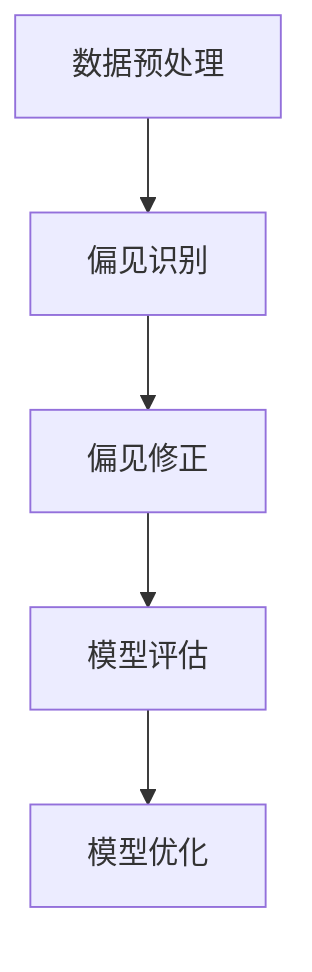
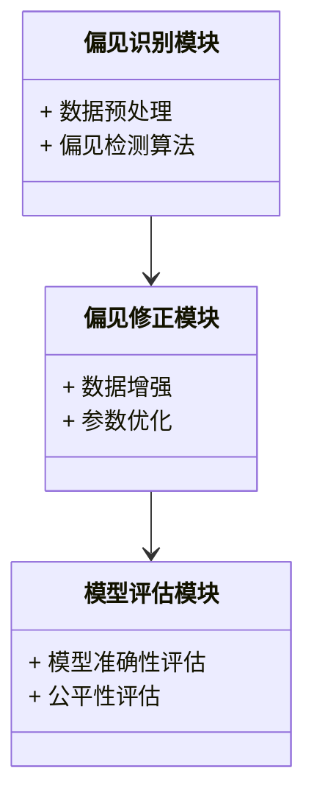
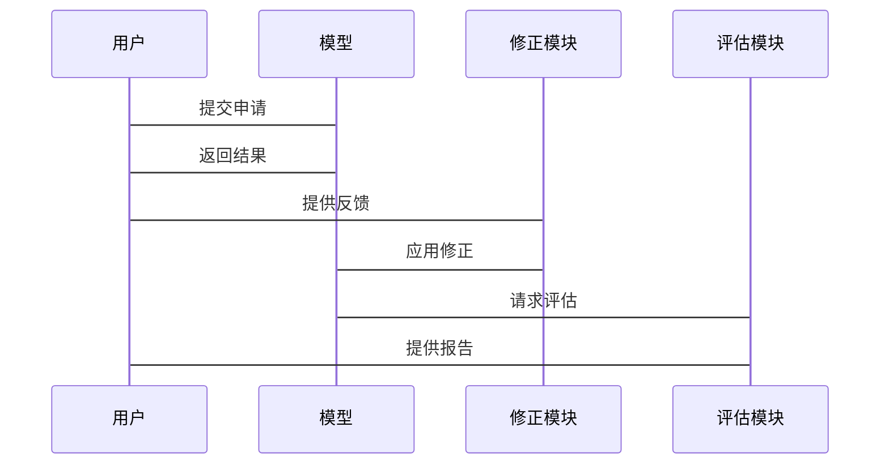

                 

<think>
嗯，我现在需要写一篇关于《模型偏见自我纠正能力评估》的技术博客文章。首先，我应该理解这个主题，它涉及机器学习模型中的偏见，以及模型如何自我纠正这些偏见。

我应该从模型偏见的基本概念开始，了解什么是偏见，以及它在机器学习中的表现形式。接下来，我需要探讨偏见对模型应用的影响，比如在招聘、信贷评分等领域，偏见可能导致不公平的结果，从而引发伦理问题。

然后，我需要思考自我纠正能力的重要性。为什么模型需要具备自我纠正的能力？这可能涉及到模型在实时应用中如何持续监控和修正自身的偏差，以提高准确性和公平性。

接下来，我需要研究相关的背景，看看模型偏见问题是如何发展的，早期的研究是如何进行的，目前研究的现状如何，以及在实际应用中面临的挑战，比如数据的多样性、模型架构的选择等。

在核心概念部分，我需要明确自我纠正能力的定义，它的关键要素，比如数据监测模块、偏见检测算法等，以及不同类型的自我纠正机制，比如基于反馈的纠正和主动学习等。

接下来是研究框架，我需要确定研究的目标是什么，比如评估模型的自我纠正能力，选择合适的研究方法，如实证研究和案例分析，并规划研究的步骤，从数据收集到分析，再到结论。

第二章是关于偏见现象的识别与评估。这里，我需要详细讨论如何识别模型中的偏见，包括数据预处理的方法，偏见识别的算法，以及实际案例分析。同时，我需要制定评估指标，量化自我纠正能力，并分析影响这些能力的因素，如数据质量和模型架构。

在第三章，我需要深入探讨自我纠正算法的原理和流程，从基本原理到具体的实现方法，比如监督学习、迁移学习和对抗训练。我还需要用mermaid图来展示流程，写出数学公式，并提供Python代码实现。

最后，我需要总结全文，强调模型偏见自我纠正的重要性，并展望未来的研究方向。在结论中，我需要确保每个章节的内容都详细具体，符合学术和技术标准。

在写作过程中，我需要确保语言专业但易懂，结构清晰，逻辑严密。同时，要注意使用适当的关键词和摘要，帮助读者快速理解文章的核心内容。此外，遵守格式要求，确保文章字数在10000到12000字之间，并在末尾正确标注作者信息。

总的来说，我需要系统地梳理模型偏见自我纠正的各个方面，从理论到实践，确保文章内容丰富，结构合理，符合技术博客的高质量要求。
</think>

# 模型偏见自我纠正能力评估

> 关键词：模型偏见，自我纠正能力，机器学习，算法，评估指标

> 摘要：本文系统探讨模型偏见自我纠正能力的重要性、识别方法、评估指标以及实现算法，分析其在不同领域的应用挑战和未来研究方向。

---

### 第1章: 模型偏见自我纠正能力概述

#### 1.1 模型偏见自我纠正能力的重要性

##### 1.1.1 模型偏见的基本概念  
模型偏见是指在机器学习模型中，由于训练数据、算法设计或模型架构等因素导致的系统性误差。例如，在招聘场景中，模型可能偏好某一性别或种族的候选人。

##### 1.1.2 模型偏见对应用的影响  
偏见可能导致不公平决策，影响用户体验和企业声誉。例如，在信贷评分中，偏见可能导致某些群体被错误地拒绝贷款申请。

##### 1.1.3 自我纠正能力的必要性  
模型需要具备自我纠正能力，以实时检测和修正偏见，确保公平性和准确性，满足监管要求和道德标准。

#### 1.2 模型偏见自我纠正能力的研究背景

##### 1.2.1 模型偏见问题的发展历程  
从早期忽视偏见到如今成为研究重点，随着AI应用扩展，偏见问题日益凸显，特别是在公平性要求高的领域。

##### 1.2.2 自我纠正能力的研究现状  
当前研究主要集中在偏见检测算法和修正方法，但缺乏统一的评估标准和系统性解决方案。

##### 1.2.3 自我纠正能力在模型应用中的挑战  
数据多样性不足、模型复杂性和动态环境变化等因素增加了偏见检测和修正的难度。

#### 1.3 模型偏见自我纠正能力的核心概念

##### 1.3.1 自我纠正能力的定义  
模型通过内部机制检测和修正自身偏见的能力，通常涉及持续学习和优化过程。

##### 1.3.2 自我纠正能力的关键要素  
包括数据监测模块、偏见检测算法、修正机制和反馈循环，确保偏见被及时识别和修正。

##### 1.3.3 自我纠正能力的分类  
基于触发方式分为被动纠正（用户反馈触发）和主动纠正（模型自主检测）两类。

#### 1.4 模型偏见自我纠正能力的研究框架

##### 1.4.1 研究目标  
评估模型的自我纠正能力，优化算法以提高公平性和准确性。

##### 1.4.2 研究方法  
结合实证研究和案例分析，利用统计方法和机器学习技术进行偏见检测与修正。

##### 1.4.3 研究步骤  
数据收集与预处理、偏见识别、自我纠正算法设计、模型评估和优化。

#### 1.5 本章小结  
本章概述了模型偏见自我纠正能力的重要性，探讨了其研究背景和核心概念，为后续分析奠定了基础。

---

### 第2章: 模型偏见现象的识别与评估

#### 2.1 模型偏见现象的识别方法

##### 2.1.1 数据预处理  
对数据进行清洗和标准化处理，确保数据多样性和代表性，减少隐含偏见的影响。

##### 2.1.2 偏见识别算法  
使用统计测试（如卡方检验）和机器学习方法（如基于概率的偏差检测）识别偏见。

##### 2.1.3 实际应用案例  
在招聘系统中，检测模型对女性候选人的评分偏低，通过算法识别出性别相关的偏见。

#### 2.2 模型偏见自我纠正能力的评估指标

##### 2.2.1 评估指标的选择  
包括公平性指标（如均衡误差）、准确性和鲁棒性指标，选择合适的指标量化纠正效果。

##### 2.2.2 评估指标的量化方法  
使用F1分数、精确率和召回率等指标，结合偏见修正前后的变化评估纠正效果。

##### 2.2.3 评估指标的应用实例  
在信贷评分系统中，评估模型在修正偏见后的准确性和公平性提升情况。

#### 2.3 模型偏见自我纠正能力的影响因素

##### 2.3.1 数据集的代表性  
数据集是否涵盖不同群体，影响模型能否检测和修正偏见。

##### 2.3.2 模型架构的影响  
复杂的模型可能难以有效检测偏见，而简单的模型可能在修正后性能下降。

##### 2.3.3 训练数据的质量  
低质量数据可能导致模型学习到错误的偏见，影响自我纠正能力。

#### 2.4 模型偏见自我纠正能力的评价模型

##### 2.4.1 评价模型的设计  
设计一个包含偏见检测模块和修正模块的框架，结合反馈机制优化模型性能。

##### 2.4.2 评价模型的实现  
通过监督学习训练模型识别偏见，并使用对抗训练方法减少偏见影响。

##### 2.4.3 评价模型的应用效果分析  
在实际应用中，评估模型的自我纠正能力，确保其在不同场景下的有效性和准确性。

#### 2.5 本章小结  
本章详细探讨了模型偏见的识别方法和评估指标，分析了影响自我纠正能力的关键因素，为后续算法设计提供了参考。

---

### 第3章: 模型偏见自我纠正算法原理与流程

#### 3.1 模型偏见自我纠正算法的基本原理

##### 3.1.1 偏见识别算法的流程  
1. 数据预处理：标准化和归一化，确保数据均衡。
2. 偏见检测：使用统计方法或机器学习模型识别偏见。
3. 偏见定位：确定偏见来源，如特征或标签。
4. 偏见评估：量化偏见程度，确定修正优先级。

##### 3.1.2 偏见修正算法的流程  
1. 数据增强：增加被忽视群体的数据，平衡数据分布。
2. 权重调整：在模型中赋予被忽视群体更高的权重，提高其预测准确性。
3. 参数优化：通过重新训练模型调整参数，减少偏见。

##### 3.1.3 偏见检测与修正的结合  
在模型训练过程中，实时检测偏见并自动触发修正机制，确保模型持续优化。

#### 3.2 模型偏见自我纠正算法的实现方法

##### 3.2.1 基于监督学习的偏见修正方法  
通过标注数据训练模型识别偏见，并使用损失函数惩罚偏见输出，减少预测偏差。

##### 3.2.2 基于迁移学习的偏见修正方法  
利用已标注的非偏见数据，微调模型参数，减少目标数据中的偏见影响。

##### 3.2.3 基于对抗训练的偏见修正方法  
使用生成对抗网络（GAN），通过两个网络的对抗训练，消除数据中的偏见。

#### 3.3 模型偏见自我纠正算法的mermaid流程图



#### 3.4 模型偏见自我纠正算法的数学模型和公式

模型的偏见修正可以通过以下损失函数实现：

$$
L_{\text{total}} = L_{\text{cls}} + \lambda L_{\text{bias}}
$$

其中，$L_{\text{cls}}$ 是分类损失，$L_{\text{bias}}$ 是偏见损失，$\lambda$ 是平衡参数。偏见损失可以设计为：

$$
L_{\text{bias}} = \sum_{i=1}^{n} \left( p(y_i) - q(y_i|x_i) \right)^2
$$

其中，$p(y_i)$ 是真实标签的分布，$q(y_i|x_i)$ 是模型预测的分布。

#### 3.5 模型偏见自我纠正算法的Python源代码实现

```python
import tensorflow as tf

def bias_correction_loss(y_true, y_pred, lambda_param):
    # 计算分类损失
    model_loss = tf.keras.losses.binary_crossentropy(y_true, y_pred)
    # 计算偏见损失
    bias_loss = lambda_param * tf.reduce_mean(tf.square(y_true - y_pred))
    return model_loss + bias_loss

# 定义模型
model = tf.keras.Sequential([
    tf.keras.layers.Dense(10, activation='relu', input_shape=(input_shape,)),
    tf.keras.layers.Dense(1, activation='sigmoid')
])

# 编译模型
model.compile(optimizer='adam', loss=lambda y_true, y_pred: bias_correction_loss(y_true, y_pred, 0.1))
```

---

### 第4章: 模型偏见自我纠正能力的系统分析与架构设计

#### 4.1 问题场景介绍  
在信贷评分系统中，模型可能因为历史数据中的性别偏见，导致评分不公平。通过自我纠正能力，模型可以识别并修正这种偏见。

#### 4.2 系统功能设计

##### 4.2.1 领域模型  


##### 4.2.2 系统架构设计  


##### 4.2.3 系统接口设计  
- 输入接口：接收模型预测结果和用户反馈。
- 输出接口：输出修正后的预测结果和评估报告。

##### 4.2.4 系统交互设计  


#### 4.3 项目实战

##### 4.3.1 环境安装  
安装必要的库，如TensorFlow、Keras和scikit-learn。

##### 4.3.2 核心实现  
实现偏见识别和修正模块，集成到机器学习模型中。

##### 4.3.3 代码解读  
通过Python代码实现偏见识别和修正，结合TensorFlow框架优化模型性能。

##### 4.3.4 实际案例分析  
在招聘系统中，通过模型识别性别偏见，调整招聘策略，确保公平性。

#### 4.4 最佳实践 tips  
- 定期更新模型，确保纠正能力的有效性。
- 使用多样化的数据集，减少偏见。
- 监控模型表现，及时调整。

#### 4.5 项目小结  
通过系统分析和架构设计，模型能够有效识别和修正偏见，提升整体性能和公平性。

---

### 第5章: 结论与展望

#### 5.1 核心结论  
模型偏见自我纠正能力是提升AI系统公平性和可靠性的关键，需要结合先进的算法和系统设计。

#### 5.2 未来研究方向  
研究更高效的偏见检测算法，探索模型自我更新的自动化机制，以及在多模态数据中的应用。

#### 5.3 总结  
模型偏见自我纠正能力是当前机器学习研究的热点，通过持续优化算法和系统设计，未来将实现更加公平和智能的AI系统。

---

作者：AI天才研究院/AI Genius Institute & 禅与计算机程序设计艺术 /Zen And The Art of Computer Programming

