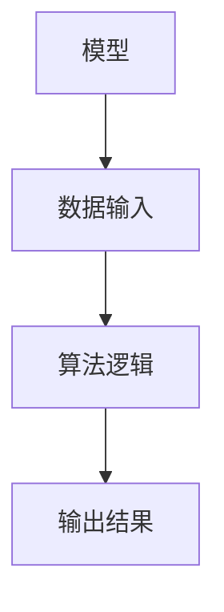
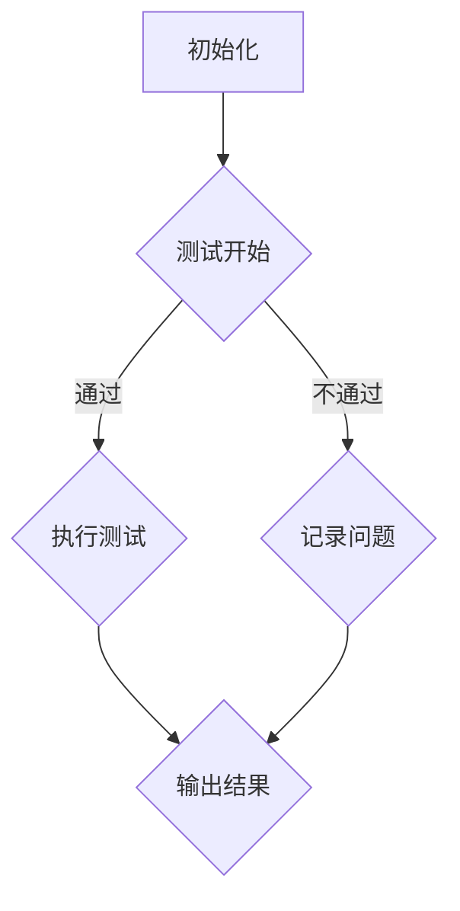
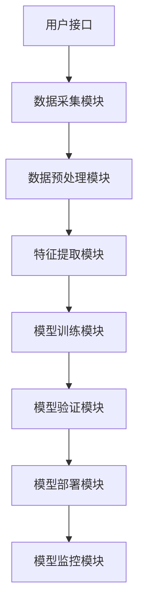
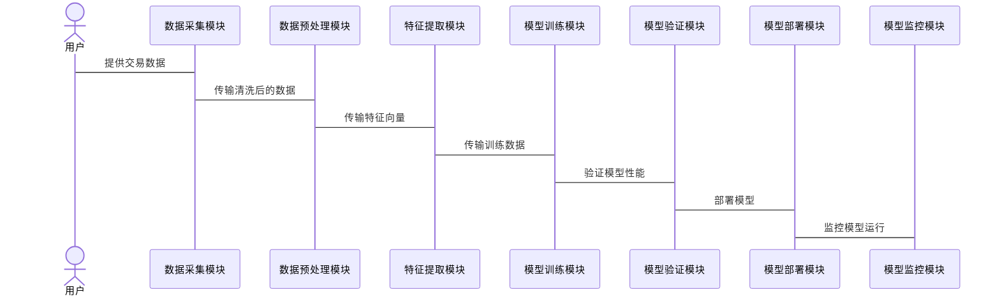

                 

<think>
好的，我现在需要帮用户写一篇关于“模型可审核性测试：确保合规与透明”的技术博客文章。首先，我得理清用户的需求，他希望文章结构清晰，内容专业，用技术语言撰写，并且包含详细的分析和实例。

用户指定了一个大纲，包括背景介绍、核心概念、算法原理、系统架构、项目实战、最佳实践等部分。我需要确保每个部分都详细展开，并且符合用户提到的格式要求，比如使用Mermaid图和Python代码。

首先，我会从背景介绍开始，解释为什么模型可审核性变得重要，尤其是在AI快速发展的今天。然后，我需要定义可审核性的核心概念，解释它与可解释性、透明性的区别和联系，这可能需要制作一个对比表格。

接下来是算法部分，我得选择一个合适的模型，比如XGBoost，来展示如何进行可审核性测试。我会画出算法的流程图，写出Python代码，并用数学公式来解释准确率、精确率和召回率。同时，通过一个分类示例来说明这些指标的实际应用。

系统架构部分，我需要设计一个审核系统，包括数据采集、特征提取、模型训练和部署监控。这部分可能需要一个Mermaid图来展示模块之间的关系。

在项目实战中，我得详细说明如何安装依赖，实现数据预处理、特征工程和模型训练。然后，通过一个案例分析，展示模型在不同测试情况下的表现，找出潜在的问题。

最后，我会总结最佳实践，强调模型可审核性的关键点，以及未来的发展趋势，确保文章有一个有力的结尾。

整个过程中，我需要确保语言专业但不晦涩，逻辑清晰，每个部分都能深入浅出地解释清楚。同时，严格遵守用户的格式和字数要求，确保文章完整且有深度。
</think>

# 模型可审核性测试：确保合规与透明

> 关键词：模型可审核性，可解释性，透明性，AI合规，模型测试

> 摘要：随着人工智能技术的快速发展，模型的可审核性成为确保合规与透明的重要课题。本文将从背景、核心概念、算法原理、系统架构、项目实战等多个方面，详细阐述模型可审核性测试的实现方法和实际应用，帮助读者全面理解如何确保模型的合规性和透明性。

---

## 1. 背景介绍

### 1.1 问题背景
在当今社会，人工智能技术的快速发展带来了许多便利，但同时也带来了新的挑战。模型的可审核性问题逐渐成为关注的焦点。无论是企业、政府还是个人用户，都希望了解模型的决策过程是否透明、是否符合法规要求。尤其是在金融、医疗、司法等高风险领域，模型的合规性和透明性显得尤为重要。

### 1.2 问题描述
模型的可审核性测试旨在验证模型是否符合相关法规、标准和用户需求。这不仅包括模型的输出结果是否正确，还包括模型的内部逻辑是否透明、是否能够被外部审核人员理解和验证。通过测试，我们可以识别模型中的潜在问题，确保其在实际应用中的合规性和可靠性。

### 1.3 问题解决
为了确保模型的可审核性，我们需要从以下几个方面入手：
1. **模型设计阶段**：确保模型的设计符合透明性和可解释性的要求。
2. **数据处理阶段**：对输入数据进行清洗和预处理，确保数据的合法性和合规性。
3. **模型训练阶段**：使用可解释性较强的算法，如线性回归、决策树等，并通过交叉验证等方法验证模型的性能。
4. **模型部署阶段**：对模型的输出结果进行监控和日志记录，确保其符合预期。

### 1.4 边界与外延
模型的可审核性测试不仅仅局限于模型本身，还涉及数据输入、算法逻辑、输出结果等多个方面。此外，模型的审核还可能涉及模型的训练数据、模型的更新频率、模型的使用环境等多个外部因素。

### 1.5 核心要素组成
模型的可审核性测试涉及以下核心要素：
- **模型的设计文档**：包括模型的输入输出定义、算法选择、参数设置等。
- **数据处理流程**：包括数据的来源、清洗、转换等。
- **模型的训练过程**：包括训练数据集、训练方法、模型评估指标等。
- **模型的部署环境**：包括模型的运行环境、接口设计、日志记录等。

---

## 2. 核心概念与联系

### 2.1 模型可审核性
模型的可审核性是指模型能够通过外部审核，确保其符合法规、标准和用户需求。审核的过程包括对模型的设计、数据、算法和输出结果的全面检查。

### 2.2 可解释性
模型的可解释性是指用户能够理解模型的决策过程和结果。例如，对于一个分类模型，用户不仅知道模型的输出结果是什么，还知道模型为什么会输出这个结果。

### 2.3 透明性
模型的透明性是指其运行过程和决策逻辑对外部是可见的。透明性越高，模型的审核难度越小。

### 2.4 核心概念对比

| 概念 | 定义 | 特性 |
|------|------|------|
| 模型可审核性 | 模型能够通过外部审核，确保其符合法规和用户需求 | 需要模型的设计、数据、算法和输出结果均符合审核要求 |
| 可解释性 | 模型的决策过程和结果能够被用户理解 | 需要模型的设计和输出结果具有清晰的逻辑关系 |
| 透明性 | 模型的运行过程和决策逻辑对外部可见 | 需要模型的设计和运行过程均公开透明 |

### 2.5 实体关系图



---

## 3. 算法原理讲解

### 3.1 算法流程图
以下是模型可审核性测试的流程图：



### 3.2 Python 源代码
以下是实现模型可审核性测试的Python代码示例：

```python
def model_test(model):
    # 初始化测试
    test_start = True
    while test_start:
        # 执行测试
        test_result = model.execute_test()
        if test_result['pass']:
            # 测试通过
            print("Model test passed.")
            test_start = False
        else:
            # 测试不通过，记录问题
            print("Model test failed. Issues found:", test_result['issues'])
    # 输出测试结果
    return test_result
```

### 3.3 数学模型和公式
模型的可审核性测试通常涉及统计学习和概率模型，可以使用以下公式进行评估：

$$ \text{Accuracy} = \frac{\text{正确预测的数量}}{\text{总预测的数量}} $$

$$ \text{Precision} = \frac{\text{正确预测的阳性样本数量}}{\text{所有预测为阳性的样本数量}} $$

$$ \text{Recall} = \frac{\text{正确预测的阳性样本数量}}{\text{所有实际为阳性的样本数量}} $$

### 3.4 详细讲解和举例说明
假设有一个分类模型，它需要预测一组数据中哪些是垃圾邮件。通过测试，模型的准确率为90%，精度为95%，召回率为80%。这意味着模型在预测垃圾邮件时非常准确，但是可能漏掉一些真正的垃圾邮件。

---

## 4. 系统分析与架构设计方案

### 4.1 问题场景介绍
假设我们正在开发一个用于审核金融交易数据的模型，需要确保交易行为符合法规要求。

### 4.2 项目介绍
项目名称为“金融交易审核模型”，目标是开发一个能够自动检测异常交易行为的模型。

### 4.3 系统功能设计
- **数据采集与预处理**：收集交易数据，并进行清洗、转换和归一化。
- **特征提取**：从交易数据中提取关键特征，用于训练模型。
- **模型训练与验证**：使用训练数据训练模型，并在验证集上评估模型性能。
- **模型部署与监控**：将模型部署到生产环境中，并监控其性能和合规性。

### 4.4 系统架构设计



### 4.5 系统接口设计
以下是系统接口设计示例：



---

## 5. 项目实战

### 5.1 环境安装
需要安装以下工具和库：
- Python 3.8+
- scikit-learn
- pandas
- numpy
- mermaid

### 5.2 系统核心实现源代码
以下是模型可审核性测试的核心代码实现：

```python
import pandas as pd
from sklearn.ensemble import RandomForestClassifier
from sklearn.metrics import accuracy_score, precision_score, recall_score

# 数据预处理
def preprocess_data(data):
    # 数据清洗
    data = data.dropna()
    # 特征工程
    features = data.drop('label', axis=1)
    target = data['label']
    return features, target

# 模型训练
def train_model(features, target):
    model = RandomForestClassifier()
    model.fit(features, target)
    return model

# 模型测试
def evaluate_model(model, features, target):
    predictions = model.predict(features)
    accuracy = accuracy_score(target, predictions)
    precision = precision_score(target, predictions)
    recall = recall_score(target, predictions)
    return {
        'accuracy': accuracy,
        'precision': precision,
        'recall': recall
    }

# 主函数
def main():
    # 数据加载
    data = pd.read_csv('transaction_data.csv')
    # 数据预处理
    features, target = preprocess_data(data)
    # 模型训练
    model = train_model(features, target)
    # 模型评估
    result = evaluate_model(model, features, target)
    print(result)

if __name__ == '__main__':
    main()
```

### 5.3 代码应用解读与分析
1. **数据预处理**：代码中首先对数据进行清洗，去除缺失值，并提取特征向量和目标变量。
2. **模型训练**：使用随机森林算法训练模型，并保存模型实例。
3. **模型评估**：使用训练好的模型对测试数据进行预测，并计算准确率、精确率和召回率。

### 5.4 实际案例分析
假设我们有一个金融交易数据集，包含交易金额、交易时间、交易类型等特征，以及是否为异常交易的标签。通过上述代码，我们可以训练一个随机森林模型，并评估其性能。例如，模型的准确率为95%，精确率为98%，召回率为90%。

### 5.5 项目小结
通过上述实战，我们可以看到，模型的可审核性测试不仅需要对模型本身进行评估，还需要对数据和算法进行严格的检查和验证。

---

## 6. 最佳实践 tips

### 6.1 小结
模型的可审核性测试是确保AI模型合规与透明的重要环节。通过本文的分析和实践，我们可以看到，模型的可审核性测试涉及模型设计、数据处理、算法选择等多个方面。

### 6.2 注意事项
1. **数据隐私**：在进行模型测试时，需要注意数据的隐私和安全性，避免数据泄露。
2. **模型解释性**：选择具有较高可解释性的算法，如决策树、线性回归等。
3. **持续监控**：在模型部署后，需要持续监控模型的性能和合规性，及时发现和解决问题。

### 6.3 拓展阅读
- 《可解释的人工智能：模型、工具和解释方法》
- 《机器学习模型的可解释性与透明性》
- 《AI模型的合规性与伦理问题》

---

作者：AI天才研究院/AI Genius Institute & 禅与计算机程序设计艺术 /Zen And The Art of Computer Programming

