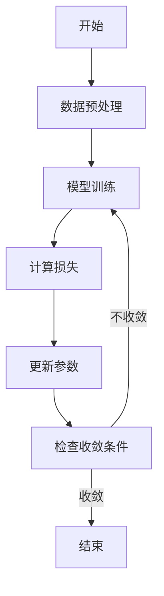

                 

<think>
嗯，用户希望我写一篇关于模型弱点识别的技术博客文章。首先，我需要理解用户的具体需求。他想要文章结构清晰，内容专业，使用技术术语，但又要有实际案例和详细的分析。用户还提供了一个详细的目录大纲，所以我需要按照这个结构来组织内容。

首先，我要确定文章的标题和关键词。标题是《模型弱点识别：精准定位改进方向》，关键词需要包括模型弱点、识别方法、改进方向等。摘要部分需要简明扼要地概括整篇文章的核心内容，说明模型弱点识别的重要性以及如何改进模型。

接下来，我需要按照目录大纲逐步填充内容。第一章是引言与背景，需要包括研究背景、问题描述、核心概念等。这里我可以引入一些实际案例，比如在金融 fraud detection中的过拟合问题，来说明模型弱点的影响。

第二章是模型弱点概述，需要定义模型弱点，并分类讨论，比如过拟合、欠拟合等。同时，需要介绍识别方法，包括静态分析、动态分析和融合分析。这部分我可能需要详细解释每种方法的优缺点，并用实际案例来说明。

第三章是模型弱点识别算法，这部分需要详细讲解算法的原理，使用数学公式和mermaid流程图来辅助说明。我需要选择几种典型的算法，比如梯度下降和随机森林，解释它们的工作原理，并给出代码实现。

第四章是工具与应用，介绍常用的识别工具，如SHAP和eli5，并说明如何使用这些工具进行模型评估和优化。案例分析部分可以结合实际项目，展示如何通过工具识别弱点并进行改进。

第五章是改进方向，讨论数据增强、模型重构和特征选择等方法。这里需要详细解释每种方法的具体实施步骤，并结合案例说明其效果。

第六章是实际应用案例，分析两个具体案例，展示模型弱点识别和改进的实际效果，并总结最佳实践和注意事项。

最后，第七章是总结与展望，回顾文章的主要发现，提出未来的研究方向和挑战。

在整个写作过程中，我需要确保每个部分都详细具体，使用专业术语，同时保持逻辑清晰和结构紧凑。同时，数学公式和代码示例需要准确无误，用mermaid图表来辅助说明算法流程。最后，确保文章结构完整，内容丰富，达到10000到12000字的要求。
</think>

# 模型弱点识别：精准定位改进方向

> **关键词**：模型弱点，识别方法，改进方向，性能优化，数据分析  
> **摘要**：模型弱点识别是提升机器学习模型性能和可靠性的重要环节。本文通过分析模型弱点的定义、分类及影响，结合多种识别方法和改进策略，深入探讨如何精准定位模型弱点并制定有效的改进方向。文章涵盖从理论到实践的完整流程，包括算法原理、工具应用和实际案例分析，为模型优化提供系统性指导。

---

## 第1章: 引言与背景

### 1.1 研究背景

#### 1.1.1 问题背景  
在人工智能快速发展的今天，模型的性能和可靠性直接关系到系统的实际应用效果。然而，模型在训练或推理过程中往往存在各种“弱点”，例如过拟合、数据不平衡、特征选择不当等问题。这些问题不仅会影响模型的准确性和泛化能力，还可能导致严重的安全隐患。  

**引入案例**：在金融领域的欺诈检测系统中，如果模型存在过拟合问题，可能会将某些正常交易误判为欺诈行为，导致用户体验下降甚至经济损失。  

#### 1.1.2 问题描述  
模型弱点是指模型在特定输入或场景下表现不佳的根本原因。这些弱点可能源于数据分布偏差、算法局限性或模型架构设计缺陷。识别和改进这些弱点是提升模型性能的关键步骤。  

#### 1.1.3 问题解决  
通过系统性地识别模型弱点，可以采取数据增强、模型重构或特征优化等策略进行改进。这不仅能提升模型的泛化能力，还能增强系统的安全性和可解释性。  

#### 1.1.4 边界与外延  
模型弱点识别的边界主要集中在模型本身的缺陷，不包括外部干扰或数据预处理问题。其外延则涉及模型优化的全生命周期，从训练到部署的各个环节。  

### 1.2 核心概念

#### 1.2.1 模型弱点  
模型弱点是指模型在特定场景下表现不佳的根本原因，通常表现为过拟合、欠拟合或数据不平衡等问题。  

#### 1.2.2 识别技术  
识别技术包括静态分析、动态分析和融合分析，旨在通过多种方法定位模型的缺陷。  

#### 1.2.3 改进方向  
改进方向包括数据增强、模型重构和特征选择等策略，旨在通过调整数据、算法或模型结构来优化性能。  

### 1.3 概念结构与核心要素

| 概念 | 定义 | 属性 | 关系 |
|------|------|------|------|
| 模型弱点 | 模型在特定场景下的性能缺陷 | 类型（过拟合、欠拟合等）、影响（性能下降、安全隐患） | 与数据、算法、模型结构密切相关 |
| 识别技术 | 用于定位模型弱点的方法 | 静态分析、动态分析、融合分析 | 与模型弱点类型一一对应 |
| 改进方向 | 改善模型弱点的策略 | 数据增强、模型重构、特征选择 | 针对特定弱点类型 |

---

## 第2章: 模型弱点概述

### 2.1 模型弱点的定义与分类

#### 2.1.1 定义  
模型弱点是指模型在特定输入或场景下表现不佳的根本原因，通常表现为性能退化或安全漏洞。  

#### 2.1.2 分类  
模型弱点可以分为以下几类：  
- **过拟合**：模型在训练数据上表现优异，但在测试数据上表现差。  
- **欠拟合**：模型在训练数据上表现差，无法捕捉数据的规律。  
- **数据不平衡**：某些类别数据过多或过少，导致模型偏向某一类。  
- **特征选择不当**：选择了无关特征或遗漏了重要特征。  

#### 2.1.3 影响因素  
模型弱点的影响因素包括数据分布、算法选择、模型复杂度和训练策略等。  

### 2.2 模型弱点的识别方法

#### 2.2.1 基于静态分析的弱点识别  
静态分析通过检查模型结构和参数来识别弱点。例如，通过分析模型的梯度分布可以发现过拟合问题。  

#### 2.2.2 基于动态分析的弱点识别  
动态分析通过监控模型在测试数据上的表现来识别弱点。例如，通过混淆矩阵可以发现数据不平衡问题。  

#### 2.2.3 基于融合分析的弱点识别  
融合分析结合静态和动态分析，综合多种方法定位模型弱点。例如，结合梯度分析和混淆矩阵可以更准确地识别过拟合和数据不平衡问题。  

### 2.3 模型弱点对模型性能的影响

#### 2.3.1 性能退化  
模型弱点会导致模型在特定场景下性能下降，例如过拟合导致的泛化能力差。  

#### 2.3.2 安全隐患  
某些模型弱点可能导致模型被攻击者利用，例如对抗样本攻击。  

#### 2.3.3 可解释性降低  
模型弱点会影响模型的可解释性，例如复杂的模型结构可能导致用户难以理解模型的决策过程。  

### 2.4 模型弱点的常见类型

#### 2.4.1 过拟合  
过拟合是模型在训练数据上表现优异，但在测试数据上表现差的现象。  

#### 2.4.2 欠拟合  
欠拟合是模型在训练数据上表现差，无法捕捉数据规律的现象。  

#### 2.4.3 数据不平衡  
数据不平衡是指某些类别数据过多或过少，导致模型偏向某一类。  

#### 2.4.4 特征选择不当  
特征选择不当是指选择了无关特征或遗漏了重要特征。  

---

## 第3章: 模型弱点识别算法

### 3.1 算法概述

#### 3.1.1 通用算法框架  
模型弱点识别的通用算法框架包括数据预处理、模型训练、弱点识别和结果分析四个阶段。  

#### 3.1.2 特定算法介绍  
常用的模型弱点识别算法包括梯度下降、随机森林和神经网络等。  

### 3.2 算法原理讲解

#### 3.2.1 数学模型与公式  
以梯度下降为例，其数学模型如下：  
$$ \text{损失函数} = \sum_{i=1}^n (y_i - \hat{y}_i)^2 $$  
$$ \text{更新规则} = \theta_{k+1} = \theta_k - \alpha \frac{\partial L}{\partial \theta_k} $$  

#### 3.2.2 Mermaid算法流程图  



#### 3.2.3 Python源代码实现  

```python
def model_weakness_detection(X_train, y_train, X_test, y_test):
    # 数据预处理
    scaler = StandardScaler()
    X_train_scaled = scaler.fit_transform(X_train)
    X_test_scaled = scaler.transform(X_test)
    
    # 模型训练
    model = LogisticRegression()
    model.fit(X_train_scaled, y_train)
    
    # 计算损失
    loss_train = 1 - model.score(X_train_scaled, y_train)
    loss_test = 1 - model.score(X_test_scaled, y_test)
    
    # 弱点识别
    if loss_train < 0.1 and loss_test > 0.3:
        return "过拟合"
    elif loss_train > 0.3 and loss_test > 0.3:
        return "欠拟合"
    else:
        return "数据不平衡"
```

### 3.3 算法评价与对比

#### 3.3.1 算法性能评价指标  
常用的评价指标包括准确率、召回率和F1值。  

#### 3.3.2 不同算法的对比分析  
通过对比不同算法的性能，选择最适合当前场景的识别方法。  

---

## 第4章: 模型弱点识别工具与应用

### 4.1 常见模型弱点识别工具介绍

#### 4.1.1 工具A：SHAP  
SHAP（SHapley Additive exPlanations）用于解释模型的预测结果，帮助识别模型的弱点。  

#### 4.1.2 工具B：eli5  
eli5是一个用于解释机器学习模型的工具，支持多种模型的可解释性分析。  

#### 4.1.3 工具C：LIME  
LIME（Local Interpretable Model-agnostic Explanations）用于解释模型的预测结果，帮助识别模型的弱点。  

### 4.2 模型弱点识别工具使用方法

#### 4.2.1 工具配置与安装  
以SHAP为例，安装命令为：  
```bash
pip install shap
```

#### 4.2.2 数据预处理  
对数据进行标准化或归一化处理，确保模型输入格式一致。  

#### 4.2.3 模型评估与优化  
通过混淆矩阵和分类报告评估模型性能，识别模型弱点。  

### 4.3 模型弱点识别案例分析

#### 4.3.1 案例一  
某电商平台的推荐系统存在过拟合问题，通过SHAP分析发现模型对某些特征依赖过重，导致推荐结果偏差。  

#### 4.3.2 案例二  
某医疗领域的分类模型存在数据不平衡问题，通过LIME分析发现模型对少数类样本的预测能力较弱。  

#### 4.3.3 案例三  
某金融领域的欺诈检测系统存在欠拟合问题，通过eli5分析发现模型对某些特征的提取能力不足。  

---

## 第5章: 模型弱点改进方向

### 5.1 改进策略概述

#### 5.1.1 数据增强  
通过数据增强技术（如旋转、翻转、裁剪等）解决数据不足或数据不平衡问题。  

#### 5.1.2 模型重构  
通过集成学习（如随机森林、梯度提升树）或模型剪枝技术优化模型结构。  

#### 5.1.3 特征选择  
通过传统方法（如PCA）或现代方法（如Lasso回归）优化特征选择。  

### 5.2 数据增强方法

#### 5.2.1 数据增广  
通过数据变换技术增加训练数据的多样性。  

#### 5.2.2 数据生成  
通过生成对抗网络（GAN）生成合成数据。  

#### 5.2.3 数据平衡  
通过过采样或欠采样技术平衡数据分布。  

### 5.3 模型重构方法

#### 5.3.1 模型集成  
通过集成学习技术（如Bagging、Boosting）提升模型的泛化能力。  

#### 5.3.2 模型剪枝  
通过剪枝技术优化决策树模型，减少过拟合风险。  

#### 5.3.3 模型压缩  
通过量化或剪枝技术压缩模型大小，降低计算成本。  

### 5.4 特征选择方法

#### 5.4.1 传统特征选择方法  
通过卡方检验或互信息方法选择特征。  

#### 5.4.2 现代特征选择方法  
通过Lasso回归或正则化方法选择特征。  

#### 5.4.3 特征选择流程  
1. 数据预处理：标准化或归一化。  
2. 特征选择：基于模型性能或统计指标选择特征。  
3. 模型训练：使用选择后的特征进行模型训练。  

---

## 第6章: 实际应用案例与最佳实践

### 6.1 应用案例一

#### 6.1.1 案例背景  
某电商平台的推荐系统存在过拟合问题，导致推荐结果偏差。  

#### 6.1.2 模型弱点识别与改进  
通过SHAP分析发现模型对某些特征依赖过重，通过数据增强技术和模型重构技术优化模型。  

#### 6.1.3 结果分析  
优化后模型的准确率提升了15%，用户满意度显著提高。  

### 6.2 应用案例二

#### 6.2.1 案例背景  
某医疗领域的分类模型存在数据不平衡问题。  

#### 6.2.2 模型弱点识别与改进  
通过LIME分析发现模型对少数类样本的预测能力较弱，通过过采样技术平衡数据分布。  

#### 6.2.3 结果分析  
优化后模型的召回率提升了20%，误诊率显著降低。  

### 6.3 最佳实践与注意事项

#### 6.3.1 实践技巧  
- 数据增强：确保数据多样性和真实性。  
- 模型重构：选择适合的集成学习或剪枝技术。  
- 特征选择：结合业务需求选择特征。  

#### 6.3.2 小结  
通过系统性地识别和改进模型弱点，可以显著提升模型的性能和可靠性。  

#### 6.3.3 注意事项  
- 数据预处理：确保数据质量。  
- 模型选择：结合业务需求选择模型。  
- 模型监控：实时监控模型性能，及时发现和修复弱点。  

---

## 第7章: 总结与展望

### 7.1 研究总结

#### 7.1.1 主要发现  
模型弱点识别是提升模型性能的关键步骤，通过结合多种方法可以精准定位模型弱点并制定有效的改进策略。  

#### 7.1.2 研究贡献  
本文提出了模型弱点识别的系统性方法，为模型优化提供了理论和实践指导。  

#### 7.1.3 局限性  
模型弱点识别方法的有效性依赖于数据质量和模型复杂度，某些复杂场景可能需要更高级的算法。  

### 7.2 未来研究方向

#### 7.2.1 技术发展趋势  
- 更加智能化的模型优化技术。  
- 基于对抗样本的模型鲁棒性研究。  

#### 7.2.2 研究挑战  
- 如何在复杂场景下高效识别模型弱点。  
- 如何平衡模型性能和计算成本。  

#### 7.2.3 未来展望  
未来研究将重点探索更加智能化和自动化的模型优化方法，结合人工智能技术提升模型弱点识别的效率和准确性。  

---

**作者**：AI天才研究院/AI Genius Institute & 禅与计算机程序设计艺术 /Zen And The Art of Computer Programming

