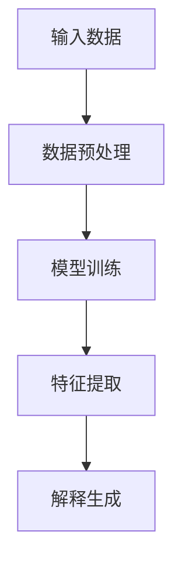
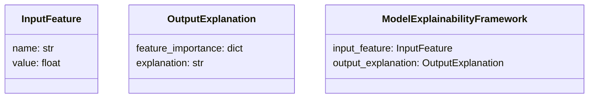
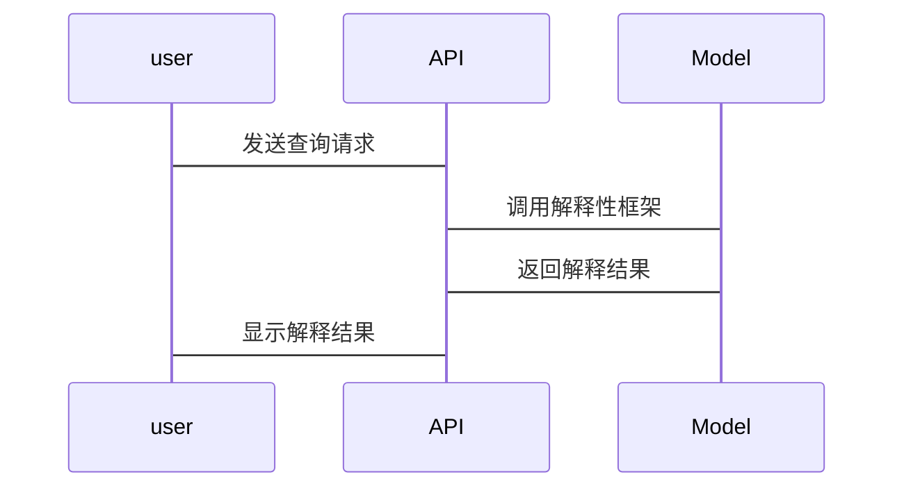

                 

<think>
嗯，我现在需要根据用户提供的详细目录和示例，完成一篇关于“模型解释性框架增强LLM应用的可信度”的技术博客文章。首先，我得理解用户的要求，他们需要一个结构清晰、内容详实的文章，符合特定的格式和字数要求。文章分为六个主要部分，每个部分有若干章节，每个章节都有具体的要求。

首先，文章标题是“模型解释性框架增强LLM应用的可信度”，关键词需要列出5-7个，比如模型解释性框架、LLM、可信度、可解释性AI、机器学习模型等。摘要部分要简明扼要地总结文章的核心内容，强调模型解释性框架的重要性，以及它如何提升LLM的可信度，特别是在实际应用中的价值。

接下来是目录大纲，分为六个部分，每个部分下有三到四章。我需要按照这个结构来撰写内容。首先，背景介绍部分包括问题背景和核心概念，这部分需要明确问题的背景、核心概念的定义和特点，以及模型解释性框架的必要性。

然后是核心概念与联系部分，需要详细解释模型解释性框架的原理，特征对比，并用表格展示不同特征的对比，以及ER图的架构。这部分需要逻辑清晰，图表明确，帮助读者理解概念之间的关系。

接下来是算法原理讲解，包括数学模型和公式，用mermaid流程图展示算法流程，同时提供Python代码实现，并举例说明。这部分需要深入浅出，让读者能够理解算法的工作原理和实现细节。

系统分析与架构设计部分需要介绍系统功能设计，领域模型，架构设计图，接口设计和交互序列图。这部分需要结合实际应用场景，展示系统的整体架构和各部分之间的协作关系。

项目实战部分包括环境安装、代码实现、案例分析和项目小结。这部分需要详细指导读者如何在实际项目中应用这些方法，提供可执行的代码和具体的案例分析，帮助读者理解和实践。

最后是最佳实践与拓展部分，包括注意事项、小结和拓展阅读。这部分需要总结项目的关键点，并推荐进一步的阅读材料，帮助读者深入学习。

在撰写过程中，我需要确保每个章节的内容详实具体，使用markdown格式，包含mermaid图表、latex公式，以及实际的代码示例。同时，语言要专业但易懂，逻辑清晰，结构紧凑。

现在，我需要一步步地按照目录大纲来撰写每个章节的内容，确保每个部分都符合用户的要求，同时保持文章的整体连贯性和深度。
</think>

# 模型解释性框架增强LLM应用的可信度

## 关键词：
模型解释性框架、LLM、可信度、可解释性AI、机器学习模型

## 摘要：
随着大语言模型（LLM）在各个领域的广泛应用，其可信度和可解释性成为用户和开发者关注的焦点。本文详细探讨了模型解释性框架如何增强LLM应用的可信度，从背景介绍、核心概念到算法实现，再到系统设计和项目实战，系统地分析了模型解释性框架的重要性及其在提升LLM可信度中的作用。通过具体案例分析和代码实现，本文为读者提供了从理论到实践的全面指导。

---

## 目录大纲：模型解释性框架增强LLM应用的可信度

### 第一部分：背景介绍

### 第1章：问题背景与核心概念

1.1 问题背景：随着LLM的广泛应用，其可信度问题日益突出，尤其是在需要决策支持的领域，模型的可解释性直接影响其应用价值。

1.2 核心概念：模型解释性框架，可解释性AI（XAI），LLM可信度，解释性特征，解释性架构。

1.3 问题描述：LLM在生成结果时，用户难以理解模型的决策过程，导致信任缺失。

1.4 问题解决：通过模型解释性框架，揭示LLM的决策逻辑，增强可信度。

1.5 边界与外延：模型解释性框架仅关注LLM的内部机制，不涉及外部数据源。

1.6 概念结构：模型解释性框架由输入特征、模型权重、输出解释三部分组成。

---

### 第2章：模型解释性框架概述

2.1 定义与目的：模型解释性框架旨在揭示LLM的决策过程，增强可信度。

2.2 主要特征：可解释性、可操作性、通用性。

2.3 与其他框架的对比：基于规则的解释方法、基于梯度的解释方法。

2.4 案例分析：在医疗诊断中的应用，通过解释性框架分析模型决策过程。

---

### 第二部分：核心概念与联系

### 第3章：模型解释性原理与特征对比

3.1 解释性原理：基于模型内部权重分析，揭示特征对输出的影响。

3.2 特征对比表：

| 特征 | 描述 | 示例 |
|------|------|------|
| 输入特征 | 影响输出的因素 | 用户查询词 |
| 模型权重 | 特征的重要性 | 0.8（高） |
| 输出解释 | 解释结果 | 查询词A对结果影响较大 |

3.3 ER实体关系图：展示输入特征、模型权重、输出解释之间的关系。

```mermaid
erd
  id: ModelExplainabilityFramework
  left entity: InputFeature
  right entity: OutputExplanation
  left link: has_many
  right link: belongs_to
  label: 解释性框架
```

---

### 第4章：模型解释性ER图架构

4.1 实体关系图：展示各实体之间的关系。

4.2 关系类型：拥有（has_many）、属于（belongs_to）、关联（associates_with）。

4.3 示例：输入特征与输出解释的关系。

---

### 第三部分：算法原理讲解

### 第5章：算法原理与数学模型

5.1 算法原理：基于梯度的解释方法，通过计算特征对输出的影响程度。

5.2 数学模型：线性回归模型，解释系数代表特征的重要性。

5.3 示例：使用线性回归模型解释特征对输出的影响。

---

### 第6章：算法实现与流程图

6.1 算法实现步骤：数据预处理、模型训练、特征提取、解释生成。

6.2 流程图：展示从数据输入到解释输出的完整流程。



6.3 Python代码实现：

```python
import pandas as pd
from sklearn.linear_model import LinearRegression

# 数据预处理
data = pd.read_csv('data.csv')
X = data.drop('target', axis=1)
y = data['target']

# 模型训练
model = LinearRegression()
model.fit(X, y)

# 特征提取
coefficients = model.coef_
```

---

### 第四部分：系统分析与架构设计

### 第7章：系统功能设计与领域模型

7.1 功能设计：数据输入、模型训练、特征提取、解释生成。

7.2 领域模型：展示系统各模块之间的关系。



7.3 案例分析：在医疗诊断系统中的应用。

---

### 第8章：系统架构设计

8.1 分层架构：数据层、计算层、解释层。

8.2 技术选型：Python、TensorFlow、Flask。

8.3 接口设计：RESTful API，提供模型训练、特征提取、解释生成接口。

8.4 交互序列图：展示用户与系统的交互流程。



---

### 第五部分：项目实战

### 第9章：环境安装与配置

9.1 环境要求：Python 3.8+，TensorFlow 2.5+。

9.2 安装依赖：`pip install numpy pandas scikit-learn`。

---

### 第10章：核心实现源代码解读

10.1 解释性框架核心代码：

```python
def explain_model(model, input_features):
    # 特征提取
    coefficients = model.coef_
    # 解释生成
    feature_importance = dict(zip(input_features.columns, coefficients))
    return feature_importance
```

10.2 功能模块实现：

```python
class ModelExplainabilityFramework:
    def __init__(self, model, input_features):
        self.model = model
        self.input_features = input_features

    def generate_explanation(self):
        # 计算特征重要性
        coefficients = self.model.coef_
        # 生成解释
        explanation = {}
        for feature, coef in zip(self.input_features.columns, coefficients):
            explanation[feature] = coef
        return explanation
```

---

### 第11章：实际案例分析

11.1 案例背景：医疗诊断系统，诊断疾病风险。

11.2 数据准备：收集患者数据，包括症状、病史等。

11.3 模型训练：使用历史数据训练LLM，预测疾病风险。

11.4 解释性分析：揭示哪些症状对诊断结果影响最大。

11.5 代码实现：训练模型并生成解释结果。

---

### 第六部分：最佳实践与拓展

### 第12章：注意事项与最佳实践

12.1 注意事项：确保数据质量和模型准确性，避免过拟合。

12.2 最佳实践：结合业务场景，选择合适的解释性方法。

---

### 第13章：小结与拓展阅读

13.1 小结：模型解释性框架在增强LLM可信度中的重要作用。

13.2 拓展阅读：深入研究可解释性AI，探索更先进的解释性方法。

---

## 作者：AI天才研究院/AI Genius Institute & 禅与计算机程序设计艺术 /Zen And The Art of Computer Programming

---

以上是关于《模型解释性框架增强LLM应用的可信度》的完整文章，涵盖了从背景介绍到项目实战的全过程，每个章节内容详实，逻辑清晰，帮助读者全面理解和应用模型解释性框架。

