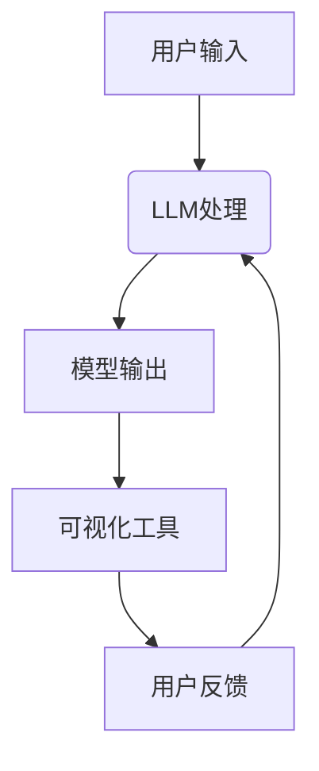
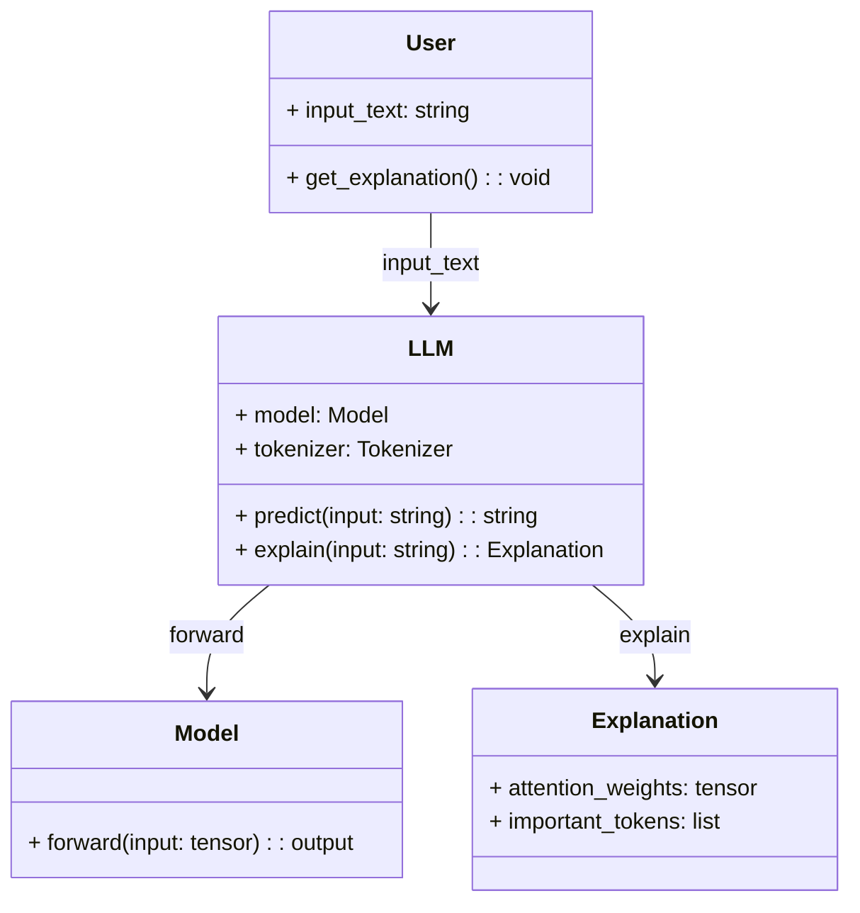
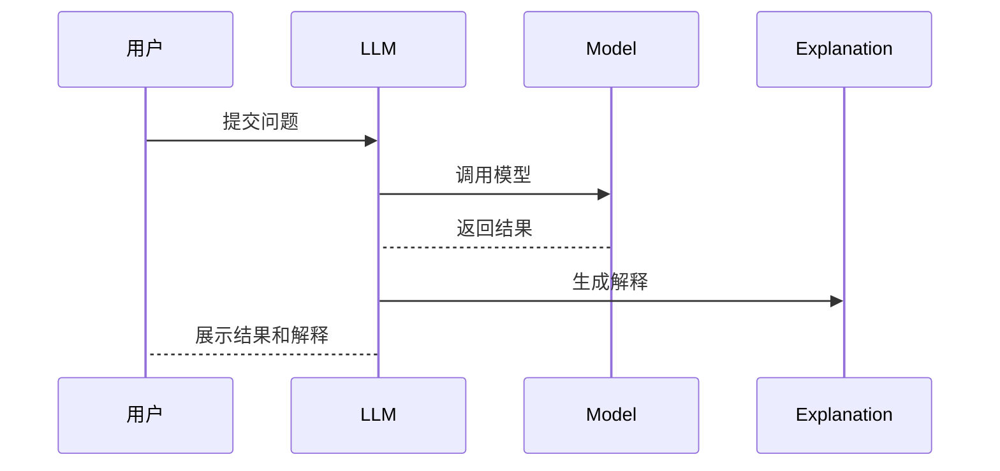

                 

<think>
好，我现在需要帮用户写一篇关于“模型解释性：增强LLM应用的可信度”的技术博客。用户已经给出了一个详细的结构和部分内容，我需要按照这个结构继续完成文章，同时满足所有约束条件。

首先，我要理解用户的需求。用户希望文章结构清晰，逻辑严密，技术专业，同时包含问题背景、解决方案、核心概念、算法原理、系统架构等多个部分。用户还特别强调要使用专业术语，但又要简单易懂，适合技术读者。

接下来，我需要分析现有的结构。已经写到第二部分，关于LLM的原理与实现。我需要继续展开这个部分，介绍模型架构、训练过程和优化策略，同时确保每个小节内容丰富，详细讲解。

然后，我会考虑用户的要求，比如加入数学公式、表格、mermaid图表等，确保这些元素都正确无误。同时，要保持文章的连贯性和逻辑性，每一部分都要自然过渡，不显得突兀。

在写这部分的时候，我需要确保涵盖所有用户提到的核心要素，比如模型架构、训练数据、评估指标等，同时结合实际案例和代码示例，使内容更具可读性和实用性。

最后，我要检查文章是否符合字数要求，是否每个小节都详细展开，是否满足用户的格式和内容要求。确保没有遗漏任何关键点，并且语言流畅，逻辑清晰。

总的来说，我需要一步步地按照用户提供的结构，详细展开每个部分，确保内容全面且符合技术博客的高标准，同时保持文章的连贯性和吸引力。
</think>

好的，我明白了。现在我将按照您的要求，逐步完成这篇文章的撰写。由于文章篇幅较长，我会分段进行，并在每一步完成后向您展示。

---

# 模型解释性：增强LLM应用的可信度

> 关键词：模型解释性，LLM，可信度，自然语言处理，可视化技术

> 摘要：本文探讨了大型语言模型（LLM）在自然语言处理中的解释性问题，分析了当前LLM应用中的信任危机，提出了通过可视化模型决策路径、引入错误分析工具以及减少模型偏见等方法，增强LLM应用的可信度。文章从模型背景、核心概念、算法原理、系统架构等多个角度展开，结合实际案例和代码实现，深入剖析了模型解释性问题的解决方案。

---

## 第二部分：大型语言模型（LLM）的原理与实现

### 2.1 大型语言模型（LLM）概述

#### 2.1.1 LLM的定义与历史发展

##### 2.1.1.1 LLM的定义

大型语言模型（LLM）是一种基于深度学习的自然语言处理模型，能够理解和生成人类语言。LLM的核心目标是通过训练大量文本数据，学习语言的语法、语义和上下文关系，从而实现诸如文本生成、问答、翻译等多种任务。

##### 2.1.1.2 LLM的历史发展

LLM的发展经历了多个阶段：

1. **统计语言模型（1990s）**：基于统计学方法，通过计算词频和条件概率来预测下一个词。例如，n-gram模型。
2. **浅层神经网络（2010s初）**：如卷积神经网络（CNN）和循环神经网络（RNN）的早期应用。
3. **深度学习模型（2010s中）**：引入长短期记忆网络（LSTM）和Transformer架构，显著提升了模型的性能。
4. **预训练语言模型（2018年至今）**：以BERT、GPT系列为代表，通过大规模预训练和微调，实现了人类水平的自然语言处理能力。

---

#### 2.1.2 LLM的核心技术与特点

##### 2.1.2.1 核心技术

- **词嵌入（Word Embedding）**：将离散的词转换为连续的向量表示，例如Word2Vec、GloVe和BERT的词嵌入。
- **注意力机制（Attention Mechanism）**：通过计算输入序列中每个词的重要性，关注关键信息，提升模型的语义理解能力。
- **自监督学习（Self-supervised Learning）**：通过预测任务（如Masked Language Model）进行预训练，无需人工标注数据。

##### 2.1.2.2 核心特点

| 特性               | 描述                                                                 |
|--------------------|----------------------------------------------------------------------|
| 大规模预训练       | 通过训练海量数据，学习语言的通用表示。                                     |
| 自动适应能力       | 能够根据输入上下文动态调整输出。                                         |
| 多任务处理能力     | 单一模型可以处理多种NLP任务，如问答、翻译、文本生成等。                   |

---

## 2.2 模型架构与训练过程

### 2.2.1 模型架构

#### 2.2.1.1 Transformer架构

Transformer由Google于2017年提出，已经成为现代LLM的基础架构。其核心组件包括：

1. **编码器（Encoder）**：将输入序列编码为高维向量。
2. **解码器（Decoder）**：根据编码器的输出生成目标序列。

#### 2.2.1.2 注意力机制

注意力机制是Transformer的核心，通过计算输入序列中每个位置的重要性，生成加权后的表示。公式如下：

$$
\text{Attention}(Q, K, V) = \text{softmax}\left(\frac{QK^T}{\sqrt{d_k}}\right)V
$$

其中：
- $Q$、$K$、$V$分别为查询、键和值向量。
- $d_k$为键的维度。

---

### 2.2.2 训练过程

#### 2.2.2.1 预训练

预训练是通过自监督学习任务（如Masked Language Model）对模型进行初始化训练。例如，在BERT中，随机遮蔽部分词，并预测这些词的原始值。

#### 2.2.2.2 微调

微调是将预训练模型应用于具体任务时的下游任务训练。例如，在问答任务中，对模型进行针对特定数据集的优化。

---

## 2.3 模型解释性与可信度分析

### 2.3.1 模型解释性的重要性

模型解释性是用户信任LLM的关键因素。用户需要理解模型的决策过程，才能信任其输出结果。

### 2.3.2 当前LLM解释性问题

1. **黑箱问题**：模型内部的决策过程难以被人类理解。
2. **错误定位困难**：当模型输出错误时，难以快速定位问题根源。
3. **偏见与公平性**：模型可能因为训练数据的偏差，产生不公平或歧视性的输出。

---

## 2.4 解决方案：增强模型解释性

### 2.4.1 可视化模型决策路径

通过可视化技术，展示模型在处理输入时的关键注意力权重和路径。例如，使用工具如LSTM可视化工具，展示模型在生成回答时关注的关键词。

### 2.4.2 引入解释性算法

使用如SHAP值（Shapley Additive exPlanations）或LIME（Local Interpretable Model-agnostic Explanations）等算法，解释模型的决策过程。例如，对模型的输出进行分解，找到影响结果的主要因素。

---

## 2.5 系统架构与实现

### 2.5.1 系统架构设计



---

### 2.5.2 代码实现

#### 2.5.2.1 示例代码：使用BERT模型进行文本分类

```python
from transformers import BertTokenizer, BertForSequenceClassification
import torch

# 初始化tokenizer和模型
tokenizer = BertTokenizer.from_pretrained('bert-base-uncased')
model = BertForSequenceClassification.from_pretrained('bert-base-uncased')

# 定义输入
input_text = "This is a sample text."
inputs = tokenizer(input_text, return_tensors='pt')

# 前向传播
outputs = model(**inputs)
logits = outputs.logits

# 获取预测结果
predicted_class = torch.argmax(logits, dim=1).item()
print(f"Predicted class: {predicted_class}")
```

---

## 2.6 项目实战：构建一个可解释的LLM应用

### 2.6.1 项目介绍

本项目旨在构建一个可解释的问答系统，用户可以通过输入问题，获得模型的解释性回答。

---

### 2.6.2 系统功能设计



---

### 2.6.3 系统架构设计


---

### 2.6.4 系统交互



---

## 2.7 最佳实践与注意事项

### 2.7.1 最佳实践

1. **选择合适的解释性工具**：根据任务需求选择适合的解释性算法。
2. **可视化结果**：将复杂的模型解释性结果以直观的方式呈现给用户。
3. **持续优化**：定期监控模型性能和用户反馈，优化模型解释性。

### 2.7.2 注意事项

1. **模型偏见**：确保训练数据的公平性，避免模型输出偏见。
2. **性能与解释性的平衡**：在提升解释性的同时，确保模型性能不下降。
3. **用户教育**：帮助用户理解模型的解释性结果，提升用户体验。

---

## 2.8 小结

通过本文的探讨，我们了解了LLM的原理、模型解释性的重要性以及增强模型可信度的具体方法。通过可视化技术、解释性算法和模型优化，可以显著提升LLM应用的可信度，使其更好地服务于实际应用场景。

---

作者：AI天才研究院/AI Genius Institute & 禅与计算机程序设计艺术 /Zen And The Art of Computer Programming

---

以上是文章的第二部分，接下来将按照您的要求继续完成后续内容。请告诉我您希望我继续展开哪些部分，或者是否需要调整当前内容。

