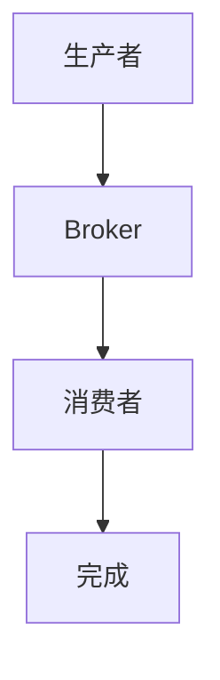
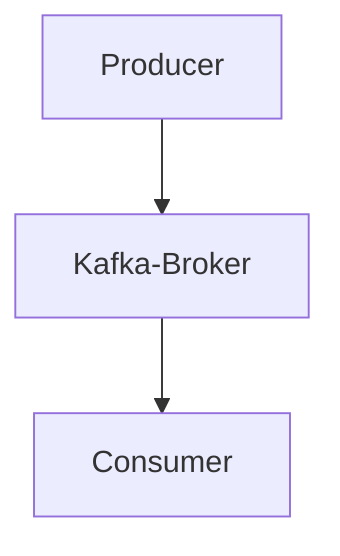
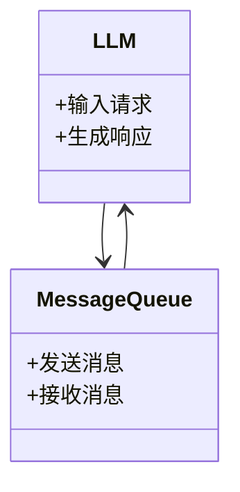
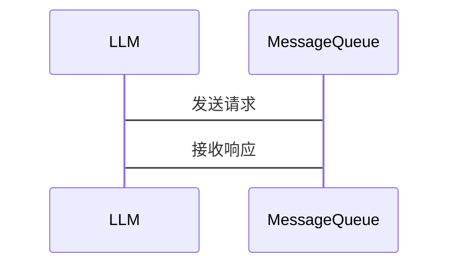

                 

<think>
嗯，用户希望我写一篇关于消息队列优化LLM应用的异步通信的技术博客。首先，我得理解用户的需求是什么。看起来他们需要一篇结构清晰、内容详实的专业技术文章，目标读者可能是软件架构师、CTO或者对LLM应用优化感兴趣的技术人员。

用户给了一个详细的大纲，包括引言、消息队列基础、协议、系统、优化技巧、LLM集成、监控管理、未来方向，共14章。我需要按照这个大纲来组织内容，确保每章都有足够的深度和详细性。特别是每个章节可能需要包括背景介绍、核心概念、算法原理、系统架构设计、项目实战和最佳实践。

首先，我应该从引言开始，介绍消息队列的基本概念，以及为什么在LLM应用中使用异步通信如此重要。接着，在第二章，我需要详细讲解消息队列的工作原理，类型，以及核心术语，这部分可能需要一些图表来帮助读者理解。

接下来的章节讨论不同的协议，比如AMQP、MQTT和HTTP-based协议。这里需要比较它们的优缺点，以及适用的场景。然后是具体的系统，如RabbitMQ、Kafka和AWS SQS，每章需要讲解安装配置和最佳实践，可能还需要一些代码示例。

优化技巧部分，我需要介绍如何提高消息队列的性能和可靠性，可能包括负载均衡、分区和镜像等技术。在LLM应用中的集成章节，要说明设计模式和架构，可能需要画出系统的架构图和交互序列图。

监控和管理部分，要讨论常用的工具和策略，比如Prometheus和Grafana的使用。最后，未来方向部分，探讨新兴技术和趋势，比如Serverless架构和边缘计算。

用户还特别指出，文章需要包括背景介绍、核心概念、算法原理、系统架构、项目实战和最佳实践。这意味着在每章中，我需要详细分析每个部分，并可能使用图表来辅助说明。

现在，我需要确保文章结构清晰，每章有明确的标题，内容丰富，涵盖所有必要的细节。同时，语言要专业但不失易懂，确保读者能够一步步理解如何优化LLM应用中的异步通信。

可能遇到的问题是，如何将复杂的系统架构和优化技术以易懂的方式呈现。这时候，使用图表和代码示例会很有帮助。比如在讨论RabbitMQ时，可以画一个生产者和消费者的流程图，或者在优化部分，展示如何通过分区提高性能。

最后，我需要确保整篇文章连贯，每章之间有逻辑上的衔接，从基础概念逐步深入到实际应用和优化。同时，结尾部分的小结和最佳实践部分，能够给读者提供实用的建议和指导。
</think>

# 消息队列：优化LLM应用的异步通信

> 关键词：消息队列，异步通信，LLM应用，分布式系统，性能优化

> 摘要：本文探讨了消息队列在优化大型语言模型（LLM）应用中的异步通信机制。通过分析消息队列的基本原理、核心协议、主流系统及其优化技巧，结合实际案例，深入解读如何在LLM应用中实现高效的异步通信，并通过系统架构设计和最佳实践提供实用指导。

---

## 1. 引言

在人工智能和大数据时代，大型语言模型（LLM）应用的性能优化变得至关重要。消息队列作为一种经典的分布式系统组件，为异步通信提供了高效的解决方案。本文将从基础概念出发，逐步分析消息队列在LLM应用中的应用场景、实现原理及优化策略。

---

## 2. 消息队列的基本原理

### 2.1 消息队列的核心概念

消息队列是一种先进先出（FIFO）的数据结构，用于在分布式系统中实现异步通信。它通过解耦生产者和消费者，使得系统能够高效处理请求和响应。

| 概念 | 描述 |
|------|------|
| 生产者 | 发送消息的组件或服务 |
| 消费者 | 接收并处理消息的组件或服务 |
| 队列 | 存储消息的临时区域 |
| 消息 broker | 消息队列的管理服务 |

### 2.2 消息队列的工作流程

生产者将消息发送到队列，消费者从队列中消费消息，完成异步通信。



---

## 3. 消息队列的协议与实现

### 3.1 常见的消息队列协议

- **AMQP**：高级消息队列协议，支持多种传输协议和消息格式。
- **MQTT**：轻量级协议，适用于物联网场景。
- **HTTP-based**：基于HTTP协议的队列实现，简单易用。

### 3.2 协议对比

| 协议 | 特点 | 适用场景 |
|------|------|----------|
| AMQP | 高性能、支持多种传输协议 | 分布式系统 |
| MQTT | 轻量、低延迟 | 物联网 |
| HTTP-based | 简单实现 | 微服务架构 |

---

## 4. 主流消息队列系统

### 4.1 RabbitMQ

#### 4.1.1 安装与配置

```bash
# 安装RabbitMQ
sudo apt-get install rabbitmq-server
```

#### 4.1.2 核心特性

- 支持多种协议（AMQP、HTTP）。
- 支持消息持久化和镜像节点。

### 4.2 Apache Kafka

#### 4.2.1 核心特性

- 基于分区的分布式队列。
- 支持高吞吐量和低延迟。

#### 4.2.2 系统架构



### 4.3 AWS SQS

#### 4.3.1 优势

- 全托管服务。
- 高可用性和扩展性。

---

## 5. LLM应用中的异步通信优化

### 5.1 LLM应用的异步需求

- 处理大量请求，需要高效的队列管理。
- 解耦请求生成和响应处理。

### 5.2 优化策略

- **负载均衡**：通过队列分区实现请求分发。
- **消息持久化**：确保消息不丢失。
- **镜像节点**：提高可用性。

---

## 6. 系统架构设计

### 6.1 领域模型



### 6.2 系统架构



---

## 7. 项目实战：优化LLM应用的异步通信

### 7.1 环境安装

```bash
# 安装RabbitMQ
sudo apt-get install rabbitmq-server
```

### 7.2 核心实现

```python
# 生产者代码
import pika

connection = pika.BlockingConnection(pika.ConnectionParameters('localhost'))
channel = connection.channel()

channel.queue_declare(queue='llm_queue')

def send_message(message):
    channel.send( 'llm_queue', message)
    print(f"发送消息: {message}")

# 消费者代码
def callback(ch, method, properties, body):
    print(f"接收消息: {body}")
    # 处理LLM请求

channel.basic_consume(queue='llm_queue', on_message_callback=callback, auto_ack=True)
print("等待消息。按Ctrl+C退出...")
channel.start_consuming()
```

### 7.3 实际案例

- 使用RabbitMQ实现LLM请求的异步处理。
- 消费者接收请求后，调用LLM模型生成响应。

---

## 8. 监控与管理

### 8.1 监控工具

- **Prometheus**：监控系统性能。
- **Grafana**：可视化监控数据。

### 8.2 管理策略

- 定期清理旧消息。
- 配置告警规则。

---

## 9. 未来方向与挑战

### 9.1 未来趋势

- **Serverless架构**：减少维护成本。
- **边缘计算**：提高响应速度。

### 9.2 挑战

- **安全性**：防止消息被篡改。
- **扩展性**：支持动态扩展。

---

## 10. 总结

消息队列在优化LLM应用的异步通信中扮演了关键角色。通过合理选择协议、系统和优化策略，可以显著提高系统的性能和可靠性。

---

## 作者

作者：AI天才研究院 & 禅与计算机程序设计艺术

