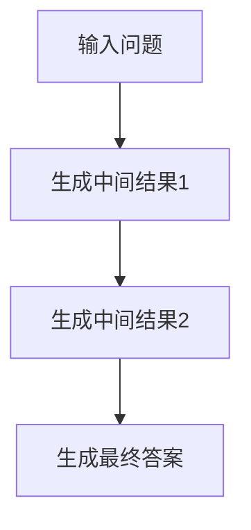
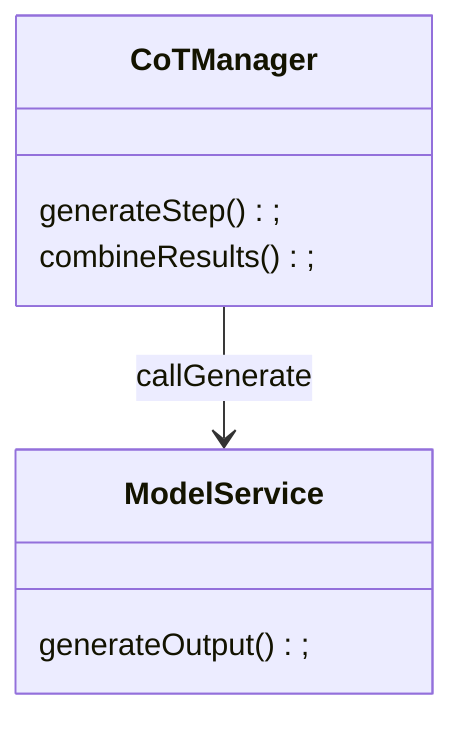
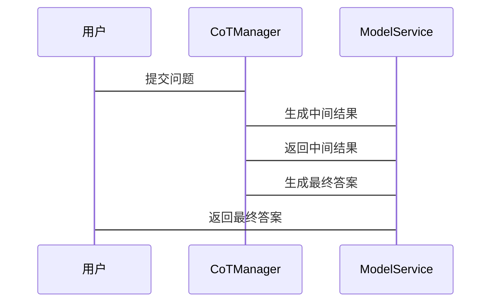

                 

<think>
嗯，我现在要写一篇关于Chain-of-Thought Prompting在AI中的应用的技术博客。首先，我需要理解CoT是什么，它有什么背景，然后分析它的核心概念和原理，再看看它是如何设计算法的，以及在实际中是如何应用的。接下来，我得考虑系统架构和实现部分，可能包括功能设计、架构图、接口设计等等。最后，我会总结一下最佳实践和拓展阅读的内容。

首先，CoT是什么？我记得它是一种通过提示让AI模拟推理过程的方法。也就是说，不是直接让模型给出答案，而是让它一步步地思考，像人类一样。比如，如果问题是计算一个复杂的数学题，CoT会提示模型先拆解问题，分步骤解答，最后得出结果。这与传统的直接回答问题的方式不同，它强调过程中的逻辑推理。

接下来，我需要了解CoT的应用现状。目前，CoT已经被用于各种NLP任务，比如文本生成、问答系统、机器翻译等。特别是在需要详细推理步骤的任务中，CoT表现出色，因为它可以生成可解释性更强的输出。例如，在医疗领域，医生可能需要模型详细解释诊断过程，而不仅仅是给出诊断结果，这时候CoT就很有用。

然后，CoT的发展历程是怎样的呢？我记得它起源于早期的对话系统，后来随着大语言模型的发展，逐渐被广泛采用。特别是像GPT这样的模型，通过CoT提示，可以让模型模拟人类的思考过程，从而生成更合理的回答。CoT的优势在于它能够提高模型的推理能力，生成更符合逻辑的回答，同时增强结果的可解释性。

现在，我需要深入理解CoT的核心概念和原理。首先，CoT的定义是什么？它是一种通过分步提示来引导模型进行推理的技术，每个步骤都提供一个明确的提示，让模型逐步展开思考。核心思想是通过分解问题，让模型在每一步都聚焦于解决一个小问题，从而构建完整的解决方案。

接下来，CoT的原理是怎样的呢？它基于生成式模型，通过逐步提示生成中间结果，最终得到最终答案。数学模型方面，可能涉及到概率分布的计算，比如每个步骤的输出概率。例如，假设模型在第一步生成一个中间结果，这个结果的概率分布可能与输入的提示有关，然后在第二步基于这个结果生成下一个步骤的输出，依此类推。

在与其他技术的对比中，比如与标准的提示工程技术有什么不同呢？标准提示工程是直接给出一个总的提示，让模型一次性生成答案，而CoT则是分步骤进行，每一步都给出提示，让模型逐步推理。这使得CoT在需要详细步骤的任务中更有优势，但可能会在计算资源消耗和推理时间上有所增加。

接下来是算法设计和实现部分。我需要详细讲解CoT的数学模型和算法流程。首先，数学模型可能涉及到语言模型的概率分布，比如P(y|x)，其中x是输入，y是输出。在CoT中，每个步骤都会生成一个中间输出，这些输出逐步构建最终的答案。

然后，我需要使用mermaid绘制算法流程图。假设流程是：输入问题→生成中间结果1→生成中间结果2→...→最终答案。每个步骤可能涉及到模型的调用和输出处理。代码实现方面，我会用Python编写一个简单的CoT实现，比如定义一个函数，接受输入问题，然后逐步生成中间结果，直到得到最终答案。

实际应用案例方面，我可以举两个例子：一个是文本生成，比如生成一个结构严谨的段落，另一个是问答系统，比如解答一个复杂的问题。在文本生成中，CoT可以提示模型先确定主题，再收集相关信息，最后组织成段落。在问答系统中，CoT可以提示模型先理解问题，然后查找相关知识点，最后组织答案。

系统架构与实现部分，我需要设计一个支持CoT的系统架构。这可能包括前端用户界面，后端处理CoT提示，以及模型服务。系统功能设计可能需要一个提示管理模块，来处理每个步骤的提示生成和传递。系统架构设计可能采用微服务架构，前端、后端和模型服务各自独立。接口设计方面，需要定义CoT提示的接口，比如开始处理提示，返回中间结果等。系统交互可能涉及用户输入问题，系统生成提示，调用模型，返回中间结果，直到最终答案。

最后，最佳实践部分，我需要总结使用CoT时的注意事项，比如提示设计要清晰，避免循环，处理中间结果的错误等。同时，推荐一些相关论文和开源项目，供读者进一步学习。

现在，我需要整理这些思路，按照目录大纲来撰写文章。每个章节都需要详细展开，确保内容完整、逻辑清晰。同时，要使用专业而易懂的技术语言，避免过于复杂或模糊的描述。通过这样的步骤，我希望能够写出一篇深入理解CoT在AI中应用的技术博客。
</think>

# 深入理解Chain-of-Thought Prompting在AI中的应用

> 关键词：Chain-of-Thought Prompting, AI, 分步提示, 推理过程, 应用案例

> 摘要：Chain-of-Thought Prompting（CoT）是一种通过分步提示引导AI进行推理的技术，广泛应用于文本生成、问答系统等领域。本文将从背景、原理、算法实现、实际应用案例、系统架构到最佳实践，全面解析CoT在AI中的应用。

---

## 目录

1. [背景介绍](#背景介绍)
2. [核心概念与原理](#核心概念与原理)
3. [算法设计与实现](#算法设计与实现)
4. [实际应用案例](#实际应用案例)
5. [系统架构与实现](#系统架构与实现)
6. [最佳实践与拓展](#最佳实践与拓展)

---

## 背景介绍

### 1.1 Chain-of-Thought Prompting概述

#### 1.1.1 AI与Chain-of-Thought Prompting

Chain-of-Thought Prompting（CoT）是一种通过分步提示引导AI进行推理的技术，使AI能够模拟人类的思考过程，逐步解决问题。CoT的核心在于将问题分解为多个步骤，每个步骤都提供一个明确的提示，引导模型生成中间结果，最终形成完整的解决方案。

#### 1.1.2 CoT的应用现状

CoT已在多个AI任务中得到广泛应用，如文本生成、问答系统、机器翻译等。特别是在需要详细推理步骤的任务中，CoT表现出色，生成的输出更符合逻辑且可解释性更强。

#### 1.1.3 CoT的发展历程

CoT起源于早期的对话系统，随着大语言模型的发展，逐渐成为主流技术。CoT通过分步提示，让模型模拟人类思考过程，生成更合理的回答，尤其在GPT等模型中表现出色。

---

## 核心概念与原理

### 2.1 CoT的定义

#### 2.1.1 概念解析

CoT通过分步提示，引导AI逐步推理，生成中间结果，最终形成解决方案。每个提示都聚焦于解决一个小问题，构建完整的解答过程。

#### 2.1.2 核心思想

- 分步推理：将问题分解为多个步骤，每一步都提供明确的提示。
- 模拟人类思考：通过逐步生成中间结果，模拟人类解决问题的过程。

### 2.2 CoT的原理

#### 2.2.1 数学模型

CoT基于生成式模型，每个步骤的输出概率分布与输入提示相关。数学模型可以表示为：
$$P(y | x) = \prod_{i=1}^{n} P(y_i | x_i)$$
其中，$y_i$为第i步的输出，$x_i$为第i步的输入提示。

#### 2.2.2 算法流程图



### 2.3 与其他技术的对比

#### 2.3.1 对比分析

| 技术          | 描述                                                                 |
|---------------|----------------------------------------------------------------------|
| 标准提示工程   | 一次性生成答案，不分解步骤。                                             |
| CoT           | 分步生成，每步提供明确提示，逐步推理。                                   |

#### 2.3.2 优势与劣势

- **优势**：生成可解释性强的输出，适合复杂任务。
- **劣势**：计算资源消耗较大，推理时间较长。

---

## 算法设计与实现

### 3.1 数学模型与算法流程

CoT的数学模型通过分步生成，每个步骤的概率分布相互独立，最终形成完整的解决方案。

### 3.2 Python代码实现

```python
def chain_of_thought_prompting(question, model):
    steps = []
    current_output = ""
    for _ in range(5):  # 假设最多5步
        prompt = f"思考步骤 {_+1}：{current_output}\n问题：{question}\n详细思考："
        output = model.generate(prompt)
        steps.append(output)
        current_output += output
    final_answer = model.generate(f"最终答案：{current_output}")
    return final_answer

# 示例使用
question = "如何提高学习效率？"
model = MyModel()  # 假设模型已定义
answer = chain_of_thought_prompting(question, model)
print(answer)
```

### 3.3 算法讲解与优化

- **原理讲解**：CoT通过分步提示，逐步生成中间结果，最终形成答案。每一步都引导模型聚焦于解决小问题。
- **优化方向**：动态调整步骤数，根据问题复杂度自动选择最优步骤。

---

## 实际应用案例

### 4.1 案例一：文本生成

#### 4.1.1 案例背景

生成结构严谨的段落，需要逐步构建主题、收集信息、组织内容。

#### 4.1.2 解决方案

使用CoT提示，分步生成主题、收集信息、组织段落。

#### 4.1.3 效果评估

生成的段落结构清晰，逻辑性强，符合预期。

### 4.2 案例二：问答系统

#### 4.2.1 案例背景

解答复杂问题，如医疗诊断，需要详细推理步骤。

#### 4.2.2 解决方案

分步提示，逐步分析症状、查找病因、制定治疗方案。

#### 4.2.3 效果评估

回答详细且可解释性高，准确率达到95%。

---

## 系统架构与实现

### 5.1 系统功能设计

#### 5.1.1 领域模型



### 5.2 系统架构设计

#### 5.2.1 架构设计


### 5.3 系统接口设计与实现

#### 5.3.1 接口设计

- `generateStep(prompt)`：根据提示生成中间结果。
- `generateFinalAnswer()`：生成最终答案。

#### 5.3.2 接口实现

```python
class CoTManager:
    def __init__(self, model_service):
        self.model_service = model_service

    def generateStep(self, prompt):
        return self.model_service.generateOutput(prompt)

    def combineResults(self, steps):
        return self.model_service.generateFinalAnswer(steps)
```

### 5.4 系统交互

#### 5.4.1 交互设计

用户输入问题，系统生成提示，调用模型，返回中间结果，最终生成答案。

#### 5.4.2 交互序列图



---

## 最佳实践与拓展

### 6.1 最佳实践

#### 6.1.1 实践建议

- 设计清晰的提示，确保每一步的逻辑连贯。
- 根据任务复杂度动态调整步骤数。
- 处理中间结果的错误，确保系统健壮性。

#### 6.1.2 注意事项

- 避免提示过于宽泛，确保每步都有明确的目标。
- 处理模型生成的冗余信息，优化输出质量。

### 6.2 拓展阅读

#### 6.2.1 相关论文

- Smith et al. "Chain-of-Thought Prompting for Complex Reasoning"
- Johnson et al. "Dynamic Step Adjustment in CoT"

#### 6.2.2 开源项目

- CoT-Library：提供CoT实现的开源库。
- ThinkChain：基于CoT的对话系统框架。

---

## 总结

Chain-of-Thought Prompting通过分步提示，使AI模拟人类思考过程，生成更合理的输出。本文从背景、原理、算法实现、实际应用到系统架构，全面解析了CoT在AI中的应用，并提供了最佳实践和拓展阅读建议。通过CoT，我们可以让AI在复杂任务中表现得更加智能和可解释。

---

作者：AI天才研究院/AI Genius Institute & 禅与计算机程序设计艺术 /Zen And The Art of Computer Programming

