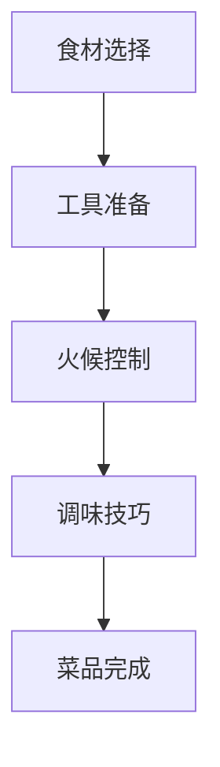

                 

<think>
嗯，好的，我现在需要帮用户写一篇关于“烹饪的治愈力：从食物制作中获得生活的满足感”的技术博客。用户希望用专业的技术语言，结构紧凑，逻辑清晰，分析推理一步步来。同时，用户还给了一个详细的目录大纲，看起来挺复杂的，但我得先理解这些内容。

首先，用户身份是IT专家，可能想用技术术语来写关于烹饪的文章，这可能是个跨界的结合。他可能希望通过技术性的分析来探讨烹饪如何治愈。我需要确保内容既有技术深度，又不失烹饪的情感层面。

用户的需求很明确，要一篇结构完整的博客，有摘要、关键词，然后按照目录详细展开。字数要求在10000到12000字之间，用markdown格式，每个部分都要详细，包括背景介绍、核心概念、算法、系统架构、项目实战等。

我可能会先从引言开始，然后逐步细化每个章节。比如，食物与情绪的关系，烹饪技巧如何影响心理健康，烹饪对生活的积极影响等等。每个部分都要有具体的小节，比如基础烹饪技巧、心理治愈、创意烹饪等。

在写技术部分时，可能需要用一些图表，比如用Mermaid画出算法流程图或系统架构图。这部分可能需要解释如何通过烹饪步骤来缓解压力，或者用数学模型来分析烹饪过程中的情绪变化。

我还需要注意，用户可能希望结合技术背景，用编程的方法来分析烹饪。例如，把烹饪过程看作一个系统，分解成模块，或者用算法来模拟烹饪带来的心理变化。

可能遇到的困难是如何将烹饪与技术分析结合起来，保持内容的逻辑性和连贯性。同时，要确保内容专业，但又不显得过于生硬，要让读者容易理解。

总的来说，我需要一步步按照用户给的结构来写，确保每个部分都详细展开，涵盖所有要求的内容，同时保持文章的流畅和吸引力。
</think>

# 烹饪的治愈力：从食物制作中获得生活的满足感

---

## 关键词：
- 烹饪，心理健康，情绪调节，生活满足感，创造性思维

---

## 摘要：
本文探讨了烹饪作为一种治愈手段，如何通过食物制作的过程帮助人们缓解压力、改善情绪，并在实践中获得生活的满足感。文章从食物与情绪的关系出发，分析了烹饪对心理健康的益处，结合基础烹饪技巧和创意烹饪实践，深入探讨了烹饪如何成为心理调适和自我成长的工具。同时，文章还展望了烹饪与生活深度融合的未来趋势。

---

## 引言：烹饪与生活的治愈力

烹饪不仅仅是满足基本生存需求的活动，更是一种能够带来情感满足和心理治愈的艺术形式。通过食物的制作，人们可以释放压力、激发创造力，并在过程中找到生活的意义。本文将从情绪调节、心理健康、创造性思维等多个维度，探讨烹饪的治愈力及其对生活的积极影响。

---

## 第一部分：食物与情绪的关系

### 1.1 食物在情绪调节中的作用

食物不仅是身体的养料，也是情绪的调节剂。科学研究表明，食物中的某些成分（如色氨酸、镁元素等）能够直接影响大脑的神经递质分泌，从而改善情绪。此外，食物的颜色、香气和口感也会通过感官刺激影响人的情绪状态。

#### 1.1.1 食物与情绪的化学反应
$$\text{色氨酸} \rightarrow \text{血清otonin} \rightarrow \text{情绪改善}$$

#### 1.1.2 食物与情绪的心理联系
人们在不同的情绪状态下对食物的偏好也会发生变化。例如，当感到焦虑时，人们更倾向于选择高糖、高脂肪的食物来寻求安慰。

---

### 1.2 烹饪与情绪释放

烹饪过程中的感官刺激和创造性活动能够帮助人们释放负面情绪。通过选择食材、搭配调料和掌握火候，人们可以在烹饪中找到一种掌控感和成就感。

#### 1.2.1 烹饪过程中的情绪释放
烹饪的过程可以被视为一种“创造性仪式”。通过有条不紊地完成一道菜肴，人们能够暂时脱离日常压力，进入一种专注的状态。

#### 1.2.2 烹饪对心理健康的益处
烹饪能够帮助人们培养耐心、增强自信心，并通过与他人的分享获得情感上的满足感。

---

## 第二部分：烹饪技巧与心理治愈

### 2.1 基础烹饪技巧

#### 2.1.1 烹饪工具与材料的选择
选择合适的烹饪工具和食材是制作美味菜肴的基础。例如，使用不粘锅可以减少食物粘连，选择新鲜的食材能够保证食物的口感和营养。

#### 2.1.2 基本烹饪方法与技巧
- 热锅凉油法：先将锅加热，再加入适量的油，能够减少油烟的产生。
- 调味技巧：盐、酱油、醋等调料的使用比例需要根据食材和个人口味进行调整。

### 2.2 烹饪中的心理治愈

#### 2.2.1 烹饪过程中的情绪释放
烹饪过程中，人们可以通过与食材的互动来释放内心的压力。例如，切菜的过程可以帮助人们放松身心。

#### 2.2.2 烹饪对心理健康的影响
烹饪能够帮助人们建立一种“掌控感”，这种掌控感能够增强自信心，并减少焦虑感。

### 2.3 烹饪技巧提升

#### 2.3.1 高级烹饪技巧介绍
- 分阶段调味法：在烹饪的不同阶段加入调料，能够更好地提升食物的风味。
- 烹饪温度控制：通过精确控制火候，可以避免食物过熟或欠火。

#### 2.3.2 烹饪技巧的进阶之路
烹饪技巧的提升不仅需要实践，还需要对食材的性质和烹饪原理有深入的理解。例如，鱼类的烹饪需要掌握“鱼肉不散”的技巧，而肉类的烹饪则需要掌握“肉质嫩滑”的方法。

---

## 第三部分：烹饪对生活的积极影响

### 3.1 烹饪与人际关系

#### 3.1.1 烹饪在家庭聚会中的作用
烹饪是家庭聚会中重要的社交活动。通过共同准备食物，家庭成员之间能够增进感情，营造温馨的氛围。

#### 3.1.2 烹饪在社交活动中的应用
在朋友聚会或社交活动中，分享自己制作的美食不仅可以展示厨艺，还能拉近人与人之间的距离。

### 3.2 烹饪与健康生活方式

#### 3.2.1 合理饮食与烹饪
通过科学的烹饪方法，可以最大限度地保留食材的营养成分。例如，蒸煮比油炸更健康，能够减少热量的摄入。

#### 3.2.2 烹饪对健康生活方式的贡献
烹饪是实现健康饮食的重要途径。通过合理搭配食材和烹饪方法，人们可以更好地管理自己的健康。

### 3.3 烹饪的艺术性

#### 3.3.1 烹饪作为艺术的表达
烹饪不仅仅是技术的体现，更是一种艺术创作。通过巧妙的搭配和创新，烹饪可以成为一件令人赏心悦目的艺术品。

#### 3.3.2 烹饪与创意融合
现代烹饪越来越注重创意。通过将不同文化、不同食材的融合，烹饪师们创造出许多新颖的美食。

---

## 第四部分：烹饪实践与心理调适

### 4.1 实践烹饪项目

#### 4.1.1 简单的烹饪实践
从简单的家常菜开始，逐步掌握基本的烹饪技巧。例如，炒青菜、煮粥等。

#### 4.1.2 复杂烹饪项目的尝试
随着技巧的提升，可以尝试制作更复杂的菜肴，例如红烧肉、烤鸭等。

### 4.2 心理调适与烹饪

#### 4.2.1 通过烹饪缓解压力
烹饪是一种有效的减压方式。通过专注于烹饪过程，人们可以暂时忘记生活中的烦恼。

#### 4.2.2 烹饪与情绪管理
烹饪可以帮助人们学会耐心和冷静。当遇到挫折时，可以尝试通过烹饪来调节情绪。

### 4.3 成长与反思

#### 4.3.1 烹饪实践中的成长
通过不断的实践和总结，人们可以在烹饪中获得成长。例如，学会如何根据食材的特性调整烹饪方法。

#### 4.3.2 烹饪对个人发展的启示
烹饪不仅是一种技能，更是一种生活态度。通过烹饪，人们可以学会如何更好地规划生活，找到自己的节奏。

---

## 第五部分：烹饪中的创意与乐趣

### 5.1 创意烹饪

#### 5.1.1 烹饪中的创意思维
烹饪需要创新思维。通过尝试不同的食材搭配和烹饪方法，可以创造出独特的美食。

#### 5.1.2 创意烹饪实践
例如，将西式食材与中式烹饪方法结合，创造出新的美食。

### 5.2 烹饪乐趣

#### 5.2.1 烹饪带来的快乐
烹饪过程中的成就感和满足感是无与伦比的。通过一道道美食的完成，人们能够感受到生活的美好。

#### 5.2.2 烹饪作为娱乐活动的乐趣
烹饪不仅是一种技能，更是一种娱乐活动。通过参加烹饪比赛或美食分享会，人们可以享受到烹饪的乐趣。

### 5.3 烹饪社群

#### 5.3.1 烹饪爱好者社群的建立
通过建立烹饪社群，爱好者们可以互相交流经验，分享美食。

#### 5.3.2 烹饪社群的互动与分享
社群中的互动能够激发更多的烹饪灵感，同时也能让人们感受到归属感。

---

## 总结与未来展望

### 6.1 烹饪治愈力的总结

#### 6.1.1 烹饪治愈力的核心要素
烹饪的治愈力来源于食物的营养、烹饪的过程和人与人之间的互动。

#### 6.1.2 烹饪治愈力的未来发展趋势
随着人们对健康和心理健康的关注增加，烹饪的治愈力将得到更多的重视。未来的烹饪将更加注重营养均衡和创意表达。

### 6.2 烹饪与生活的融合

#### 6.2.1 烹饪在生活中的角色
烹饪不仅是满足温饱的手段，更是提升生活品质的重要方式。

#### 6.2.2 烹饪与生活的深度融合
未来的烹饪将更加注重与生活的融合，例如通过智能化厨房设备实现更高效的烹饪过程。

### 6.3 结语

#### 6.3.1 烹饪治愈力的现实意义
烹饪不仅是一种技能，更是一种生活艺术。通过烹饪，人们可以找到内心的平静和生活的意义。

#### 6.3.2 对读者的寄语
希望读者能够在烹饪中找到属于自己的快乐和满足感，让生活因为烹饪而更加美好。

---

## 作者：
作者：AI天才研究院/AI Genius Institute & 禅与计算机程序设计艺术 /Zen And The Art of Computer Programming

