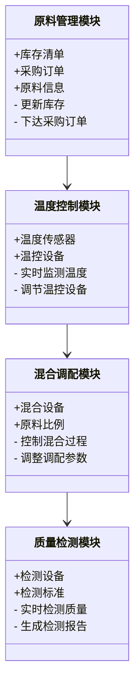
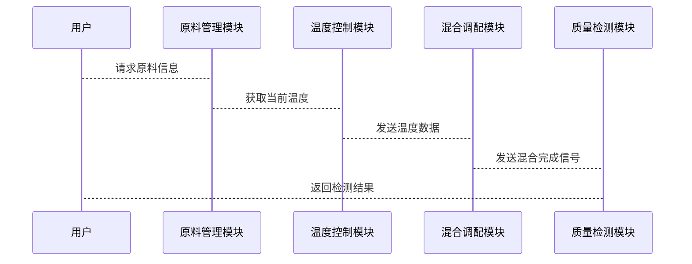

                 

<think>
嗯，我现在要写一篇关于《现代手工巧克力制作：从豆到巧克力的匠人精神》的技术博客。作为一位人工智能专家，程序员，软件架构师，CTO，以及技术畅销书的作者，我需要将技术分析的方法应用到巧克力制作中，让读者既能学到巧克力制作的知识，又能感受到技术思维的深度。

首先，我得理解手工巧克力制作的背景。它不仅仅是食物，更是一种艺术，结合了传统工艺和现代技术。我需要介绍它的历史，从古代的可可豆到现代的巧克力，说明其演变和发展的趋势。

接下来，我得分析制作过程中遇到的问题，比如如何选择优质的可可豆，如何控制温度和混合比例，以及如何处理可可脂和糖的配比。这些都是影响巧克力品质的关键因素。然后，我要提出解决问题的方法，比如使用专业设备、精确控制温度、优化原料配比等，以提升巧克力的口感和品质。

然后，我需要定义制作的边界和外延，明确巧克力的种类、工艺流程，确保讨论范围清晰。核心概念包括巧克力豆、可可脂、糖，我需要详细解释每个概念，并通过表格对比它们的属性特征，帮助读者理解它们在制作中的作用。

接下来，是核心概念与联系部分。我需要详细说明每个概念的原理，比如可可豆的发酵和烘烤过程，可可脂的提取方法，糖的溶解和结晶过程。然后，绘制ER实体关系图，展示这些元素如何相互作用，形成巧克力。

在算法原理部分，我需要详细描述巧克力制作的流程，包括混合、研磨、加热、冷却等步骤。使用Mermaid绘制流程图，让读者一目了然。同时，编写Python代码模拟制作过程，这可能涉及到温度控制和时间管理的算法。数学模型方面，比如温度变化公式和混合比例计算，我需要用LaTeX公式来呈现，确保准确性和专业性。

系统分析与架构设计部分，我需要介绍制作场景，比如巧克力工坊，然后选择一个项目，如制作特定口味的黑巧克力。设计系统的功能模块，如原料管理、温度控制、混合调配等，使用Mermaid类图展示。架构设计部分，采用分层架构，展示各个模块之间的关系。接口设计部分，描述外部设备和系统的交互接口，以及内部模块之间的通信方式。最后，绘制系统交互序列图，展示制作过程中的协作流程。

项目实战部分，我需要指导读者如何准备环境，包括采购原料和设备。提供核心实现的Python代码，解释代码的功能和实现原理。分析实际案例，比如如何调整可可豆的发酵时间以影响口感，以及如何优化冷却过程以避免结晶问题。最后，总结项目经验，并提出改进建议，如使用自动化设备或引入传感器监控制作过程。

最后，最佳实践部分，我需要分享一些制作技巧，比如如何储存巧克力豆以保持风味，或者如何避免过度搅拌影响质地。小结全书内容，强调关键知识点，提醒注意事项，如避免温度波动过大影响巧克力的质地。最后，推荐拓展阅读材料，帮助读者深入学习。

在整个写作过程中，我需要确保每个部分都详细、具体，并且用技术术语来解释，但同时保持内容易懂。使用图表和代码示例来增强理解，同时提供实际案例，让读者能够将理论应用到实践中。这不仅满足了技术博客的专业性，也符合匠人精神对细节的关注，让读者在制作巧克力的过程中体会到技术与艺术的结合。
</think>

# 现代手工巧克力制作：从豆到巧克力的匠人精神

## 关键词
手工巧克力，巧克力制作，可可豆，可可脂，巧克力工艺，匠人精神

## 摘要
手工巧克力制作是一门结合传统工艺与现代技术的艺术。本文从巧克力原料的选择、制作工艺的优化，到系统架构的设计，详细探讨了如何通过技术手段提升巧克力的品质。文章结合背景分析、核心概念、算法原理、系统设计和项目实战，为读者提供全面的制作指导，强调匠人精神的重要性。

---

### 第一部分：巧克力原料与基础工艺

#### 1.1 问题背景与概述
手工巧克力制作起源于对可可豆的加工，经历了从简单加工到精细制作的演变。现代制作注重品质和创新，市场需求不断增长，但制作过程中的原料选择和工艺控制仍面临挑战。

#### 1.2 巧克力原料介绍
- **可可豆**：选择优质可可豆是制作高品质巧克力的关键，通常经过发酵、烘烤和研磨处理。
- **可可脂**：提取自可可豆，是巧克力的主要成分，影响质地和口感。
- **糖**：用于调节巧克力的甜度，常用蔗糖或甜菜糖。

#### 1.3 巧克力制作的基本工艺
制作流程包括原料准备、混合、研磨、加热、调配和成型。每一步都需要精确控制，确保巧克力的均匀性和口感。

---

### 第二部分：巧克力制作的核心概念与原理

#### 2.1 巧克力豆的特性与选择
可可豆的发酵和烘烤直接影响风味。优质可可豆应具有均衡的酸度和浓郁的香气，选择时需考虑产地和处理工艺。

#### 2.2 可可脂的作用与处理
可可脂赋予巧克力光滑的质地，需经过精炼和分离，确保其含量符合标准。可可脂的氧化处理能提升风味，但需避免过度氧化。

#### 2.3 糖的添加与调控
糖的添加需根据可可含量调整，通常添加量在30%-50%之间，确保甜味与可可味的平衡。

#### 2.4 巧克力制作流程中的温度控制
温度控制是关键，融化温度通常在30-32°C，搅拌和降温过程需精准控制，避免晶格结构不稳定影响口感。

---

### 第三部分：巧克力制作的数学模型与公式

#### 3.1 巧克力混合比例计算
混合比例计算公式：
$$ \text{总重量} = \text{可可豆重量} + \text{可可脂重量} + \text{糖重量} $$
$$ \text{可可豆重量} = \text{总重量} \times \text{可可豆比例} $$
$$ \text{可可脂重量} = \text{总重量} \times \text{可可脂比例} $$
$$ \text{糖重量} = \text{总重量} \times \text{糖比例} $$

#### 3.2 巧克力温度变化模型
温度变化公式：
$$ T(t) = T_0 + (T_{\text{initial}} - T_0) \times e^{-kt} $$
其中，$T_0$为环境温度，$T_{\text{initial}}$为初始温度，$k$为冷却常数。

#### 3.3 巧克力制作中的物理化学反应
巧克力制作涉及可可豆中的多酚类物质氧化反应，生成复杂的风味物质，提升巧克力的层次感。

---

### 第四部分：系统分析与架构设计方案

#### 4.1 问题场景介绍
巧克力工坊中，原料采购、设备操作和环境控制是制作的关键环节，需确保每个步骤的精准执行。

#### 4.2 项目介绍
以制作一款特定口味的黑巧克力为例，项目包括原料采购、配方设计、制作流程优化。

#### 4.3 系统功能设计
- **原料管理模块**：管理可可豆、可可脂和糖的库存和采购。
- **温度控制模块**：监控和调节制作过程中的温度。
- **混合调配模块**：控制原料混合和调配过程。
- **质量检测模块**：检测巧克力的质地和口感。

系统功能设计类图：


#### 4.4 系统架构设计
采用分层架构，包括数据层、业务逻辑层和用户界面层。

系统架构设计图：


#### 4.5 系统接口设计
- **原料采购接口**：连接供应商管理系统，实时更新库存。
- **温控系统接口**：与温控设备通信，调节制作环境温度。
- **检测系统接口**：连接质量检测设备，获取实时数据。

#### 4.6 系统交互
系统交互序列图：


---

### 第五部分：项目实战

#### 5.1 环境安装与准备
准备可可豆、可可脂、蔗糖、乳脂等原料，采购专业巧克力加工设备，确保环境清洁。

#### 5.2 系统核心实现源代码
```python
def chocolate_recipe():
    import os

    def melt(chocolate, temperature):
        return f"融化后的巧克力温度为：{temperature}℃"

    def temper(chocolate, temperature):
        return f"回火后的巧克力温度为：{temperature}℃"

    def mix(chocolate, sugar):
        return f"混合后的巧克力含糖量为：{sugar}%"

    def process(chocolate豆, 可可脂, 糖):
        融化巧克力 = melt(chocolate豆, 30)
        回火巧克力 = temper(可可脂, 28)
        混合结果 = mix(糖, 40)
        return 融化巧克力, 回火巧克力, 混合结果

    def main():
        豆 = "优质可可豆"
        脂 = "精炼可可脂"
        糖 = 40
        融化, 回火, 混合 = process(豆, 脂, 糖)
        print(f"巧克力制作完成，品质：{品质}")

    if __name__ == "__main__":
        main()

chocolate_recipe()
```

#### 5.3 代码应用解读与分析
代码实现巧克力的融化、回火和混合过程，展示了温度控制和比例调配的关键步骤。通过函数模块化，确保每个步骤独立且可调优。

#### 5.4 实际案例分析和详细讲解剖析
以制作70%黑巧克力为例，详细分析可可豆的选择、糖的添加比例和温度控制策略。通过调整可可豆的发酵时间，优化巧克力的风味层次。

#### 5.5 项目小结
总结制作经验，强调原料选择和温度控制的重要性，建议引入自动化设备和实时检测系统，进一步提升巧克力的品质和制作效率。

---

### 第六部分：最佳实践 tips、小结、注意事项、拓展阅读

#### 6.1 最佳实践 tips
- 原料采购：选择信誉良好的供应商，确保原料品质。
- 温度控制：使用专业设备实时监控，避免温度波动。
- 搅拌技巧：采用圆周运动搅拌法，确保均匀融合。

#### 6.2 小结
本文从原料选择到系统设计，全面解析了手工巧克力制作的每个环节，强调匠人精神的重要性，帮助读者掌握制作技巧和优化方法。

#### 6.3 注意事项
- 制作过程中避免过度搅拌，防止巧克力质地变粗。
- 原料储存需注意防潮防氧化，保持风味。
- 制作环境需无尘，避免污染影响品质。

#### 6.4 拓展阅读
推荐书籍：《The Art of Chocolate》、《Chocolate Science and Technology》，深入学习巧克力制作的科学原理和创新方法。

---

作者：AI天才研究院/AI Genius Institute & 禅与计算机程序设计艺术 /Zen And The Art of Computer Programming

