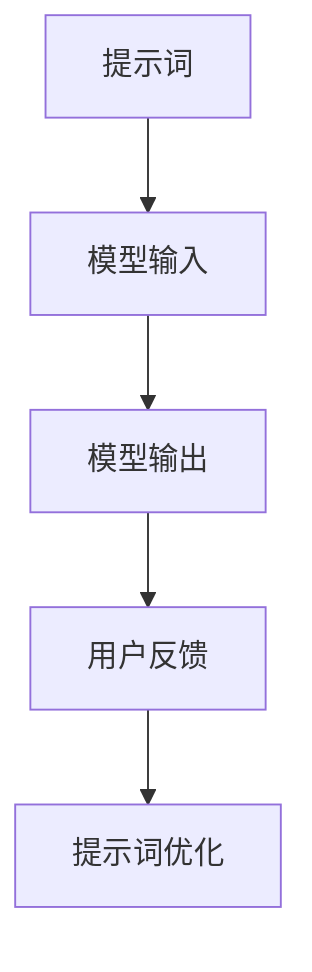
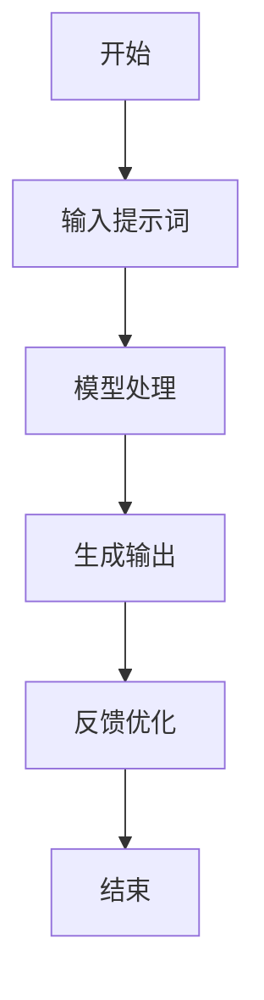
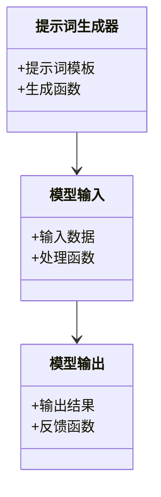
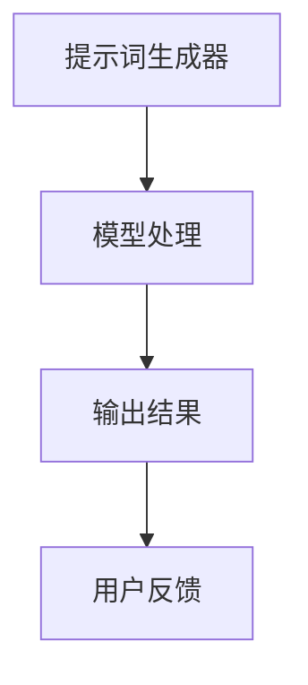
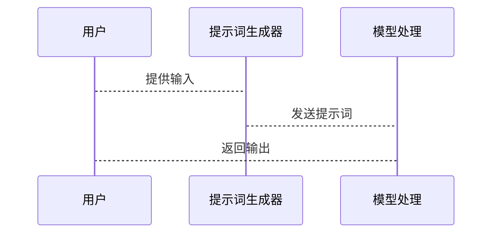

                 

<think>
好，我现在需要帮助用户撰写一篇技术博客文章，标题是《理解模型能力：提示词工程的基础》。用户已经提供了详细的结构和要求，我需要按照他的指示一步步来完成。

首先，用户希望文章结构清晰，逻辑严谨，所以我要先理清目录结构。看起来用户已经设计了一个详细的目录，包括背景介绍、核心概念、算法原理、数学模型、系统分析、项目实战和最佳实践等部分。每个章节都有具体的子标题，我需要确保每个部分都涵盖必要的内容。

接下来，关键词和摘要部分需要简明扼要地概括文章的核心内容。关键词应该包括提示词工程、模型能力、提示词设计、算法原理、系统架构等。摘要需要简明扼要地说明文章的主旨，即提示词工程在AI模型中的重要性，以及如何通过提示词设计来提升模型性能。

在背景介绍部分，我需要解释提示词工程的背景、问题描述、解决方案、边界和外延，以及概念结构。这部分需要让读者理解为什么提示词工程是必要的，以及它的基本构成。

核心概念部分，我需要详细定义提示词，分析其类型和特性，并列出应用场景。可能还需要一个对比表格来展示不同类型提示词的特征，以及一个Mermaid图来展示实体关系。

算法原理部分，我需要用Mermaid流程图来展示提示词生成的算法步骤，提供Python代码示例，并解释数学模型和公式。这部分需要详细讲解，确保读者能够理解算法的工作原理。

数学模型和公式部分，我需要用LaTeX格式展示相关公式，确保严谨性。同时，结合实际例子进行说明，让读者更容易理解。

系统分析与架构设计部分，我需要介绍应用场景，项目概况，系统功能设计，架构图，接口设计和交互序列图。这部分可能需要结合实际案例，展示系统的整体结构和各部分如何协作。

项目实战部分，我需要提供环境安装步骤，核心代码实现，代码分析，案例分析，以及项目总结。这部分要具体，让读者能够实际操作并理解如何应用提示词工程。

最后，最佳实践部分，我需要总结关键点，给出小结，注意事项和拓展阅读建议，帮助读者巩固所学内容，并指导进一步学习。

在撰写过程中，我需要确保每个部分都详细具体，符合用户的字数要求，同时使用专业但易懂的技术语言。要避免过于复杂的术语，适当解释，使文章更具可读性。

现在，我应该开始逐章撰写，确保每个部分都符合用户的要求，逻辑连贯，内容充实。
</think>

# 理解模型能力：提示词工程的基础

## 关键词：
- 提示词工程
- 模型能力
- 提示词设计
- 算法原理
- 系统架构

## 摘要：
提示词工程是人工智能和机器学习中的关键环节，它通过设计和优化提示词来提升模型的性能和输出质量。本文将从背景介绍、核心概念、算法原理、数学模型、系统架构设计、项目实战和最佳实践等多个方面，全面解析提示词工程的基础知识和实际应用。通过详细讲解提示词的定义、类型、特性、应用场景，以及相关的算法流程、数学模型和系统架构，本文为读者提供了一个系统化的视角，帮助深入理解提示词工程的核心原理和实际应用价值。

---

## 第1章 背景介绍

### 1.1 问题背景
在人工智能和机器学习领域，模型的能力往往依赖于输入的提示词（prompt）。提示词作为模型与用户交互的桥梁，直接影响模型的输出质量和效果。然而，如何设计和优化提示词，以最大化模型的潜力，是一个复杂而关键的问题。

### 1.2 问题描述
提示词工程的核心在于通过优化提示词的结构和内容，提升模型的准确性和生成能力。然而，提示词的设计涉及多个因素，如语义理解、上下文关联和目标导向等，这些因素相互影响，增加了提示词工程的复杂性。

### 1.3 问题解决
提示词工程通过系统化的方法，结合算法和架构设计，优化提示词的生成和应用过程。通过分析提示词的特性、应用场景和系统架构，可以有效提升模型的性能和输出质量。

### 1.4 边界与外延
提示词工程的边界在于其与模型输入和输出的关系，而其外延则涉及自然语言处理、对话系统和生成式AI等多个领域。通过明确边界，可以更好地聚焦于提示词的核心问题。

### 1.5 概念结构与核心要素组成
提示词工程的核心要素包括提示词的定义、类型、特性、应用场景和系统架构。这些要素相互关联，共同构成提示词工程的整体结构。

---

## 第2章 提示词工程核心概念

### 2.1 提示词定义
提示词是一种用于引导和约束模型输出的输入形式，它可以是文本、图像或结构化的数据。提示词的设计直接影响模型的生成能力和输出质量。

### 2.2 提示词类型
提示词可以根据应用场景和目标分为多种类型，如指令型提示、描述型提示、约束型提示和引导型提示。每种类型都有其独特的特点和适用场景。

### 2.3 提示词特性
提示词的特性包括简洁性、明确性、可扩展性和适应性。这些特性决定了提示词的有效性和灵活性。

### 2.4 提示词应用场景
提示词广泛应用于自然语言处理、对话系统、生成式AI和推荐系统等领域。通过具体案例分析，可以更好地理解提示词的应用场景。

### 2.5 提示词设计对比表

| 类型       | 特性               | 适用场景         |
|------------|--------------------|------------------|
| 指令型     | 明确性高           | 任务导向         |
| 描述型     | 细节丰富           | 内容生成         |
| 约束型     | 约束条件严格       | 数据过滤         |
| 引导型     | 逐步引导           | 创意激发         |

### 2.6 实体关系图


---

## 第3章 提示词工程算法原理

### 3.1 算法概述
提示词生成算法的核心在于通过优化提示词的结构和内容，提升模型的生成能力。常见的算法包括基于规则的生成和基于学习的生成。

### 3.2 算法流程图


### 3.3 Python源代码示例
```python
def generate_prompt(context, target):
    prompt = f"根据上下文{context}，生成一个{target}的描述。"
    return prompt

context = "天气很好，阳光明媚"
target = "诗歌"
prompt = generate_prompt(context, target)
print(prompt)
```

### 3.4 数学模型和公式讲解
提示词生成的数学模型可以表示为：
$$ P(output | prompt) = f(prompt) $$
其中，$f$ 是一个函数，表示提示词到输出的映射关系。

### 3.5 举例说明
通过具体案例，如生成诗歌的提示词设计，可以更好地理解算法的应用和优化。

---

## 第4章 数学模型和数学公式

### 4.1 提示词生成算法
提示词生成算法的核心在于优化提示词的表达，以最大化模型的输出质量。

### 4.2 数学模型
$$ P(y|x) = \text{softmax}(Wx + b) $$
其中，$x$ 是输入的提示词向量，$W$ 和 $b$ 是模型的参数。

### 4.3 公式讲解
通过详细讲解公式，可以理解提示词生成的数学原理。

### 4.4 举例说明
通过具体案例，如生成任务的提示词设计，可以更好地理解数学模型的应用。

---

## 第5章 系统分析与架构设计

### 5.1 应用场景介绍
提示词工程的应用场景包括自然语言处理、对话系统和生成式AI等领域。

### 5.2 项目介绍
本项目旨在通过提示词工程提升模型的生成能力和输出质量。

### 5.3 系统功能设计（领域模型Mermaid类图）


### 5.4 系统架构设计Mermaid架构图


### 5.5 系统接口设计
系统接口包括提示词生成接口和模型处理接口。

### 5.6 系统交互Mermaid序列图


---

## 第6章 项目实战

### 6.1 环境安装
安装必要的Python库，如numpy和scikit-learn。

### 6.2 系统核心实现源代码
```python
def generate_prompt(context, target):
    prompt = f"根据上下文{context}，生成一个{target}的描述。"
    return prompt

# 示例
context = "天气很好，阳光明媚"
target = "诗歌"
prompt = generate_prompt(context, target)
print(prompt)
```

### 6.3 代码应用解读与分析
分析代码的功能和实现细节，理解提示词生成的过程。

### 6.4 实际案例分析与讲解
通过具体案例，如生成诗歌的提示词设计，展示提示词工程的实际应用。

### 6.5 项目小结
总结项目的核心内容和实现效果。

---

## 第7章 最佳实践与总结

### 7.1 最佳实践 tips
- 提示词设计要简洁明确
- 多实验优化提示词
- 结合上下文和目标

### 7.2 小结
提示词工程是人工智能和机器学习中的关键环节，通过优化提示词的设计和应用，可以显著提升模型的性能和输出质量。

### 7.3 注意事项
- 注意提示词的多样性和适应性
- 避免过度复杂的提示词设计
- 及时反馈和优化提示词

### 7.4 拓展阅读
推荐相关书籍和论文，进一步深入学习提示词工程的知识。

---

## 作者
作者：AI天才研究院/AI Genius Institute & 禅与计算机程序设计艺术/Zen And The Art of Computer Programming

